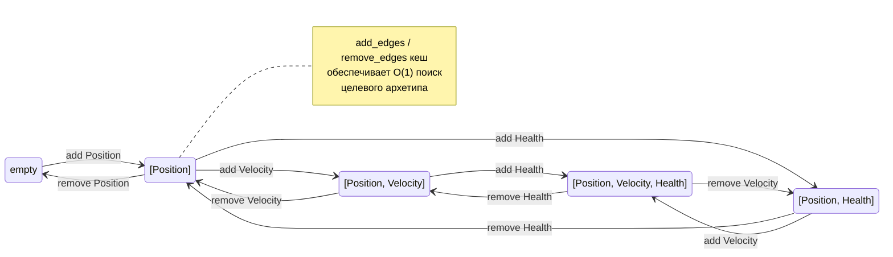

# ApexForge_ECS — Entity Component System Engine
### Руководство пользователя
> **Версия 0.1.0** | Rust Edition 2021

---

## Содержание

1. [Введение](#1-введение)
   - [1.4 Быстрый старт — рабочий мир за 20 строк](#14-быстрый-старт--рабочий-мир-за-20-строк)
2. [Основные концепции](#2-основные-концепции)
   - [2.4 Миграция с Bevy — таблица соответствий](#24-миграция-с-bevy--таблица-соответствий-d2-8)
3. [Архетипы и хранилище](#3-архетипы-и-хранилище)
4. [Query API](#4-query-api)
5. [Ресурсы и события](#5-ресурсы-и-события)
6. [Системы и планировщик](#6-системы-и-планировщик)
   - [6.0 Регистрация систем — `add_systems()`](#60-регистрация-систем--add_systems-рекомендуемый-способ)
   - [6.0a Run Conditions — условное выполнение систем](#60a-run-conditions--условное-выполнение-систем)
   - [6.0b Scope Conditions — условия на группу систем](#60b-scope-conditions--условия-на-группу-систем)
   - [6.0c Apply Deferred — применение команд в том же кадре](#60c-apply-deferred--применение-команд-в-том-же-кадре)
   - [6.1 `system!` макрос](#61-system-макрос)
   - [6.8 `SystemParam` — типобезопасные параметры систем](#68-systemparam--типобезопасные-параметры-систем)
7. [Commands](#7-commands)
8. [Relations (связи между entity)](#8-relations-связи-между-entity)
9. [EntityTemplate](#9-entitytemplate)
10. [Сериализация](#10-сериализация)
11. [Hot Reload](#11-hot-reload)
12. [Изолированные миры (IsolatedWorld)](#12-изолированные-миры-isolatedworld)
13. [Параллелизм](#13-параллелизм)
14. [Советы по производительности](#14-советы-по-производительности)
15. [Полный пример](#15-полный-пример)
16. [Быстрый справочник](#16-быстрый-справочник)
17. [Lua Scripting](#17-lua-scripting)
---

## 1. Введение

**ApexForge_ECS** — это высокопроизводительный движок Entity Component System (ECS), написанный на Rust. Он разработан для применения в игровых движках и симуляциях, где требуется обработка сотен тысяч объектов с минимальными накладными расходами.

> **О продукте.** Продуктовое имя движка — **ApexForge_ECS**. Крейты называются `apex-core`,
> `apex-scheduler`, `apex-serialization` и т.д. (импорты `use apex_core::prelude::*;`) — имена крейтов
> не меняются. В тексте руководства «ApexForge_ECS» и «движок» — синонимы.

### 1.1 Ключевые возможности

- **Архетипное хранилище компонентов (SoA layout)** — данные одного типа хранятся рядом в памяти, что максимизирует использование CPU-кеша
- **Параллельное выполнение систем** — планировщик автоматически находит системы без конфликтов и запускает их параллельно через Rayon; решение SEQ/PAR принимает cost-model по замеренной работе стадии (не по числу entity)
- **Change Detection** — каждая строка данных хранит тик последнего изменения, запросы `Changed<T>`/`Added<T>` работают без overhead
- **Композиция Bundle** — вложенные `#[derive(Bundle)]`, кортежи Bundle до 12 элементов, одиночные компоненты напрямую в `spawn()`
- **Relations (связи между entity)** — иерархии, ownership и произвольные связи в выделенных индексах мира (O(1) добавление, без влияния на архетипы; cascade delete при despawn target)
- **Сериализация мира** — снэпшот/восстановление состояния через JSON или bincode; инкрементальный diff; префабы
- **Hot Reload** — файловый watcher перезагружает JSON-конфиги, Lua-скрипты и префабы без перезапуска
- **Lua-скриптинг** — игровая логика на Lua 5.4 с хот-релоадом `.lua`-файлов, sandbox-изоляцией и доступом к ECS через query/spawn/resource/event API
- **Детерминированный спавн** — опциональный record/replay-детерминизм присвоения entity-id run-to-run
- **Run Conditions** — условное выполнение систем: `.run_if(closure)` для простых проверок и `.run_if_cond(typed)` для условий, чей доступ виден планировщику (авто-порядок); AND/OR-комбинация, scope conditions, готовые условия из модуля `conditions`
- **Event Pipeline** — конвейерная обработка событий (Producer → Transformer → Consumer) с порядком по именам
- **Изолированные миры** — `IsolatedWorld` + `WorldBridge`: полноценный 2-поточный параллелизм между независимыми мирами

> **Крейты пока не опубликованы на crates.io.** Добавляйте зависимость через `path = "..."` или
> `git = "..."` (см. §1.3).
### 1.2 Структура крейтов

| Крейт | Назначение |
|---|---|
| `apex-core` | Ядро ECS: entity, component, archetype, query, world, events, relations, resources, EntityTemplate, TemplateRegistry |
| `apex-scheduler` | Планировщик систем: компиляция графа зависимостей, параллельные Stage, typed Run Conditions (condition access → авто-порядок), apply_deferred + HAS_DEFERRED auto-apply, Event Pipeline |
| `apex-graph` | Граф зависимостей: топологическая сортировка, обнаружение циклов |
| `apex-serialization` | Сериализация мира: WorldSnapshot, snapshot/restore, PrefabManifest, PrefabLoader |
| `apex-hot-reload` | Горячая перезагрузка: FileWatcher, HotReloadPlugin, PrefabPlugin |
| `apex-macros` | Процедурные макросы: `#[derive(Component)]` (реализация трейта + авторегистрация), `#[derive(Bundle)]` (бандлы с поддержкой вложенности), `#[derive(Scriptable)]` для интеграции с Lua-скриптингом |
| `apex-scripting` | Lua-скриптинг: ScriptEngine, регистрация компонентов/ресурсов/событий, хот-релоад `.lua`-скриптов |
| `apex-isolated` | Изолированные ECS-миры: IsolatedWorld, WorldBridge, CloneableBridge |

### 1.3 Установка

Крейты **ещё не опубликованы на crates.io**. Используйте один из способов ниже.

**Вариант A — локальный путь (разработка):**

```toml
[dependencies]
apex-core          = { path = "path/to/apex-ecs/crates/apex-core" }
apex-scheduler     = { path = "path/to/apex-ecs/crates/apex-scheduler" }
apex-serialization = { path = "path/to/apex-ecs/crates/apex-serialization" }
apex-hot-reload    = { path = "path/to/apex-ecs/crates/apex-hot-reload" }
apex-macros        = { path = "path/to/apex-ecs/crates/apex-macros" }
apex-scripting     = { path = "path/to/apex-ecs/crates/apex-scripting" }
apex-isolated      = { path = "path/to/apex-ecs/crates/apex-isolated" }

```

**Вариант B — git-зависимость (потребитель):**

> ⚠️ **Внимание:** `latest-revision-hash` — это **заглушка**. Замените её на реальный хеш
> коммита из репозитория (узнать: `git ls-remote https://github.com/StanislavMal/apex-ecs HEAD`).

```toml
[dependencies]
apex-core          = { git = "https://github.com/StanislavMal/apex-ecs", rev = "latest-revision-hash" }
apex-scheduler     = { git = "https://github.com/StanislavMal/apex-ecs", rev = "latest-revision-hash" }
apex-serialization = { git = "https://github.com/StanislavMal/apex-ecs", rev = "latest-revision-hash" }
apex-hot-reload    = { git = "https://github.com/StanislavMal/apex-ecs", rev = "latest-revision-hash" }
apex-macros        = { git = "https://github.com/StanislavMal/apex-ecs", rev = "latest-revision-hash" }
apex-scripting     = { git = "https://github.com/StanislavMal/apex-ecs", rev = "latest-revision-hash" }
apex-isolated      = { git = "https://github.com/StanislavMal/apex-ecs", rev = "latest-revision-hash" }
```

> **Минимальная версия Rust:** 2021 Edition. Rayon всегда скомпилирован — параллелизм доступен
> без feature-флагов. Решение SEQ/PAR принимает **cost-model** (замеренная работа стадии), а не
> число entity: тривиальные стадии не платят rayon-оверхед, тяжёлые — параллелятся даже при малом
> числе entity (см. §13).

### 1.4 Быстрый старт — рабочий мир за 20 строк

Минимальная программа: объявить компоненты, создать мир, заспавнить entity, прогнать систему.

```rust
use apex_core::prelude::*;
use apex_scheduler::prelude::*;

#[derive(Component, Clone, Copy)]
struct Position { x: f32, y: f32 }

#[derive(Component, Clone, Copy)]
struct Velocity { x: f32, y: f32 }

// Система — обычная функция с типизированными параметрами (Bevy-стиль).
// Планировщик выводит доступ из типов параметров и распараллеливает бесконфликтные системы.
fn movement(mut q: Query<(&Velocity, &mut Position)>) {
    q.for_each_mut(|_, (vel, mut pos)| {
        pos.x += vel.x;
        pos.y += vel.y;
    });
}

fn main() {
    let mut world = World::new();

    // #[derive(Component)] регистрирует тип автоматически.
    world.spawn((Position { x: 0.0, y: 0.0 }, Velocity { x: 1.0, y: 0.0 }));

    let mut sched = Scheduler::new();
    sched.add_systems(StageLabel::Update, movement);
    sched.compile().unwrap();

    for _ in 0..60 {
        world.tick();            // инкремент тика кадра (база change detection)
        sched.run(&mut world);   // флашит события и продвигает change-tick сам
    }

    println!("entities: {}", world.entity_count());
}
```

Дальше в руководстве — концепции (§2–3), затем золотой путь по задачам (запросы §4, ресурсы и события
§5, системы §6, команды §7), козыри движка (relations §8, шаблоны §9, сериализация §10, изолированные
миры §12) и справочник (§16).

---

## 2. Основные концепции

### 2.1 Entity

Entity — это уникальный идентификатор объекта в мире. Он не хранит данные напрямую, только указывает на строку в архетипе.

```rust
// Entity — generational index: index + generation
// Generational counter защищает от use-after-free
pub struct Entity {
    index:      u32,   // позиция в аллокаторе
    generation: u32,   // инкрементируется при повторном использовании
}

// Проверка жизни entity:
world.is_alive(entity)   // -> bool

// Проверка наличия компонента (начиная с v0.1.0, O(1)):
world.has_component::<Position>(entity) // -> bool
entity.index()           // -> u32
entity.generation()      // -> u32
```

> **Примечание:** Entity никогда не хранит компоненты напрямую. Все данные живут в Column-буферах архетипа. Entity — это только ключ для поиска.

### 2.2 Component

Компонент — это чистые данные без логики. Трейт `Component` (маркерный: `Send + Sync + 'static`)
**обязательно требует явной реализации** — через `#[derive(Component)]` или manual `impl Component for Type {}`.

`#[derive(Component)]` генерирует:
- `impl Component for Type {}` — реализацию трейта
- статический регистратор через `linkme::distributed_slice` для авторегистрации при `World::new()`

```rust
use apex_core::prelude::*;
// `Component` derive доступен из prelude (ре-экспорт из apex_macros).
// Альтернативно: `use apex_macros::Component;`

// #[derive(Component)] генерирует impl Component + авторегистрацию:
#[derive(Component, Clone, Copy, Debug)]
struct Position { x: f32, y: f32 }

// Для сериализации нужен register_component_serde:
#[derive(Component, Clone, Copy, Debug, Serialize, Deserialize)]
struct SaveablePos { x: f32, y: f32 }
// ... world.register_component_serde::<SaveablePos>(); // ← всё ещё нужен

// Ручная реализация (если не используется derive):
impl Component for MyDynamicType {}
world.register_component::<MyDynamicType>();

// Регистрация с сериализацией:
world.register_component_serde::<Position>();
```

> **Авторегистрация:** `#[derive(Component)]` генерирует статический регистратор через `linkme::distributed_slice`. При создании `World::new()` вызывается `ComponentRegistry::register_all_auto()` — все зарегистрированные компоненты готовы к использованию без ручных вызовов.
>
> **Важно:** Blanket impl `impl<T: Send + Sync + 'static> Component for T` **убран**. Каждый тип должен явно реализовать `Component` (через `#[derive(Component)]` или manual `impl`). Это необходимо для корректной работы рекурсивной композиции Bundle (кортежи не должны наследовать `Component`).
>
> **Сериализация:** `#[derive(Component)]` даёт только базовую реализацию трейта (без serde-функций). Для компонентов с `Serialize + Deserialize` по-прежнему вызывайте `world.register_component_serde::<T>()` — метод идемпотентен и только добавляет сериализацию.
>
> **`linkme`:** Ре-экспортирован через `apex_core::linkme` — не нужно добавлять в `Cargo.toml` отдельно. Ручной вызов `world.register_component::<T>()` остаётся рабочим для динамических компонентов (скриптинг, hot-reload).
>
> **Внешние типы (`cgmath::Matrix4<f32>`):** Для использования внешних типов как компонентов, включите feature-флаг `cgmath` в `apex-core` — он предоставляет `impl Component for cgmath::Matrix4<f32>`.

### 2.2.1 Required components — `#[require(...)]` (аналог Bevy 0.15+)

Компонент может объявить, какие компоненты ему нужны рядом — спавн/insert
сам дотягивает недостающие дефолтами:

```rust
#[derive(Component)]
#[require(LocalTransform, GlobalTransform)]
struct MeshRenderer { /* … */ }

// Никакого GlobalTransform::IDENTITY-бойлерплейта:
let e = world.spawn((MeshRenderer::new(mesh, mat),));
assert!(world.has_component::<GlobalTransform>(e));

// Для типов с ручным impl Component — ручной API (идемпотентная декларация):
world.require_component::<Camera, LocalTransform>();
```

Семантика:
- требуемый тип обязан реализовывать `Default`; **явно заданное значение
  всегда выигрывает** у дефолта (`spawn((MeshRenderer…, LocalTransform::at(…)))`);
- требования **транзитивны** (если требуемый компонент сам что-то требует);
- дотяжка происходит через очередь хуков состава сразу по завершении
  spawn/insert — к моменту пользовательского `on_add` и к возврату из `spawn`
  состав уже полный;
- движок объявляет requires для `MeshRenderer`/`Camera`/светов
  (LocalTransform + GlobalTransform) в `RenderPlugin::build`;
- **работает на всех платформах, включая wasm** — требования регистрируются через
  `Component::register_requires` при первой регистрации типа (`linkme`-авторегистрация
  на нативе — лишь оптимизация старта; на wasm требования дотягиваются лениво, без linker-магии).

### 2.3 World

World — центральный контейнер, который хранит всё: entity, компоненты, ресурсы, события, relations.

```rust
use apex_core::prelude::*;

let mut world = World::new();

// Компоненты с #[derive(Component)] регистрируются автоматически
// (иначе — вручную: world.register_component::<Position>())

// Создание entity с набором компонентов — кортеж (Bundle):
let player = world.spawn((
    Position { x: 0.0, y: 0.0 },
    Velocity { x: 1.0, y: 0.0 },
    Health { current: 100.0, max: 100.0 },
));

// Одиночный компонент — работает напрямую (blanket impl: Component → Bundle):
let marker = world.spawn(Position { x: 100.0, y: 100.0 });

// Пустая entity:
let empty = world.spawn(());

// ── Именованные Bundle — #[derive(Bundle)] ─────────────────

// Плоский бандл (любое число полей):
#[derive(Bundle)]
struct PlayerBundle {
    pos: Position,
    vel: Velocity,
    hp: Health,
    armor: Armor,
    team: Team,
    inventory: Inventory,
}
let player = world.spawn(PlayerBundle {
    pos: Position { x: 0.0, y: 0.0 },
    vel: Velocity { x: 1.0, y: 0.0 },
    hp: Health { current: 100.0, max: 100.0 },
    armor: Armor { value: 10.0 },
    team: Team::Red,
    inventory: Inventory::default(),
});

// ── Вложенные Bundle (композиция) ─────────────────────────

// Один Bundle может содержать другой Bundle как поле:
#[derive(Bundle)]
struct PlayerBase {
    pos: Position,
    hp:  Health,
}

#[derive(Bundle)]
struct ArmedPlayer {
    base:   PlayerBase,  // ← вложенный Bundle (рекурсивно разворачивается)
    weapon: Weapon,
    armor:  Armor,
}

let warrior = world.spawn(ArmedPlayer {
    base: PlayerBase {
        pos: Position { x: 10.0, y: 20.0 },
        hp:  Health { current: 100.0, max: 100.0 },
    },
    weapon: Weapon { name: "Меч", damage: 25.0 },
    armor:  Armor(50.0),
});
// Множество компонентов: [Position, Health, Weapon, Armor]

// ── Кортежи Bundle ────────────────────────────────────────

// Bundle-структура + одиночный компонент + ещё один компонент:
world.spawn((
    PlayerBase { pos: Position { x: 0.0, y: 0.0 }, hp: Health { current: 100.0, max: 100.0 } },
    Speed(5.0),
    Team(2),
));
// Поддерживается до 12 элементов в кортеже

// Добавление компонента после создания — через EntityWorldMut (полный мутабельный доступ).
// `entity(e)` даёт read-only EntityRef; для мутаций берём `entity_mut(e)`:
world.entity_mut(player).insert(Armor { value: 10.0 });

// Batch-спавн одинаковых бандлов (самый быстрый способ):
let entities = world.spawn_many(1000, |i| (
    Position { x: i as f32, y: 0.0 },
    Velocity { x: 0.1, y: 0.0 },
));

// Batch-спавн из итератора (разные бандлы):
world.spawn_batch([
    (Health(100.0), Armor(10.0), Player),
    (Health(50.0),  Armor(5.0),  Enemy),
    (Health(25.0),  Armor(2.0),  Enemy),
]);

// Уничтожение entity:
world.despawn(player);

// Удаление всех entity с сохранением ресурсов:
world.clear_entities();

// Добавление/удаление компонентов:
world.insert(entity, Health { current: 50.0, max: 100.0 });
world.remove::<Velocity>(entity);

// Чтение компонента:
if let Some(pos) = world.get::<Position>(entity) {
    println!("pos: ({}, {})", pos.x, pos.y);
}

// Мутабельное чтение:
if let Some(hp) = world.get_mut::<Health>(entity) {
    hp.current -= 10.0;
}
```

### 2.4 Миграция с Bevy — таблица соответствий

Типичная Bevy-**ECS**-система компилируется после механической замены имён: идиомы Bevy работают
1:1, наши преимущества — сверху. Ниже — только ECS-соответствия; движковые типы (`Transform`,
`Camera`, `Color`, `Handle`, `Input` и т.п.) описаны в руководстве движка.

#### Что переносится 1:1 (только импорты)

| Bevy | ApexForge_ECS | Примечание |
|---|---|---|
| `fn sys(time: Res<Time>, q: Query<(&A, &mut B)>)` | то же | plain-fn системы; `ResMut<T>`, `&mut Commands`, `EventReader<E>`/`EventWriter<E>` — те же параметры |
| `Query<(&A, &mut B), (With<C>, Changed<A>)>` | то же | двухпараметрическая форма; `Added`/`Changed`/`With`/`Without`/`Or<>` — те же фильтры |
| `for (a, mut b) in &mut q { … }` | то же | итерация выдаёт item без навязанной entity; `Query<(Entity, &A)>` — entity явной формой |
| `q.single()` / `q.single_mut()` | то же | `Result<_, QuerySingleError>` (Bevy 0.15+) |
| `q.get(entity)` / `q.get_mut(entity)` | то же | random-access O(1), фильтры применяются |
| `app.add_systems(Update, (a, b))` | то же | bare-метки стадий в prelude; `movement.run_if(in_state(...))` работает на bare-fn |
| `#[derive(Component)]` `#[require(A, B)]` | то же | required components; плюс наш derive **авто-регистрирует** компонент (linkme) — `register_component` не нужен |
| `App::new().add_plugins((DefaultPlugins, MyPlugin))` | то же | группы плагинов и кортежи, включая вложенные |
| `commands.spawn(bundle)` / `despawn` / `insert` | то же | `Commands` — bump-arena (без per-command Box) |
| `EventReader::read()`, `EventWriter::send()` | то же | итерация 1:1 Bevy: `for e in r.read()`; регистрация типов событий не нужна (авто) |
| `State<S>` / `NextState<S>` / `in_state(...)` | то же | `app.add_state(initial)`; `on_enter`/`on_exit` — условия, а не отдельные schedule |
| `FixedUpdate` | то же | стадия с аккумулятором `FixedTime` |
| `RemovedComponents<T>` | то же | трекинг **opt-in**: `world.track_removals::<T>()` — нулевая стоимость по умолчанию |
| `Single<Q>` / `Option<Single<Q>>` | то же | skip-семантика (система пропускается при ≠1 матче), как Bevy `validate_param` |
| `commands.insert_resource(r)` | то же | отложенная вставка ресурса в sync-точке |

#### Что называется иначе (и почему)

| Bevy | ApexForge_ECS | Почему |
|---|---|---|
| стадии `PreUpdate`/`Update`/`PostUpdate`/… | те же имена | у нас это `StageLabel`-стадии планировщика, а не вложенные schedule |
| `mut commands: Commands` | `cmd: &mut Commands` | параметр берётся по `&mut` (bump-arena живёт в контексте системы) |

Ключевая семантическая разница внутри `system!`: там `&T` означает **ресурс** (не компонент запроса,
как в Bevy) — ловушка мигранта; компоненты в `system!` пишутся `Read<T>`/`Write<T>`. В plain-fn
системах этой ловушки нет: `&T`/`&mut T` внутри `Query` — компоненты, как в Bevy (см. §6).

#### `Local<T>` — НЕ переносим (намеренно)

Вместо Bevy `Local<T>` используйте **state-системы** `system!` — состояние объявляется
структурой с полями (без обязательного `Default`), доступно как `s: &mut Self`:

```rust
system! {
    struct WaveSpawner { cfg: SpawnConfig, timer: f32 = 0.0 }
    fn run(s: &mut Self, time: Res<Time>, cmd: Cmd) {
        s.timer += time.delta_seconds;
        // …
    }
}
// cfg без дефолта ⇒ Default не генерируется, поля pub — конструируем литералом:
app.add_systems(Update, WaveSpawner { cfg, timer: 0.0 });
```

Это строго мощнее `Local<T>`: именованные поля вместо кортежа локалов, конструктор
с параметрами, состояние видно в сигнатуре регистрации. Plain-fn системы остаются
stateless — это осознанная граница двух диалектов.

#### Чего в Bevy нет (наши козыри)

- **Relations a-la Flecs** (§8): `ChildOf`/wildcard-запросы/cascade delete — иерархии
  без Parent/Children-компонентов и их рассинхрона.
- **state-системы `system!`** — см. выше.
- **`IsolatedWorld` + `WorldBridge`** (§12): настоящий 2-поточный main↔render
  параллелизм (Bevy делит один поток).
- **Авто-регистрация** компонентов (derive+linkme) и событий — нет `app.add_event::<E>()`.
- **Детерминированный compile-time access-вывод**: расписание строится из деклараций,
  а не рантайм-наблюдения — важно для replay/netcode; конфликты диагностируются
  именованно (`ConflictKind`).
- **`EntityTemplate`/prefabs, snapshot/restore, hot-reload** (§9–11).

---

## 3. Архетипы и хранилище

ApexForge_ECS использует архетипное хранилище (Archetype Storage). Entity с одинаковым набором компонентов хранятся в одном архетипе — это обеспечивает cache-friendly итерацию.

### 3.1 Как работает хранилище

```
Archetype [Position, Velocity, Health]
┌─────────────┬─────────────┬─────────────────┐
│  Position   │  Velocity   │     Health      │
├─────────────┼─────────────┼─────────────────┤
│ (0.0, 0.0)  │ (1.0, 0.0)  │ {100.0, 100.0}  │ entity 0
│ (5.0, 3.0)  │ (0.5, 0.0)  │ {75.0, 100.0}   │ entity 1
│ (10.0, 0.0) │ (0.0, -1.0) │ {50.0, 100.0}   │ entity 2
└─────────────┴─────────────┴─────────────────┘

Данные одного компонента — contiguous в памяти → SIMD-friendly
```

> **Примечание:** При добавлении или удалении компонента entity перемещается в другой архетип. Используйте `add_edges`/`remove_edges` кеш для O(1) поиска нужного архетипа при повторных операциях.

**Стоимость фрагментации.** Число архетипов — это цена, которую платит каждый
`Query::new` (выбор архетипов-кандидатов), планировщик (маппинг систем на архетипы)
и кэш-профиль итерации: мир из множества мелких архетипов теряет contiguous-преимущество.
На больших мирах (>128 архетипов) `Query::new` берёт кандидатов из индекса по самому
редкому обязательному компоненту, но архетип-на-горстку-строк всё равно дороже плотного
хранения. Фрагментацию создаёт только РАЗНООБРАЗИЕ СОСТАВОВ компонентов — следите за
ним на реальных сценах через `world.archetype_stats()`. **Relations фрагментацию НЕ
создают**: пара `(kind, target)` не входит в идентичность архетипа — иерархия
из десятков тысяч уникальных родителей живёт в считанных архетипах (см. §8 и §14).

### 3.2 Граф переходов архетипов

Каждый архетип хранит карту переходов: при добавлении компонента A — в какой архетип перейти, при удалении A — в какой вернуться.



```rust
// Внутренняя логика (для понимания):
// world.insert(entity, NewComponent { ... })
//   → find_or_create_archetype_with(current_arch, component_id)
//   → проверяем add_edges cache (O(1) при повторе)
//   → move_entity: копируем общие компоненты, swap_remove из старого
//   → записываем новый компонент в новый архетип
```

---

## 4. Query API

Query — основной способ итерации по компонентам. ApexForge_ECS предоставляет несколько уровней Query API.

### 4.1 Параметры запроса

| Параметр | Bevy-эквивалент | Выдаёт | Описание |
|---|---|---|---|
| `Entity` | — | `Entity` | Id сущности в составе item (iter/for-цикл больше НЕ выдают entity сами) |
| `Read<T>` | `&T` | `&T` | Чтение компонента |
| `Write<T>` | `&mut T` | **`Mut<T>`** | Запись (smart-pointer, стампит change-tick) |
| `With<T>` | — | `()` | Фильтр: entity должен иметь T |
| `Without<T>` | — | `()` | Фильтр: entity не должен иметь T |
| `Changed<T>` | — | `()` | Фильтр: изменённые с прошлого запуска; комбинируется с `Read<T>` |
| `Added<T>` | — | `()` | Фильтр: компонент ДОБАВЛЕН entity с прошлого запуска (§4.3.4) |
| `Maybe<T>` | `Option<&T>` | `Option<&T>` | Чтение, если компонент есть |
| `MaybeWrite<T>` | `Option<&mut T>` | `Option<Mut<T>>` | Запись, если компонент есть |
| `Or<(F1, F2, …)>` | `Or<…>` | `()` | Дизъюнкция фильтров: строка проходит, если проходит хотя бы одна ветка (§4.3) |

> **Два словаря данных.** Компоненты в запросе можно писать двумя эквивалентными способами: маркерами
> `Read<T>`/`Write<T>` **или** ссылками `&T`/`&mut T` — обе формы дают идентичный Item. `&T`/`&mut T` —
> идиома plain-fn систем (1:1 Bevy); `Read<T>`/`Write<T>` — идиома `system!` (там `&T` занят под
> ресурсы). Прежний алиас `Ref<T>` **удалён** (в Bevy `Ref` = read + change-detection — другая
> семантика; чтобы не путать, у нас его нет).

> **`Mut<T>` и `mut`-биндинг (важно!).** `Write<T>`/`&mut T` выдают smart-pointer **`Mut<T>`** (как в
> Bevy): на `DerefMut` он автоматически стампит change-tick строки → `Changed<T>` достоверен на всех
> путях мутации (через Query и через `World::get_mut`). Поэтому связка требует `mut`:
> `q.for_each_mut(|_, (vel, mut pos)| pos.x += vel.x)`. Чистое чтение через `Write<T>` без мутации
> **не** помечает изменённым (стамп — только на `DerefMut`).

> **Read/write split (borrow-модель, как Bevy).** Итерация делится по типу заёма:
> - **read-only аксессоры** (`for_each`/`iter`/`par_for_each`/`for_each_chunk`) берут `&self` и требуют
>   `Q: ReadOnlyWorldQuery` (только `Read`/`&T`/`With`/`Without`/`Maybe`/фильтры);
> - **write-аксессоры** (`for_each_mut`/`iter_mut`/`par_for_each_mut`/`for_each_chunk_mut`) берут
>   `&mut self` и работают с любой формой, включая `Write`/`&mut T`.
>
> Прямые конструкторы: `Query::new(&world)` — только read-only-формы; `Query::new_mut(&mut world)` —
> любая форма (эксклюзивный заём ⇒ выдаваемые `&mut` заведомо не алиасят). Аналогично
> `world.query::<Q>()` (read-only) / `world.query_mut::<Q>()` (любая форма) и `QueryState::query` /
> `query_mut`. Внутри систем `Query`-параметр выдаёт планировщик, уже проверивший доступы на конфликты.

### 4.1.1 Bevy-форма `Query<Data, Filter>`, for-итерация и `single()`

Второй параметр `Query` — фильтр (по умолчанию `()`); item фильтра не попадает в выдачу.
`iter()`/for-цикл/`single()` выдают **только item** — Bevy 1:1; `Entity` при необходимости
включается в запрос явной формой:

```rust
// Данные и фильтрация разнесены (1:1 перенос с Bevy):
let mut q = Query::<(&Hp, &mut Pos), (With<Boss>, Changed<Hp>)>::new_mut_with_tick(&mut world, last_run);
for (hp, mut pos) in &mut q { /* … */ }          // write-форма → итерируем по `&mut q`

// Read-only форма — по `&q`:
let q = Query::<(Entity, &Hp)>::new(&world);
for (e, hp) in &q { /* … */ }                    // Entity — явной формой запроса

// Ровно одна entity (Result, как Bevy 0.15+):
let hp = q.single()?;                            // NoMatches / MultipleMatches

// Random-access внутри запроса: O(1), фильтры применяются:
if let Some(hp) = q.get(boss_entity) { /* … */ }
let mut q = Query::<&mut Hp>::new_mut(&mut world);
q.get_mut(boss_entity).unwrap().0 -= 10;
```

> `for_each(|entity, item|)` / `for_each_mut(...)` — НАШ диалект (горячий путь, entity всегда
> передаётся первым аргументом); это не Bevy-API, поэтому конфликта ожиданий нет. Bevy-идиомы
> (`iter`, for-цикл, `single`, `get`) ведут себя ровно как в Bevy.

Единый кортеж остаётся как вторая форма: `Query<(&Hp, With<Boss>)>` эквивалентен.
Плотная итерация (`for_each_chunk`) требует **архетипного** фильтра
(`()`/`With`/`Without`/их кортежи — маркер `ArchetypeFilter`); построчные
`Changed`/`Added` в позиции фильтра с chunk-методами не компилируются.

### 4.2 `Query<Q>`

```rust
use apex_core::prelude::*;

// Простой запрос — итерация по Position:
Query::<Read<Position>>::new(&world)
    .for_each(|_, pos| {
        println!("pos: ({}, {})", pos.x, pos.y);
    });

// Запрос с Entity + мутацией (Write<Position> → Mut<Position> → `mut pos`).
// Write-форма ⇒ new_mut + for_each_mut (эксклюзивный заём):
Query::<(Read<Velocity>, Write<Position>)>::new_mut(&mut world)
    .for_each_mut(|entity, (vel, mut pos)| {
        pos.x += vel.x * 0.016;   // DerefMut → стампит change-tick
        pos.y += vel.y * 0.016;
        println!("entity {:?} moved", entity);
    });

// То же в Bevy-синтаксисе (&T / &mut T) — для прямых Query:
Query::<(&Velocity, &mut Position)>::new_mut(&mut world)
    .for_each_mut(|_, (vel, mut pos)| { pos.x += vel.x * 0.016; });

// Фильтрация по маркерному компоненту:
Query::<(Read<Health>, With<Player>)>::new(&world)
    .for_each(|_, hp| {
        println!("player HP: {}/{}", hp.current, hp.max);
    });

// Исключение компонента:
Query::<(Read<Position>, Without<Enemy>)>::new(&world)
    .for_each(|_, pos| { /* только не-Enemy */ });

// Change detection (фильтр — Changed<T> не возвращает данные, только фильтрует):
let last_tick = world.current_tick();
// ... (следующий тик) ...
// Changed<Position> в составе кортежа — выбирает только изменённые entity:
Query::<(Read<Position>, Read<Velocity>, Changed<Position>)>::new_with_tick(&world, last_tick)
    .for_each(|_, (pos, vel, ())| {
        println!("moved: pos=({},{}), vel=({},{})", pos.x, pos.y, vel.x, vel.y);
    });

// Changed<T> отдельно (без данных — только считать количество изменившихся):
let changed_count = Query::<(Changed<Position>,)>::new_with_tick(&world, last_tick)
    .iter()
    .count();

// Итератор (стандартный Iterator trait):
let count = Query::<Read<Health>>::new(&world)
    .iter()
    .filter(|(_, hp)| hp.current < 25.0)
    .count();
```

> **Примечание:** `Query::new()` собирает список подходящих архетипов при создании. `world.query::<Q>()`
> использует **кэш архетипов мира** (переиспользует список между вызовами), а для долгоживущих горячих
> запросов есть инкрементальный `QueryState<Q>` (§4.3.2).
> 
> **`Maybe<T>`** — опциональный компонент: возвращает `None` если компонент отсутствует, без фильтрации entity:
> ```rust
> // Все entity с Position, Health опционально — один проход:
> Query::<(Read<Position>, Maybe<Health>)>::new(&world)
>     .for_each(|entity, (pos, hp)| {
>         match hp {
>             Some(hp) => println!("HP: {}/{}", hp.current, hp.max),
>             None     => println!("без Health"),
>         }
>     });
> 
> // MaybeWrite<T> — опциональная мутация (write-форма → new_mut + for_each_mut):
> Query::<(Read<Position>, MaybeWrite<Speed>)>::new_mut(&mut world)
>     .for_each_mut(|_, (pos, speed)| {
>         if let Some(mut speed) = speed {   // Option<Mut<Speed>>
>             speed.0 *= 0.9;  // замедлить, если есть Speed
>         }
>     });
> ```

`world.query::<Q>()` возвращает `Query`, кэширующий список архетипов мира; кэш инвалидируется только при
изменении состава архетипов. Для read-only-формы — `query`, для write-формы — `query_mut`.

```rust
// Read-only запрос через кэш мира (Bevy: world.query::<Q>()):
world.query::<Read<Position>>()
    .for_each(|_, pos| { /* ... */ });

// С мутацией и change detection — query_mut_changed (write-форма) + for_each_mut:
world.query_mut_changed::<(Read<Velocity>, Write<Position>)>(last_tick)
    .for_each_mut(|entity, (vel, mut pos)| {
        // Обрабатываются только entity с изменённым Position или Velocity
    });

// Changed<T> как фильтр (read-only: данных Write нет → query_changed):
world.query_changed::<(Read<Velocity>, Changed<Position>)>(last_tick)
    .for_each(|_, (vel, ())| {
        // vel только для изменившегося Position
    });

// Стандартный Iterator через .iter() — выдаёт только item:
let far = world.query::<(Entity, Read<Position>)>()
    .iter()
    .filter(|(_, pos)| pos.x > 100.0)
    .count();

// Параллельная итерация (rayon всегда доступен):
world.query::<Read<Position>>()
    .par_for_each(|_, pos| {
        /* CPU-bound расчёты */
    });
```

> **Внутри систем** запросы декларируются параметром `q: Query<…>` (плановщик выдаёт `Query` над
> per-system SubWorld — индексы архетипов предвычислены, вызов не делает ни аллокаций, ни локов).
> Read-only-доступ есть и через `ctx.query::<Q>()` (`Q: ReadOnlyWorldQuery`); для мутаций объявляйте
> `Query<Write<T>>`-параметр, а не тянитесь за `ctx` (см. §6).
>
> **Незарегистрированные компоненты.** Каждая форма запроса вносит в список ids ровно своё число записей;
> не зарегистрированный ещё компонент кодируется сентинелом `ComponentId::INVALID`. Следствия: обязательная
> форма (`Read`/`Write`/`With`/`Changed`) с незарегистрированным T даёт честно пустой запрос; `Maybe<T>`
> выдаёт `None`; `Without<T>` пропускает всех; позиция формы в кортеже не влияет на корректность.

### 4.3 `Or<>` — дизъюнкция фильтров

`Or<(F1, …, F8)>` пропускает строку, если проходит **хотя бы одна** ветка. Главный паттерн —
«изменился любой из» вместо двух запросов с dedup-набором:

```rust
// Entity, у которых изменился Transform ИЛИ Visibility:
Query::<(Read<Transform>, Read<Visibility>, Or<(Changed<Transform>, Changed<Visibility>)>)>
    ::new_with_tick(&world, last_tick)
    .for_each(|e, (tf, vis, ())| { /* пересинхронизировать */ });

// Союз маркеров: With<A> ИЛИ With<B>:
Query::<(Read<Position>, Or<(With<Player>, With<Npc>)>)>::new(&world)
    .for_each(|_, (pos, ())| { /* персонажи обоих видов */ });
```

Семантика:
- архетип матчится, если матчится хотя бы одна ветка; per-row проверяются только живые ветки;
- ветка с незарегистрированным компонентом просто мертва (не опустошает запрос);
- ветки — фильтры (`With`/`Without`/`Changed`/вложенный `Or`/кортежи-конъюнкции из них);
- `Or` не сужает кандидатов запроса — строка может пройти по любой ветке.

### 4.3.1 Плотная chunk-итерация — `for_each_chunk`

Для массовых не-фильтрующих проходов колонки выдаются **слайсами** — без per-row обвязки,
дружелюбно к автовекторизации (скорость уровня Legion, но с change-тиками):

```rust
// |entities, (vel: &[Velocity], pos: &mut [Position])|  — write-форма → for_each_chunk_mut
Query::<(Read<Velocity>, Write<Position>)>::new_mut(&mut world)
    .for_each_chunk_mut(|_entities, (vel, pos)| {
        for (p, v) in pos.iter_mut().zip(vel) { p.x += v.x * 0.016; }
    });

// Параллельно — те же диапазоны, что у par_for_each_mut:
world.query_mut::<(Read<Velocity>, Write<Position>)>()
    .par_for_each_chunk_mut(|_, (vel, pos)| { /* ... */ });
```

Правила:
- доступно формам `Read`/`Write`/`&T`/`&mut T`/`Maybe`/`MaybeWrite`/`With`/`Without` и кортежам
  (трейт `DenseQuery`); **`Changed<T>` и `Added<T>` не компилируются** — построчные фильтры
  несовместимы со слайсами, для них остаётся `for_each`;
- **контракт change-detection**: write-слайс стампит change-tick **всему выданному диапазону**
  в момент выдачи («взял слайс на запись = весь диапазон changed»); точечный стампинг через
  `Mut<T>` в обычном `for_each` не изменился;
- `Maybe<T>` выдаёт `Option<&[T]>` — `None` для архетипов без компонента.

Ориентир (10k строк × 2 колонки, criterion): `for_each` ~9.2µs → `for_each_chunk` ~6.8µs
(Legion без тиков — ~6.0µs; разрыв — полоса памяти на запись тиков).

### 4.3.2 `QueryState<Q>` — per-system стейт запроса

Долгоживущий стейт в духе Bevy `QueryState`: список матчащих архетипов хранится у владельца и
дополняется **инкрементально** только новыми архетипами. В устоявшемся состоянии вызов —
одна проверка счётчика: ни локов, ни hash-lookup'ов, ни аллокаций (конструктор ~9ns против
~32ns у `world.query::<Q>()` через глобальный кэш).

```rust
struct ExtractMeshes {
    q: QueryState<(Read<Mesh>, Read<GlobalTransform>)>,
}

// в горячем цикле:
self.q.query(&world).for_each(|e, (mesh, gt)| { /* ... */ });
// с собственной базой Changed:
self.q.query_with_tick(&world, last_run).for_each(|e, item| { /* ... */ });
```

Стейт привязан к миру по `World::id()`: применение к другому миру (main/render/isolated)
прозрачно перестраивает его; ленивая регистрация компонентов доразрешается сама.

### 4.3.4 `Added<T>` и наблюдение за составом

`Added<T>` — фильтр «компонент **добавлен** entity после `last_run`» (паритет Bevy). Каждая
строка хранит отдельный added-tick рядом с change-tick'ом:

```rust
// Только что получившие PhysicsBody (spawn или insert):
Query::<(Added<PhysicsBody>, Read<PhysicsBody>)>::new_with_tick(&world, last_run)
    .for_each(|e, ((), body)| { /* инициализация */ });

// Внутри систем база last_run подставляется автоматически (как у Changed).
```

Семантика added-тика:
- ставится при **появлении** компонента у entity (spawn / insert нового);
- **переживает archetype move**: insert/remove соседних компонентов entity не «обновляет» Added;
- `insert` поверх существующего компонента (replace) — это `Changed`, но **не** `Added` (как Bevy);
- мутации (`Mut<T>`) added-tick не трогают;
- построчный фильтр: с `for_each_chunk`/`DenseQuery` не компилируется (как `Changed`).

Помимо фильтра, есть **хуки состава** и **события удаления** — см. §5.2.10 (`Removed<T>`),
§16 (быстрый справочник API `on_add`/`on_remove`/`track_removals`) и §8 (хуки relations).

### 4.4 `QueryBuilder` (динамический запрос)

Когда типы компонентов не известны статически (инспектор редактора, скриптинг,
agent-IPC) — используйте `QueryBuilder`. Компоненты выбираются на этапе
выполнения: типом (`read::<T>()`), по `ComponentId` (`read_id`) или по полному
имени типа (`read_name` — то же разрешение, что `world.component_id_by_name`).

```rust
// Собрать запрос и пройтись по результатам без знания типов на этапе компиляции:
let hp_id = world.component_id_by_name("my_game::Hp").unwrap();
let q = world.query_builder()
    .read_id(hp_id)                     // доступ на чтение по runtime-id
    .with_name("my_game::Boss")         // фильтр наличия по имени
    .exclude::<Dead>()                  // фильтр отсутствия типом
    .build()?;                          // Err: неизвестное имя / write-термы

for item in &q {
    // DynItem { entity, archetype, row } + untyped/typed доступ:
    let entity = item.entity();
    let hp: &Hp = item.get::<Hp>(hp_id).unwrap();      // typed (тип сверяется с реестром)
    let ptr: *const u8 = item.get_ptr(hp_id).unwrap(); // untyped (для биндингов)
}

// Точечный lookup (инспектор): None если entity мертва или не матчится.
if let Some(item) = q.get(entity) { /* ... */ }
```

Правила громкости: неизвестное имя — `DynQueryError::UnknownComponent`
при `build()`; НЕзарегистрированный *типовой* терм — запрос честно не матчит
ничего (никто не может иметь незарегистрированный компонент); несоответствие
`T` и `id` в `item.get::<T>(id)` — throttled-warn + `None`.

**Динамическая ЗАПИСЬ** — через `query_builder_mut()` (эксклюзивный заём мира
⇒ выдаваемые `&mut T` заведомо не алиасят, B1(в)):

```rust
let mut q = world.query_builder_mut()
    .read_id(hp_id)          // чтение по id
    .write_id(mana_id)       // мутация по id (write_name / write::<T> — тоже)
    .with::<Boss>()
    .build()?;               // Err: неизвестное имя / компонент записан дважды

q.for_each_mut(|mut item| {
    let hp = item.get::<Hp>(hp_id).unwrap().0;          // read
    item.get_mut::<Mana>(mana_id).unwrap().0 *= hp;     // &mut T — помечает Changed
    // item.get_mut_ptr(id) — untyped *mut для биндингов
});

// Точечная мутация (инспектор редактора):
if let Some(mut item) = q.get_mut(entity) { /* item.get_mut::<T>(id) */ }
```

`DynItemMut` выдаёт мутабельный доступ по одному за раз (аксессоры берут
`&mut self`), запись помечает компонент `Changed`, повтор write-id ловится как
`DynQueryError::AliasedWrite` (аналог C2). Read-`build()` по-прежнему отвергает
write-термы (`WriteNotSupported`, указывает на `query_builder_mut`).
`matching_archetype_ids()` (индексы подходящих архетипов) работает у обоих
билдеров — для низкоуровневых консумеров.

---

## 5. Ресурсы и события

### 5.1 Resources

Ресурс — это глобальный синглтон, доступный из любой системы. Типичные примеры: конфиг физики, delta time, статистика кадра.

```rust
#[derive(Clone, Copy)]
struct PhysicsConfig { gravity: f32, dt: f32 }

#[derive(Default)]
struct FrameStats { frame: u32, total_entities: usize }

// Вставка ресурса:
world.insert_resource(PhysicsConfig { gravity: 9.8, dt: 0.016 });
world.insert_resource(FrameStats::default());

// Чтение (паникует если не найден):
let cfg = world.resource::<PhysicsConfig>();
println!("gravity: {}", cfg.gravity);

// Мутабельный доступ:
world.resource_mut::<PhysicsConfig>().gravity = 1.62;

// Безопасное чтение (Option):
if let Some(stats) = world.try_resource::<FrameStats>() {
    println!("frame: {}", stats.frame);
}

// Безопасный мутабельный доступ (Option):
if let Some(mut stats) = world.try_resource_mut::<FrameStats>() {
    stats.frame += 1;
}

// В системах — те же методы через ctx (см. раздел 6.6):
let cfg   = ctx.resource::<PhysicsConfig>();       // Res<T>
let stats = ctx.try_resource::<FrameStats>();       // Option<Res<T>>

// Проверка наличия:
world.has_resource::<PhysicsConfig>() // -> bool

// Удаление:
let old_cfg = world.remove_resource::<PhysicsConfig>();
```

### 5.2 Events

События используют двойную буферизацию: `pending` (куда пишут в текущем тике) и `events` (доступно для чтения, данные предыдущего тика).

> **Важно:** `world.tick()` **только инкрементирует счётчик тика** и не переключает буферы событий. Flush событий выполняет Scheduler после каждого Stage автоматически. При работе с `World` **без `Scheduler`** используйте самодостаточный **`world.advance_frame()`** (= флаш всех событий + продвижение change-tick) один раз в конце каждой итерации цикла — это заменяет ручную пару `flush_all_events()` + `tick()`.
>
> **Change detection в системах:** планировщик продвигает change-tick на границе кадра (`advance_change_tick`), поэтому `Changed<T>` **внутри систем** достоверно детектирует мутации текущего кадра (а не «всё подряд»).

Внутренний тип очереди — [`Events<T>`](crates/apex-core/src/events.rs:63). Доступ к нему осуществляется через `world.events::<T>()` (immutable) и `world.events_mut::<T>()` (mutable).

> **Авторегистрация:** `world.send_event::<T>()` автоматически регистрирует тип события, если он ещё не был зарегистрирован. Явный вызов `world.add_event::<T>()` нужен только до первого создания `EventReader::new()`, когда события ещё ни разу не отправлялись.

#### 5.2.1 Базовая отправка и чтение через `EventReader`

Для чтения событий используется [`EventReader<T>`](crates/apex-core/src/system_param.rs:110) с per-reader курсором. `EventReader::new()` безопасно создаёт читателя, автоматически регистрируя его через `add_reader()`.

**Два способа создать EventReader:**
- `EventReader::new(world.events_mut::<T>())` — низкоуровневый
- `world.event_reader::<T>()` — convenience-метод на `World` (рекомендуется, зеркало `ctx.event_reader()`)

> **Важно:** [`iter()`](crates/apex-core/src/events.rs:294) **не продвигает** курсор — события
> будут повторно видны при следующем вызове. Для однократного чтения используйте
> [`read()`](crates/apex-core/src/system_param.rs:137) (RAII-автопродвижение при `Drop`).
> При уничтожении `EventReader` его курсор автоматически удаляется из очереди событий
> (через `remove_reader()` в `Drop`), что предотвращает утечку и позволяет корректно
> очищать буфер.

```rust
#[derive(Clone, Copy)]
struct DamageEvent { target: Entity, amount: f32 }

#[derive(Clone, Copy)]
struct DeathEvent { entity: Entity }

// Регистрация типа события (опционально — send_event регистрирует сам):
// world.add_event::<DamageEvent>();
// world.add_event::<DeathEvent>();

// Создание читателя событий (safe — сам вызывает add_reader()):
let mut reader = EventReader::new(world.events_mut::<DamageEvent>());

// Отправка события (авторегистрация — add_event не нужен):
world.send_event(DamageEvent { target: enemy, amount: 35.0 });

// Чтение непрочитанных событий через slice (без продвижения курсора):
for ev in reader.iter() {
    println!("damage: {} → entity {:?}", ev.amount, ev.target);
}

// RAII-чтение с авто-продвижением курсора — главная идиома (1:1 Bevy):
for ev in reader.read() {
    process(ev);
} // ← курсор автоматически продвинут (drop итератора; break тоже продвигает до конца)

// Эквивалент через guard (когда нужны len()/is_empty() или итерация по ссылке):
{
    let guard = reader.read();  // -> EventReadGuard<DamageEvent>
    if !guard.is_empty() {
        for ev in &guard {
            process(ev);
        }
    }
} // ← курсор автоматически продвинут

// Переключение буферов — при использовании Scheduler flush происходит автоматически.
// Без Scheduler: вызывать world.flush_all_events() после world.tick().
world.tick();
world.flush_all_events();   // ← только если НЕ используется Scheduler

// После flush события из pending стали доступны для чтения:
for ev in reader.iter() {
    println!("new tick: {:?}", ev);
}
```

> **При использовании Scheduler:** `sched.run(&mut world)` автоматически флашит события после каждого Stage — ручной вызов `flush_all_events()` не нужен. События, отправленные на Stage N, видны на Stage N+1 того же кадра.

#### 5.2.2 Per-reader чтение (низкоуровневое)

[`Events<T>`](crates/apex-core/src/events.rs:63) поддерживает произвольное количество независимых читателей, каждый со своим курсором [`EventCursor`](crates/apex-core/src/events.rs:574). Для типовых сценариев используйте [`EventReader`](#521-базовая-отправка-и-чтение-через-eventreader), а низкоуровневый API — для максимального контроля:

```rust
let queue = world.events_mut::<DamageEvent>();

// Создаём читателя вручную:
let reader_a = queue.add_reader();   // -> EventCursor
let reader_b = queue.add_reader();

// Отправляем несколько событий:
queue.send(DamageEvent { target: e1, amount: 10.0 });
queue.send(DamageEvent { target: e2, amount: 25.0 });

// Каждый читатель видит только непрочитанные события:
for ev in queue.iter(&reader_a) {
    println!("reader_a: {:?}", ev);
}

// Ручное продвижение курсора:
queue.advance_reader_mut(&reader_a);

// reader_b всё ещё видит все события (его курсор не двигали):
for ev in queue.iter(&reader_b) { /* ... */ }

// Удаление читателя:
queue.remove_reader(reader_b);

// Количество непрочитанных событий:
let n = queue.len_pending();
```

#### 5.2.3 RAII-чтение с автоматическим продвижением (`EventReadGuard`)

[`EventReadGuard<T>`](crates/apex-core/src/events.rs:248) — RAII-обёртка, которая при Drop автоматически продвигает курсор до конца буфера. Исключает забытые `advance_reader_mut()`.

```rust
let queue = world.events_mut::<DamageEvent>();

// read() возвращает EventReadGuard — итерация напрямую (IntoIterator →
// владеющий EventIterator, отдаёт &T; курсор продвигается при дропе):
for ev in queue.read(&reader_a) {
    process(ev);
}

// ...или через scope с guard'ом:
{
    let guard = queue.read(&reader_a);  // -> EventReadGuard<DamageEvent>
    for ev in &guard {
        process(ev);
    }
} // ← здесь cursor автоматически продвигается

// ⚠️ Важно: всегда привязывайте результат .read() к переменной
// (начиная с v0.1.0 — #[must_use] предотвращает случайный дроп):
// queue.read(&reader_a);  // ← предупреждение компилятора!
let guard = queue.read(&reader_a);  // ✓ правильно

// Можно использовать Deref к срезу:
let guard = queue.read(&reader_a);
if !guard.is_empty() {
    let first: &DamageEvent = &guard[0];
}
```

#### 5.2.4 Просмотр без продвижения (`PeekGuard`) и частичное чтение

[`PeekGuard<T>`](crates/apex-core/src/events.rs:544) — самостоятельная структура (не обёртка над `EventReadGuard`), которая **не** продвигает курсор при Drop. Создаётся через [`EventReadGuard::peek()`](crates/apex-core/src/events.rs:450):

```rust
let queue = world.events_mut::<DamageEvent>();

// Посмотреть события, но не отмечать их как прочитанные:
let peek = queue.read(&reader_a).peek();  // -> PeekGuard<DamageEvent>
println!("{} pending events", peek.len());
// курсор не сдвинулся — следующий read() покажет те же события
```

[`read_partial(&cursor, max_count)`](crates/apex-core/src/events.rs:347) — прочитать не более N событий и продвинуть курсор ровно на прочитанное. В отличие от `read()` (drop → конец буфера), `read_partial` при дропе продвигает курсор на `guard.len()` — остальные события не теряются:

```rust
// Обрабатываем по 32 события за тик, не теряя остальные:
loop {
    let guard = queue.read_partial(&reader_a, 32);
    if guard.is_empty() { break; }
    for ev in guard.iter() { process(ev); }
    // При дропе курсор продвинется ровно на guard.len()
}
```

#### 5.2.5 Пакетная отправка (`send_batch`)

Для массовой отправки событий используйте [`send_batch`](crates/apex-core/src/events.rs:98):

```rust
let queue = world.events_mut::<DamageEvent>();

// Вектор событий:
let batch: Vec<DamageEvent> = (0..100).map(|i| {
    DamageEvent { target: entity, amount: i as f32 }
}).collect();
queue.send_batch(batch);

// Или итератор:
queue.send_batch((0..50).map(|i| DamageEvent { target: entity, amount: i as f32 }));
```

#### 5.2.6 Сводка методов `Events<T>`

| Метод | Описание |
|-------|----------|
| `send(event)` | Отправить одно событие в текущий тик |
| `send_batch(events)` | Отправить пачку событий (любой `IntoIterator`) |
| `send_sync(event)` | *advanced* (`#[doc(hidden)]`): thread-safe отправка через `&self`. Золотой путь — декларировать `EventWriter<T>`-параметр |
| `send_batch_sync(events)` | *advanced*: thread-safe пакетная отправка (один lock на пачку) |
| `flush_sync()` | *advanced*: слить thread-safe буфер (`sync_pending`) в основной `pending` |
| `reserve(n)` | Предаллоцировать `pending` буфер для N событий (избежать реаллокаций) |
| `add_reader() -> EventCursor` | Зарегистрировать нового читателя |
| `remove_reader(reader_id)` | Удалить читателя |
| `iter(reader_id) -> &[T]` | Непрочитанные события для reader (без продвижения курсора) |
| `read(reader_id) -> EventReadGuard<T>` | Чтение с auto-advance на Drop (весь буфер); guard итерируется напрямую: `for e in queue.read(&c)` (`IntoIterator` → `EventIterator`) |
| `read_partial(reader_id, max_count) -> PartialReadGuard<T>` | Чтение с продвижением ровно на N событий |
| `advance_reader_mut(reader_id)` | Ручное продвижение курсора до конца буфера |
| `advance_reader_by(reader_id, count)` | Ручное продвижение курсора на N событий |
| `len_pending() -> usize` | Количество событий в буфере записи |
| `clear()` | Очистить оба буфера и сбросить все курсоры |
| `update()` | Переключить буферы: pending → events. Вызывается Scheduler'ом после каждого Stage (sequential и parallel), либо вручную через `world.flush_all_events()` |

**`EventWriter<T>`** (декларируется как параметр системы `name: EventWriter<T>` — планировщик
валидирует доступ):

| Метод | Описание |
|-------|----------|
| `send(event: T)` | Отправить одно событие |
| `send_batch(events)` | Отправить пачку событий (любой `IntoIterator<Item=T>`) |
| `reserve(additional)` | Предаллоцировать буфер для отправки |

**`EventReader<T>`** (рекомендуемый высокоуровневый API):

| Метод | Описание |
|-------|----------|
| `new(events: &mut Events<T>) -> Self` | Создать читателя (авто-регистрация через `add_reader()`) |
| `iter(&self) -> &[T]` | Непрочитанные события в виде среза (без продвижения курсора) |
| `read(&mut self) -> EventReadGuard<T>` | Чтение с auto-advance на Drop; итерация напрямую — `for e in reader.read()` (1:1 Bevy, рекомендуется) |
| `len(&self) -> usize` | Количество непрочитанных событий |
| `is_empty(&self) -> bool` | Проверить, есть ли непрочитанные события |
| `Drop` | Автоматически вызывает `remove_reader()` — предотвращает утечку курсоров |

#### 5.2.7 Декларативное резервирование буфера через `AccessDescriptor`

Для систем с массовой отправкой событий планировщик может автоматически предаллоцировать буфер `pending` перед запуском системы, избегая реаллокаций `Vec` в hot-пути `send()`. Достаточно указать ожидаемую ёмкость в `AccessDescriptor`:

```rust
// Для system! — резервируем через writer.reserve() прямо в теле:
system! {
    fn collision_system(
        q: Read<Collider>,
        writer: &mut Vec<DamageEvent>,
    ) {
        writer.reserve(10000);  // предаллоцировать буфер под 10000 событий
        q.for_each(|entity, _| {
            writer.send(DamageEvent { target: entity, amount: 25.0 });
        });
    }
}

// Для par_access — через access_desc!:
sched.add_systems(StageLabel::Update, par_access(
    "collision",
    access_desc!(write_event::<DamageEvent>)
        .event_reserve::<DamageEvent>(10000),
    |ctx| { /* массовая отправка DamageEvent */ },
));
```

Планировщик вызывает `world.event_reserve::<T>(capacity)` перед выполнением системы, что позволяет `EventWriter::send()` работать без аллокаций внутри цикла. В `system!` макросе можно вызвать `writer.reserve()` напрямую.

> **Примечание:** `world.event_reserve::<T>(cap)` и `world.event_reserve_by_type(type_id, cap)` доступны и для ручного вызова вне планировщика.

#### 5.2.8 Отложенная доставка через `DelayedQueue<T>`

[`DelayedQueue<T>`](crates/apex-core/src/events.rs:636) — отдельная очередь для событий, которые должны быть доставлены с задержкой в N тиков. Внутри — `BinaryHeap` для O(log N) вставки и O(K log N) извлечения готовых. События с одинаковым `deliver_at` доставляются в порядке вставки (FIFO).

```rust
use apex_core::DelayedQueue;   // advanced — не в prelude

let mut delayed = DelayedQueue::new();

// Отправить событие с задержкой в тиках:
delayed.send_delayed("boom", 3, world.current_tick().0);  // взрыв через 3 тика

// Перенести готовые события в основную очередь:
delayed.flush_delayed(world.current_tick().0, world.events_mut::<&str>());

// события теперь в pending — станут доступны после flush_all_events() (или Scheduler.run())
```

| Метод | Описание |
|-------|----------|
| `new() -> Self` | Создать пустую очередь |
| `send_delayed(event, delay, current_tick)` | Отправить с задержкой в N тиков (O(log N)) |
| `flush_delayed(tick, &mut Events<T>)` | Извлечь все готовые события в `pending` (O(K log N)) |
| `len() -> usize` | Количество отложенных событий |
| `is_empty() -> bool` | Пуста ли очередь |
| `clear()` | Очистить очередь и сбросить sequence |
| `reserve(n)` | Предаллоцировать память под N будущих событий |

#### 5.2.9 Thread-safe отправка (`send_sync` / `send_batch_sync`) — *advanced*

> **Золотой путь — декларировать `EventWriter<T>`-параметр системы** (планировщик валидирует доступ и
> сериализует писателей). Методы ниже (`#[doc(hidden)]`) — низкоуровневый escape для случаев, когда
> доступен только `&Events<T>`.

Методы `send_sync` и `send_batch_sync` пишут во внутренний `Mutex<Vec<T>>`, который лениво инициализируется через `OnceLock` (нулевой overhead для однопоточных сценариев).

Содержимое `sync_pending` автоматически сливается в основной `pending` при вызове `update()` (т.е. при каждом `world.tick()`), либо вручную через `flush_sync()`.

```rust
let queue: &Events<DamageEvent> = world.events::<DamageEvent>();

// Поштучная отправка — каждый вызов берёт lock:
queue.send_sync(DamageEvent { target: e, amount: 10.0 });
queue.send_sync(DamageEvent { target: e, amount: 20.0 });

// Пакетная отправка — один lock на пачку:
queue.send_batch_sync((0..100).map(|i| DamageEvent { target: e, amount: i as f32 }));
```

| Метод | Описание |
|-------|----------|
| `send_sync(&self, event)` | Thread-safe отправка одного события |
| `send_batch_sync(&self, events)` | Thread-safe пакетная отправка (один lock) |
| `flush_sync(&mut self)` | Слить `sync_pending` в основной `pending` |

> **Примечание:** `update()` вызывается Scheduler'ом после каждого Stage (или через `world.flush_all_events()`). Ручной вызов `flush_sync()` нужен только если требуется прочитать события до следующего flush.

#### 5.2.10 `Removed<T>` — события удаления компонентов + хуки состава

Аналог Bevy `RemovedComponents`, реализованный поверх обычных событий (per-reader курсоры —
без дублей и пропусков, обычная дисциплина флаша):

```rust
world.track_removals::<PhysicsBody>();   // включить (идемпотентно)

// ... remove::<PhysicsBody>(e) или despawn(e) где-то в кадре ...

// Чтение — как любое событие: &[Removed<PhysicsBody>] в system! или reader:
let mut reader = world.event_reader::<Removed<PhysicsBody>>();
for r in reader.read() {
    physics.remove_body(r.entity);       // при despawn entity уже мертва
}
```

Для невключённых типов удаления не записываются — нулевая стоимость.
Bevy-совместимое имя — алиас `RemovedComponents<'w, T>` (= `EventReader<Removed<T>>`),
работает и параметром plain-fn системы.

**Хуки состава** — синхронные наблюдатели (`fn(&mut World, Entity)`, без захватов; один хук
на компонент на вид события — для нескольких подписчиков используйте события):

```rust
world.on_add::<MeshRenderer>(|w, e| { /* появился у e (spawn/insert нового) */ });
world.on_remove::<MeshRenderer>(|w, e| { /* e потеряла компонент (remove/despawn) */ });
```

Дисциплина вызова: структурная операция **сначала завершается**, затем диспетчер зовёт хуки на
консистентном мире — хук может делать любые операции, включая структурные (вложенные хуки
встают в ту же очередь, без рекурсии). `on_add` НЕ дёргается на replace существующего
компонента (это `Changed`, см. §4.3.4); `on_remove` вызывается после удаления — значение
компонента уже уничтожено; при `despawn` entity уже мертва (`is_alive == false`).

### 5.3 Event Pipeline — конвейерная обработка событий

`EventPipelineBuilder` — надстройка над механизмом явных зависимостей (`add_dependency`), которая декларативно описывает **цепочку обработки одного события**. Позволяет гарантировать порядок: `Producer → Transformer → [Consumer, Consumer (parallel)]` без ручного вызова `add_dependency` между каждой парой систем.

#### 5.3.1 Мотивация

Автоматическое правило `Emit<E> → Listen<E>` даёт гарантию: все отправители — до всех слушателей. Но внутри группы `Listen<E>` порядок не определён. Конвейер устраняет этот пробел.

**Без конвейера:**
```text
Emit<Damage> → [ArmorSystem, HealthSystem, SoundSystem] (все Listen — без порядка)
```

**С конвейером:**
```text
CollisionSystem (Emit) → ArmorSystem (Listen+Emit) → [HealthSystem, SoundSystem] (Listen)
```

#### 5.3.2 Роли в конвейере

| Роль | Требования к доступу | Описание |
|------|---------------------|----------|
| `produced_by` | `Emit<E>` | Только отправляет событие |
| `transformed_by` | `Listen<E>` + `Emit<E>` | Читает, обрабатывает и перевыпускает событие |
| `consumed_by` | `Listen<E>` | Только читает событие |

#### 5.3.3 Базовое использование

```rust
use apex_scheduler::{Scheduler, sys};

let mut sched = Scheduler::new();

// Системы регистрируются по именам (не SystemId)
sched.add_systems(StageLabel::Update, (
    sys("collision", CollisionSystem),  // Emit<DamageEvent>
    sys("armor",     ArmorSystem),      // Listen+Emit<DamageEvent>
    sys("health",    HealthSystem),     // Listen<DamageEvent>
    sys("sound",     SoundSystem),      // Listen<DamageEvent>
));

// Конвейер: collision → armor → [health, sound]
Scheduler::event_pipeline::<DamageEvent>()
    .produced_by("collision")     // ← только имя, без SystemId
    .transformed_by("armor")
    .consumed_by("health")
    .consumed_by("sound")
    .build(&mut sched);

sched.compile().unwrap();
```

Планировщик сгенерирует 3 Stage: `collision → armor → [health + sound]`. Несколько `consumed_by` подряд образуют параллельную группу (если нет компонентных конфликтов).

#### 5.3.4 Валидация ролей

`build_validated()` проверяет, что AccessDescriptor каждой системы соответствует заявленной роли:

```rust
let result = Scheduler::event_pipeline::<DamageEvent>()
    .produced_by("bad_producer")
    .build_validated(&mut sched);

if let Err(errors) = result {
    for e in &errors {
        eprintln!("{}", e);
        // Pipeline: система 'bad_producer' объявлена как Producer для 'DamageEvent',
        // но не имеет Emit<DamageEvent>.
    }
}
```

#### 5.3.5 Особенности double-buffered events

Конвейер управляет **порядком выполнения**, а не потоком данных. Flush событий происходит после каждого Stage (через `world.flush_events_by_type()`), что означает: события, отправленные на Stage N, видны на Stage N+1 **того же кадра** (без задержки в 1 тик).

При этом:
- Трансформер может модифицировать **компоненты** — изменения видны консьюмерам того же кадра
- Трансформер может перевыпускать события — консьюмеры **следующего Stage** увидят их в том же кадре
- Два `consumed_by` без компонентных конфликтов выполняются параллельно

```text
Кадр N:
  Stage 0 (Collision): Emit<Damage> → pending
  flush → DamageEvent в events
  Stage 1 (Armor):     Listen<Damage> + Emit<Damage_reduced> → pending
  flush → Damage_reduced в events
  Stage 2 (Health, Sound): Listen<Damage> + Listen<Damage_reduced> → чтение из events
```

---

## 6. Системы и планировщик

ApexForge_ECS предоставляет **единый макрос** `system!` для объявления систем — параллельных и
эксклюзивных (`world: &mut World`) — и единый API регистрации через `add_systems()`.

### 6.0 Регистрация систем — `add_systems()` (рекомендуемый способ)

Единая точка регистрации. Принимает **обычные функции с Bevy-параметрами**
(plain-fn системы), **bare-идентификаторы** систем из `system!` (имя
выводится из `fn`) — как параллельные, так и эксклюзивные — в одном кортеже:

```rust
use apex_scheduler::{Scheduler, StageLabel};

// Plain-fn система — Bevy-стиль 1:1, БЕЗ макроса. Параметры:
// Res<T> / ResMut<T> / Query<Q> / EventReader<E> / EventWriter<E> /
// &mut Commands / Single<Q> / Option<Single<Q>>.
// Access выведен, имя — из имени функции. Single — ровно один матч:
// система ПРОПУСКАЕТСЯ в кадрах с 0 или >1 матчами (Bevy 1:1);
// Option<Single> — None при нуле, пропуск только при >1.
// Write-форма запроса ⇒ параметр `mut q` + for_each_mut:
fn movement(dt: Res<DeltaTime>, mut q: Query<(&Velocity, &mut Position)>) {
    q.for_each_mut(|_, (vel, mut pos)| pos.x += vel.x * dt.0);
}

let mut sched = Scheduler::new();

// move_player — параллельная (system!), load_level — эксклюзивная (system! + world:&mut World).
// Имена выведены из fn; маркер-дизамбигуация различает их автоматически.
sched.add_systems(StageLabel::Update, (movement, move_player, load_level));
sched.add_systems(StageLabel::Update, WaveSpawner::default());   // стейтфул, значением
```

> **Plain-fn vs `system!` — где какая семантика.** В plain-fn пути семантика
> Bevy 1:1: `Res<T>`/`ResMut<T>` — ресурсы, компоненты живут внутри
> `Query<…>` (включая `&T`/`&mut T`-формы), `&mut Commands` — отложенные
> команды (планировщик сам ставит apply-точку). В `system!` же `&T` означает
> РЕСУРС — ловушка для Bevy-мигранта; в plain-fn её нет. `system!` остаётся
> рекомендованным диалектом для систем с состоянием (`struct {…}` удобнее
> Bevy `Local<T>`). Plain-fn системы без захватов — кандидаты ASD row-split
> (как stateless `system!`); замыкания с захватами планируются целиком.

Для условий/имён/доступа-замыканий доступны конструкторы `sys`/`seq`/`par`/`par_access` из `apex_scheduler`:

```rust
use apex_scheduler::{sys, seq, par, par_access};

sched.add_systems(StageLabel::Update, (
    sys("movement", movement_system),                     // явное имя + AutoSystem
    sys("ai", ai_system).run_if(|w| !is_paused(w)),       // с условием
    seq("cleanup", |world: &mut World| { /* ... */ }),    // sequential замыкание
    par("log", |_: SystemContext| println!("tick")),      // closure без доступа (advanced)
    // par_access — advanced: доступ объявлен в access_desc!, поэтому write-запрос берётся через
    // ctx.query_unchecked (escape для закрытых-по-декларации замыканий):
    par_access("physics", access_desc!(read<Vel>, write<Pos>),
        |ctx| ctx.query_unchecked::<(Read<Vel>, Write<Pos>)>().for_each_mut(|_, (v, mut p)| p.x += v.x)),
));
```

| Способ | Тип системы |
|---|---|
| bare `movement` (plain-fn) | обычная `fn` с Bevy-параметрами — имя из fn, access из параметров |
| bare `move_player` | `system!` (параллельная) — имя из fn |
| bare `load_level` | `system!` + `world:&mut World` (эксклюзивная) — имя из fn |
| `sys(name, struct)` | AutoSystem / `system!` struct с явным именем |
| `seq(name, fn)` | эксклюзивное замыкание `FnMut(&mut World)` |
| `par(name, closure)` | parallel-замыкание без доступа *(advanced)* |
| `par_access(name, access, closure)` | parallel-замыкание с явным `AccessDescriptor` *(advanced)* |

Кортежи принимают до 12 элементов. Имена используются для `chain()`, `before()`/`after()`, event
pipeline и `apply_deferred()`. **`add_systems(label, …)` — единственный вход регистрации**
(ревизия API 2026-06-12: зоопарк `add_auto_system`/`add_par*`/`add_*_to_stage`/`add_startup_*`
удалён — всё выражается конструкторами `sys`/`seq`/`par`/`par_access` + bare-идентификаторами).

### 6.0a Run Conditions — условное выполнение систем

Система может быть пропущена в зависимости от состояния мира. Apex предлагает два способа задания условий:

| Метод | Для чего | Планировщик видит доступ? |
|---|---|---|
| `.run_if(closure)` | 90% случаев — простые проверки | Нет (opaque) |
| `.run_if_cond(typed_cond)` | Нужен автопорядок систем | Да — `access()` → dependency edges |

**Closures** — простой и быстрый способ (тот же API что и раньше):

```rust
sched.add_systems(StageLabel::Update, (
    sys("movement", movement_system)
        .run_if(|w| !w.resource::<GameState>().paused)   // AND-композиция
        .run_if(|w| w.try_resource::<u32>().is_some()),   // оба должны быть true
));
```

**Typed conditions** — планировщик знает какие данные читает условие. Если система B пишет в ресурс, который читает условие системы A — планировщик автоматически поставит их в разные Stage (WriteRead конфликт):

```rust
use apex_scheduler::{sys, conditions};

sched.add_systems(StageLabel::Update, (
    // Одно typed-условие — планировщик видит read<GamePhase>
    sys("movement", movement_system)
        .run_if_cond(conditions::resource_equals(GamePhase::Playing)),

    // AND-комбинация typed условий — оба должны быть true
    sys("ai", ai_system)
        .run_if_cond(conditions::resource_equals(GamePhase::Playing))
        .run_if_cond(conditions::any_with_component::<Enemy>()),

    // Tuple AND — оба условия typed, access автоматически мержится
    sys("damage", damage_system)
        .run_if_cond((
            conditions::resource_exists::<Player>(),
            conditions::resource_equals(GamePhase::Playing),
        )),

    // Инвертирование через .not()
    sys("idle_ai", idle_ai)
        .run_if_cond(conditions::resource_exists::<Paused>().not()),

    // Смешанный подход — opaque closure для простого, typed для access
    sys("physics", physics_system)
        .run_if(|w| w.try_resource::<Config>().map(|c| c.enabled).unwrap_or(true))
        .run_if_cond(conditions::any_with_component::<PhysicsBody>()),
));
```

**OR-комбинация** — `.or_else()` (closure) и `.or_else_cond()` (typed):

```rust
sys("respawn", respawn_system)
    .or_else(|w| w.try_resource::<u32>().map(|&n| n == 0).unwrap_or(false))
    .or_else(|w| w.try_resource::<u32>().map(|&n| n > 100).unwrap_or(false));
// Выполнится если n == 0 ИЛИ n > 100
```

> **Важно об OR:** дефолтное дерево условий — всегда `true`. При первом `.or_else()` оно оборачивается в `Or([true, new_cond])` → результат всегда `true`. Чтобы создать чистый OR без always-true базы, сначала сбросьте дерево через `.condition()`:
> ```rust
> .condition(ConditionTree::And(vec![ConditionTree::leaf(|_| false)]))
> .or_else(|w| w.has_resource::<Paused>())
> // Теперь: false OR has_resource::<Paused>()
> ```

**Условия** (opaque и typed) оцениваются на **главном потоке до** запуска stage'а. Когда `false` — система пропускается целиком (не создаются ASD-таски, ноль CPU).

**Встроенные условия** (модуль `conditions`) — **все возвращают typed struct с `access()`** (используйте с `run_if_cond`):

| Функция | Тип условия | `access()` |
|---|---|---|
| `resource_exists::<T>()` | typed | `read<T>` |
| `resource_equals(value)` | typed | `read<T>` |
| `any_with_component::<T>()` | typed | `read<T>` |
| `run_until(n)` | typed (opaque access) | empty |
| `every_n_frames(n)` | typed (opaque access) | empty |
| `not(cond)` | typed (наследует access) | = `cond.access()` |

### 6.0b Scope Conditions — условия на группу систем

Условие применяется ко всем системам, зарегистрированным внутри `scoped()`-блока
(по выходе из блока скоуп восстанавливается; вложенные скоупы комбинируются по AND):

```rust
sched.scoped(|s| {
    // Все системы внутри наследуют это условие (AND с их собственными)
    s.run_condition(|w| !w.resource::<GameState>().paused);

    s.add_systems(StageLabel::Update, (
        sys("movement", movement),
        sys("ai", ai)
            .run_if_cond(conditions::any_with_component::<Enemy>()),
        sys("damage", damage),
    ));
    // movement: paused=false
    // ai:      paused=false AND any_enemy
    // damage:  paused=false
});
```

### 6.0c Apply Deferred — применение команд в том же кадре

Обычно команды (spawn/despawn/insert) применяются **после** завершения stage'а. `apply_deferred()` создаёт точку синхронизации внутри stage'а:

```rust
sched.add_systems(StageLabel::Update, seq("spawner", |world| { world.spawn(...); }));
sched.apply_deferred();  // ★ команды spawner'а применены к миру

sched.add_systems(StageLabel::Update, (
    sys("camera", camera),   // ✅ видит только что созданные entity
    sys("ai", ai),           // ✅ видит только что созданные entity
));
```

`apply_deferred()` работает на этапе **compile()** — Stage разбивается на под-Stage. Горячий цикл `run()` не знает о split'е — **ноль runtime overhead**.

#### 6.0c.1 Авто-apply через `HAS_DEFERRED` + `chain()`

`system!` макрос автоматически выставляет `const HAS_DEFERRED = true` при обнаружении параметра `cmd: Cmd`. Если такие системы объединены в `chain()` — планировщик **сам** вставляет точку синхронизации (compile-time split). Ручной `apply_deferred()` не нужен:

```rust
system! {
    fn spawner(cmd: Cmd) {
        cmd.spawn((Enemy, Position { x: 0.0, y: 0.0 }));
    }
}

let mut sched = Scheduler::new();
sched.add_systems(StageLabel::Update, (
    spawner,    // bare-идентификатор system! (имя из fn)
    seq("camera", move |world: &mut World| {
        // ✅ видит заспавненные Enemy — Commands уже применены
        let count = Query::<Read<Enemy>>::new(world).iter().count();
        assert!(count > 0);
    }),
));
sched.chain(&["spawner", "camera"]).unwrap();
// ↑ compile() видит has_deferred + explicit_ordering → авто-split
```

| Способ | Когда | Что делать |
|---|---|---|
| Ручной `apply_deferred()` | sequential системы, `world.spawn()` | Вызвать явно |
| Авто-apply | `system!` + `cmd: Cmd` + `chain()` | Ничего — compile сам вставит split |
| `run_sequential()` | Тесты, отладка | Commands работают (per-stage apply) |
| `run()` | Production | Commands работают (per-thread + per-stage apply) |

### 6.0d FixedUpdate — фиксированный шаг симуляции

Стадия `StageLabel::FixedUpdate` шагает по аккумулятору ресурса
`apex_scheduler::FixedTime` (0..N раз за кадр, остаток переносится; каждый шаг
со своим применением команд и флашем событий):

```rust
use apex_scheduler::FixedTime;

world.insert_resource(FixedTime::from_hz(60.0));   // в движке App вставляет сам
// раз в кадр, до run():
world.resource_mut::<FixedTime>().accumulate(frame_dt); // App кормит Time.delta_seconds

sched.add_systems(StageLabel::FixedUpdate, physics_step); // dt шага = FixedTime.dt
```

- `max_steps_per_frame` (default 8) — защита от «спирали смерти», излишек
  отбрасывается; `overstep_fraction()` — коэффициент интерполяции рендера;
- БЕЗ ресурса `FixedTime` стадия выполняется один раз за кадр (как раньше);
- DtConditioner (apex-window) кондиционирует ВХОДНОЙ dt — аккумулятор работает
  поверх него штатно, `FixedTime.dt` независим.

### 6.0e App-состояния — `State<S>` / `NextState<S>`

Состояния поверх run conditions: `in_state` / `on_enter` / `on_exit`
(переход применяется в начале кадра — кадр видит одно состояние;
enter/exit-условия истинны ровно один кадр):

```rust
use apex_scheduler::{init_state, in_state, on_enter, on_exit, NextState};

#[derive(Clone, Copy, PartialEq, Eq)]
enum GameState { Menu, Playing }

init_state(&mut world, &mut sched, GameState::Menu); // или app.add_state(GameState::Menu)

sched.add_systems(StageLabel::Update, (
    SystemConfig::fn_sys(menu_ui).run_if(in_state(GameState::Menu)),
    SystemConfig::fn_sys(spawn_level).run_if(on_enter(GameState::Playing)),
    SystemConfig::fn_sys(save_game).run_if(on_exit(GameState::Playing)),
));

// Переход — из любой системы:
world.resource_mut::<NextState<GameState>>().set(GameState::Playing);
```

### 6.1 `system!` макрос — единый для всех систем

`system!` — **единственный** макрос объявления систем (параллельных и эксклюзивных).
Доступен через `use apex_core::prelude::*`. Режим выбирается по параметрам:

- **Параллельная система** — доступ выведен из параметров (`Read`/`Write`/ресурсы/события);
  генерируется `impl AutoSystem`. Планировщик сам распараллеливает её с непересекающимися системами.
- **Эксклюзивная система** — если среди параметров есть `world: &mut World`, генерируется
  `impl ExclusiveSystem` с полным `&mut World`. Объявляет **FULL access** (конфликтует со всем) и
  исполняется планировщиком в одиночку (sync-точка). `world: &mut World` **нельзя комбинировать** с
  другими data-параметрами — макрос даёт понятную compile-ошибку.

> Это замена удалённого `sequential_system!`: один макрос на оба режима. Имя системы выводится из
> идентификатора `fn` (не нужно дублировать строкой).

> **Как выводится доступ:** макрос анализирует типы параметров:
> - `q: (Read<A>, Write<B>)` → `type Query = (...)`
> - `name: Res<T>` → `ResRead<T>` · `name: ResMut<T>` → `ResWrite<T>` — **как в plain-fn**
>   (bare `&T`/`&mut T` как ресурс — compile-ошибка с подсказкой; у Bevy `&T` означает
>   компонент запроса, двойная семантика была ловушкой мигранта)
> - `name: &[E]` / `EventReader<E>` → `Listen<E>` (чтение) · `name: &mut Vec<E>` / `EventWriter<E>` → `Emit<E>` (`.send()`)
> - `name: Cmd` → отложенные команды (`ctx.commands()`), не конфликтует
> - `world: &mut World` → **эксклюзив (FULL)**
>
> Планировщик автоматически выводит `AccessDescriptor`. Для событий `Emit<E>`→`Listen<E>` гарантирует порядок.

#### Параллельная система — без состояния

```rust
use apex_core::system;
use apex_core::prelude::*;

system! {
    fn movement_system(
        q: (Read<Velocity>, Write<Position>),
        keys: Res<Input<KeyCode>>,
    ) {
        // ВАЖНО: Write<T> выдаёт smart-pointer Mut<T> → нужен for_each_mut и `mut pos`
        // (как `for mut x in &mut q` в Bevy); на DerefMut стампится change-tick.
        q.for_each_mut(|_, (vel, mut pos)| {
            if keys.pressed(KeyCode::A) { pos.x -= vel.x; }
        });
    }
}
// Регистрация (имя выведено из fn):
//   sched.add_systems(StageLabel::Update, movement_system);
```

#### Эксклюзивная система — `world: &mut World`

```rust
system! {
    fn load_level(world: &mut World) {
        world.spawn((Position::default(), Player));
        world.insert_resource(LevelLoaded(true));
        // полный доступ: world.query::<_>(), world.get_mut::<_>(), world.send_event(...)
    }
}
// Регистрация — bare-идентификатором (имя из fn), в т.ч. в общем кортеже
// с параллельными; условия — через SystemConfig::exclusive(load_level).run_if(…):
//   sched.add_systems(StageLabel::PostUpdate, (move_player, load_level));
```

> `world: &mut World` нужен для структурных операций, требующих немедленной видимости
> (рекурсивный despawn, массовая перестройка архетипов, Lua-скриптинг, snapshot/restore). Внутри
> тела используйте методы `world` напрямую. Для отложенных операций из параллельной системы —
> предпочитайте `cmd: Cmd`.

#### Полный набор параметров (параллельная)

```rust
system! {
    fn full_featured(
        q: (Read<Position>, Write<Velocity>),   // query
        keys: Res<Input<KeyCode>>,               // resource read (bare &T — ошибка)
        exit: ResMut<Exit>,                      // resource write
        events: &[CollisionEvent],               // event reader (биндится EventReader'ом)
        out: &mut Vec<DamageEvent>,              // event writer (.send())
        cmd: Cmd,                                // commands (отложенные)
        ctx: Ctx,                                // SystemContext
        __whole: WholeWorld,                     // NEEDS_WHOLE_WORLD
    ) {
        for ev in events.iter() { /* ... */ }
        out.send(DamageEvent { target: e, amount: 10.0 });
        cmd.despawn(e);
        log::info!("Entities: {}", ctx.entity_count());
    }
}
```

#### Система со состоянием

```rust
// Все поля с дефолтами → генерируется Default, регистрируется значением.
system! {
    struct WaveSpawner {
        wave: u32 = 1,
        enemies_spawned: u32 = 0,
    }
    fn run(s: &mut Self, cmd: Cmd, dt: Res<Time>) {
        if s.wave <= 5 {
            cmd.spawn((Enemy, Position::default()));
            s.enemies_spawned += 1;
        }
    }
}
// Регистрация: sched.add_systems(StageLabel::Update, WaveSpawner::default());

// Поля БЕЗ дефолтов (U.5) → Default НЕ генерируется, поля `pub` — конструируйте сами.
system! {
    struct Accumulator { cfg: SpawnConfig }      // нет `= ...`
    fn run(s: &mut Self, cmd: Cmd) {
        cmd.spawn((Enemy, s.cfg.spawn_point));
    }
}
// Регистрация: sched.add_systems(StageLabel::Update, Accumulator { cfg });
```

#### Полная таблица параметров `system!`

| Параметр | Семантика / associated type | Примечание |
|----------|------------------------------|------------|
| `q: (Read<A>, Write<B>, With<C>, Without<D>, MaybeWrite<E>)` | `type Query` | `Write<T>` → итерация `Mut<T>` (нужен `mut`-биндинг) |
| `q: Read<A>` (bare) | `type Query = (Read<A>)` | одиночный компонент |
| `name: Res<T>` | `ResRead<T>` | ресурс (чтение); bare `&T` — compile-ошибка |
| `name: ResMut<T>` | `ResWrite<T>` | ресурс (запись); bare `&mut T` — compile-ошибка |
| `name: &[E]` / `EventReader<E>` | `Listen<E>` | чтение событий |
| `name: &mut Vec<E>` / `EventWriter<E>` | `Emit<E>` | запись событий (`.send()`) |
| `name: Cmd` | `const HAS_DEFERRED = true` | отложенные команды, не конфликтует |
| `name: Ctx` | *(none)* | `&SystemContext` |
| `__whole: WholeWorld` | `const NEEDS_WHOLE_WORLD = true` | весь SubWorld (без ASD-чанков) |
| `world: &mut World` | **ExclusiveSystem (FULL)** | **только один**; не комбинируется с другими |
| `s: &mut Self` (+ `struct {…}`) | состояние системы | с/без дефолтов |

При нераспознанном параметре (или `world` + другие) макрос выдаёт `compile_error!` с подсказкой.

> **HAS_DEFERRED и авто-apply:** `system!` с `cmd: Cmd` автоматически выставляет `const HAS_DEFERRED = true`. Если такая система в `chain(&["spawner", "reader"])`, планировщик на `compile()` сам вставляет точку синхронизации — ручной `apply_deferred()` не нужен. Подробнее: [секция 6.0c](#60c-apply-deferred--применение-команд-в-том-же-кадре).

### 6.2 Эксклюзивные системы (миграция с `sequential_system!`)

> ⚠️ **`sequential_system!` удалён.** Используйте `system!` с параметром `world: &mut World`
> (см. §6.1). Один макрос — оба режима.

**Когда нужен `world: &mut World`:**
- рекурсивный despawn, массовые structural changes (немедленная видимость);
- Lua-скриптинг, hot-reload, snapshot/restore;
- редактор / любая логика, которой нужен полный мир.

**Миграция** (было → стало):

```rust
// БЫЛО (удалено):
// sequential_system! {
//     fn cleanup(world: &mut World, events: &[DeathEvent], cmd: Cmd) {
//         for ev in events.iter() { cmd.despawn(ev.entity); }
//         cmd.apply(world); // ручной apply
//     }
// }
// app.add_sequential_system(PostUpdate, "cleanup", cleanup);

// СТАЛО — события/ресурсы читаем напрямую из world, команды не нужны:
system! {
    fn cleanup(world: &mut World) {
        let dead: Vec<DeathEvent> = {
            let mut reader = world.event_reader::<DeathEvent>();
            reader.read().into_iter().copied().collect()
        };
        for ev in dead { world.despawn(ev.entity); }
    }
}
sched.add_systems(StageLabel::PostUpdate, cleanup);
```

**Стейтфул-эксклюзив** (например, Lua-раннер):

```rust
system! {
    struct LuaRunner { engine: ScriptEngine }   // без дефолта — поле pub
    fn run(s: &mut Self, world: &mut World) {
        s.engine.run(world);
    }
}
// let runner = LuaRunner { engine: ScriptEngine::with_dir("scripts/") };
// sched.add_systems(StageLabel::Update, runner);
```

**Регистрация эксклюзивных систем** — bare-идентификатором в
`add_systems(label, (par_sys, excl_sys))` (имя выводится из fn); с условиями —
`SystemConfig::exclusive(sys).run_if(…)`; именованное замыкание — `seq("имя", |world| …)`.

> **Единый вход для эксклюзива.** Bare-идентификатор принимает **любой
> `FnMut(&mut World)`**: struct-маркеры из `system!`, обычные функции
> (`fn name(world: &mut World)` — напр. `propagate_transforms`) и инлайн-замыкания —
> через blanket `impl ExclusiveSystem for FnMut(&mut World)`. Так `propagate_transforms`
> регистрируется так же, как макрос-системы:
> `app.add_systems(StageLabel::PostUpdate, propagate_transforms)`.

> Большинство бывших sequential-систем после исправления change-detection (`Changed<T>` достоверен) и `Cmd` становятся **параллельными** `system!`. Оставляйте `world: &mut World` только там,
> где реально нужен немедленный структурный доступ ко всему миру.

### 6.3 `AutoSystem` — ручная реализация (для понимания)

`AutoSystem` — трейт для параллельных систем. `system!` макрос генерирует его автоматически; ниже показана ручная реализация для понимания механики.
> **Упорядочивание по событиям:** Если система A объявляет `type Events = Emit<CollisionEvent>`, а система B — `type Events = Listen<CollisionEvent>`, то планировщик автоматически гарантирует, что A выполнится до B (A → ребро в графе зависимостей → B). Два `Listen<E>` не конфликтуют и могут выполняться параллельно. Два `Emit<E>` — конфликтуют (порядок записи неопределён).
>
> Поведение можно отключить через [`enable_event_ordering(false)`](#651-управление-упорядочиванием-по-событиям) для обратной совместимости.
>
> **BidirectionalWriteRead:** Если система A пишет T (компонент, читаемый B), а B пишет U (компонент, читаемый A) — планировщик детектит взаимный конфликт чтения-записи. Без явного упорядочивания это приводит к ошибке `CircularDependency` с подсказкой. Для разрешения используйте одно из:
> - `scheduler.chain(&["a", "b"])` — цепочка A → B
> - `scheduler.before("a", "b")` — A до B
> - `scheduler.after("b", "a")` — B после A
> 
> Явный порядок имеет приоритет над авто-детектом: при наличии `before`/`after`/`chain` рёбра, противоречащие указанному направлению, подавляются, и цикла не возникает.

**Только компоненты** (для понимания устройства; рекомендуемый способ — макрос `system!`):

```rust
// Ручная реализация (для понимания):
struct MovementSystem;
impl AutoSystem for MovementSystem {
    type Query = (Read<Velocity>, Write<Position>);
    type Resources = ();
    type Events = ();
    // HAS_DEFERRED = false по умолчанию — система не использует Commands
    // Установите true вручную или используйте system! с cmd: Cmd для авто-обнаружения
    fn run(&mut self, ctx: SystemContext<'_>) { ... }
}

// Рекомендуемый способ — макрос system!:
system! {
    fn movement_system(
        q: (Read<Velocity>, Write<Position>),
    ) {
        q.for_each_mut(|_, (vel, mut pos)| {   // Write<Position> → Mut<Position>
            pos.x += vel.x * 0.016;
            pos.y += vel.y * 0.016;
        });
    }
}

let mut sched = Scheduler::new();
sched.add_systems(StageLabel::Update, movement_system);
```

**Компоненты + ресурсы + события** (ручная реализация и макрос):

```rust
// Ручная реализация:
struct PhysicsSystem;
impl AutoSystem for PhysicsSystem {
    type Query     = (Read<Mass>, Write<Velocity>, Write<Position>);
    type Resources = ResRead<PhysicsConfig>;
    type Events    = Emit<CollisionEvent>;
    const HAS_DEFERRED: bool = false;  // не использует Commands
    fn run(&mut self, ctx: SystemContext<'_>) {
        // Ручная реализация — advanced: доступ объявлен в associated-типах, поэтому
        // write-запрос/writer берутся через *_unchecked (declared-access escape).
        let cfg = ctx.resource::<PhysicsConfig>();
        let mut writer = ctx.event_writer_unchecked::<CollisionEvent>();
        ctx.query_unchecked::<Self::Query>().for_each_mut(|entity, (mass, mut vel, pos)| {
            vel.y -= cfg.gravity * mass.0 * cfg.dt;   // Write<Velocity> → Mut → mut
            if pos.y < 0.0 { writer.send(CollisionEvent { entity }); }
        });
    }
}

// Рекомендуемый способ — макрос system!:
system! {
    fn physics_system(
        q: (Read<Mass>, Write<Velocity>, Write<Position>),
        cfg: Res<PhysicsConfig>,
        writer: &mut Vec<CollisionEvent>,
    ) {
        q.for_each_mut(|entity, (mass, mut vel, pos)| {
            vel.y -= cfg.gravity * mass.0 * cfg.dt;
            if pos.y < 0.0 { writer.send(CollisionEvent { entity }); }
        });
    }
}

sched.add_systems(StageLabel::Update, physics_system);
```

#### 6.1.1 Глобальный доступ (`NEEDS_WHOLE_WORLD`)

Некоторым системам нужен доступ **ко всем entity** мира — например, гравитация (сбор позиций всех тел) или построение пространственных структур. Такие системы несовместимы с ASD-чанкованием — если планировщик разрежет систему на чанки, каждый чанк увидит лишь часть entity и логика сломается.

```rust
// Ручная реализация:
struct OrbitalSystem;
impl AutoSystem for OrbitalSystem {
    type Query = (Read<Position>, Write<Velocity>, Read<Mass>, Maybe<Orbits>);
    type Resources = ResRead<SpaceSettings>;
    type Events = ();
    /// Гравитация собирает позиции ВСЕХ тел — ASD-чанкование запрещено.
    const NEEDS_WHOLE_WORLD: bool = true;
    fn run(&mut self, ctx: SystemContext<'_>) { ... }
}

// Рекомендуемый способ — макрос system! с __whole:
system! {
    fn orbital_system(
        q: (Read<Position>, Write<Velocity>, Read<Mass>, Maybe<Orbits>),
        __whole: WholeWorld,
    ) {
        // Фаза 1: собираем глобальные данные (все entity). Запрос содержит Write<Velocity>
        // ⇒ итерируем через for_each_mut (даже когда фаза только читает):
        let mut bodies: Vec<(Entity, Position, f32)> = Vec::new();
        q.for_each_mut(|entity, (pos, _, mass, _)| {
            bodies.push((entity, *pos, mass.0));
        });
        // Фаза 2: применяем гравитацию
        q.for_each_mut(|_, (pos, vel, mass, orbits)| {
            // ... расчёт сил через bodies ...
        });
    }
}

sched.add_systems(StageLabel::Update, orbital_system);
// ↑ NEEDS_WHOLE_WORLD выставляется макросом автоматически.
```

**Что происходит:** система получает полный SubWorld (все entity), ASD не чанкует. Внутрисистемный `par_for_each` при этом остаётся доступен.

**Для `par_access`-замыканий** — через `.whole_world()`:

```rust
sched.add_systems(StageLabel::Update, par_access(
    "grav",
    access_desc!(write<Velocity>, read<Position>).whole_world(),
    |ctx| { /* глобальный доступ */ },
));
```

> **Когда включать:** система собирает данные ВСЕХ entity (гравитация, BVH, статистика). **Когда НЕ включать:** каждый entity обрабатывается независимо (физика, рендер) — ASD безопасен.

### 6.4 Параллельные системы-замыкания (`par` / `par_access`) — *advanced*

> **Низкоуровневый путь.** Приоритет — типизированные системы (`system!` / plain-fn) через
> `add_systems` (§6.0–6.1). Конструкторы `par(...)`/`par_access(...)` нужны для **сырых
> замыканий с динамическим доступом**; регистрируются тем же `add_systems`.

**Без доступа к компонентам** (логирование, отладка):

```rust
use apex_scheduler::par;

sched.add_systems(StageLabel::Update, par("debug", |_| {
    println!("tick");
}));
```

**С явным доступом** — используйте `access_desc!` для компактного `AccessDescriptor`:

```rust
use apex_core::access_desc;
use apex_scheduler::par_access;

sched.add_systems(StageLabel::Update, par_access(
    "enemy_ai",
    access_desc!(read<Enemy>, write<Velocity>),
    |ctx| {
        // доступ объявлен в access_desc! ⇒ write-запрос через ctx.query_unchecked + for_each_mut
        ctx.query_unchecked::<(Read<Enemy>, Write<Velocity>)>()
            .for_each_mut(|_, (_, mut vel)| {   // Write<T> → Mut<T> → `mut`
                vel.x *= 0.99;
                vel.y *= 0.99;
            });
    },
));
```

**Система с внутренним `par_for_each`** — пометьте её, чтобы ASD не создавал
дополнительных чанков (избегает oversubscribe rayon thread pool):

```rust
// Для par_access — флаг прямо на AccessDescriptor:
sched.add_systems(StageLabel::Update, par_access(
    "heavy_physics",
    access_desc!(write<Pos>, read<Vel>).par_for_each_used(),
    |ctx| {
        ctx.query_unchecked::<(Read<Vel>, Write<Pos>)>()
            .par_for_each_mut(|_, (v, mut p)| { /* CPU-bound расчёты */ });
    },
));

// Для типизированных систем — декларативно, методом .par_for_each_used() на конфиге:
sched.add_systems(StageLabel::Update, sys("heavy_physics", HeavyPhysSys).par_for_each_used());
```

> **`access_desc!(read<T>, write<T>, read_event<T>, write_event<T>)`** — макрос,
> сокращающий `AccessDescriptor::new().read::<T>().write::<T>()`.

### 6.5 Эксклюзивная система-замыкание (вручную)

> **Рекомендуется:** `system!` с `world: &mut World` (§6.2). Ниже — замыкание-вариант для случаев,
> когда удобнее inline-closure.

Эксклюзивная система получает `&mut World` и выполняется строго одна в своём Stage — используется для structural changes (spawn/despawn).

```rust
// Эксклюзивные замыкания — seq("имя", |world| …) в add_systems:
use apex_scheduler::seq;

sched.add_systems(StageLabel::PostUpdate, seq("despawn_dead", |world: &mut World| {
    let deaths: Vec<Entity> = {
        let mut reader = world.event_reader::<DeathEvent>();
        reader.read().into_iter().map(|ev| ev.entity).collect()
    };

    for entity in deaths {
        world.despawn(entity);
    }
}));
```

> **Автоматическое упорядочивание:** Планировщик сам:
> - Группирует параллельные системы в более ранних топологических уровнях, а Sequential — в более поздних, независимо от порядка регистрации.
> - Обеспечивает порядок событий: все `Emit<E>` выполняются до `Listen<E>` (разные Stage), несколько `Listen<E>` — параллельно.
> - **Sequential барьеры используют один dummy-узел** (N+M рёбер вместо N×M) — результат тот же, но `debug_plan_verbose()` чище.
> - **Предупреждение о позднем Startup:** `add_systems(Startup, …)` после завершения Startup-этапа пишет `log::warn!` (система не выполнится).
>
> Регистрируйте системы в любом порядке — `compile()` выстроит оптимальную группировку. Явный порядок (`chain`/`before`/`after`) имеет приоритет над автоматическим.

### 6.6 Компиляция и запуск планировщика

```rust
let mut sched = Scheduler::new();

// Регистрация — порядок не важен, планировщик сам переупорядочит:
sched.add_systems(StageLabel::Update, (
    sys("physics", PhysicsSystem),
    sys("health_clamp", HealthClampSystem),
    sys("movement", MovementSystem),
    damage_apply,     // bare-идентификаторы system! — имя из fn
    despawn_dead,
    stats_update,
));

// Явное упорядочивание (рекомендуется):
sched.chain(&["damage_apply", "health_clamp", "despawn_dead", "stats_update"]).unwrap();
// damage_apply → health_clamp → despawn_dead → stats_update

// Точечное упорядочивание:
sched.before("ai", "render").unwrap();   // ai до render
sched.after("render", "input").unwrap(); // render после input

// Компиляция — строит граф, проверяет циклы, группирует в Stage:
sched.compile().expect("circular dependency detected");

// Диагностика плана:
println!("{}", sched.debug_plan());

// Игровой цикл (tick() только инкрементирует, flush в sched.run()):
world.tick();
sched.run(&mut world);   // ← автоматически флашит события после каждого Stage

// Последовательный запуск (тесты/отладка):
sched.run_sequential(&mut world);
```

> **`compile_with_world()`:** Доступен метод `compile_with_world(&mut self, world: &World)`, который заполняет имена компонентов в диагностике планировщика до компиляции:
>
> ```rust
> sched.compile_with_world(&world).expect("circular dependency detected");
> ```
>
> Разница с `compile()`: `compile_with_world()` также вызывает `populate_type_names(world.registry())`, что позволяет `debug_plan_verbose()` показывать реальные имена компонентов и событий (например, `Position` или `CollisionEvent` вместо `<component>`). Вызывайте его после регистрации всех систем и компонентов, но перед первым `run()`.

#### 6.4.1 Группировка систем по этапам (StageLabel)

Этапы (`StageLabel`) — механизм группировки систем с гарантированным порядком выполнения. В отличие от явных `add_dependency()` между каждой парой систем, этапы задают порядок **групп** одной строкой.

**Краткий конструктор `StageLabel::tag()`:**

```rust
use apex_scheduler::StageLabel;

// Вместо:
StageLabel::Custom("physics".to_string());

// Теперь:
StageLabel::tag("physics");
```

**Регистрация в свой этап** — явная метка в `add_systems`:

```rust
sched.add_systems(StageLabel::tag("input"), (
    sys("read_keys", ReadKeys),
    sys("parse", Parse),
));

sched.add_systems(StageLabel::tag("sim"), (
    sys("physics", Physics),
    sys("ai", AI),
));
```

**Порядок этапов (`configure_stages()`):**

```rust
sched.configure_stages(vec![
    StageLabel::tag("input"),
    StageLabel::tag("sim"),
    StageLabel::tag("render"),
]);
// input → sim → render → остальные (включая default)
```

**Пример: два плагина, независимые друг от друга:**

```rust
// Plugin A — знает только свой этап
fn plugin_a(sched: &mut Scheduler) {
    sched.add_systems(StageLabel::tag("input"), sys("read_keys", ReadKeys));
    sched.add_systems(StageLabel::tag("render"), sys("draw", Draw));
}

// Plugin B — тоже знает только свой этап
fn plugin_b(sched: &mut Scheduler) {
    sched.add_systems(StageLabel::tag("sim"), (
        sys("physics", Physics),
        sys("ai", AI),
    ));
}

// App — одна строка порядка:
sched.configure_stages(vec![
    StageLabel::tag("input"),
    StageLabel::tag("sim"),
    StageLabel::tag("render"),
]);

// Результат: input → sim (physics + ai параллельно) → render
```

> **Как это работает:** `StageLabel` — это enum (Startup, First, PreUpdate, FixedUpdate, Update, PostUpdate, Last, Custom). `StageLabel::tag()` — краткий конструктор для `Custom`. `configure_stages()` задаёт порядок этапов — системы с неуказанными этапами выполняются после всех указанных. Скоуп-условий это не касается — см. `scoped()` (§6.0b).

#### 6.4.2 Явное упорядочивание систем

Планировщик автоматически строит рёбра на основе access-дескрипторов (`Read<T>`, `Write<T>`, etc.). Но когда две системы «пинг-понг» читают/пишут компоненты друг друга (гравитация читает Position и пишет Velocity, физика читает Velocity и пишет Position), возникает `BidirectionalWriteRead` — планировщик не может автоматически определить порядок и сигнализирует об ошибке.

Для разрешения конфликтов используется явное упорядочивание, которое имеет **приоритет** над авто-детектом:

```rust
sched.add_systems(StageLabel::Update, (
    sys("gravity", GravitySystem),
    sys("physics", PhysicsSystem),
));

// Способ 1: .chain() — цепочка систем (рекомендуется)
sched.chain(&["gravity", "physics"]).unwrap();

// Способ 2: .before() — «a до b»
sched.before("gravity", "physics").unwrap();

// Способ 3: .after() — «a после b»
sched.after("physics", "gravity").unwrap();

// Все три эквивалентны: gravity всегда выполняется до physics
```

**API явного упорядочивания:**

| Метод | Пример | Семантика |
|---|---|---|
| `chain(names)` | `sched.chain(&["a", "b", "c"])` | Цепочка: a → b → c (основной способ) |
| `before(name, name)` | `sched.before("a", "b")` | a выполняется до b |
| `after(name, name)` | `sched.after("b", "a")` | b выполняется после a |
| `independent(names)` | `sched.independent(&["a","b"])` | Порядко-независимы: не падать на BidirectionalWriteRead, сериализовать детерминированно (§6.6) |

Все методы принимают строковые имена систем (имена из `sys("имя", …)`/`seq("имя", …)` или
выведенные из fn для bare-идентификаторов). При отсутствии системы с указанным именем
возвращается `SchedulerError::SystemNotFound`.

**Как это работает:** при вызове `.before("a", "b")` планировщик сохраняет пару `(a, b)` во внутреннем множестве `explicit_orderings`. При обнаружении `BidirectionalWriteRead` между `a` и `b` на шаге построения графа — рёбра, противоречащие явному порядку, **подавляются** (не добавляются в граф). Цикл не возникает, системы выполняются в указанном порядке.

**Сообщение об ошибке** при `BidirectionalWriteRead` без явного порядка:

```
grav <-> phys, phys <-> grav
  Hint: resolve with scheduler.chain(&["a", "b"]),
  scheduler.before("a", "b"), or scheduler.after("b", "a")
```

**`independent(&[...])` — когда порядок не важен (2026-06-16).** Если перекрёстный конфликт реальный,
но порядок выполнения для логики **безразличен** (и не хочется выдумывать искусственный
`before`/`after`), объявите системы порядко-независимыми:

```rust
sched.independent(&["grav", "phys"]);  // компилируется; порядок детерминирован (по регистрации)
```

Планировщик не падает, а сериализует пару в **детерминированном порядке регистрации** (конфликт по
данным всё равно исключает параллельный запуск — гонок нет; `independent` лишь снимает требование
*явно выбрать* направление). В отличие от Bevy `ambiguous_with` (произвольный порядок) детерминизм
сохраняется — важно для replay/netcode. Строгость по умолчанию НЕ ослабляется: без явного указания
`BidirectionalWriteRead` по-прежнему ошибка.

#### 6.5.1 Управление упорядочиванием по событиям

По умолчанию планировщик автоматически гарантирует, что системы с `Emit<E>` выполняются до систем с `Listen<E>`. Это поведение можно отключить:

```rust
// Отключить событийное упорядочивание:
sched.enable_event_ordering(false);

// Включить обратно (по умолчанию true):
sched.enable_event_ordering(true);
```

При `enable_event_ordering(false)` порядок Emit/Listen не определён планировщиком — системы могут выполняться параллельно, если нет других конфликтов. Используйте для:
- Обратной совместимости со старым кодом
- Максимизации параллелизма, если порядок событий не важен

> **Важно:** `enable_event_ordering(false)` не влияет на компонентные и ресурсные конфликты — только на событийные (`Emit<E>` / `Listen<E>`). После вызова метода планировщик автоматически перекомпилирует граф при следующем `compile()`.

### 6.6a Детерминированный параллельный спавн — `set_deterministic_spawn`

По умолчанию при параллельном выполнении несколько систем, спавнящих entity через `Commands`,
резервируют id из общего атомарного счётчика — порядок id зависит от того, в каком порядке rayon-потоки
успели дёрнуть резерв, т.е. **недетерминирован** run-to-run (как и в Bevy). Для record/replay,
rollback-netcode и детерминированных golden-тестов это включается опцией:

```rust
sched.set_deterministic_spawn(true);
```

Как это работает: каждой command-системе стадии выдаётся приватный **блок** id-пространства с
детерминированной базой (по рангу системы в стадии). Внутри блока система резервирует id приватным
счётчиком — без contention и детерминированно. Вместе с rank-упорядоченным применением команд это даёт
**идентичное присвоение entity-id run-to-run** при одинаковом стартовом snapshot + входах. Присвоение
не зависит от того, выбрал ли планировщик SEQ- или PAR-путь (блоки сеются в обоих). Приятный бонус:
приватный счётчик убирает contention общего атомика → массовый параллельный спавн становится **быстрее**.

Блоки **reuse-aware**: `reserve_block` сперва переиспользует освобождённые слоты (в детерминированном
порядке), затем добирает свежие; незаспавненный хвост блока возвращается в reuse-пул после стадии. Поэтому
детерминизм держится и под **despawn+respawn churn**, а id-пространство остаётся ограниченным (не растёт).

**Граница гарантии (продаём ровно то, что держим):**
- ✅ **Гарантируем: single-binary детерминизм, включая churn** — один и тот же бинарь при одинаковом старте
  + входах воспроизводит идентичное присвоение id (в т.ч. переиспользование освобождённых слотов при
  spawn+despawn), идентичный порядок применения команд и iteration-independent результат. Достаточно для
  record/replay и rollback на одной машине/бинаре; id-пространство ограничено (без утечки под churn).
- ⚠ **Граница steady-state:** размер блока адаптивен (наблюдённый пик спавнов × 2). Если система за один
  кадр спавнит больше, чем вместил блок (spawn-спайк, обычно только первый кадр), избыток берётся из
  общего пути — недетерминирован **тот кадр**, затем размер блока растёт и детерминизм восстанавливается.
  (Rank-ordered детерминированный overflow — узкий фронтир; после прогрева overflow не наступает.)
- ❌ **Вне scope:** битовая FP-идентичность и кросс-платформенный/кросс-компиляторный детерминизм
  (отдельная ось: `fma`/денормали/`fast-math`) — НЕ заявляем.

По умолчанию опция **выключена** — обычные проекты платят ноль (путь резерва не меняется).

### 6.7 `SystemContext` — *advanced*

> **Золотой путь — типизированные параметры системы** (`Query`, `Res`/`ResMut`, `EventReader`/
> `EventWriter`, `&mut Commands` — см. §6.0–6.1). `SystemContext` нужен только в ручной реализации
> `AutoSystem` и в `par`/`par_access`-замыканиях. Мутабельный доступ через `ctx` **не декларируется**
> планировщику, поэтому идёт через `#[doc(hidden)]`-методы `*_unchecked` — их можно звать ТОЛЬКО когда
> доступ уже объявлен (типами `AutoSystem` или `access_desc!`), иначе это недекларированная гонка.

`SystemContext` даёт read-only доступ к Query, ресурсам и событиям; write-доступ — через
declared-access escape (`*_unchecked`).

```rust
fn run(&mut self, ctx: SystemContext<'_>) {
    // Read-only Query (Q: ReadOnlyWorldQuery):
    ctx.query::<Read<Velocity>>()
        .for_each(|entity, vel| { /* ... */ });

    // Write-запрос — только через declared-access escape (доступ объявлен в type Query):
    ctx.query_unchecked::<(Read<Vel>, Write<Pos>)>()
        .for_each_mut(|_, (v, mut p)| { /* ... */ });

    // Ресурсы (чтение — обычный API):
    let cfg = ctx.resource::<PhysicsConfig>();          // Res<T> — паникует если нет
    if let Some(stats) = ctx.try_resource::<FrameStats>() {  // Option<Res<T>>
        println!("frame: {}", stats.frame);
    }
    // Запись ресурса — declared-access escape:
    let mut s = ctx.resource_mut_unchecked::<FrameStats>();  // ResMut<T>
    s.frame += 1;

    // События (чтение — обычный API; запись — escape):
    let reader     = ctx.event_reader::<DamageEvent>();          // EventReader<T>
    let mut writer = ctx.event_writer_unchecked::<DeathEvent>(); // EventWriter<T>
    writer.send(DeathEvent { entity });

    ctx.entity_count(); // -> usize

    // Thread-local Commands:
    ctx.commands().despawn(entity);
    ctx.commands().insert(entity, NewComponent { value: 42 });
}
```

> **`ctx.commands()`** возвращает `&mut Commands` для текущего потока. В параллельных системах каждая
> система получает собственный экземпляр `Commands` (безопасно — `Commands` не `Sync`); команды применяет
> планировщик после Stage. Метод устраняет необходимость вручную создавать `Commands` внутри `par_for_each`.

### 6.9 `EventPipelineBuilder`

`EventPipelineBuilder` — строитель конвейера событий. Создаётся через `Scheduler::event_pipeline::<E>()`, применяется через `.build()`.

**Методы:**

| Метод | Описание |
|-------|----------|
| `produced_by(name)` | Добавить систему-производитель по имени (требует `Emit<E>`) |
| `transformed_by(name)` | Добавить систему-трансформер (требует `Listen<E>` + `Emit<E>`) |
| `consumed_by(name)` | Добавить систему-потребитель (требует `Listen<E>`) |
| `build(sched)` | Применить зависимости к планировщику |
| `build_validated(sched) -> Result<(), Vec<PipelineValidationError>>` | Применить с проверкой ролей |

**Правила построения зависимостей:**

- `Producer` → зависит от предыдущей не-Consumer стадии, становится новым барьером
- `Transformer` → зависит от предыдущего барьера + от предыдущих Consumer
- `Consumer` → зависит от последнего Producer/Transformer барьера, НО не от других Consumer — они параллельны

**Полный пример:** `cargo run -p apex-examples --example event_pipeline --release`

---

### 6.8 `SystemParam` — типобезопасные параметры систем

`SystemParam` — трейт, стоящий **за** типизированными параметрами систем: именно он превращает
`Res<T>`/`Query<Q>`/`EventReader<E>`-параметры plain-fn и `system!` в доступ к миру. Его можно
использовать и напрямую — объявить набор параметров типом-кортежем и извлечь одним вызовом. Это
**advanced**-механизм (полезен для портирования Bevy-рендера, где `RenderCommand::Param: SystemParam`);
в обычных системах пишите параметры напрямую.

#### Базовое использование

```rust
use apex_core::prelude::*;

// Набор параметров как тип-кортеж из маркеров:
type MyParams = (
    ResRead<DeltaTime>,                            // → Res<'_, DeltaTime>
    QueryParam<(Read<Vel>, Write<Pos>)>,           // → Query<'_, '_, (Read<Vel>, Write<Pos>)>
    Listen<CollisionEvent>,                        // → EventReader<'_, CollisionEvent>
);

fn my_system(ctx: &SystemContext<'_>) {
    // fetch_unchecked — declared-access escape (#[doc(hidden)]): сверки декларации нет,
    // вызывать только когда доступ объявлен (тип MyParams и есть декларация).
    let (dt, mut q, events) = ctx.fetch_unchecked::<MyParams>();
    // ... используем dt, q, events
}
```

#### Маркеры параметров

| Маркер | Что возвращает `fetch_unchecked()` | Соответствует |
|--------|--------------------------|--------|
| `ResRead<T>` | `Res<'w, T>` (иммутабельная ссылка) | `Res<T>`-параметр |
| `ResWrite<T>` | `ResMut<'w, T>` (мутабельная ссылка) | `ResMut<T>`-параметр |
| `Listen<E>` | `EventReader<'w, E>` (чтение событий) | `EventReader<E>`-параметр |
| `Emit<E>` | `EventWriter<'w, E>` (отправка событий) | `EventWriter<E>`-параметр |
| `QueryParam<Q>` | `Query<'w, '_, Q>` (запрос компонентов) | `Query<Q>`-параметр |
| `CommandsParam` | `&'w mut Commands` (структурные изменения) | `&mut Commands`-параметр |
| `Extract<QueryParam<Q>>` | `Query<'w, '_, Q>` (read-only, из MainWorld) | доступ к MainWorld (§12.1.1) |
| `Extract<ResRead<T>>` | `Res<'w, T>` (из MainWorld) | доступ к MainWorld |
| `Extract<Listen<E>>` | `EventReader<'w, E>` (из MainWorld) | доступ к MainWorld |

#### Кортежи

Маркеры комбинируются в кортежи до 12 элементов. `access()` автоматически сливает декларации доступа от всех элементов — планировщик видит полную картину.

```rust
// 1 элемент
type P1 = ResRead<DeltaTime>;

// 2 элемента
type P2 = (ResRead<DeltaTime>, QueryParam<(Read<Vel>, Write<Pos>)>);

// 4 элемента
type P4 = (
    ResRead<DeltaTime>,
    ResWrite<FrameStats>,
    QueryParam<(Read<Vel>, Write<Pos>)>,
    Emit<CollisionEvent>,
);

// Пустой набор (нет параметров)
type P0 = ();

// Использование:
fn my_system(ctx: &SystemContext<'_>) {
    let (dt, stats, mut q, mut writer) = ctx.fetch_unchecked::<P4>();
    // dt: Res<'_, DeltaTime>
    // stats: ResMut<'_, FrameStats>
    // q: Query<'_, '_, (Read<Vel>, Write<Pos>)>
    // writer: EventWriter<'_, CollisionEvent>
}
```

#### Использование в Bevy RenderCommand (портирование)

`SystemParam` — ключ к портированию Bevy `RenderCommand<P>` трейта:

```rust
trait RenderCommand<P: PhaseItem> {
    type Param: SystemParam;  // ← типы ресурсов, нужные команде

    fn render<'w>(
        item: &P,
        pass: &mut wgpu::RenderPass<'static>,
        param: <Self::Param as SystemParam>::Item<'w>,
    ) -> RenderCommandResult;
}

// Конкретная команда:
impl<P: PhaseItem> RenderCommand<P> for DrawMesh {
    type Param = (ResRead<GpuResourceCache>, ResRead<Assets<Mesh>>);

    fn render<'w>(
        item: &P,
        pass: &mut wgpu::RenderPass<'static>,
        (cache, meshes): (Res<'w, GpuResourceCache>, Res<'w, Assets<Mesh>>),
    ) -> RenderCommandResult { /* ... */ }
}
```

#### Отличия от Bevy SystemParam

| Bevy | ApexForge_ECS |
|------|------|
| `SystemParam` с разделением `State`/`Fetch` | `fetch_unchecked(ctx)` напрямую (declared-access escape) |
| `#[derive(SystemParam)]` proc-макрос | Типы-маркеры + кортежи (без макроса) |
| `Query<&T, &mut U>` через SystemParam | `QueryParam<(Read<T>, Write<U>)>` |
| Интегрирован в планировщик | Ортогонален: `system!` (параллельный/эксклюзивный) работает независимо |

#### `Extract<P>` — Bevy-совместимый доступ к MainWorld

`Extract<P>` позволяет extract-системам **прозрачно читать данные из другого мира** (MainWorld),
временно вставленного как ресурс (§12.1.1). Это порт Bevy `Extract<T>` SystemParam; извлекается тем же
`ctx.fetch_unchecked`. Доступ read-only.

```rust
use apex_core::prelude::*;

// Extract-система: читает камеры и ресурс из MainWorld, пишет результат в текущий мир.
type ExtractCams = (
    Extract<QueryParam<(Read<Camera>, Read<GlobalTransform>)>>,  // → Query из MainWorld
    Extract<ResRead<ShadowQuality>>,                             // → Res из MainWorld
);

fn extract_cameras(ctx: &SystemContext<'_>) {
    let (q, shadow) = ctx.fetch_unchecked::<ExtractCams>();
    let mut out = ctx.resource_mut_unchecked::<ExtractedCamera>();
    for (_, (cam, transform)) in q.iter() {   // iter() выдаёт item
        *out = ExtractedCamera::new(cam, transform, *shadow);
    }
}
```

**Как это работает:** во время extract-стадии render-мир содержит временный ресурс `MainWorld` (§12.1.1).
`Extract<P>` читает `Res<MainWorld>` из текущего мира и применяет внутренний `SystemParam P` к main-миру —
прозрачно для вызывающего кода.

**Доступные комбинации `Extract<P>`:**

| P | Что читает из MainWorld |
|---|---|
| `QueryParam<(Read<A>, Read<B>)>` | Компоненты (любой WorldQuery) |
| `ResRead<T>` | Ресурс |
| `Listen<E>` | События |

---

## 7. Commands

### 7.1 Commands

`Commands` буферизуют structural changes (spawn/despawn/insert/remove) для применения после завершения текущей итерации.

```rust
let mut cmds = Commands::new();

// Буферизация команд во время Query:
Query::<(Read<Health>, Read<Position>)>::new(&world)
    .for_each(|entity, (hp, pos)| {
        if hp.current <= 0.0 {
            cmds.despawn(entity);
        }
    });

// Применение всех команд за один проход:
cmds.apply(&mut world);

// Все поддерживаемые операции:
cmds.spawn((Position { x: 0.0, y: 0.0 }, Velocity { x: 1.0, y: 0.0 }));
cmds.despawn(entity);
cmds.insert(entity, NewComponent { value: 42 });
cmds.remove::<OldComponent>(entity);

// Relations:
cmds.add_relation(entity, ChildOf, parent);
cmds.remove_relation(entity, Owns, target);
cmds.add_relation_batch(vec![e1, e2, e3], ChildOf, root);

// Произвольная команда:
cmds.add(|world: &mut World| { world.insert_resource(MyRes(42)); });
```

> **Совет:** `Commands::with_capacity(n)` — предаллоцирует буфер для `n` команд. Используйте, когда заранее знаете примерное количество команд.

### 7.1.1 `EntityCommands` — id сразу + декларативные иерархии (2026-06-16)

`spawn()` возвращает **`EntityCommands`** — билдер, дающий настоящий `Entity` сразу (через атомарную
резервацию, 1:1 Bevy `Commands::spawn`) и позволяющий цепочкой довешивать компоненты, связи и
**детей** — декларативно, в plain-fn системах, без эксклюзивного `&mut World`:

```rust
fn setup(cmd: &mut Commands) {
    // id() — настоящий cross-frame Entity (можно сохранить в ресурс/компонент).
    let player = cmd.spawn((Transform::default(), Health(100))).id();

    // Иерархия декларативно: каждый child получает связь ChildOf → родитель.
    cmd.spawn((Transform::default(), Name("ring")))
        .with_children(|c| {
            c.spawn((Transform::default(), Sprite));
            c.spawn((Transform::default(), Sprite));
        })
        .insert(Visible);             // цепочка: довесить компонент родителю

    // Билдер для уже существующей entity:
    cmd.entity(player).set_parent(root).insert(Armed);

    // Перепривязка СУЩЕСТВУЮЩИХ entity (для редактора/геймплея):
    cmd.entity(squad).add_children(&[soldier_a, soldier_b]); // усыновить имеющиеся
    cmd.entity(soldier_a).remove_parent();                   // отвязать от родителя
    cmd.entity(squad).clear_children();                      // отвязать всех детей (не удаляя)

    // Массовый спавн ОДНИМ резервированием — возвращает id (для частиц/толпы):
    let bullets: Vec<Entity> = cmd.spawn_batch((0..100).map(|_| (Transform::default(), Bullet)));
}
```

Методы `EntityCommands`: `id()`, `insert(c)`, `remove::<T>()`, `add_relation(kind, target)`,
`set_parent(parent)` (связь `ChildOf`), `add_child(e)`/`add_children(&[…])` (усыновить существующие),
`remove_parent()`/`clear_children()` (отвязать; резолв на apply), `with_children(|c| …)` (спавн детей,
вложенность любой глубины), `despawn()`. `ChildSpawner::spawn` внутри `with_children` сам навешивает
`ChildOf` → родитель. `Commands::spawn_batch(iter) -> Vec<Entity>` — массовый спавн однотипных Bundle
одним атомарным резервированием (1:1 Bevy `spawn_batch`, но с возвратом id).

> **Когда id валиден.** В системе (через `&mut Commands`/`CommandsParam`) резерватор привязывается
> автоматически — `id()` отдаёт настоящий `Entity`. У standalone `Commands::new()` (ручной/тестовый
> путь) привяжите его: `cmds.set_reserver(world.entity_reserver())`; без него `id()` = `Entity::PLACEHOLDER`,
> а `spawn` аллоцирует id на `apply` (старое поведение; `cmd.spawn(x);` без чтения результата работает
> всегда). Зарезервированная entity «не жива» до `apply` (как Bevy до sync-точки) — в запросах
> появится после применения команд.

> **Резервация переиспользует освобождённые слоты.** `cmd.spawn()` не растит память
> безгранично под churn'ом: резерватор сперва переиспользует слоты, освобождённые `despawn`'ом
> (аренда свободных слотов, переарендуется на sync-точке), а свежие индексы выдаёт лишь при их
> исчерпании — `EntityAllocator.records` ≈ ПИК одновременных entity, а не сумма-всех-спавнов. Спавн
> тысяч пуль/частиц через `Commands` + despawn безопасен по памяти.

> **Группировка insert-бёрстов.** Бёрст ПОДРЯД идущих `insert`'ов на одну entity
> (`cmds.insert(e, A); cmds.insert(e, B); cmds.insert(e, C)`) применяется группой — **один**
> archetype move на всю пачку вместо move-на-компонент (~1.4× быстрее apply на бёрст-паттерне).
> Порядок применения команд сохраняется; дубликат компонента в пачке — выживает последний.
> Вывод для кода: добавляете несколько компонентов одной entity — кладите команды подряд.

> **Перезапись существующего компонента дропает старое значение.** До 2026-06-11
> `world.insert(e, X)` поверх уже существующего `X` молча терял старое значение —
> Drop-типы (String, Vec, Arc, хэндлы) утекали. Теперь старое значение корректно
> дропается на всех путях (одиночном, групповом, `insert_raw`).

> **Параллелизм:** В параллельных системах (см. [раздел 13](#13-параллелизм)) каждая система получает собственный экземпляр `Commands` — это безопасно, т.к. `Commands` не `Sync`. Два `despawn()` одного entity — второй вызов будет no-op. `Commands` не должен пересекать границу параллельного вызова — применяйте `cmds.apply()` после завершения параллельного блока.

> **`DeferredQueue` удалён.** Ранее существовал отдельный тип `DeferredQueue` для динамических операций с raw `ComponentId`. Теперь вся функциональность объединена в `Commands`: используйте `cmds.remove_raw(entity, component_id)` и `cmds.insert_raw(entity, component_id, value)` для динамических случаев.

---

## 8. Relations (связи между entity)

Relations позволяют создавать иерархии, ownership и произвольные связи между entity.

**Модель хранения (с рефакторинга 2026-06-11):** пара `(kind, target)` НЕ
является компонентом и не входит в состав архетипа. Связи живут в двух индексах мира:
subject-индекс (`entity → её пары`, target хранится целиком — index + generation) и
target-индекс (`(kind, target) → subjects`). Следствия:

- `add_relation`/`remove_relation` — O(1)-вставки в индексы, БЕЗ архетипного перехода
  и без влияния на кэш запросов; иерархия любого размера не плодит архетипов;
- `targets_of(kind, parent)` — O(числа детей);
- **связь никогда не переживает свой target**: `despawn(target)` вычищает все пары,
  где entity — target, а generation в индексах гарантирует, что переиспользованный
  `entity.index` не вернёт чужие связи;
- `add_relation` с МЁРТВЫМ subject или target — no-op с `warn` в лог (такая связь
  никогда не была бы вычищена корректно).

### 8.1 Встроенные виды связей

```rust
// Встроенные RelationKind:
// ChildOf — иерархия (cascade delete при уничтожении parent)
// Owns    — ownership
// Likes   — произвольная связь

// Добавление связи:
world.add_relation(child, ChildOf, parent);
world.add_relation(player, Owns, sword);

// Проверка:
world.has_relation(child, ChildOf, parent) // -> bool

// Получение target:
let parent_entity = world.target_of(child, ChildOf); // -> Option<Entity>

// Итерация по дочерним entity:
for child in world.targets_of(ChildOf, parent) {
    println!("child: {:?}", child);
}

// Удаление связи:
world.remove_relation(child, ChildOf, parent);

// Уничтожение иерархии: для cascade-видов (ChildOf) достаточно обычного despawn —
// все subjects уничтожаются каскадом (итеративно, без рекурсии):
world.despawn(root);

// Явный рекурсивный вариант работает для ЛЮБОГО вида связи (включая не-cascade):
world.despawn_recursive(ChildOf, root); // удаляет root + всех потомков
```

**Семантика despawn(target):** для видов с
`cascade_delete_on_target_despawn() == true` (например, `ChildOf`) subjects
уничтожаются вместе с target; для остальных видов (например, `Owns`) subjects
живут дальше, но связь вычищается из индексов — `target_of` вернёт `None`.

### 8.1.1 Массовое добавление Relations

```rust
// Массовое добавление одинаковой relation от множества субъектов к одному target.
let subjects = vec![entity1, entity2, entity3];
world.add_relation_batch(&subjects, ChildOf, parent);
```

> **Производительность:** `add_relation` не делает структурных изменений,
> поэтому batch — это просто bulk-вставка в индексы (O(N)); отдельный цикл
> `add_relation()` стоит столько же. API сохранён для удобства и обратной совместимости.

### 8.2 Пользовательские RelationKind

```rust
// Создание своего типа связи:
#[derive(Clone, Copy)]
struct Targets;  // "атакует"

impl RelationKind for Targets {
    // Опционально: cascade delete — удалять subject при удалении target?
    fn cascade_delete_on_target_despawn() -> bool { false }
}

world.add_relation(archer, Targets, goblin);
```

### 8.3 Query по Relations

```rust
// Найти всех entity с ChildOf-связью к конкретному parent:
for (entity, pos) in world.query_relation::<ChildOf, Read<Position>>(ChildOf, parent) {
    println!("child {:?} at ({}, {})", entity, pos.x, pos.y);
}

// Wildcard — все entity с любым ChildOf-target:
for (entity, hp) in world.query_wildcard::<ChildOf, Read<Health>>(ChildOf) {
    println!("entity with parent: {:?}", entity);
}
```

### 8.4 Relations через `system!` макрос

Внутри `system!` Relations доступны через параметры `ctx: Ctx` (чтение) и `cmd: Cmd` (запись):

```rust
system! {
    fn parent_system(
        ctx: Ctx,
        cmd: Cmd,
        q: (Write<Position>,),
    ) {
        // Чтение:
        for child in ctx.targets_of(ChildOf, root) {
            if ctx.has_relation(child, Owns, root) {
                cmd.remove_relation(child, Owns, root);
            }
        }
        // Запрос с компонентами:
        let iter = ctx.query_relation::<ChildOf, Read<Position>>(ChildOf, parent);
        for (entity, pos) in iter { /* ... */ }

        // Запись:
        cmd.add_relation(entity, ChildOf, parent);
    }
}
```

В эксклюзивной системе (`system!` с `world: &mut World`) — те же методы прямо на `world`:

```rust
system! {
    fn cleanup_orphans(world: &mut World) {
        let orphans: Vec<_> = world.targets_of(ChildOf, root)
            .filter(|&child| !world.has_relation(child, Owns, root))
            .collect();
        for child in orphans {
            world.despawn_recursive(ChildOf, child);
        }
    }
}
```

### 8.5 Чтение Relations через SystemContext / World

Методы доступны как на `SystemContext` (через `ctx: Ctx` в `system!`), так и на `World`:

| Метод | Возвращает | Описание |
|-------|-----------|----------|
| `query_relation<R, Q>(kind, target)` | `RelationIter<Q>` | Entity с relation R к target + компоненты Q |
| `query_wildcard<R, Q>(kind)` | `RelationIter<Q>` | Entity с любым relation R + компоненты Q |
| `targets_of<R>(kind, parent)` | `impl Iterator<Item = Entity>` | Все субъекты relation R к parent |
| `has_relation<R>(subject, kind, target)` | `bool` | Проверка наличия связи |
| `target_of<R>(subject, kind)` | `Option<Entity>` | Найти target для subject |

### 8.6 Запись Relations через Commands

| Метод Commands | Тип команды | Аллокация |
|---------------|-------------|-----------|
| `add_relation(subject, kind, target)` | Function pointer | Нет |
| `remove_relation(subject, kind, target)` | Function pointer | Нет |
| `add_relation_batch(subjects, kind, target)` | Замыкание (Box) | Box |

---

### 8.7 Хуки связей

Наблюдатели за появлением/исчезновением пар вида `R` (один хук на вид на событие):

```rust
world.on_relation_add::<ChildOf>(|w, subject, target| {
    /* пара (subject ─ChildOf→ target) добавлена */
});
world.on_relation_remove::<ChildOf>(|w, subject, target| {
    /* пара исчезла: явный remove_relation ИЛИ вычистка при despawn
       subject'а/target'а (включая каскад) — entity могут быть уже мертвы */
});
```

Дисциплина та же, что у хуков компонентов (§5.2.10): вызов после завершения операции на
консистентном мире, структурные операции из хука разрешены. Без подписчиков — нулевая
стоимость на горячих путях `add_relation`/despawn (один bool-гейт).

## 9. EntityTemplate

EntityTemplate — программные шаблоны сущностей. Позволяют определить многократно используемый «рецепт» создания entity с заданными компонентами, параметрами и родительской связью.

### 9.1 Трейт `EntityTemplate`

```rust
use apex_core::template::{EntityTemplate, TemplateParams, TemplateRegistry};

// Определение шаблона для врага:
struct MonsterTemplate {
    base_hp: f32,
}

impl EntityTemplate for MonsterTemplate {
    fn spawn(&self, world: &mut World, params: &TemplateParams) -> Entity {
        // Параметры вызова могут переопределить поля:
        let hp = params.get::<HpParam>().copied().unwrap_or(self.base_hp);

        let entity = world.spawn((
            Position { x: 0.0, y: 0.0 },
            Health { current: hp, max: self.base_hp },
            Enemy,
        ));
        entity
    }

    // Опционально: привязать к родителю
    fn parent(&self) -> Option<Entity> {
        None
    }
}
```

### 9.2 `TemplateRegistry` и регистрация

`TemplateRegistry` хранится в `World` и управляет всеми зарегистрированными шаблонами.

```rust
// Регистрация:
let template = MonsterTemplate { base_hp: 100.0 };
world.register_template("Monster", template);

// Проверка:
assert!(world.has_template("Monster"));
```

### 9.3 Параметры шаблонов (`TemplateParams`)

Параметры позволяют переопределять значения при каждом спавне. `TemplateParams` использует **типизированные ключи** вместо строковых — ошибки в именах и типах обнаруживаются на этапе компиляции.

```rust
use apex_core::template::{TemplateParams, TemplateParam};

// Определение типизированных параметров:
struct HpParam;
impl TemplateParam for HpParam { type Value = f32; }

// Создание параметров:
let params = TemplateParams::new()
    .set::<HpParam>(150.0);

// Спавн из шаблона:
let boss = world.spawn_template_with("Monster", &params)
    .expect("template not found");
```

#### 9.3.1 Автоматические overrides для PrefabManifest

Параметры автоматически преобразуются в overrides компонентов при спавне через `PrefabManifest`. Для этого `TemplateParam` должен объявить полное имя типа компонента через `component_type_name()`:

```rust
struct MonsterHealth;
impl TemplateParam for MonsterHealth {
    type Value = f32;
    fn component_type_name() -> &'static str {
        "my_game::Health"  // ← должно совпадать с type_name в PrefabComponent
    }
}

// Параметр автоматически становится override'ом:
let params = TemplateParams::new()
    .set::<MonsterHealth>(200.0f32);

// PrefabManifest::spawn() применит overrides:
world.spawn_template_with("MonsterPrefab", &params);
```

Значение сериализуется в JSON в момент `set::<P>()` и хранится в `TemplateParams` до спавна. Параметры без `component_type_name()` (по умолчанию `""`) игнорируются для overrides, но по-прежнему доступны через `get::<P>()`.

Метод `json_overrides_iter()` возвращает итератор пар `(&str, &serde_json::Value)` — готовые PrefabComponent-переопределения.

### 9.4 Спавн через `Commands`

`Commands` поддерживает отложенный спавн из шаблона — полезно внутри систем, когда нельзя делать структурные изменения напрямую.

```rust
let mut cmds = Commands::new();
cmds.spawn_template("Monster");
cmds.spawn_template_with("Monster", params.clone());
cmds.apply(&mut world);
```

### 9.5 `EntityTemplate::parent()` — иерархии через шаблоны

Если шаблон переопределяет `parent()`, entity автоматически получает `ChildOf`-связь при спавне:

```rust
struct ChildTemplate {
    parent_entity: Entity,
}

impl EntityTemplate for ChildTemplate {
    fn spawn(&self, world: &mut World, _params: &TemplateParams) -> Entity {
        world.spawn((Position { x: 10.0, y: 0.0 },))
    }

    fn parent(&self) -> Option<Entity> {
        Some(self.parent_entity)
    }
}

// При спавне child сразу получает ChildOf к parent:
let child = world.spawn_template_with("Child", &TemplateParams::new());
```

### 9.6 Макрос `impl_entity_template!`

Для быстрой регистрации шаблона с именем:

```rust
impl_entity_template!(MonsterTemplate, "Monster");
// Эквивалентно: world.register_template("Monster", MonsterTemplate { ... })
```

---

## 10. Сериализация

`apex-serialization` предоставляет механизм сохранения/загрузки состояния мира. Сериализуются только компоненты, явно зарегистрированные через `register_component_serde`.

### 10.1 Настройка

```rust
use apex_serialization::{WorldSerializer, WorldSnapshot};
use serde::{Serialize, Deserialize};

// Только Serialize + Deserialize компоненты:
#[derive(Serialize, Deserialize, Clone, Copy)]
struct Position { x: f32, y: f32 }

#[derive(Serialize, Deserialize, Clone, Copy)]
struct Health { current: f32, max: f32 }

// Не сериализуемый компонент (runtime данные):
struct RenderHandle(u64);  // нет derive Serialize

// Регистрация:
world.register_component_serde::<Position>(); // → в снэпшот
world.register_component_serde::<Health>();   // → в снэпшот
world.register_component::<RenderHandle>();   // → НЕ в снэпшот
```

### 10.2 Сохранение

```rust
// Создать снэпшот текущего состояния мира:
let snapshot = WorldSerializer::snapshot(&world)
    .expect("serialization failed");

// Сериализовать в JSON:
let json = snapshot.to_json().expect("json failed");

// Записать на диск:
std::fs::write("savegame.json", &json).unwrap();

// Информация о снэпшоте:
println!("entities: {}", snapshot.entities.len());
println!("relations: {}", snapshot.relations.len());
```

#### 10.2.1 Бинарный формат (bincode)

Помимо JSON, снэпшоты поддерживают бинарную сериализацию через `bincode`. Бинарный формат компактнее и быстрее — используйте его для production save/load:

```rust
// Сериализовать в bincode:
let binary = snapshot.to_bincode().expect("bincode failed");
std::fs::write("savegame.bin", &binary).unwrap();

// Загрузить из bincode:
let data = std::fs::read("savegame.bin").unwrap();
let restored = WorldSnapshot::from_bincode(&data).expect("invalid binary save");
```

Также доступен универсальный метод `WorldSerializer::write_to_file()`, который определяет формат по расширению:

```rust
// Сохранение — явное указание формата:
WorldSerializer::write_to_file("savegame.json", &snapshot, apex_serialization::snapshot::SaveFormat::Json).unwrap();
WorldSerializer::write_to_file("savegame.bin", &snapshot, apex_serialization::snapshot::SaveFormat::Bincode).unwrap();

// Загрузка — авто-определение по расширению:
let loaded = WorldSerializer::read_from_file("savegame.json").unwrap();
```

> **Сравнение размеров** (на тестовом датасете): JSON ~1.8 MB, bincode ~1.2 MB. Разница особенно заметна при большом количестве entity.

### 10.3 Загрузка

```rust
// Прочитать с диска (JSON):
let json = std::fs::read("savegame.json").unwrap();
let snapshot = WorldSnapshot::from_json(&json).unwrap();

// Или из bincode:
let binary = std::fs::read("savegame.bin").unwrap();
let snapshot = WorldSnapshot::from_bincode(&binary).unwrap();

// Подготовить новый мир (зарегистрировать те же типы):
let mut world = World::new();
world.register_component_serde::<Position>();
world.register_component_serde::<Health>();

// Восстановить — НЕ очищает мир (merge семантика):
let entity_map = WorldSerializer::restore(&mut world, &snapshot)
    .expect("restore failed");

// entity_map: HashMap<old_index, new_Entity>
// Используйте для патча внешних ссылок:
let new_player_entity = entity_map[&old_player_index];
```

> **Примечание:** Relations восстанавливаются автоматически на шаге 2 `restore` — после того как все entity уже созданы. Если тип `RelationKind` не зарегистрирован в мире — relation пропускается с предупреждением в лог.

### 10.3.1 WorldDiff и дельта-сериализация

`WorldDiff` — структура, представляющая разницу между двумя состояниями мира. Используется для инкрементальных сохранений — вместо полного snapshot сохраняются только изменённые компоненты.

```rust
use apex_serialization::{WorldSerializer, snapshot::WorldDiff};

// Создать два snapshot:
let snap1 = WorldSerializer::snapshot(&world).unwrap();
// ... изменения в мире ...
let snap2 = WorldSerializer::snapshot(&world).unwrap();

// Вычислить diff (byte-level сравнение компонентов) — ассоциированный метод хаба:
let diff = WorldSerializer::diff_snapshots(&snap1, &snap2).unwrap();

// diff.modified_components — только изменённые данные
// Неизменённые компоненты исключены из диффа
println!("modified components: {}", diff.modified_components.len());
```

> **Преимущество:** При частичных изменениях (например, изменилось 10% entity) размер диффа в ~10× меньше полного snapshot. Поле `modified_components` содержит только побайтово изменённые компоненты.

### 10.3.2 Контекст-зависимая (де)сериализация — `SerdeContext`

Компонент с **внешней ссылкой** (хэндл ассета, `Entity`-референс, путь ресурса) нужно (де)сериализовать
**через резолвер**: при сохранении ссылка → стабильный идентификатор (например путь), при загрузке обратно.
Для этого serde-функции принимают непрозрачный **контекст** `&mut dyn SerdeContext`. Ядро **не знает** его
содержимого — хост (движок/редактор) реализует свой тип и **даункастит** его. Так apex-ecs остаётся
самостоятельным (никаких внешних типов в ядре).

```rust
use apex_core::{ComponentSerdeFns, SerdeContext};
use std::any::Any;

// Контекст хоста (например резолвер Handle↔путь). Живёт в движке/редакторе, не в ядре.
struct AssetCtx { /* resolver … */ }
impl SerdeContext for AssetCtx {
    fn as_any(&self) -> &dyn Any { self }
    fn as_any_mut(&mut self) -> &mut dyn Any { self }
}

// Компонент с внешней ссылкой — регистрируем КОНТЕКСТ-ЗАВИСИМЫЕ serde-функции:
world.register_component_serde_with::<MyRef>(ComponentSerdeFns {
    serialize_fn: |ptr, ctx| {
        let me = unsafe { &*(ptr as *const MyRef) };
        let ctx = ctx.as_any().downcast_ref::<AssetCtx>().unwrap(); // резолвим ссылку
        /* … вернуть байты со стабильным идентификатором … */
        Ok(bytes)
    },
    deserialize_fn: |bytes, ctx| { /* резолвим обратно через ctx */ Ok(buf) },
    format: "bincode",
});

// Снэпшот/восстановление С контекстом:
let mut ctx = AssetCtx { /* … */ };
let snap = WorldSerializer::snapshot_with(&world, &mut ctx)?;
WorldSerializer::restore_with(&mut new_world, &snap, &mut ctx)?;
```

Обычные компоненты (`register_component_serde`) контекст **игнорируют** — `WorldSerializer::snapshot`/
`restore` это обёртки над `*_with` с пустым `NoContext`, поэтому существующий код не меняется.

Контекст прокинут **консистентно через ВСЕ пути сериализации** — у каждого есть `*_with`-вариант
(без него — обёртка с `NoContext`), так что контекст-зависимый компонент резолвит ссылки одинаково везде:

```rust
// Инкрементальный diff:
let diff = WorldSerializer::diff_with(&old_snapshot, &world, &mut ctx)?;
// Префабы (сериализация и инстанцирование):
let manifest = WorldSerializer::entity_to_prefab_with(&world, entity, &mut ctx)?;       // + hierarchy_to_prefab_with
loader.instantiate_with(&mut world, &manifest, &[], None, None, &mut ctx)?;
```

### 10.3.3 Версия формата, ресурсы и Entity-ссылки

**Версия снапшота.** Формат `WorldSnapshot` версионирован: `WorldSnapshot::CURRENT_VERSION` (сейчас `2`)
пишется в поле `version`. При загрузке старого снапшота вызывайте `migrate()` — он поднимает данные до
текущей версии (v1→v2 — no-op, поле `resources` добавляется пустым); `is_version_compatible()` проверяет
совместимость до восстановления:

```rust
let mut snapshot = WorldSnapshot::from_json(&json)?;
if !snapshot.is_version_compatible() {
    snapshot.migrate().expect("несовместимая версия снапшота");
}
WorldSerializer::restore(&mut world, &snapshot)?;
```

**Ресурсы в снапшоте (v2).** Ресурсы сериализуются отдельно от компонентов — зарегистрируйте их через
`register_resource_serde::<R>()` (`R: Serialize + DeserializeOwned`). Тогда `snapshot`/`restore`
сохраняют и восстанавливают их вместе с миром.

```rust
world.register_resource_serde::<GameConfig>();   // → ресурс попадает в снапшот
```

**Entity-ссылки внутри компонентов.** Компонент, хранящий `Entity` другого объекта, после `restore`
получил бы устаревший id (restore перенумеровывает entity). Реализуйте `MapEntities` и зарегистрируйте
через `register_map_entities::<T>()` — restore автоматически перепишет ссылки на новые id:

```rust
#[derive(Component, Serialize, Deserialize)]
struct Target(Entity);

impl MapEntities for Target {
    fn map_entities(&mut self, f: &mut dyn FnMut(Entity) -> Entity) {
        self.0 = f(self.0);
    }
}

world.register_map_entities::<Target>();   // ссылки чинятся при restore
```

### 10.4 Prefabs (файловые префабы)

Prefabs — это JSON-формат для описания и переиспользования entity и их иерархий. В отличие от `EntityTemplate`, префабы загружаются из файлов и могут изменяться без перекомпиляции.

#### 10.4.1 Формат `PrefabManifest` и регистрация компонентов

Для инстанциирования префаба компоненты должны быть зарегистрированы через `register_component_serde_json<T>()` — PrefabLoader читает JSON и использует `serde_json::from_slice` для десериализации. `register_component_serde<T>()` (bincode) НЕ подходит — bincode не может разобрать JSON.

```rust
// ✅ ПРАВИЛЬНО: для префабов
world.register_component_serde_json::<Position>();
world.register_component_serde_json::<Health>();

// ❌ НЕПРАВИЛЬНО: bincode не читает JSON
// world.register_component_serde::<Position>();
```

```json
{
  "name": "Orc",
  "components": [
    { "type_name": "prefab_isolated::Position", "value": { "x": 0.0, "y": 0.0 } },
    { "type_name": "prefab_isolated::Health",   "value": { "current": 100.0, "max": 100.0 } },
    { "type_name": "prefab_isolated::Enemy",    "value": null }
  ],
  "children": [
    { "prefab": "Weapon", "overrides": [
      { "type_name": "prefab_isolated::Damage", "value": 15 }
    ]}
  ]
}
```

- `name` — уникальное имя префаба
- `components` — список компонентов с типом (полное имя) и значением
- `children` — дочерние элементы (вложенность через `ChildOf`). Каждый ребёнок — **либо ссылка** на именованный под-префаб `{ "prefab": "Weapon", "overrides": [...] }` (под-префаб должен быть загружен в `PrefabLoader`), **либо встроенный (inline)** манифест `{ "name", "components", "children" }` — самодостаточное поддерево. Формат `untagged`: ссылку отличает поле `prefab`, встроенный — `name`+`components`. Обратно совместимо со старыми файлами-ссылками.
- `overrides` — переопределение полей у ссылочных детей (для inline не нужно — манифест и так буквальный)
- Для unit-компонентов (маркеров) указывать `"value": null`

#### 10.4.2 `PrefabLoader`

```rust
use apex_serialization::prefab::PrefabLoader;

let mut loader = PrefabLoader::new();

// Загрузка из JSON-строки:
let manifest = loader.load_json(r#"{
    "name": "Orc",
    "components": [
        { "type_name": "prefab_isolated::Position", "value": { "x": 10.0, "y": 0.0 } },
        { "type_name": "prefab_isolated::Health",   "value": { "current": 100.0, "max": 100.0 } },
        { "type_name": "prefab_isolated::Enemy",    "value": null }
    ]
}"#).expect("invalid prefab");

// Инстанциирование:
let orc = loader.instantiate(&mut world, &manifest, &[], None, None)
    .expect("prefab instantiation failed");
```

#### 10.4.3 `PrefabManifest` как `EntityTemplate`

`PrefabManifest` реализует трейт `EntityTemplate`, поэтому префаб можно зарегистрировать в `TemplateRegistry`:

```rust
world.register_template("Orc", manifest);
world.spawn_template_with("Orc", &TemplateParams::new());
```

#### 10.4.4 Экспорт entity в префаб

```rust
use apex_serialization::WorldSerializer;

// Экспорт одного entity:
let prefab = WorldSerializer::entity_to_prefab(&world, entity).unwrap();

// Экспорт entity с иерархией (дети встроены inline — префаб самодостаточен):
let hierarchy = WorldSerializer::hierarchy_to_prefab(&world, root).unwrap();
```

`hierarchy_to_prefab` встраивает всех детей как **inline**-манифесты, поэтому полученный префаб **самодостаточен**: его можно сохранить в один `.prefab.json`-файл и инстанцировать через `PrefabLoader` **без предзагрузки** под-префабов:

```rust
let loader = PrefabLoader::new();            // пустой кэш — под-префабы не нужны
let root = loader.instantiate(&mut world, &hierarchy, &[], None, None).unwrap();
```

Сохраните полученный `PrefabManifest` в файл `<имя>.prefab.json` для последующей загрузки через `PrefabLoader`/`PrefabPlugin` (watcher берёт только `*.prefab.json`). (Обходится только `ChildOf`; ZST-компоненты-маркеры `entity_to_prefab` пропускает.)

---

## 11. Hot Reload

ApexForge_ECS поддерживает три вида горячей перезагрузки:

- **JSON-конфиги** — через `apex-hot-reload` (ресурсы мира)
- **Lua-скрипты** — через `apex-scripting` (игровая логика)
- **Prefab-файлы** — через `PrefabPlugin` (entity и иерархии)

### 11.1 Hot Reload конфигураций (JSON)

`apex-hot-reload` позволяет изменять JSON-конфиги без перезапуска приложения. Изменения применяются в game loop без блокировки потока.

### 11.1.1 Настройка

```rust
use apex_hot_reload::HotReloadPlugin;
use serde::{Serialize, Deserialize};
use std::path::Path;

#[derive(Serialize, Deserialize, Clone)]
struct PhysicsConfig { gravity: f32, dt: f32 }

#[derive(Serialize, Deserialize, Clone)]
struct AudioConfig { master_volume: f32, music_volume: f32 }
```

### 11.1.2 Инициализация

```rust
// Создать plugin — следит за директорией assets/:
let mut hot = HotReloadPlugin::with_default_debounce(Path::new("assets/"))
    .expect("watcher init failed");

// Зарегистрировать конфиг — немедленно загружает файл:
hot.watch_config::<PhysicsConfig>(
    Path::new("assets/physics.json"),
    &mut world,
).expect("watch_config failed");

hot.watch_config::<AudioConfig>(
    Path::new("assets/audio.json"),
    &mut world,
).expect("watch_config failed");

// После watch_config ресурсы уже доступны в мире:
let cfg = world.resource::<PhysicsConfig>();
println!("gravity: {}", cfg.gravity);
```

### 11.1.3 Game loop

```rust
// В game loop — вызывать каждый кадр:
loop {
    // apply_changes < 1µs если нет изменений (non-blocking poll):
    let changed = hot.apply_changes(&mut world);
    for c in &changed {
        log::info!("reloaded: {:?}", c.path);
    }

    // Планировщик использует уже обновлённые ресурсы:
    scheduler.run(&mut world);
    world.tick();

    if should_exit { break; }
}
```

> **Формат файлов:** JSON. Структура файла должна точно соответствовать полям Rust struct (serde_json десериализация). При ошибке чтения/десериализации предыдущее значение ресурса остаётся в мире, ошибка пишется в `log::error!`.

### 11.1.4 Кастомный загрузчик

Если вам нужен нестандартный формат — реализуйте `ConfigLoader`:

```rust
use apex_hot_reload::ConfigLoader;

struct TomlConfigLoader;

impl ConfigLoader for TomlConfigLoader {
    fn reload(&self, path: &Path, world: &mut World) -> Result<(), HotReloadError> {
        let text = std::fs::read_to_string(path)?;
        let cfg: MyConfig = toml::from_str(&text)?;
        world.insert_resource(cfg);
        Ok(())
    }
}

hot.watch_config_with_loader(
    Path::new("assets/config.toml"),
    &mut world,
    TomlConfigLoader,
);
```

### 11.2 Hot Reload Lua-скриптов

`apex-scripting` поддерживает горячую перезагрузку `.lua`-файлов. При изменении файла на диске скрипт автоматически перекомпилируется и применяется в следующем кадре.

```rust
use apex_scripting::ScriptEngine;

// Следить за директорией scripts/:
let mut engine = ScriptEngine::with_dir("scripts/");

// В game loop:
loop {
    engine.poll_hot_reload();  // проверить изменения
    engine.run(dt, &mut world);
    world.tick();
}
```

Подробнее — в разделе [Lua Scripting](#17-lua-scripting).

### 11.3 Hot Reload префабов (PrefabPlugin)

`PrefabPlugin` из крейта `apex-hot-reload` отслеживает изменения `*.prefab.json`-файлов и автоматически пересоздаёт entity при изменении.

#### 11.3.1 Инициализация

```rust
use apex_hot_reload::prefab_plugin::PrefabPlugin;
use apex_hot_reload::asset_registry::AssetRegistry;

let mut registry = AssetRegistry::new();
let mut prefab_plugin = PrefabPlugin::new();

// Загрузить все `*.prefab.json`-файлы из директории (берутся только они):
prefab_plugin.load_directory(Path::new("assets/prefabs/"), &mut registry)?;

// Трекинг entity: после спавна префаба привяжите entity к AssetId
prefab_plugin.track_entity(asset_id, entity);
```

#### 11.3.2 Пересоздание entity

При изменении файла префаба на диске, `PrefabPlugin` может пересоздать все сущности, созданные из этого префаба:

```rust
// В game loop:
for change in hot.apply_changes(&mut world) {
    // Пересоздать entity для изменённого префаба:
    prefab_plugin.reapply_asset(&mut world, change.id)
        .expect("reapply failed");
}

// Или пересоздать всё сразу:
prefab_plugin.reapply_all(&mut world);
```

`reapply_asset` деспавнит старые entity (рекурсивно, включая детей через `ChildOf`) и создаёт новые из обновлённого кеша префаба.

---

## 12. Изолированные миры (IsolatedWorld)

`apex-isolated` предоставляет возможность создавать изолированные ECS-миры с собственной логикой и планировщиком, а также организовывать коммуникацию между ними через каналы.

### 12.1 `IsolatedWorld`

`IsolatedWorld` — самодостаточный мир со встроенным `Scheduler`:

```rust
use apex_isolated::IsolatedWorld;

let mut sub = IsolatedWorld::new();

// Зарегистрировать компоненты и системы как в обычном мире:
sub.world_mut().register_component::<Position>();
sub.scheduler_mut().add_systems(
    StageLabel::Update,
    seq("move", |w: &mut World| { /* ... */ }),
);

// Один кадр: scheduler.run() + world.tick()
sub.tick();

// P2c: обмен миров для pipelined rendering
// Используется когда render_world путешествует между main и render потоками
let mut temp = World::new();
sub.swap_world(&mut temp);
// sub.world теперь пуст, temp содержит GPU-ресурсы
sub.swap_world(&mut temp);
// sub.world снова имеет GPU-ресурсы, temp опустошён
```

### 12.1.1 `MainWorld` — временный ресурс для extract

`MainWorld(pub World)` — Send+Sync wrapper для временного хранения main-мира как ресурса в render-мире во время extract-стадии. Используется вместе с `Extract<P>` SystemParam (см. [раздел 6.8](#68-systemparam--типобезопасные-параметры-систем)):

```rust
use apex_core::world::MainWorld;

// Main-поток: временно вставить main мир в render мир
render_world.insert_resource(MainWorld(std::mem::take(main_world)));

// Запустить extract-системы (читают MainWorld через Extract<P>)
render_scheduler.run_extract(&mut render_world);

// Вернуть main мир обратно
*main_world = render_world.remove_resource::<MainWorld>().unwrap().0;
```

### 12.2 `WorldBridge`

`WorldBridge` — двунаправленный канал для обмена событиями между мирами.
Предоставляет три способа отправки:

| Метод | Сериализация | Требуется `register_event`? | Тип данных |
|---|---|---|---|
| `send_action_event(event)` | Нет (closure) | Нет | `Send + Sync + 'static` |
| `send_event(event)` | Да (bincode) | Да | `Serialize + Send + Sync + 'static` |

#### 12.2.1 `send_action_event` (без сериализации)

Самый простой и эффективный способ — отправляет замыкание, которое вызовет `world.send_event()` на другой стороне. Не требует регистрации типа.

```rust
use apex_isolated::WorldBridge;

let (bridge_a, bridge_b) = WorldBridge::new();

// Отправить действие — любое Send + Sync + 'static:
bridge_a.send_action_event("Hello from main!".to_string());

// На принимающей стороне:
bridge_b.apply_incoming(&mut world);
// Вызовет world.send_event("Hello from main!".to_string())
```

#### 12.2.2 `send_event` + `register_event` (с сериализацией)

Сериализует событие через bincode и десериализует на принимающей стороне. Перед отправкой нужно вызвать `register_event`, который:
1. Регистрирует тип в `EventQueue` принимающего мира (`world.add_event::<T>()`)
2. Сохраняет bincode-десериализатор в реестре моста

```rust
#[derive(serde::Serialize, serde::Deserialize)]
struct ScoreEvent(u32);

let (bridge_a, bridge_b) = WorldBridge::new();
let mut world = World::new();

// Шаг 1: зарегистрировать на ПРИНИМАЮЩЕЙ стороне
bridge_b.register_event::<ScoreEvent>(&mut world);

// Шаг 2: отправить
bridge_a.send_event(&ScoreEvent(42));

// Шаг 3: применить — десериализуется и вызовет world.send_event(ScoreEvent(42))
bridge_b.apply_incoming(&mut world);

assert_eq!(world.events::<ScoreEvent>().len(), 1);
```

> **Внимание:** Без `register_event` сериализованное событие будет отброшено с предупреждением в лог. `send_action_event` не требует регистрации и предпочтителен для внутрипроцессной передачи.

#### 12.2.3 Создание каналов (правильная схема)

`WorldBridge::new()` возвращает пару `(main_to_sub, sub_to_main)`. Важно не перепутать каналы:

```rust
// main_to_sub: отправляет в IsolatedWorld, принимает из IsolatedWorld
// sub_to_main: отправляет в основной мир, принимает из основного мира
let (main_to_sub, sub_to_main) = WorldBridge::new();
```

#### 12.2.4 `send_action` (низкоуровневый)

Отправить произвольное замыкание:

```rust
bridge_a.send_action(Box::new(|world: &mut World| {
    world.spawn(());
}));
```

### 12.3 `CloneableBridge`

`CloneableBridge` — клонируемый мост для хранения в `Resources` (требуется `Clone`). Имеет тот же API, что и `WorldBridge`.

```rust
use apex_isolated::{CloneableBridge, sync_bridge_cloneable};

// Создаём каналы вручную — то же что WorldBridge::new():
let (main_tx, sub_rx) = crossbeam_channel::unbounded();  // main → sub
let (sub_tx, main_rx) = crossbeam_channel::unbounded();  // sub → main

// Мост для основного мира: to_sub = main_tx (отправляет в sub),
// from_sub = main_rx (принимает из sub)
let main_bridge = CloneableBridge::new(main_tx, main_rx);
world.insert_resource(main_bridge);

// Мост для изолированного мира:
let sub_bridge = CloneableBridge::new(sub_tx, sub_rx);

// Использование — полный аналог WorldBridge:
main_bridge.send_action_event("action".to_string());       // без сериализации
main_bridge.register_event::<String>(sub.world_mut());     // регистрация
main_bridge.send_event(&"serialized".to_string());          // с сериализацией
main_bridge.apply_incoming(&mut main_world);                // приём

// Система синхронизации — применяет входящие события каждый кадр:
sched.add_systems(StageLabel::PreUpdate, seq("sync_bridge", |world: &mut World| {
    sync_bridge_cloneable(world);
}));
```

### 12.4 Полный пример: два мира

```rust
use apex_isolated::{IsolatedWorld, WorldBridge, CloneableBridge, sync_bridge_cloneable};
use crossbeam_channel;

#[derive(Debug, PartialEq, serde::Serialize, serde::Deserialize)]
struct ScoreEvent(u32);

let mut world = World::new();

// 1. Создаём мосты
let (to_sub, from_sub) = crossbeam_channel::unbounded();   // main → sub
let (sub_tx, main_rx) = crossbeam_channel::unbounded();    // sub → main
let main_bridge = CloneableBridge::new(to_sub, main_rx);
world.insert_resource(main_bridge);

// 2. Изолированный мир
let mut iso = IsolatedWorld::new();
let iso_bridge = CloneableBridge::new(sub_tx, from_sub);

// 3. Регистрируем событие и отправляем
iso_bridge.register_event::<ScoreEvent>(iso.world_mut());
iso_bridge.send_event(&ScoreEvent(100));

// 4. Применяем
iso_bridge.apply_incoming(iso.world_mut());
iso.world_mut().tick();
let events = iso.world_mut().events::<ScoreEvent>();
assert_eq!(events.len(), 1);

// 5. Или проще — send_action_event (без регистрации):
iso_bridge.send_action_event(ScoreEvent(200));
iso_bridge.apply_incoming(iso.world_mut());
```

### 12.5 Важные ограничения

- `send_event::<T>()` требует `T: Serialize + Send + Sync + 'static`
- `send_action_event::<T>()` требует только `T: Send + Sync + 'static` (без сериализации)
- `register_event::<T>()` требует `T: Serialize + DeserializeOwned + Send + Sync + 'static`
- Без вызова `register_event` сериализованные события отбрасываются (warning в лог)
- Изолированный мир использует собственный `Scheduler` — зависимости между мирами не отслеживаются
- Канал `CloneableBridge`/`WorldBridge` гарантирует FIFO-порядок

---

## 13. Параллелизм

### 13.1 Параллельный запуск систем

Планировщик автоматически группирует совместимые параллельные системы в одну Stage и запускает их параллельно через Rayon. Используется алгоритм **ASD (Adaptive Scope Distribution)** — адаптивное распределение чанков по worker'ам. Rayon всегда скомпилирован, feature-флаг не требуется.

```bash
# Запуск (параллелизм включён по умолчанию):
cargo run --release
```

#### 13.1.1 Как работает ASD (Adaptive Scope Distribution)

```
# Размер чанка вычисляется адаптивно (не жёсткая константа):
per_system_entity = total_entity_count / num_systems
target_chunk = adaptive_chunk_size(per_system_entity, num_workers)
                         # clamp(per_sys/n, 64..65536)
# Cache-line alignment:
effective_chunk = (target_chunk / 8) * 8

for each system:
    if entity_count <= effective_chunk or system has events:
        → 1 задача (per-system scope, без row-level ranges)
    else:
        → N задач чанками ~effective_chunk
        → arch_indices сужается до нужных каждому чанку
        → сортировка по archetype_id для cache locality
```

> **Важно:** формула выше — это **размер чанка ПОСЛЕ** того, как стадия выбрана параллельной. Само
> решение SEQ vs PAR принимает **cost-model по замеренной работе** (§13.1.3), а не entity-count;
> entity-порог здесь — cold-start первого кадра.

- **Мало entity** → per-system scope (одна задача на систему, без overhead)
- **Много entity** → чанки равномерно заполняют все ядра, даже если архетип один (row-level split)
- **Событийные системы** (Emit/Listen) не чанкуются — для записи из параллельных систем используйте `send_sync` / `send_batch_sync`
- Запуск через `rayon::scope` + `s.spawn(|_| ...)` (не `par_iter` — избегает двойного chunking Rayon)

#### 13.1.2 Ключевое улучшение v0.1.0: Query через SubWorld

`ctx.query::<Q>()` маршрутизируется через `SubWorld`, а не напрямую через `World`. Это означает:
- Query итерирует только архетипы SubWorld'а, а не весь мир
- Query уважает `row_ranges` SubWorld'а — безопасное чанкование внутри одного архетипа
- Одиночные архетипы режутся на чанки без data race (раньше это было невозможно)

> **Row-level splits (разбиение строк архетипа)** создаются только для систем,
> находящихся в **одном `all_parallel` Stage**. Системы в разных Stage (последовательные)
> всегда видят все entity своих архетипов — каждый SubWorld содержит полный набор строк.
>
> **Системы с глобальным доступом:** `const NEEDS_WHOLE_WORLD = true` (или `.whole_world()`
> на `AccessDescriptor` у `par_access`) запрещает ASD-чанкование. Подробнее: [раздел 6.1.1](#611-глобальный-доступ-needs_whole_world).

#### 13.1.3 Как планировщик решает SEQ vs PAR — cost-model

Решение о параллельном запуске стадии принимает **cost-model по замеренной работе**, а НЕ по числу
entity. Планировщик ведёт per-stage **EMA** (экспоненциальное скользящее среднее, α=0.2) фактического
wall-time диспетча стадии и сравнивает с порогом `T_STAGE_SEQ_NS` (≈40µs) с гистерезисом ±20% (против
дребезга на границе). Это наше преимущество: ни Bevy (ручной `par_iter`), ни Legion (всегда DAG)
замеренной стоимостью не управляются.

**Иерархия решения (в порядке приоритета):**
1. **Жёсткий пол** `stage_parallel_min_entities` — стадия с < `n` total entity **всегда** sequential
   (пользовательский оверрайд, суперсидит всё).
2. **Cost-model (основной механизм, steady-state).** После первого прогона стадии (есть история EMA)
   решает **замеренная работа**: тяжёлая стадия параллелится даже при малом числе entity; тривиальная
   (swap-подобная) сериализуется, даже если entity много. Замеренная стоимость **суперсидит**
   entity-count.
3. **Cold-start эвристика (первый кадр, истории нет).** Пока EMA не накоплена, работает старая
   entity-эвристика (порог зависит от числа систем: 15 000 / 25 000 / 80 000 entity/system).
   Управляется `auto_disable_stage_parallel` (по умолчанию `true`). Худший случай первого кадра =
   прежнее поведение; со второго кадра решает cost-model.

**Единая точка настройки — `ChunkConfig` на World** (`world.set_chunk_config(...)`); планировщик читает
из `world.chunk_config()`. Прежние глобальный atomic `set_par_chunk_size` и методы Scheduler
`set_parallel_min_entities`/`set_parallel_auto_disable` **сняты** — все ручки теперь поля `ChunkConfig`:

```rust
use apex_core::world::ChunkConfig;   // не в prelude — импортируется явно

world.set_chunk_config(ChunkConfig {
    stage_parallel_min_entities: 10_000, // жёсткий пол PAR; usize::MAX = полностью sequential
    auto_disable_stage_parallel: true,   // cold-start entity-эвристика (по умолчанию)
    max_chunk_size: 65536,               // потолок размера чанка (env APEX_PAR_CHUNK_SIZE)
    ..Default::default()
});
// Один env-вход для всех оверрайдов из окружения:
world.set_chunk_config(ChunkConfig::from_env());
```

| Поле `ChunkConfig` | По умолчанию | Описание |
|-------|-------------|----------|
| `stage_parallel_min_entities` | `0` (без пола) | Жёсткий пол: < `n` total entity в Stage → всегда sequential. `usize::MAX` = полностью sequential |
| `auto_disable_stage_parallel` | **`true`** | Cold-start entity-эвристика (только первый прогон стадии). После прогрева решает cost-model |
| `max_chunk_size` | `65536` | Максимальный размер чанка (env `APEX_PAR_CHUNK_SIZE`) |

> **Единой ручки-политики (`ParallelPolicy`) пока нет** — пороги cost-model захардкожены как константы;
> настраиваемая политика/принудительный Fixed-режим — в `plans/TECH_DEBT.md`. Дизайн — `decisions/ADR-003`.

#### 13.1.4 Правила параллелизма

Аналог Rust borrow checker:

| Комбинация | Результат |
|---|---|
| `Read` + `Read` | Нет конфликта → параллельны |
| `Write` + `Read` | Конфликт → разные Stage |
| `Write` + `Write` | Конфликт → разные Stage |
| `Listen<E>` + `Listen<E>` | Нет конфликта → параллельны |
| `Emit<E>` + `Listen<E>` | Конфликт → разные Stage (Emit раньше) |
| `Emit<E>` + `Emit<E>` | Конфликт → разные Stage |

> Правила для событий активны по умолчанию. Отключить: [`sched.enable_event_ordering(false)`](#651-управление-упорядочиванием-по-событиям).

#### 13.1.5 Безопасность

Параллелизм безопасен благодаря четырём архитектурным решениям:

1. **SubWorld-aware Query.** `ctx.query()` маршрутизируется через `SubWorld`, ограничивая итерацию до архетипов и row_ranges, выделенных системe. Это предотвращает data race при чанковании внутри одного архетипа.
2. **Archetype-level sharing.** Параллельные системы получают `SubWorld` — shared borrow на уровне архетипов.
3. **Deferred structural changes.** `Commands::apply()` вызывается вне параллельного контекста.
4. **Thread-local Commands.** Каждая параллельная система получает собственный `Commands` через `ctx.commands()`.

#### 13.1.6 Результаты (12 потоков, i5-12400F, 200k entities)

| Сценарий | До оптимизаций | После | Ускорение |
|---|---|---|---|
| 3 независимые read-only системы | 0.92x (PAR медленнее) | **3-5x** | +400% |
| Внутрисистемный PAR (1 архетип) | 0.80x (PAR медленнее) | **2.5x** | +312% |
| 4 архетипа (фрагментация) | PAR нестабилен | **2.6x** | исправлено |
| Full pipeline (6 систем) | 1.2x | **3.4x** | +183% |

### 13.2 Параллельная итерация внутри системы

`par_for_each` использует chunk-level параллелизм: архетип разбивается на chunks, каждый chunk обрабатывается независимо в Rayon thread pool. Размер чанка вычисляется динамически функцией `adaptive_chunk_size`:

```
chunk = entity_count / max(num_threads, 1)
# Абсолютный максимум — пользовательская настройка или 65536
if chunk > MAX_CHUNK_SIZE → chunk = MAX_CHUNK_SIZE
# Динамический минимум:
if   entity_count < 100   → min = 128   # очень мало entity → крупные чанки
elif entity_count < 1000  → min = 32    # средний размер → умеренное дробление
else                      → min = 64    # много entity → баланс
if chunk < min → chunk = min
chunk = min(chunk, entity_count)
```

```rust
system! {
    fn physics_system(
        q: (Read<Mass>, Write<Velocity>, Write<Position>),
    ) {
        q.par_for_each_mut(|_, (mass, mut vel, mut pos)| {   // write-форма → par_for_each_mut
            vel.y -= 9.8 * mass.0 * 0.016;
            pos.x += vel.x * 0.016;
            pos.y += vel.y * 0.016;
        });
    }
}

// par_for_each — read-only с Entity:
ctx.query::<Read<Position>>().par_for_each(|entity, pos| {
    /* обрабатывается параллельно */
});
```

> **Флаг `.par_for_each_used()`:** Для `par_access`-замыканий — через `AccessDescriptor`:
> ```rust
> sched.add_systems(StageLabel::Update, par_access("heavy_sys",
>     access_desc!(read<A>, write<B>).par_for_each_used(),
>     |ctx| { ctx.query_unchecked::<(Read<A>, Write<B>)>().par_for_each_mut(|_, (a, mut b)| { /* … */ }); },
> ));
> ```
> Для типизированных систем — декларативно, `.par_for_each_used()` на конфиге:
> ```rust
> sched.add_systems(StageLabel::Update, sys("heavy_sys", MyAutoSys).par_for_each_used());
> ```
> Планировщик не будет дополнительно чанковать такую систему через ASD, избегая oversubscribe rayon thread pool.

> **Настройка `max_chunk_size`:** По умолчанию 65536. Меняется полем `ChunkConfig` (`world.set_chunk_config`)
> или env `APEX_PAR_CHUNK_SIZE=n` (через `ChunkConfig::from_env()`). Увеличение уменьшает число задач для
> больших миров (меньше overhead), уменьшение — более равномерная загрузка ядер.

> **Примечание:** Выигрыш от `par_for_each` достигается когда вычисления CPU-bound (не memory-bandwidth bound), а overhead Rayon оправдан сложностью расчётов. Для маленьких датасетов (entity_count < 100) chunk-size = 128, что минимизирует overhead.

### 13.3 Ограничения параллелизма

#### Nested `par_for_each`

Вызов `par_for_each` внутри callback'а другого `par_for_each` **запаникует** — Rayon не поддерживает вложенные вызовы `scope()` в одном thread pool. Используйте последовательную итерацию (`for_each`) внутри параллельного блока.

#### Structural changes внутри `par_for_each`

Прямой вызов `world.insert()` / `world.remove()` / `world.despawn()` внутри `par_for_each` — **UB** (меняет мапу архетипов во время итерации). Используйте `Commands` для буферизации:
```rust
ctx.query::<Read<Health>>()
    .par_for_each(|entity, hp| {
        // ✅ Безопасно: Commands буферизует изменения
        if hp.current <= 0.0 { cmds.despawn(entity); }
    });
// Применение вне параллельного контекста:
cmds.apply(world);
```
Подробнее о `Commands` — в [разделе 7](#7-commands-и-deferredqueue).

#### Lua-скриптинг

`ScriptEngine` использует `Rc<RefCell<>>` и **не** реализует `Send`. Скрипты выполняются в главном потоке через `engine.run(dt, &mut world)`. Для использования внутри планировщика — поместите вызов в **эксклюзивную** систему.

> **⚠️ Lua-скриптинг однопоточный.** `ScriptEngine::run()` выполняет скрипт последовательно, без параллелизма. `ScriptEngine` не `Send` — он привязан к потоку, в котором создан.

**В эксклюзивной системе (рекомендуемый способ):**
```rust
// ✅ ПРАВИЛЬНО: ScriptEngine через system! с world: &mut World.
// Примечание: world нельзя комбинировать с другими параметрами —
// dt читаем из world напрямую.
system! {
    struct ScriptedSystem {
        engine: ScriptEngine = ScriptEngine::with_dir("scripts/"),
    }
    fn run(s: &mut Self, world: &mut World) {
        let dt = world.resource::<Time>().0;
        s.engine.run(dt, world);
    }
}
// Регистрация:
sched.add_systems(StageLabel::PostUpdate, ScriptedSystem::default());
```

**В параллельной системе (`AutoSystem`/`par_access`) — НЕЛЬЗЯ.** ScriptEngine требует `&mut World`, который недоступен в параллельном контексте.

Подробнее — в [разделе 17](#17-lua-scripting).

---

## 14. Советы по производительности

### 14.1 Spawn

- Используйте `spawn_many()` вместо цикла `spawn()` — один batch-аллокатор вместо N отдельных
- `spawn_many_silent()` — то же что `spawn_many`, но без возврата `Vec<Entity>` — экономит heap-аллокацию
- `spawn_batch()` — для спавна из итератора с разными типами бандлов (удобно в тестах/примерах)
- **`spawn_many` и не-Copy компоненты:** для бандлов, содержащих типы с Drop (String, Vec<T>, Arc<T>), `spawn_many` автоматически переключается на per-entity цикл, безопасный для некопируемых данных. Для `Copy`-бандлов используется bulk-copy — самый быстрый путь.
- Определяйте компоненты для entity сразу при спавне — структурные изменения после спавна дороже

### 14.2 Query

- `world.query::<Q>()` переиспользует список архетипов мира — дешевле `Query::new()` в hot path
- Для ДОЛГОЖИВУЩИХ горячих запросов (системы, extract) — `QueryState<Q>` (§4.3.2): инкрементальный стейт у владельца, ноль локов/аллокаций на вызов (~9ns конструктор против ~32ns у `world.query::<Q>()`)
- Массовые не-фильтрующие проходы — `for_each_chunk` (§4.3.1): слайсы колонок, автовекторизация, ~1.4× быстрее per-row `for_each`
- «Изменился любой из» — `Or<(Changed<A>, Changed<B>)>` вместо двух запросов + dedup-set (§4.3)
- Используйте `With<T>`/`Without<T>` для фильтрации вместо `if` внутри closure
- `for_each(|_, ...)` — единый метод; если entity не нужна, используйте `_` (компилятор оптимизирует загрузку entity)

### 14.3 Structural changes

- Минимизируйте `insert`/`remove` в hot path — каждый вызов перемещает entity между архетипами
- Группируйте изменения через `Commands.apply()` — один проход вместо N структурных изменений; бёрст `insert`'ов на одну entity кладите ПОДРЯД — он применится одним archetype move
- Маркерные компоненты (ZST) бесплатны по памяти, но всё равно вызывают переход архетипа

### 14.4 Планировщик

- **Порядок регистрации не важен** — планировщик автоматически группирует параллельные системы перед Sequential. Явный порядок (`chain`/`before`/`after`) имеет приоритет.
- Один `compile()` при старте, потом только `run()` — повторный `compile()` при `graph_dirty=false` возвращается мгновенно (~0µs)
- **Cost-model** (замеренная работа стадии, EMA) решает SEQ/PAR в steady-state: тривиальные стадии не платят rayon-оверхед, тяжёлые параллелятся даже при малом числе entity (§13.1.3). Entity-пороги (15K/25K/80K) — лишь cold-start первого кадра. Диспетчер в steady-state **не аллоцирует** (персистентный план)
- Чем больше параллельных систем без конфликтов — тем лучше масштабируется на N ядер
- `par_for_each` (внутрисистемный) эффективнее межсистемного параллелизма для CPU-bound нагрузок
- **Event ordering:** Если порядок `Emit<E>` / `Listen<E>` не критичен, отключите его через `sched.enable_event_ordering(false)` — это уберёт лишние барьеры и увеличит параллелизм.

### 14.5 Intra-system Parallelism

`par_for_each` на `Query` даёт реальный прирост только когда:
- **Размер чанка** — вычисляется динамически `adaptive_chunk_size`: по умолчанию создаётся `2×threads` задач (work-stealing Rayon). Нижний лимит `dynamic_min_chunk=64` entity, верхний `max_chunk_size=65536`. Настраивается через `ChunkConfig`:
  ```rust
  world.set_chunk_config(ChunkConfig {
      task_multiplier: 2.0,  // 1.0 = ровно threads задач, 2.0 = вдвое больше (default)
      dynamic_min_chunk: 64, // мин. размер чанка
      max_chunk_size: 65536, // макс. размер чанка
      ..Default::default()
  });
  ```
- **Вычисления CPU-bound** (atan2, физика, AI) — memory-bound задачи упираются в шину памяти
- **Флаг `.par_for_each_used()`** — для `par_access` через `access_desc!(...).par_for_each_used()`, для типизированных систем — `sys("имя", S).par_for_each_used()` при регистрации.

```rust
// Хорошо: CPU-bound, много entity (write-форма через declared-access escape + par_for_each_mut)
ctx.query_unchecked::<(Read<Mass>, Write<Velocity>)>()
    .par_for_each_mut(|_, (mass, mut vel)| {
        vel.y -= 9.8 * mass.0 * 0.016; // CPU-bound
    });

// Плохо: memory-bound, мало entity
ctx.query::<Read<Position>>()
    .par_for_each(|_, pos| {
        let _ = pos.x.sqrt(); // memory-bound
    });
```

### 14.6 Релизная сборка

```toml
# В Cargo.toml (уже настроено):
[profile.release]
opt-level = 3
lto = "fat"
codegen-units = 1
```

```bash
# Запуск с параллелизмом:
cargo run --release
```

### 14.7 Эталонные метрики производительности

Измерения на **i5-12400F (6P+4E, 12 потоков) + RTX 4060 Ti**, release + LTO, пример
`cargo run --release -p apex-examples --example perf` (медиана из 7 прогонов, warmup).
Актуализировано **2026-06-16**.

> ⚠ **Разброс машины.** На i5-12400F (P/E-ядра без пиннинга) абсолютные числа гуляют ±20-40%
> между сессиями в зависимости от фоновой нагрузки. Абсолютная таблица ниже — снимок текущей
> сессии; **робастный сигнал — относительное сравнение с Bevy/Legion в §14.9** (мерится в одном
> прогоне на одной машине, поэтому к разбросу устойчиво).

| Операция | ns/op | Throughput | Масштабирование |
|----------|:-----:|:----------:|:---------------:|
| `spawn` loop (baseline) | 91.9 | **10.9 M ops/s** | 🟢 O(N) |
| `spawn_many` (batch+collect) | 31.2 | **32.1 M ops/s** | 🟢 O(N) |
| `spawn_many_silent` (1 comp) | 17.1 | **58.5 M ops/s** | 🟢 O(N) |
| `spawn_many_silent` (4 comp) | 29.2 | **34.3 M ops/s** | 🟢 O(N) |
| `allocate_batch` (ZST) | 11.6 | **86.5 M ops/s** | 🟢 O(N) |
| `Query::for_each` | 9.2 | **109 M ops/s** | 🟢 O(N) |
| `world.query` `for_each` (кэш) | 9.0 | **111 M ops/s** | 🟢 O(N) |
| `Query<(Read<Vel>, Write<Pos>)>` | 9.2 | **109 M ops/s** | 🟢 O(N) |
| `Query<With<_>>` 0 результатов | 8.3 | **121 M ops/s** | 🟢 O(N) |
| insert component (archetype-move) | 78.0 | **12.8 M ops/s** | 🟢 O(N) |
| despawn | 37.5 | **26.7 M ops/s** | 🟢 O(N) |
| `Commands::despawn` + apply | 43.0 | **23.2 M ops/s** | 🟢 O(N) |
| event send → tick → iter | 6.6 | **152 M ops/s** | 🟢 O(N) |
| resource read | 3.0 | **330 M ops/s** | 🟢 O(1) |
| resource write | 2.9 | **343 M ops/s** | 🟢 O(1) |
| `has_resource` | 2.0 | **491 M ops/s** | 🟢 O(1) |
| `has_relation` (SubjectIndex) | 162 | **6.2 M ops/s** | 🟢 O(1) |
| Scheduler `run()` 1 система (100k) | 10.3 | **97 M ops/s** | 🟢 O(N) |
| Scheduler `run()` 2 системы (1 stage) | 8.8 | **114 M ops/s** | 🟢 O(N) |

**Параллельное ускорение (speedup = seq/par, 12 потоков; `parallel_diagnostics`, 12 ядер,
обновлено 2026-06-17). ЛЁГКАЯ нагрузка (movement write — memory-bound), полная N-кривая
показывает «долину смерти» и точку пересечения:**

| Сценарий | 5K | 10K | 25K | 50K | 100K | 200K |
|----------|:--:|:---:|:---:|:---:|:----:|:----:|
| 3 независимые системы | 0.87× | 1.04× | 1.64× | **2.70×** | **2.90×** | **3.41×** |
| 1 система intra-par (1 архетип) | 0.95× | 0.97× | 0.99× | 0.99× | **2.82×** | **4.65×** |
| 1 система intra-par (4 архетипа) | 0.95× | 0.96× | 1.09× | 0.98× | **2.38×** | **2.56×** |

> Потолок ~3.4× (3 системы) / ~4.6× (intra) на 12 потоках — это **bandwidth-предел лёгкой
> memory-bound работы** (упор в пропускную способность памяти раньше, чем в счёт), НЕ дефект
> планировщика. intra-par имеет резкий порог: ≈паритет до 50K, затем скачок (par_for_each
> включает адаптивный chunking). *Замер однократный (1µs-гранул) — отдельные ячейки шумны; для
> 4arch@200K=2.56× это вероятный недо-замер, тренд: PAR выигрывает 2.5–4.6× на 100K+.*

**На РЕАЛЬНОЙ CPU-нагрузке (atan2/cos/инверсии, отдельный CPU-heavy probe — НЕ из лёгкого прогона выше):**

| Сценарий | speedup @100K | Комментарий |
|----------|:-------------:|-------------|
| CPU-bound, изолир. архетипы (2-3 sys) | **5.0–5.2×** | 🟢 Межсистемный, реальная работа |
| CPU-bound `par_for_each` (внутрисистемный) | **3.5×** | 🟢 atan2+cos, >> PAR_CHUNK |
| 12 solo-систем, 12 архетипов | **4.4×** | 🟡 Насыщение ~8 потоков |

> **Ключевой вывод:** ASD дробит каждую систему на чанки по воркерам — это даёт **до 5× на реальной
> CPU-нагрузке** и тонкую балансировку неравномерных систем. На лёгкой/тривиальной работе дробление
> overhead'но (см. `schedule` §14.9, valley-of-death выше) — для малых/лёгких миров автоотключатель
> (ниже) переводит stage на sequential. Это и есть наш сознательный trade-off: проигрыш на синтетике
> с мелкой работой ради выигрыша на настоящей.

**Event pipeline — стабильный throughput (M ops/s)** *(`parallel_diagnostics`, 12 потоков, обновлено 2026-06-17):*

| N entity | 5K | 10K | 25K | 50K | 100K | 200K |
|----------|:--:|:---:|:---:|:---:|:----:|:----:|
| Emit→Listen (2 системы) | 535 | 563 | 598 | 512 | 414 | 498 |
| Полный пайплайн (6 систем) | 311 | 313 | 281 | 345 | 509 | 509 |

> **Вывод:** Event pipeline готов к production. Throughput держится в здоровой полосе **~280–600 M ops/s**
> на всём диапазоне, overhead минимален даже при 6 системах. Emit→Listen пик ~600 M ops/s в среднем
> диапазоне (25K); полный пайплайн из 6 систем **растёт с масштабом** (281→509 M ops/s к 200K) —
> лучшее распределение работы по ядрам на больших мирах. *Замер однократный, гранулярность таймера 1µs ⇒
> на малых N (<5K) Meps зашумлён; робастная зона — 5K+.*

**Автоотключение PAR — эмпирические пороги** *(подтверждены прогоном 2026-06-17):*

| Систем | Порог (entity/system) | Обоснование (свежие числа) |
|--------|:---------------------:|-------------|
| 3+ систем | 15 000 | 10K=1.04× (наравне), 25K=**1.64×**, 50K=**2.70×** — порог 15K попадает в зону входа в выигрыш |
| 2 системы | 25 000 | Пересечение PAR/SEQ около 25K (не перемерялось в этом прогоне — 1 и 3 системы) |
| 1 система | 80 000 | 50K=0.99× (паритет), 100K=**2.82×** — пересечение ~80–100K |

> **«Valley of death» (уточнено по свежим данным):** долина **глубже всего на малых N** — при <1K
> PAR до **2.4–3.6× медленнее** SEQ (3 системы @100 = 0.28×; 1 система @100 = 0.42×). При **5K–50K
> PAR ≈ паритет** (0.87–0.99×) — overhead есть, но выгоды ещё нет. Прежняя формулировка «2-3× медленнее
> при 5000–50000» была переоценкой. Автоотключатель гасит PAR в этой зоне (порог per-system выше),
> переводя stage на sequential.

**Фрагментированный мир (бенч `frag_world`):**

Профиль ~ many_foxes @1000: 28k entity, 1000 цепочек root→26 узлов→prim через `ChildOf`
→ 27k уникальных родителей. **ДО** рефакторинга (модель «пара = компонент архетипа») мир
фрагментировался на **27 005 архетипов**; **ПОСЛЕ** (2026-06-11) тот же мир —
**5 архетипов**. Все таблицы выше меряны на мирах из единиц архетипов и фрагментированный
профиль не ловили. Числа (i5-12400F, release + LTO, медиана из 9):

| Операция | ДО (27k архетипов) | ПОСЛЕ (5 архетипов) | Δ |
|----------|:------------------:|:-------------------:|:--:|
| `Query::new` Read×1 (28k строк) | 549 µs | **~0.2-0.3 µs** | ~2000× |
| `Query::new` Read×2 (1k строк) | 185 µs | **~0.15 µs** | ~1200× |
| `Query::new` Read×3 (27k строк) | 1.42 ms | **~0.2-0.4 µs** | ~4000× |
| `Query::new` (Read, Maybe) | 912 µs | **~0.15-0.2 µs** | ~5000× |
| `Query::new` (Read, Without) | 477 µs | **~0.15 µs** | ~3000× |
| `Query::new` (Read, With) (1k) | 222 µs | **~0.17 µs** | ~1300× |
| `Query::new` редкий комп. (8 строк) | 173 µs | **~0.12 µs** | ~1400× |
| `Query::new` Changed (with_tick) | 974 µs | **~0.13 µs** | ~7000× |
| `targets_of` ×27k родителей | 264 µs (9.8 ns/вызов) | **~190 µs (7 ns)** | 1.4× |
| `target_of` ×27k | 1.64 ms (61 ns/вызов) | **80 µs (3 ns)** | 20× |
| random `get_mut` ×28k (shuffle) | 3.25 ms (116 ns/вызов) | **195 µs (7 ns)** | 16× |
| random `get_mut_by_id` ×28k | — | **172 µs (6.1 ns)** | 19× от ДО-get_mut |
| `has_component` ×28k | 425 µs (15 ns/вызов) | **120 µs (4.3 ns)** | 3.5× |
| extract-цикл (18 `Query::new` + iter) | **15.1 ms** | **~0.21 ms** | **73×** |
| spawn поддерева (28 spawn + 27 `add_relation`) | 86.8 µs (3.2 µs/add_relation) | **~14 µs (0.5 µs)** | 6× |
| построение мира 28k | 47.5 ms | **~7 ms** | 6× |

> Причина ускорения: relations вынесены из идентичности архетипа (27k архетипов → 5), кандидаты
> Query::new берутся из индекса по компоненту, доступ по ComponentId с линейным поиском колонки при ≤8 компонентах.
> Бенч-страж: `cargo run --release -p apex-bench --bin frag_world` — падение >20% на нём
> блокирует мерж.
>
> **ECS-атрибутируемый выигрыш** здесь — extract-цикл 15.1 ms → 0.21 ms (73×) и времена `Query::new`
> выше: это чистая работа ядра. Downstream-эффект на реальной 3D-сцене движка (стресс скиннинга
> `many_foxes`) измеряется в FPS, но FPS определяется рендером/GPU, а не ECS — эти числа живут в
> руководстве **движка** (apex-engine), не в ядровом.

### 14.8 Сравнение с Bevy 0.18 и Legion 0.4

Микро-бенчи `apex-bench` (criterion) против **современных** движков: `bevy_ecs 0.18.1`
(фича `multi_threaded`) и `legion 0.4.0`. Запуск:
`cargo bench -p apex-bench --bench benchmarks --features "bevy legion"`. Методология честная:
apex использует **персистентный `QueryState`** там же, где Bevy (иначе сравнивали бы наш
ergonomic-путь с кэширующим Bevy); фильтрованные/событийные бенчи имеют **стражи честности**
(`tests/*_fairness.rs` — apex и Bevy обязаны выполнять одинаковую работу, напр. прочитать
одинаковое число событий / увидеть одинаковое число changed). Меньше = лучше.

Числа ниже — **полный 3-way прогон 2026-06-17** (все движки в одном процессе ⇒ дрейф машины
канселится, ratio apex/bevy надёжен; абсолютные значения ±10-40% между прогонами).

> **⚠ Обновление после кампании PARALLELISM (2026-07-04, `plans/archive/PARALLELISM_PERF_PARITY.md`
> §11 `sh_final`):** таблица ниже снята ДО cost-model-планировщика. Главное изменение — **`schedule`
> перевернулся с 0.83× (отставал от обоих) на 1.45× vs Bevy / 1.12× vs Legion** (cost-model убирает
> rayon-оверхед с тривиальных стадий, см. §13.1.3 и `decisions/ADR-003`). Остальные группы —
> в пределах прежней природы (relations 0.74× — архитектурная цена двустороннего индекса; vs Legion
> iter/insert — цена change detection). Текущий стендинг — в архиве кампании.

| Бенч | apex | bevy 0.18 | legion 0.4 | Итог |
|------|:----:|:---------:|:----------:|------|
| simple_insert (10k×4 comp) | 340 µs | **303** | **206** | 🟡 ≈ Bevy (−12%) |
| simple_iter (10k) | 9.22 µs · dense **6.70** | 9.24 | 6.32 | ≈ паритет (dense ≈ legion) |
| fragmented_iter (26 арх) | 167 ns | **144** | 187 | 🔴 < Bevy (но > legion) |
| schedule (3 sys / 40k) | 44 µs | 39 | **36** | 🔴 < Bevy |
| heavy_compute (par) | 587 µs | 579 | **488** | ≈ паритет |
| add_remove (10k) | **521 µs** | 867 | 2720 | 🟢 ×1.7 (vs legion ×5.2) |
| commands_spawn (10k) | **378 µs** | 479 | — | 🟢 ×1.3 > Bevy |
| despawn (10k) | **252 µs** | 305 | 488 | 🟢 > обоих |
| despawn_recursive (поддерево 1k) | **21.3 µs** | 56 | — | 🟢 **×2.6** |
| get_component (random ×10k) | **34 µs** | 37 | 55 | 🟢 > обоих |
| changed_iter (Changed, 10% dirty) | 7.59 µs | 7.61 | — | ≈ паритет |
| events (send+read 10k) | **13.2 µs** | 22.5 | — | 🟢 **×1.7** |
| relations (build+iter 10k ChildOf) | 678 µs | 678 | — | ≈ паритет |
| wide_iter (5 comp: 4R+1W) | 3.77 µs | 3.74 | **2.26** | ≈ паритет |
| commands_insert (10k) | 534 µs | **490** | — | 🟡 < Bevy (−9%) |

**Итог: ~6 побед / 5 паритетов / 4 отставания** против современного Bevy (+ `propagate` — apex-фокус
без прямого аналога: bevy propagate — отдельный crate). Наши уникальные возможности (events ×1.7,
relations, despawn_recursive-каскад ×2.6, add_remove ×1.7) — **заметно быстрее Bevy**. Отставания — НЕ
баги (см. ниже): trade-off параллелизма + микро-тюнинг codegen Bevy. Где Legion впереди
(simple_insert/simple_iter/wide_iter/heavy_compute) — у него **нет change detection** (мы платим за
`Changed<T>`/`Added<T>`; Bevy платит ту же цену и ≈равен нам), а iter-выигрыш Legion apex **уже берёт**
своим dense-путём (`for_each_chunk`: simple_iter dense 6.70 ≈ legion 6.32). На СТРУКТУРНЫХ операциях
apex рушит Legion (add_remove ×5.2, despawn ×1.9, get_component ×1.6) — цена его cross-archetype packed
storage.

**Природа отставаний (не баги):**
- **schedule** — после перехода на cost-model планировщик обгоняет оба эталона (тривиальные стадии не платят rayon-оверхед, тяжёлая неравномерная нагрузка параллелится); таблица выше снята ДО cost-model.
- **fragmented_iter / simple_insert / wide_iter / heavy_compute** — микро-тюнинг codegen Bevy и отсутствие change detection у Legion (мы платим за `Changed<T>`/`Added<T>`; наш dense-путь `for_each_chunk` берёт iter-выигрыш Legion назад). Алгоритмически обход тот же.
- **commands_insert** — bound на archetype-move из разбросанных строк; ~9% диффузный отрыв, рычага нет.

> Полная история бенч-кампаний и «коррекции честности» — в архивах планов (`plans/archive/`).

---

## 15. Полный пример

Минимальный рабочий пример, демонстрирующий все основные концепции:

```rust
use apex_core::prelude::*;
use apex_scheduler::{Scheduler, StageLabel};
use serde::{Serialize, Deserialize};

// Компоненты — #[derive(Component)] обязателен (авто-регистрация через linkme)
#[derive(Component, Clone, Copy, Serialize, Deserialize)]
struct Position { x: f32, y: f32 }

#[derive(Component, Clone, Copy, Serialize, Deserialize)]
struct Velocity { x: f32, y: f32 }

#[derive(Component, Clone, Copy, Serialize, Deserialize)]
struct Health { current: f32, max: f32 }

#[derive(Component, Clone, Copy)]
struct Player;

// Ресурс
#[derive(Clone, Copy, Serialize, Deserialize)]
struct DeltaTime(f32);

// Событие
#[derive(Clone, Copy)]
struct DeathEvent { entity: Entity }

system! {
    fn movement_system(
        q: (Read<Velocity>, Write<Position>),
        dt: Res<DeltaTime>,
    ) {
        q.for_each_mut(|_, (vel, mut pos)| {   // Write<Position> → Mut<Position>
            pos.x += vel.x * dt.0;
            pos.y += vel.y * dt.0;
        });
    }
}

system! {
    fn cleanup_dead(world: &mut World) {
        let dead: Vec<Entity> = world
            .query::<(Entity, Read<Health>)>()
            .iter()
            .filter(|(_, hp)| hp.current <= 0.0)
            .map(|(e, _)| e)
            .collect();
        for e in dead {
            world.despawn(e);   // эксклюзив → немедленное structural-изменение
        }
    }
}

fn main() {
    let mut world = World::new();

    // Регистрация
    world.register_component_serde::<Position>();
    world.register_component_serde::<Velocity>();
    world.register_component_serde::<Health>();
    // Player авторегистрируется через #[derive(Component)]; serde ему не нужен
    world.insert_resource(DeltaTime(0.016));
    world.add_event::<DeathEvent>();  // опционально — send_event регистрирует сам

    // Спавн
    let player = world.spawn((
        Position { x: 0.0, y: 0.0 },
        Velocity { x: 1.0, y: 0.0 },
        Health   { current: 100.0, max: 100.0 },
        Player,
    ));

    world.spawn_many(500, |i| (
        Position { x: i as f32, y: 0.0 },
        Velocity { x: 0.1, y: 0.0 },
        Health   { current: 50.0, max: 50.0 },
    ));

    // Планировщик: единый вход add_systems + явные этапы
    let mut sched = Scheduler::new();

    sched.add_systems(StageLabel::tag("sim"), movement_system);
    sched.add_systems(StageLabel::tag("cleanup"), cleanup_dead); // эксклюзивная

    // sim → cleanup → остальные
    sched.configure_stages(vec![
        StageLabel::tag("sim"),
        StageLabel::tag("cleanup"),
    ]);

    sched.compile().unwrap();

    // Game loop
    for _ in 0..3 {
        world.tick();
        sched.run(&mut world);
    }

    println!("entities: {}", world.entity_count());

    // Сохранение
    use apex_serialization::WorldSerializer;
    let snap = WorldSerializer::snapshot(&world).unwrap();
    std::fs::write("save.json", snap.to_json().unwrap()).unwrap();
    println!("saved {} entities", snap.entities.len());
}
```

> **Вариант с Lua-скриптингом:** Тот же пример, но логика движения вынесена в `.lua`-скрипт:
>
> ```rust
> use apex_scripting::{ScriptEngine, WorldScriptingExt};
> use apex_macros::Scriptable;
>
> // Компоненты — добавляем Scriptable для доступа из Lua
> #[derive(Component, Clone, Scriptable)]
> struct Position { x: f32, y: f32 }
>
> #[derive(Component, Clone, Scriptable)]
> struct Velocity { x: f32, y: f32 }
>
> #[derive(Component, Clone, Scriptable)]
> struct Health { current: f32, max: f32 }
>
> #[derive(Component, Clone, Scriptable)]
> struct Player;
>
> #[derive(Component, Clone, Scriptable)]
> struct DeltaTime(f32);
>
> fn main() {
>     let mut world = World::new();
>
>     // Настройка ScriptEngine — используем WorldScriptingExt (один вызов)
>     let mut engine = ScriptEngine::new();
>     world.register_scriptable::<Position>(&mut engine);
>     world.register_scriptable::<Velocity>(&mut engine);
>     world.register_scriptable::<Health>(&mut engine);
>     world.register_scriptable::<Player>(&mut engine);
>     world.register_scriptable_resource::<DeltaTime>(&mut engine);
>
>     engine.load_script_str("move", r#"
> function run()
>     local dt = delta_time()
>     for entity in query({"Read:Velocity", "Write:Position"}) do
>         entity.position.x = entity.position.x + entity.velocity.x * dt
>         entity.position.y = entity.position.y + entity.velocity.y * dt
>         commit(entity)
>     end
> end
>     "#).unwrap();
>     engine.set_active("move").unwrap();
>
>     // Спавн
>     let _player = world.spawn((
>         Position { x: 0.0, y: 0.0 },
>         Velocity { x: 1.0, y: 0.0 },
>         Health   { current: 100.0, max: 100.0 },
>         Player,
>     ));
>
>     world.spawn_many(500, |i| (
>         Position { x: i as f32, y: 0.0 },
>         Velocity { x: 0.1, y: 0.0 },
>         Health   { current: 50.0, max: 50.0 },
>     ));
>
>     // Game loop
>     for _ in 0..3 {
>         engine.run(0.016, &mut world);
>         world.tick();
>     }
>
>     println!("entities: {}", world.entity_count());
> }
> ```

---

## 16. Быстрый справочник

### World API

| Метод | Описание |
|---|---|
| `spawn(bundle)` | Создать entity с набором компонентов (принимает Bundle; `spawn(())` для пустой entity; одиночный компонент — напрямую; кортеж `(A, B)` до 12 элементов; `#[derive(Bundle)]` с вложенностью) |
| `spawn_many(n, \|i\| bundle)` | Batch-спавн N одинаковых бандлов (возвращает Vec; bulk-copy для 2+ компонентов без Drop) |
| `spawn_many_silent(n, \|i\| bundle)` | Batch-спавн N одинаковых бандлов (без возврата Vec) |
| `spawn_batch(iter)` | Спавн из итератора бандлов (разные типы) |
| `entity(entity)` | `EntityRef` (read-only): `get`, `has_relation`, `target_of`/`targets_of`; паникует если entity мертва (`get_entity` → `Option`) |
| `entity_mut(entity)` | `EntityWorldMut` (полный доступ): `insert`/`remove`/`despawn`/`get_mut` + иерархия `set_parent`/`add_child`/`with_children` (`get_entity_mut` → `Option`) |
| `despawn(entity)` | Уничтожить entity |
| `insert(entity, component)` | Добавить компонент |
| `remove::<T>(entity)` | Удалить компонент |
| `get::<T>(entity)` | Прочитать компонент → `Option<&T>` |
| `get_mut::<T>(entity)` | Изменить компонент → `Option<&mut T>` |
| `component_id::<T>()` | ComponentId типа → `Option<ComponentId>` |
| `get_by_id::<T>(entity, cid)` | `get` по заранее взятому ComponentId — без TypeId-hash на вызов (горячие циклы) |
| `get_mut_by_id::<T>(entity, cid)` | `get_mut` по ComponentId (стампит change-tick) |
| `insert_resource(value)` | Вставить ресурс |
| `resource::<T>()` | Прочитать ресурс (panic если нет) |
| `resource_mut::<T>()` | Изменить ресурс |
| `try_resource::<T>()` | Безопасное чтение ресурса → `Option<Res<T>>` |
| `try_resource_mut::<T>()` | Безопасное мутабельное чтение → `Option<ResMut<T>>` |
| `has_resource::<T>()` | Проверить наличие ресурса → `bool` |
| `remove_resource::<T>()` | Удалить ресурс → `Option<T>` |
| `add_event::<T>()` | Зарегистрировать тип события (опционально — `send_event` регистрирует сам) |
| `send_event(event)` | Отправить событие (авторегистрация, не паникует) |
| `event_reserve::<T>(cap)` | Предаллоцировать буфер для событий типа T (избежать реаллокаций) |
| `event_reserve_by_type(type_id, cap)` | То же по `TypeId` (для планировщика) |
| `events::<T>()` | Получить `Events<T>` (иммутабельно) |
| `events_mut::<T>()` | Получить `Events<T>` (мутабельно) |
| `event_reader::<T>()` | Создать `EventReader<T>` (рекомендуется, зеркало `ctx.event_reader()`) |
| `event_writer::<T>()` | Создать `EventWriter<T>` |
| `tick()` | Инкрементировать счётчик тика (flush событий — Scheduler) |
| `query::<Q>()` | Кешированный read-only запрос (`Q: ReadOnlyWorldQuery`) над архетип-кэшем мира |
| `query_mut::<Q>()` | Кешированный запрос с write-формами (`&mut self`) |
| `query_changed::<Q>(tick)` | Read-only запрос с базой change detection (`Changed`/`Added` как фильтр) |
| `query_mut_changed::<Q>(tick)` | То же для write-форм |
| `query_builder()` / `query_builder_mut()` | Динамический запрос по runtime-`ComponentId` (скриптинг/инспектор) |
| `query_relation::<K, Q>(kind, target)` | Query по relation |
| `query_wildcard::<K, Q>(kind)` | Query по relation (любой target) |
| `add_relation(s, kind, t)` | Создать связь subject→target (O(1), без структурных изменений; мёртвые s/t — no-op+warn) |
| `add_relation_batch(&subjects, kind, target)` | Массовое добавление relation (bulk-вставка в индексы) |
| `has_relation(s, kind, t)` | Проверить наличие связи |
| `target_of(s, kind)` | Получить target связи → `Option<Entity>` (generation-честно) |
| `targets_of(kind, parent)` | Итерация по дочерним entity — O(числа детей) |
| `despawn_recursive(kind, e)` | Удалить entity + потомков (для cascade-видов хватает обычного `despawn`) |
| `iter_relations()` | Все связи мира `(subject_index, kind_idx, target)` — сериализация |
| `add_relation_by_kind_idx(s, kind_idx, t)` | Низкоуровневое добавление по kind_idx (restore/горячие циклы) |
| `register_component::<T>()` | Зарегистрировать компонент |
| `register_component_serde::<T>()` | Зарегистрировать + bincode-сериализация |
| `register_component_serde_json::<T>()` | Зарегистрировать + JSON-сериализация (для префабов) |
| `require_component::<C, R>()` | Объявить: C требует R — спавн дотягивает `R::default()` (§2.2.1; derive-атрибут `#[require(…)]`) |
| `on_add::<T>(fn)` | Хук «компонент T появился у entity» (§5.2.10); один хук на компонент, fn-pointer без захватов |
| `on_remove::<T>(fn)` | Хук «entity потеряла T» (remove/despawn; значение уже уничтожено, при despawn entity мертва) |
| `track_removals::<T>()` | Включить эмиссию событий `Removed<T>` при потере компонента (аналог Bevy `RemovedComponents`) |
| `on_relation_add::<R>(fn)` | Хук появления пары вида R: `fn(&mut World, subject, target)` (§8.7) |
| `on_relation_remove::<R>(fn)` | Хук исчезновения пары (явный remove ИЛИ despawn-вычистка, вкл. каскад) |
| `entity_count()` | Количество живых entity → `usize` |
| `archetype_stats()` | Сводка по архетипам → `ArchetypeStats` (всего/пустых/строк/максимум + память: `component_bytes`/`tick_bytes`/`entity_bytes`, `total_bytes()`) |
| `is_alive(entity)` | Проверить, жив ли entity → `bool` |
| `has_component::<T>(entity)` | Проверить наличие компонента у entity → `bool` |
| `clear_entities()` | Удалить все entity, сохранив ресурсы и события |
| `current_tick()` | Текущий тик мира → `Tick` |
| `advance_frame()` | Конец кадра (без планировщика): флаш событий + продвижение change-tick |
| `advance_change_tick()` | Продвинуть change-tick на границе кадра (база `Changed<T>`); делает планировщик |
| `last_run_tick()` | База change-detection для систем → `Tick` |
| `register_template(name, tmpl)` | Зарегистрировать EntityTemplate по имени |
| `spawn_template_with(name, params)` | Создать entity из шаблона с параметрами |
| `has_template(name)` | Проверить наличие шаблона → `bool` |
| `id()` | Уникальный id мира в процессе (привязка `QueryState`) |
| `check_change_ticks()` | Кламп старых change-тиков к окну `Tick::MAX_CHANGE_AGE`; автозапуск из `tick()`/`advance_change_tick()` раз в ~67M тиков — вручную нужен только при собственном цикле без них |

**`QueryState<Q>`**: per-system стейт запроса — `new()`, `query(&world)`,
`query_with_tick(&world, last_run)`; инкрементальное дополнение новыми архетипами,
ноль локов/аллокаций на вызов; привязка к миру по `World::id()` (§4.3.2).

**Плотная итерация:** `for_each_chunk`/`par_for_each_chunk` (read) и `for_each_chunk_mut`/
`par_for_each_chunk_mut` (write) на `Query` — слайсы колонок (`&[T]`/`&mut [T]`/`Option<&[T]>`),
write-слайс стампит change-tick всему диапазону; `Changed<T>`/`Added<T>` не компилируются (§4.3.1).

**`Or<(F1,…)>`**: дизъюнкция фильтров в запросе (§4.3).

**`Added<T>`**: фильтр «компонент добавлен после last_run»; переживает archetype
move, replace не перезапускает; с плотной итерацией не компилируется (§4.3.4).

**Итерация:** `iter()`/for-цикл/`single()`/`get(entity)` выдают `Q::Item`
(Bevy 1:1); entity — формой запроса `Query<(Entity, …)>`; `for_each(|e, item|)` —
наш диалект с явной entity. `q.get(e)`/`q.get_mut(e)` — random-access O(1);
`movement.run_if(...)` работает прямо на bare-fn (`FnSystemExt`).

**Generation-wrap:** слот entity, чей generation дошёл до `u32::MAX`, ретируется
(не переиспользуется) — застрявший хэндл прошлой «жизни» слота никогда не укажет на чужую
entity (ABA исключён; цена — одна запись на 2³² переиспользований слота).

**Stateful-системы и ASD:** системы с состоянием (`system!` со `struct {…}`,
замыкания с захватами) не делятся row-split'ом — один вызов `run` на кадр на весь
SubWorld (внутри можно `par_for_each`). Параллельность МЕЖДУ системами не ограничена.

**Утилита `apex_core::IndexStamp`**: генерационная «карта посещений» по
`entity.index()` — O(1) `mark`/`contains` без хэширования, очистка — `next_generation()`.
Замена `FxHashSet<Entity>`-на-кадр для ПЛОТНЫХ кадровых множеств (тысячи отметок;
generation entity не участвует — НЕ использовать для множеств, переживающих кадр).

### Scheduler API

| Метод | Описание |
|---|---|
| `add_systems(label, systems)` | **Единственный вход регистрации**: plain-fn системы, bare `system!`-идентификаторы (параллельные и эксклюзивные), `SystemConfig` (`sys`/`seq`/`par`/`par_access` + `.run_if*`) и кортежи до 12 — см. §6.0 |
| `FixedTime` (ресурс) | Фиксированный шаг для `StageLabel::FixedUpdate`: `from_hz`/`accumulate`/`overstep_fraction`, кап шагов (§6.0d) |
| `init_state(world, sched, s)` / `in_state`/`on_enter`/`on_exit` | App-состояния поверх run conditions; переход через `NextState<S>` (§6.0e) |
| `scoped(\|s\| { ... })` | Скоуп условий: `run_condition` внутри блока применяется ко всем регистрациям; по выходе восстанавливается (§6.0b) |
| `run_condition(f)` | Scope condition внутри `scoped()` (AND с собственными условиями систем) |
| `chain(names)` | Цепочка систем: `chain(&["a","b","c"])` — каждая после предыдущей |
| `before(a, b)` | `a` выполняется до `b` (по именам). Явный порядок приоритетнее авто-конфликтов |
| `after(a, b)` | `a` выполняется после `b` (по именам). Явный порядок приоритетнее авто-конфликтов |
| `independent(names)` | Объявить системы порядко-независимыми: при `BidirectionalWriteRead` не падать, сериализовать в порядке регистрации (детерминированно) |
| `configure_stages(order)` | Задать порядок этапов (вместо порядка по приоритету) |
| `apply_deferred()` | Sync-point после последней зарегистрированной системы (§6.0c) |
| `compile()` | Скомпилировать план → `Result` (возвращает мгновенно если граф не изменился) |
| `compile_with_world(&world)` | Компиляция с заполнением имён компонентов для диагностики |
| `enable_event_ordering(bool)` | Вкл/выкл автоматическое упорядочивание по `Emit`/`Listen` (по умолч. `true`) |
| `event_pipeline::<E>()` | Создать строитель конвейера для типа события E |
| `run(&mut world)` | Запустить (параллельно если возможно) |
| `run_sequential(&mut world)` | Запустить последовательно |
| `debug_plan()` | Краткий план выполнения |
| `debug_plan_verbose()` | Подробная диагностика плана |

> **Настройка параллелизма — на World, не на Scheduler.** PAR-gating (`stage_parallel_min_entities`,
> `auto_disable_stage_parallel`, `max_chunk_size`) — поля `ChunkConfig` (`world.set_chunk_config(...)`,
> §13.1.3). Пометка «система использует внутренний `par_for_each`» — метод конфига `.par_for_each_used()`
> (`sys("имя", S).par_for_each_used()`), а не метод Scheduler.

**Pipeline API:**

| Метод | Описание |
|-------|----------|
| `EventPipelineBuilder::produced_by(name)` | Добавить Producer по имени (Emit<E>) |
| `EventPipelineBuilder::transformed_by(name)` | Добавить Transformer (Listen<E> + Emit<E>) |
| `EventPipelineBuilder::consumed_by(name)` | Добавить Consumer (Listen<E>) |
| `EventPipelineBuilder::build(sched)` | Применить зависимости к планировщику |
| `EventPipelineBuilder::build_validated(sched)` | Применить с проверкой ролей |

### `AccessDescriptor` API (builder-методы)

| Метод | Описание |
|---|---|
| `AccessDescriptor::new()` | Создать пустой дескриптор |
| `.read::<T>()` | Декларировать чтение компонента T |
| `.write::<T>()` | Декларировать запись компонента T |
| `.read_event::<T>()` | Декларировать чтение событий T |
| `.write_event::<T>()` | Декларировать запись событий T |
| `.event_reserve::<T>(cap)` | Зарезервировать буфер на cap событий T |
| `.par_for_each_used()` | Пометить, что система использует `par_for_each` внутри |
| `.whole_world()` | Пометить, что системе нужен глобальный доступ ко всем entity (ASD-чанкование запрещено) |
| `.merge(&other)` | Слить с другим дескриптором (max по резервам) |

### `StageLabel` API

| Метод | Описание |
|---|---|
| `StageLabel::tag("name")` | Краткий конструктор `StageLabel::Custom("name".into())` |
| `StageLabel::Update` | Этап по умолчанию (основная логика) |
| `StageLabel::Startup` | Однократный запуск при первом `run()` |
| `StageLabel::First` | Выполняется до всех остальных |
| `StageLabel::PreUpdate` | Обработка ввода |
| `StageLabel::FixedUpdate` | Фиксированный временной шаг (физика, детерминированная логика, 60 Hz) |
| `StageLabel::PostUpdate` | Пост-обработка (трансформации, коллизии) |
| `StageLabel::Last` | Финальная обработка, статистика |
| `StageLabel::Custom("name")` | Пользовательский этап |
| `StageLabel::standard_order()` | Стандартный порядок: Startup→First→PreUpdate→FixedUpdate→Update→PostUpdate→Last |
| `StageLabel::priority()` | Числовой приоритет (меньше = раньше) |

> **`App` API — в движке, не в ядре.** Тип `App` (`add_plugins`/`DefaultPlugins`/`add_state`/`run`/
> `update`) живёт в umbrella-крейте `apex-engine`, а не в `apex-ecs`. Его справочник — в руководстве
> движка. Ядро использует напрямую `World` + `Scheduler` (см. выше).

### Макрос `system!` (раздел 6)

**Единый макрос** для параллельных и эксклюзивных систем (`sequential_system!` удалён).

**Параллельная** (`impl AutoSystem`) — параметры:
`q: (Read<A>, Write<B>)` (Write→`Mut<T>`, нужен `mut`-биндинг), `q: Read<A>`, `name: Res<T>`, `name: ResMut<T>`,
`name: &[E]`, `name: &mut Vec<E>`, `name: Cmd`, `name: Ctx`, `__whole: WholeWorld`.

**Эксклюзивная** (`impl ExclusiveSystem`, FULL access, alone) — параметр `world: &mut World`
(**только он**, не комбинируется с другими). Регистрация — bare-идентификатором в
`add_systems(...)`; с условиями — `SystemConfig::exclusive(sys).run_if(…)`.

**Со состоянием** — `struct {…}` + `fn run(s: &mut Self, …)`; поля с `= default` → генерируется
`Default`; поля без дефолтов → `pub`, конструируйте значением.

### SystemContext API (раздел 6.7)

| Метод | Описание |
|---|---|
| `query::<Q>()` | Read-only `Query` над per-system SubWorld (`Q: ReadOnlyWorldQuery`) |
| `query_changed::<Q>(tick)` | То же с change detection (Changed<T> как фильтр) |
| `resource::<T>()` | Чтение ресурса (panic если нет) → `Res<T>` |
| `try_resource::<T>()` | Безопасное чтение ресурса → `Option<Res<T>>` |
| `event_reader::<T>()` | Чтение событий → `EventReader<T>` |
| `entity_count()` | Количество entity |
| `commands()` | Thread-local `&mut Commands` |
| `query_unchecked::<Q>()` / `resource_mut_unchecked::<T>()` / `event_writer_unchecked::<T>()` | *advanced* (`#[doc(hidden)]`): write-доступ через declared-access escape (§6.7) |
| `fetch_unchecked::<P>()` | *advanced*: извлечь `SystemParam`-кортеж `P` (§6.8) |
| `query_relation::<R, Q>(kind, target)` | Query по relation R к target + компоненты Q |
| `query_wildcard::<R, Q>(kind)` | Query по relation R (любой target) + компоненты Q |
| `targets_of::<R>(kind, parent)` | Итератор по дочерним entity |
| `has_relation::<R>(subject, kind, target)` | Проверить наличие связи |
| `target_of::<R>(subject, kind)` | Получить target связи → `Option<Entity>` |

### Commands API

| Метод | Описание |
|---|---|
| `spawn(bundle) -> EntityCommands` | Создать entity; билдер даёт `id()` сразу + `with_children`/связи (§7.1.1) |
| `spawn_batch(iter) -> Vec<Entity>` | Массовый спавн однотипных Bundle одним резервированием; возвращает id |
| `entity(e) -> EntityCommands` | Билдер для существующей entity (insert/set_parent/add_child/…) |
| `despawn(entity)` | Уничтожить entity (отложенно) |
| `insert(entity, component)` | Добавить компонент (отложенно) |
| `remove::<T>(entity)` | Удалить компонент (отложенно) |
| `remove_raw(entity, component_id)` | Удалить компонент по динамическому ComponentId |
| `insert_raw(entity, component_id, value)` | Добавить компонент по динамическому ComponentId |
| `add(fn)` | Произвольная команда `\|world: &mut World\|` |
| `spawn_template(name)` | Создать entity из шаблона (без параметров) |
| `spawn_template_with(name, params)` | Создать entity из шаблона с параметрами |
| `add_relation(subject, kind, target)` | Добавить relation (отложенно, без аллокации) |
| `remove_relation(subject, kind, target)` | Удалить relation (отложенно, без аллокации) |
| `add_relation_batch(subjects, kind, target)` | Массовое добавление relation |
| `apply(&mut world)` | Применить все буферизованные команды |

### EntityTemplate API

| Метод | Описание |
|---|---|
| `EntityTemplate::spawn(world, params)` | Создать entity из шаблона |
| `EntityTemplate::parent()` | Опционально: вернуть Entity родителя |
| `TemplateParams::new()` | Создать пустые параметры |
| `TemplateParams::set::<P>(value)` | Установить значение типизированного параметра |
| `TemplateParams::get::<P>()` | Получить значение параметра |
| `TemplateParams::json_overrides_iter()` | Итератор пар `(type_name, serde_json::Value)` для PrefabManifest overrides |
| `TemplateParam` | Трейт для типизированного параметра (`type Value = ...`) |
| `TemplateParam::component_type_name()` | Полное имя типа компонента (для auto-override в PrefabManifest) |
| `impl_entity_template!(T, name)` | Макрос: зарегистрировать тип как шаблон |

### Prefab API

| Метод | Описание |
|---|---|
| `PrefabLoader::new()` | Создать загрузчик префабов |
| `PrefabLoader::load_json(json)` | Загрузить префаб из JSON-строки |
| `PrefabLoader::load_file(path)` | Загрузить префаб из файла |
| `PrefabLoader::instantiate(world, manifest, overrides, parent, params)` | Создать entity из префаба |
| `WorldSerializer::entity_to_prefab(world, e)` | Экспорт entity в префаб |
| `WorldSerializer::hierarchy_to_prefab(world, e)` | Экспорт entity + children в префаб |

### Hot-reload PrefabPlugin API

| Метод | Описание |
|---|---|
| `PrefabPlugin::new()` | Создать плагин префабов |
| `PrefabPlugin::load_directory(dir, reg)` | Загрузить все `.prefab` из директории |
| `PrefabPlugin::load_file(path, reg)` | Загрузить один prefab-файл |
| `PrefabPlugin::prefab_name(path)` | Получить имя префаба по пути файла |
| `PrefabPlugin::track_entity(id, entity)` | Привязать entity к AssetId префаба |
| `PrefabPlugin::reapply_asset(world, id)` | Пересоздать entity при изменении префаба |
| `PrefabPlugin::reapply_all(world)` | Пересоздать все отслеживаемые префабы |
| `PrefabPlugin::on_asset_changed(change)` | Обработать изменение файла |

### IsolatedWorld API

| Метод | Описание |
|---|---|
| `IsolatedWorld::new()` | Создать изолированный мир |
| `IsolatedWorld::tick()` | Выполнить один кадр (scheduler.run + world.tick) |
| `IsolatedWorld::read_resource::<T>()` | Прочитать ресурс → `Option<&T>` |
| `WorldBridge::new()` | Создать пару мостов (main_to_sub, sub_to_main) |
| `WorldBridge::send_action_event::<T>(event)` | Отправить action-событие (без сериализации) |
| `WorldBridge::send_event::<T>(event)` | Отправить сериализуемое событие (нужен register_event) |
| `WorldBridge::send_action(f)` | Отправить произвольное замыкание |
| `WorldBridge::register_event::<T>(world)` | Зарегистрировать тип для десериализации |
| `WorldBridge::apply_incoming(world)` | Применить входящие события в мир |
| `CloneableBridge::new(to_sub, from_sub)` | Создать клонируемый мост из пары каналов |
| `CloneableBridge::send_action_event::<T>(event)` | Отправить action-событие |
| `CloneableBridge::send_event::<T>(event)` | Отправить сериализуемое событие |
| `CloneableBridge::register_event::<T>(world)` | Зарегистрировать тип для десериализации |
| `CloneableBridge::apply_incoming(world)` | Применить входящие события |
| `sync_bridge_cloneable(world)` | Система синхронизации CloneableBridge |

### Регистрация, условия и порядок систем (справочник)

**Конструкторы систем** (`use apex_scheduler::prelude::*`): `sys("name", struct)` (AutoSystem с явным
именем), `seq("name", fn)` (эксклюзивное замыкание `FnMut(&mut World)`), `par("name", closure)` /
`par_access("name", access, closure)` (*advanced*), `SystemConfig::exclusive(sys)` (эксклюзив как конфиг
для `.run_if*`). Все передаются в `add_systems(label, …)`.

**Run Conditions**

| Метод | Описание |
|---|---|
| `.run_if(closure)` | Opaque AND-комбинация — 90% случаев |
| `.run_if_cond(typed)` | Typed условие — планировщик видит `access()`, авто-порядок |
| `.run_if_cond((a, b))` | Tuple AND — оба typed, access мержится |
| `.or_else(closure)` | Opaque OR-комбинация — хотя бы одно true |
| `.or_else_cond(typed)` | Typed OR-условие |
| `s.run_condition(f)` | Scope condition внутри `scoped()` — применяется ко всем системам |
| `conditions::resource_exists::<T>()` | Ресурс T существует? (typed, `access: read<T>`) |
| `conditions::resource_equals(val)` | Ресурс равен значению? (typed, `access: read<T>`) |
| `conditions::any_with_component::<T>()` | Есть entity с компонентом? (typed, `access: read<T>`) |
| `conditions::run_until(n)` | Выполниться N раз |
| `conditions::every_n_frames(n)` | Раз в N кадров |
| `conditions::not(cond)` | Инвертировать условие |
| `cond.not()` | Инвертировать typed condition (наследует `access`) |

**Apply Deferred**

| Метод | Описание |
|---|---|
| `s.apply_deferred()` | Ручной sync-point: применить команды после последней системы |
| `chain() + HAS_DEFERRED` | Авто-apply: `system!` + `cmd: Cmd` → auto-split через compile |
| `run_sequential()` | Per-stage apply — Commands работают в тестах |
| `run()` | Per-thread + per-stage apply — production |

**Порядок и Pipeline**

| Метод | Описание |
|---|---|
| `s.chain(&["a", "b"])` | Явный порядок: a → b |
| `s.before("a", "b")` | a выполняется до b |
| `s.after("a", "b")` | a выполняется после b |
| `event_pipeline::<E>().produced_by("name")` | Producer в конвейере |
| `.transformed_by("name")` | Transformer в конвейере |
| `.consumed_by("name")` | Consumer в конвейере |
| `.build(&mut sched)` | Применить конвейер |

### WorldScriptingExt API (рекомендуемый способ регистрации)

| Метод | Описание |
|---|---|
| `world.register_scriptable::<T>(&mut engine)` | Зарегистрировать компонент в World и ScriptEngine (один вызов) |
| `world.register_scriptable_resource::<T>(&mut engine)` | Зарегистрировать ресурс в ScriptEngine |
| `world.register_scriptable_event::<T>(&mut engine)` | Зарегистрировать событие в World и ScriptEngine (один вызов) |

### ScriptEngine API

| Метод | Описание |
|---|---|
| `new()` | Создать ScriptEngine |
| `with_dir(path)` | Создать ScriptEngine с файловым watcher для `.lua` |
| `register_component::<T>(&world)` | Зарегистрировать компонент для доступа из Lua (низкоуровневый; рекомендуется `WorldScriptingExt`) |
| `register_resource::<T>()` | Зарегистрировать ресурс для доступа из Lua (низкоуровневый; рекомендуется `WorldScriptingExt`) |
| `register_event::<T>()` | Зарегистрировать событие для отправки из Lua (низкоуровневый; рекомендуется `WorldScriptingExt`) |
| `load_script_str(name, code)` | Загрузить скрипт из строки |
| `load_scripts()` | Загрузить все `.lua`-файлы из директории |
| `set_active(name)` | Установить активный скрипт |
| `run(dt, &mut world)` | Выполнить активный скрипт |
| `poll_hot_reload()` | Проверить изменения `.lua`-файлов на диске |

---

## 17. Lua Scripting

`apex-scripting` интегрирует скриптовый язык **Lua 5.4** (через крейт `mlua`) в ApexForge_ECS. Скрипты можно использовать для описания игровой логики, прототипирования и хот-релоада поведения без перекомпиляции Rust.

**Назначение — непроизводительные элементы.** Lua-скриптинг однопоточный внутренне
(скрипты выполняются последовательно) и не может выполняться в параллельных
системах (`AutoSystem`/`par_access`). `ScriptEngine` привязан к потоку создания
(не `Send`). Он идеален для событийно-ориентированной логики (диалоги, квесты,
триггеры), тюнинга параметров и быстрого прототипирования. Для CPU-bound обработки
тысяч сущностей оставайтесь на чистых Rust-системах (`AutoSystem`).

### 17.1 Быстрый старт

```rust
use apex_scripting::{ScriptEngine, WorldScriptingExt};
use apex_macros::Scriptable;

// 1. Пометить компоненты, ресурсы и события
#[derive(Component, Clone, Scriptable)]
struct Position { x: f32, y: f32 }

#[derive(Component, Clone, Scriptable)]
struct Velocity { x: f32, y: f32 }

#[derive(Clone, Scriptable)]
struct Gravity(f32);  // ресурс (кортеж-структ)

#[derive(Clone, Scriptable)]
struct CollisionEvent { entity: Entity, damage: f32 }  // событие

#[derive(Component, Clone, Scriptable)]
struct Player;  // unit struct маркер — фильтр With<T>/Without<T>

#[derive(Component, Clone, Scriptable)]
struct Enemy;   // unit struct маркер

fn main() {
    let mut world = World::new();

    // 2. Настроить движок (WorldScriptingExt — один вызов для компонентов)
    let mut engine = ScriptEngine::new();
    world.register_scriptable::<Position>(&mut engine);
    world.register_scriptable::<Velocity>(&mut engine);
    world.register_scriptable_resource::<Gravity>(&mut engine);
    world.register_scriptable_event::<CollisionEvent>(&mut engine);

    // 3. Загрузить скрипт
    engine.load_script_str("game", r#"
function run()
    local dt = delta_time()
    -- Движение всех entity с Velocity + Position
    for entity in query({"Read:Velocity", "Write:Position"}) do
        entity.position.x = entity.position.x + entity.velocity.x * dt
        entity.position.y = entity.position.y + entity.velocity.y * dt
        commit(entity)
    end
    -- Только игроки (с маркером Player)
    for entity in query({"Read:Health", "With:Player"}) do
        if entity.health.current < 50 then
            -- логика для раненых игроков
        end
    end
    -- Только не-Enemy
    for entity in query({"Read:Position", "Without:Enemy"}) do
        -- логика для дружественных entity
    end
end
    "#).unwrap();
    engine.set_active("game").unwrap();

    // 4. Game loop
    loop {
        engine.run(0.016, &mut world);
        world.tick();
    }
}
```

### 17.2 Глобальные функции Lua

| Функция | Сигнатура | Описание |
|---|---|---|
| `delta_time()` | `→ number` | Текущий dt, переданный в `run()` |
| `entity_count()` | `→ integer` | Количество entity в мире (снэпшот на начало `run()`) |
| `query(descs)` | `→ iterator` | Итерация по компонентам. Возвращает Lua-итератор для `for-in` |
| `commit(entity)` | — | Записать изменения Write-компонентов обратно в ECS |
| `spawn_entity(components)` | — | Создать entity с компонентами (отложенно, **не возвращает индекс**) |
| `despawn(entity_id)` | — | Уничтожить entity по id-строке `"index:generation"` (напр. `despawn(entity.entity)`) |
| `read_resource("TypeName")` | `→ table` | Прочитать ресурс (Lua таблица) |
| `write_resource("TypeName", value)` | — | Записать ресурс (отложенно) |
| `emit_event("TypeName", value)` | — | Отправить событие (отложенно) |
| `log(msg)`/`print(msg)` | — | Логирование в `log::info!` |
| `log_debug(msg)` | — | Логирование в `log::debug!` |
| `log_warn(msg)` | — | Логирование в `log::warn!` |
| `log_error(msg)` | — | Логирование в `log::error!` |
| `inspect(table)` | `→ string` | Рекурсивная сериализация таблицы в читаемую строку |

> **spawn_entity не возвращает индекс:** создание entity отложено до конца `run()`.
> Нельзя сделать `local e = spawn_entity({...})` и тут же `despawn(e)`.
> Для удаления используйте `despawn(entity.entity)` из query-итерации.
>
> **Авто-commit:** `engine.set_auto_commit(true)` включает автоматический вызов
> `commit(entity)` при переходе к следующей entity в `for-in` цикле —
> не нужно писать `commit(entity)` явно.
>
> **Read-компоненты защищены:** попытка изменить Read-компонент
> (`entity.position.x = 5` при `Read:Position`) выводит предупреждение в лог
> и не применяется.

### 17.3 Формат query-дескрипторов

```lua
-- query({"Mode:TypeName", ...})
-- Read    — иммутабельное чтение (значение доступно в entity таблице)
-- Write   — мутабельное чтение (требует commit(entity))
-- With    — фильтр: entity должен иметь компонент (значение НЕ возвращается)
-- Without — фильтр: entity НЕ должен иметь компонент

-- Примеры:
query({"Read:Position"})                                -- только чтение
query({"Read:Velocity", "Write:Position"})               -- чтение + запись
query({"Read:Health", "Read:Position"})                  -- множественное чтение
query({"Read:Position", "With:Player"})                  -- только entity с Player
query({"Read:Position", "Without:Enemy"})                -- все кроме Enemy
query({"Read:Pos", "Write:Vel", "With:Player", "Without:Dead"})  -- комбинированный
```

**Синтаксис:** Lua-таблица строк в формате `"Mode:TypeName"`. Без префикса — `Read` по умолчанию.

### 17.4 Структура элемента query

Каждый элемент итератора `query()` — это Lua-таблица с полями компонентов, именованными **lowercase** имени типа:

```lua
-- Для компонентов:
--   struct Velocity { x: f32, y: f32 }
--   struct Position { x: f32, y: f32 }
-- Поля в Lua:
for entity in query({"Read:Velocity", "Write:Position"}) do
    entity.velocity.x, entity.velocity.y   -- чтение Velocity
    entity.position.x, entity.position.y   -- чтение/запись Position
    entity.entity                          -- id entity: строка "index:generation" (НЕ голое число)
    commit(entity)                         -- записать изменения Position
end

-- Для кортеж-структур (newtype):
--   struct Gravity(f32)
--   entity.gravity._value  -- доступ к значению

-- Для unit struct (маркеров):
--   struct Player;
--   struct Enemy;
--   Используются только как With<T>/Without<T> фильтры
--   В entity таблице НЕ возвращаются
```

### 17.5 Работа с ресурсами и событиями

```lua
-- Запись ресурса:
write_resource("Gravity", Gravity.new(1.62))

-- Чтение ресурса (возвращает Lua таблицу):
local g = read_resource("Gravity")
if g._value > 0 then
    -- используем g._value для newtype-структур
end

-- Отправка события:
emit_event("CollisionEvent", CollisionEvent.new(entity_id, 25.0))
```

> **Внутренняя архитектура:** `write_resource` и `emit_event` буферизуются во
> время выполнения скрипта (через `RegistryKey`) и применяются после завершения
> скрипта — это предотвращает двойной borrow при вызове внутри `query()`-итерации.

### 17.5.1 Кэширование запросов

Повторные вызовы `query()` с теми же дескрипторами автоматически кэшируются.
Кэш инвалидируется при каждом новом запуске скрипта (`set_world_ptr`).

```lua
-- Первый вызов — полное сканирование архетипов:
for entity in query({"Read:Velocity", "Write:Position"}) do ... end
-- Второй вызов с теми же дескрипторами — из кэша (быстрее):
for entity in query({"Read:Velocity", "Write:Position"}) do ... end
```

### 17.5.2 Change Detection после записи компонентов

При модификации компонентов через `commit(entity)` change ticks корректно обновляются.
Это значит, что `Changed<T>` в последующих Rust-системах видит изменения, сделанные скриптами.

> **Внутреннее устройство:** В `commit_entity_table()` при записи компонента
> вызывается `arch.set_change_tick(row, component_id, world.current_tick())`.

### 17.5.3 Обработка ошибок

`ScriptEngine::run()` логирует ошибки выполнения через `log::error!()`, но **не паникует** —
игра продолжает работать даже при падении скрипта:

```rust
engine.run(0.016, &mut world);
// При ошибке скрипта: ошибка в логе, мир не повреждён
```

Типы ошибок (`apex_scripting::ScriptError`):

| Вариант | Описание |
|---|---|
| `ScriptError::Compile` | Ошибка компиляции — синтаксис Lua, неверные типы |
| `ScriptError::Runtime` | Ошибка выполнения — неверный тип, паника в функции |
| `ScriptError::NotFound` | Скрипт с указанным именем не найден |
| `ScriptError::Io` | Ошибка чтения `.lua`-файла с диска |
| `ScriptError::Watcher` | Ошибка файлового наблюдателя (hot-reload) |
| `ScriptError::NoScriptDir` | Директория скриптов не задана |

`load_script_str()` и `load_scripts()` возвращают `Result<(), ScriptError>` — ошибки компиляции
должны обрабатываться явно:

```rust
match engine.load_script_str("game", code) {
    Ok(()) => log::info!("Скрипт скомпилирован"),
    Err(e) => log::error!("Ошибка компиляции: {}", e),
}
```

При хот-релоаде неудачная перекомпиляция **не заменяет** старый скрипт —
предыдущая рабочая версия продолжает использоваться.

### 17.6 Хот-релоад скриптов

`ScriptEngine` поддерживает горячую перезагрузку `.lua`-файлов из директории:

```rust
// Следить за директорией scripts/:
let mut engine = ScriptEngine::with_dir("scripts/");

// В game loop:
loop {
    engine.poll_hot_reload();  // проверить изменения файлов
    engine.run(dt, &mut world);
    world.tick();
}
```

При изменении `.lua`-файла движок автоматически перекомпилирует и применяет новый скрипт.
Если компиляция не удалась — старое поведение сохраняется, ошибка пишется в лог.

### 17.7 Поддерживаемые типы полей

| Rust тип | В Lua |
|---|---|
| `f32`, `f64` | `number` |
| `i32`, `i64`, `u32`, `u64`, `usize` | `integer` / `number` |
| `bool` | `boolean` |
| `String` | `string` |
| `Vec<T>` | `table` (последовательность) |
| `HashMap<String, V>` | `table` (ассоциативный массив) |
| Named struct | `table` с полями (через `#[derive(Scriptable)]`) |
| Tuple struct (1 поле) | `{ _value = ... }` (таблица-обёртка) |
| Unit struct (маркер) | `true` (boolean); фильтр через `With<T>`/`Without<T>` |
| C-like enum | `table`-неймспейс: `TileKind.Floor = 0`, `TileKind.Wall = 1` |

> **Конструкторы:** Для каждого типа, помеченного `#[derive(Scriptable)]`,
> в Lua регистрируется таблица-конструктор: `Position.new(x, y) → { x = ..., y = ... }`.
> Для unit struct (маркеров) — пустая таблица, используется только в `With<T>`/`Without<T>`.
>
> **C-like enum:** Константы доступны как поля таблицы: `TileKind.Floor` (без скобок).
> `#[derive(Scriptable)]` для enum генерирует таблицу `TileKind = { Floor = 0, Wall = 1, ... }`.
>
> **Sandbox изоляция:** Каждый скрипт выполняется в изолированном окружении `_ENV`.
> Доступны только: стандартные библиотеки Lua (`math`, `string`, `table`, ...),
> API-функции (`delta_time`, `query`, `commit`, ...) и конструкторы зарегистрированных типов.
> Глобальное окружение Lua недоступно из скриптов.

### 17.7.1 Ручная реализация `ScriptableRegistrar`

`#[derive(Scriptable)]` генерирует реализацию `ScriptableRegistrar` для структур
с поддерживаемыми типами полей (см. таблицу 17.7). Если ваш компонент содержит
нестандартные типы, требующие специальной логики конвертации, реализуйте трейт вручную:

```rust
use mlua::{Lua, Value};
use apex_scripting::ScriptableRegistrar;

struct Health { current: f32, max: f32 }

impl ScriptableRegistrar for Health {
    fn type_name_str() -> &'static str { "Health" }
    fn field_names() -> &'static [&'static str] { &["current", "max"] }

    fn to_lua(&self, lua: &Lua) -> mlua::Result<Value> {
        let t = lua.create_table()?;
        t.set("current", self.current)?;
        t.set("max", self.max)?;
        Ok(Value::Table(t))
    }

    fn from_lua(val: &Value) -> Option<Self> {
        let t = val.as_table()?;
        Some(Self {
            current: t.get("current").ok()?,
            max:     t.get("max").ok()?,
        })
    }

    fn register_lua_type(lua: &Lua) -> mlua::Result<()> {
        let t = lua.create_table()?;
        t.set("new", lua.create_function(|lua, (current, max): (f32, f32)| {
            let t = lua.create_table()?;
            t.set("current", current)?;
            t.set("max", max)?;
            Ok(t)
        })?)?;
        lua.globals().set("Health", t)
    }
}
```

**Когда нужна ручная реализация:**
- Enum с данными (варианты с полями) — макрос поддерживает только C-like enum
- Нестандартная логика конвертации
- Компонент из внешнего крейта, к которому нельзя добавить `#[derive(Scriptable)]`
- Нужна кастомная валидация при конвертации `Value → T`

### 17.8 Публичное API apex-core для скриптинга

Методы `World`, используемые `apex-scripting`:

| Метод | Описание |
|---|---|
| `world.registry().get_id::<T>()` | Получить ComponentId по типу |
| `world.archetypes()` | Список архетипов для итерации |
| `world.insert_resource(value)` | Вставить ресурс |
| `world.try_resource::<T>()` | Безопасное чтение ресурса |
| `world.send_event(event)` | Отправка события (авторегистрация типа) |
| `world.entity_allocator()` | Доступ к аллокатору entity (поиск по индексу) |

---

*ApexForge_ECS v0.1.0 • Rust Edition 2021 • MIT License*