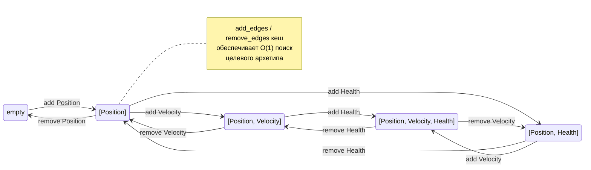

# APEX ECS — Entity Component System Engine
### Руководство пользователя
> **Версия 0.3.0** | Rust Edition 2021

---

## Содержание

1. [Введение](#1-введение)
2. [Основные концепции](#2-основные-концепции)
3. [Архетипы и хранилище](#3-архетипы-и-хранилище)
4. [Query API](#4-query-api)
5. [Ресурсы и события](#5-ресурсы-и-события)
6. [Системы и планировщик](#6-системы-и-планировщик)
   - [6.0 Регистрация систем — `add_systems()`](#60-регистрация-систем--add_systems-рекомендуемый-способ)
   - [6.0a Run Conditions — условное выполнение систем](#60a-run-conditions--условное-выполнение-систем)
   - [6.0b Scope Conditions — условия на группу систем](#60b-scope-conditions--условия-на-группу-систем)
   - [6.0c Apply Deferred — применение команд в том же кадре](#60c-apply-deferred--применение-команд-в-том-же-кадре)
   - [6.1 `system!` макрос](#61-system-макрос)
   - [6.8 `SystemParam` — типобезопасные параметры систем](#68-systemparam--типобезопасные-параметры-систем)
7. [Commands](#7-commands)
8. [Relations (связи между entity)](#8-relations-связи-между-entity)
9. [EntityTemplate](#9-entitytemplate)
10. [Сериализация](#10-сериализация)
11. [Hot Reload](#11-hot-reload)
12. [Изолированные миры (IsolatedWorld)](#12-изолированные-миры-isolatedworld)
13. [Параллелизм](#13-параллелизм)
14. [Советы по производительности](#14-советы-по-производительности)
15. [Полный пример](#15-полный-пример)
16. [Быстрый справочник](#16-быстрый-справочник)
17. [Lua Scripting](#17-lua-scripting)
---

## 1. Введение

**Apex ECS** — это высокопроизводительный движок Entity Component System (ECS), написанный на Rust. Он разработан для применения в игровых движках и симуляциях, где требуется обработка сотен тысяч объектов с минимальными накладными расходами.

### 1.1 Ключевые возможности

- **Архетипное хранилище компонентов (SoA layout)** — данные одного типа хранятся рядом в памяти, что максимизирует использование CPU-кеша
- **Параллельное выполнение систем** — планировщик автоматически находит системы без конфликтов и запускает их параллельно через Rayon с адаптивным отключением для малых миров
- **Change Detection** — каждая строка данных хранит тик последнего изменения, запросы `Changed<T>` работают без overhead
- **Композиция Bundle** — вложенные `#[derive(Bundle)]`, кортежи Bundle до 12 элементов, одиночные компоненты напрямую в `spawn()`
- **Relations (связи между entity)** — иерархии, ownership и произвольные связи закодированы как компоненты
- **Сериализация мира** — снэпшот/восстановление состояния через JSON или bincode
- **Hot Reload конфигураций** — файловый watcher перезагружает JSON-конфиги без перезапуска
- **Lua-скриптинг** — игровая логика на Lua 5.4 с хот-релоадом `.lua`-файлов, sandbox-изоляцией и доступом к ECS через query/spawn/resource/event API
- **Batch API** — `spawn_many` создаёт тысячи entity за один проход
- **Run Conditions** — условное выполнение систем: `.run_if(cond)`, AND/OR-комбинация, scope conditions, common conditions из коробки
- **Apply Deferred** — немедленное применение Commands между системами в том же кадре (compile-time, ноль runtime overhead)
- **Event Pipeline** — конвейерная обработка событий (Producer → Transformer → Consumer) с порядком по именам
> **Версия 0.3.0** — крейты пока не опубликованы на crates.io. Для использования добавляйте зависимость через `path = "..."` или `git = "..."` (см. раздел 1.3).
### 1.2 Структура крейтов

| Крейт | Назначение |
|---|---|
| `apex-core` | Ядро ECS: entity, component, archetype, query, world, events, relations, resources, EntityTemplate, TemplateRegistry |
| `apex-scheduler` | Планировщик систем: компиляция графа зависимостей, параллельные Stage, Run Conditions, Apply Deferred, Event Pipeline |
| `apex-graph` | Граф зависимостей: топологическая сортировка, обнаружение циклов |
| `apex-serialization` | Сериализация мира: WorldSnapshot, snapshot/restore, PrefabManifest, PrefabLoader |
| `apex-hot-reload` | Горячая перезагрузка: FileWatcher, HotReloadPlugin, PrefabPlugin |
| `apex-macros` | Процедурные макросы: `#[derive(Component)]` (реализация трейта + авторегистрация), `#[derive(Bundle)]` (бандлы с поддержкой вложенности), `#[derive(Scriptable)]` для интеграции с Lua-скриптингом |
| `apex-scripting` | Lua-скриптинг: ScriptEngine, регистрация компонентов/ресурсов/событий, хот-релоад `.lua`-скриптов |
| `apex-isolated` | Изолированные ECS-миры: IsolatedWorld, WorldBridge, CloneableBridge |

### 1.3 Установка

Крейты **ещё не опубликованы на crates.io** (версия 0.1.0). Используйте один из способов ниже.

**Вариант A — локальный путь (разработка):**

```toml
[dependencies]
apex-core          = { path = "path/to/apex-ecs/crates/apex-core" }
apex-scheduler     = { path = "path/to/apex-ecs/crates/apex-scheduler" }
apex-serialization = { path = "path/to/apex-ecs/crates/apex-serialization" }
apex-hot-reload    = { path = "path/to/apex-ecs/crates/apex-hot-reload" }
apex-macros        = { path = "path/to/apex-ecs/crates/apex-macros" }
apex-scripting     = { path = "path/to/apex-ecs/crates/apex-scripting" }
apex-isolated      = { path = "path/to/apex-ecs/crates/apex-isolated" }

```

**Вариант B — git-зависимость (потребитель):**

> ⚠️ **Внимание:** `latest-revision-hash` — это **заглушка**. Замените её на реальный хеш
> коммита из репозитория (узнать: `git ls-remote https://github.com/StanislavMal/apex-ecs HEAD`).

```toml
[dependencies]
apex-core          = { git = "https://github.com/StanislavMal/apex-ecs", rev = "latest-revision-hash" }
apex-scheduler     = { git = "https://github.com/StanislavMal/apex-ecs", rev = "latest-revision-hash" }
apex-serialization = { git = "https://github.com/StanislavMal/apex-ecs", rev = "latest-revision-hash" }
apex-hot-reload    = { git = "https://github.com/StanislavMal/apex-ecs", rev = "latest-revision-hash" }
apex-macros        = { git = "https://github.com/StanislavMal/apex-ecs", rev = "latest-revision-hash" }
apex-scripting     = { git = "https://github.com/StanislavMal/apex-ecs", rev = "latest-revision-hash" }
apex-isolated      = { git = "https://github.com/StanislavMal/apex-ecs", rev = "latest-revision-hash" }
```

> **Минимальная версия Rust:** 2021 Edition. Rayon всегда скомпилирован — параллелизм доступен
> без feature-флагов. Автоотключатель (15000/25000/80000 entity/system) защищает малые миры
> от параллельного оверхеда. Для жёсткого sequential:
> `scheduler.set_parallel_auto_disable(false).set_parallel_min_entities(usize::MAX)`.

---

## 2. Основные концепции

### 2.1 Entity

Entity — это уникальный идентификатор объекта в мире. Он не хранит данные напрямую, только указывает на строку в архетипе.

```rust
// Entity — generational index: index + generation
// Generational counter защищает от use-after-free
pub struct Entity {
    index:      u32,   // позиция в аллокаторе
    generation: u32,   // инкрементируется при повторном использовании
}

// Проверка жизни entity:
world.is_alive(entity)   // -> bool

// Проверка наличия компонента (начиная с v0.1.0, O(1)):
world.has_component::<Position>(entity) // -> bool
entity.index()           // -> u32
entity.generation()      // -> u32
```

> **Примечание:** Entity никогда не хранит компоненты напрямую. Все данные живут в Column-буферах архетипа. Entity — это только ключ для поиска.

### 2.2 Component

Компонент — это чистые данные без логики. Трейт `Component` (маркерный: `Send + Sync + 'static`)
**обязательно требует явной реализации** — через `#[derive(Component)]` или manual `impl Component for Type {}`.

`#[derive(Component)]` генерирует:
- `impl Component for Type {}` — реализацию трейта
- статический регистратор через `linkme::distributed_slice` для авторегистрации при `World::new()`

```rust
use apex_core::prelude::*;
// `Component` derive доступен из prelude (ре-экспорт из apex_macros).
// Альтернативно: `use apex_macros::Component;`

// #[derive(Component)] генерирует impl Component + авторегистрацию:
#[derive(Component, Clone, Copy, Debug)]
struct Position { x: f32, y: f32 }

// Для сериализации нужен register_component_serde:
#[derive(Component, Clone, Copy, Debug, Serialize, Deserialize)]
struct SaveablePos { x: f32, y: f32 }
// ... world.register_component_serde::<SaveablePos>(); // ← всё ещё нужен

// Ручная реализация (если не используется derive):
impl Component for MyDynamicType {}
world.register_component::<MyDynamicType>();

// Регистрация с сериализацией:
world.register_component_serde::<Position>();
```

> **Авторегистрация:** `#[derive(Component)]` генерирует статический регистратор через `linkme::distributed_slice`. При создании `World::new()` вызывается `ComponentRegistry::register_all_auto()` — все зарегистрированные компоненты готовы к использованию без ручных вызовов.
>
> **Важно:** Blanket impl `impl<T: Send + Sync + 'static> Component for T` **убран**. Каждый тип должен явно реализовать `Component` (через `#[derive(Component)]` или manual `impl`). Это необходимо для корректной работы рекурсивной композиции Bundle (кортежи не должны наследовать `Component`).
>
> **Сериализация:** `#[derive(Component)]` даёт только базовую реализацию трейта (без serde-функций). Для компонентов с `Serialize + Deserialize` по-прежнему вызывайте `world.register_component_serde::<T>()` — метод идемпотентен и только добавляет сериализацию.
>
> **`linkme`:** Ре-экспортирован через `apex_core::linkme` — не нужно добавлять в `Cargo.toml` отдельно. Ручной вызов `world.register_component::<T>()` остаётся рабочим для динамических компонентов (скриптинг, hot-reload).
>
> **Внешние типы (`cgmath::Matrix4<f32>`):** Для использования внешних типов как компонентов, включите feature-флаг `cgmath` в `apex-core` — он предоставляет `impl Component for cgmath::Matrix4<f32>`.

### 2.3 World

World — центральный контейнер, который хранит всё: entity, компоненты, ресурсы, события, relations.

```rust
use apex_core::prelude::*;

let mut world = World::new();

// Компоненты с #[derive(Component)] регистрируются автоматически
// (иначе — вручную: world.register_component::<Position>())

// Создание entity с набором компонентов — кортеж (Bundle):
let player = world.spawn((
    Position { x: 0.0, y: 0.0 },
    Velocity { x: 1.0, y: 0.0 },
    Health { current: 100.0, max: 100.0 },
));

// Одиночный компонент — работает напрямую (blanket impl: Component → Bundle):
let marker = world.spawn(Position { x: 100.0, y: 100.0 });

// Пустая entity:
let empty = world.spawn(());

// ── Именованные Bundle — #[derive(Bundle)] ─────────────────

// Плоский бандл (любое число полей):
#[derive(Bundle)]
struct PlayerBundle {
    pos: Position,
    vel: Velocity,
    hp: Health,
    armor: Armor,
    team: Team,
    inventory: Inventory,
}
let player = world.spawn(PlayerBundle {
    pos: Position { x: 0.0, y: 0.0 },
    vel: Velocity { x: 1.0, y: 0.0 },
    hp: Health { current: 100.0, max: 100.0 },
    armor: Armor { value: 10.0 },
    team: Team::Red,
    inventory: Inventory::default(),
});

// ── Вложенные Bundle (композиция) ─────────────────────────

// Один Bundle может содержать другой Bundle как поле:
#[derive(Bundle)]
struct PlayerBase {
    pos: Position,
    hp:  Health,
}

#[derive(Bundle)]
struct ArmedPlayer {
    base:   PlayerBase,  // ← вложенный Bundle (рекурсивно разворачивается)
    weapon: Weapon,
    armor:  Armor,
}

let warrior = world.spawn(ArmedPlayer {
    base: PlayerBase {
        pos: Position { x: 10.0, y: 20.0 },
        hp:  Health { current: 100.0, max: 100.0 },
    },
    weapon: Weapon { name: "Меч", damage: 25.0 },
    armor:  Armor(50.0),
});
// Множество компонентов: [Position, Health, Weapon, Armor]

// ── Кортежи Bundle ────────────────────────────────────────

// Bundle-структура + одиночный компонент + ещё один компонент:
world.spawn((
    PlayerBase { pos: Position { x: 0.0, y: 0.0 }, hp: Health { current: 100.0, max: 100.0 } },
    Speed(5.0),
    Team(2),
));
// Поддерживается до 12 элементов в кортеже

// Добавление компонента после создания через EntityRef:
world.entity(player).insert(Armor { value: 10.0 });

// Batch-спавн одинаковых бандлов (самый быстрый способ):
let entities = world.spawn_many(1000, |i| (
    Position { x: i as f32, y: 0.0 },
    Velocity { x: 0.1, y: 0.0 },
));

// Batch-спавн из итератора (разные бандлы):
world.spawn_batch([
    (Health(100.0), Armor(10.0), Player),
    (Health(50.0),  Armor(5.0),  Enemy),
    (Health(25.0),  Armor(2.0),  Enemy),
]);

// Уничтожение entity:
world.despawn(player);

// Удаление всех entity с сохранением ресурсов:
world.clear_entities();

// Добавление/удаление компонентов:
world.insert(entity, Health { current: 50.0, max: 100.0 });
world.remove::<Velocity>(entity);

// Чтение компонента:
if let Some(pos) = world.get::<Position>(entity) {
    println!("pos: ({}, {})", pos.x, pos.y);
}

// Мутабельное чтение:
if let Some(hp) = world.get_mut::<Health>(entity) {
    hp.current -= 10.0;
}
```

---

## 3. Архетипы и хранилище

Apex ECS использует архетипное хранилище (Archetype Storage). Entity с одинаковым набором компонентов хранятся в одном архетипе — это обеспечивает cache-friendly итерацию.

### 3.1 Как работает хранилище

```
Archetype [Position, Velocity, Health]
┌─────────────┬─────────────┬─────────────────┐
│  Position   │  Velocity   │     Health      │
├─────────────┼─────────────┼─────────────────┤
│ (0.0, 0.0)  │ (1.0, 0.0)  │ {100.0, 100.0}  │ entity 0
│ (5.0, 3.0)  │ (0.5, 0.0)  │ {75.0, 100.0}   │ entity 1
│ (10.0, 0.0) │ (0.0, -1.0) │ {50.0, 100.0}   │ entity 2
└─────────────┴─────────────┴─────────────────┘

Данные одного компонента — contiguous в памяти → SIMD-friendly
```

> **Примечание:** При добавлении или удалении компонента entity перемещается в другой архетип. Используйте `add_edges`/`remove_edges` кеш для O(1) поиска нужного архетипа при повторных операциях.

### 3.2 Граф переходов архетипов

Каждый архетип хранит карту переходов: при добавлении компонента A — в какой архетип перейти, при удалении A — в какой вернуться.



```rust
// Внутренняя логика (для понимания):
// world.insert(entity, NewComponent { ... })
//   → find_or_create_archetype_with(current_arch, component_id)
//   → проверяем add_edges cache (O(1) при повторе)
//   → move_entity: копируем общие компоненты, swap_remove из старого
//   → записываем новый компонент в новый архетип
```

---

## 4. Query API

Query — основной способ итерации по компонентам. Apex ECS предоставляет несколько уровней Query API.

### 4.1 Параметры запроса

| Параметр | Тип доступа | Описание |
|---|---|---|
| `Read<T>` | Иммутабельный (`&T`) | Чтение компонента |
| `Write<T>` | Мутабельный (`&mut T`) | Запись компонента |
| `With<T>` | Только фильтр | Entity должен иметь T |
| `Without<T>` | Только фильтр | Entity не должен иметь T |
| `Changed<T>` | Фильтр (не возвращает данные) | Только изменённые с тика; комбинируется с `Read<T>` |
| `Maybe<T>` | Опциональный (`Option<&T>`) | Чтение, если компонент есть |
| `MaybeWrite<T>` | Опциональный (`Option<&mut T>`) | Запись, если компонент есть |

### 4.2 `Query<Q>`

```rust
use apex_core::prelude::*;

// Простой запрос — итерация по Position:
Query::<Read<Position>>::new(&world)
    .for_each(|_, pos| {
        println!("pos: ({}, {})", pos.x, pos.y);
    });

// Запрос с Entity + мутацией:
Query::<(Read<Velocity>, Write<Position>)>::new(&world)
    .for_each(|entity, (vel, pos)| {
        pos.x += vel.x * 0.016;
        pos.y += vel.y * 0.016;
        println!("entity {:?} moved", entity);
    });

// Фильтрация по маркерному компоненту:
Query::<(Read<Health>, With<Player>)>::new(&world)
    .for_each(|_, hp| {
        println!("player HP: {}/{}", hp.current, hp.max);
    });

// Исключение компонента:
Query::<(Read<Position>, Without<Enemy>)>::new(&world)
    .for_each(|_, pos| { /* только не-Enemy */ });

// Change detection (фильтр — Changed<T> не возвращает данные, только фильтрует):
let last_tick = world.current_tick();
// ... (следующий тик) ...
// Changed<Position> в позиции фильтра — выбирает только изменённые entity:
Query::<(Read<Position>, Read<Velocity>), Changed<Position>>::new_with_tick(&world, last_tick)
    .for_each(|_, (pos, vel)| {
        println!("moved: pos=({},{}), vel=({},{})", pos.x, pos.y, vel.x, vel.y);
    });

// Changed<T> отдельно (без данных — только считать количество изменившихся):
let changed_count = Query::<(Changed<Position>,)>::new_with_tick(&world, last_tick)
    .iter()
    .count();

// Итератор (стандартный Iterator trait):
let count = Query::<Read<Health>>::new(&world)
    .iter()
    .filter(|(_, hp)| hp.current < 25.0)
    .count();
```

> **Примечание:** `Query::new()` собирает список подходящих архетипов при создании. Для горячих путей используйте `CachedQuery`, который переиспользует этот список.
> 
> **`Maybe<T>`** — опциональный компонент: возвращает `None` если компонент отсутствует, без фильтрации entity:
> ```rust
> // Все entity с Position, Health опционально — один проход:
> Query::<(Read<Position>, Maybe<Health>)>::new(&world)
>     .for_each(|entity, (pos, hp)| {
>         match hp {
>             Some(hp) => println!("HP: {}/{}", hp.current, hp.max),
>             None     => println!("без Health"),
>         }
>     });
> 
> // MaybeWrite<T> — опциональная мутация:
> Query::<(Read<Position>, MaybeWrite<Speed>)>::new(&world)
>     .for_each(|_, (pos, speed)| {
>         if let Some(speed) = speed {
>             speed.0 *= 0.9;  // замедлить, если есть Speed
>         }
>     });
> ```

`CachedQuery` кеширует список архетипов и инвалидируется только при изменении состава архетипов мира.

```rust
// CachedQuery — переиспользует список архетипов:
world.query_typed::<Read<Position>>()
    .for_each(|_, pos| { /* ... */ });

// С change detection (Changed<T> как фильтр):
world.query_changed::<(Read<Velocity>, Write<Position>)>(last_tick)
    .for_each(|entity, (vel, pos)| {
        // Обрабатываются только entity с изменённым Position или Velocity
    });

// Changed<T> как фильтр в Query (возвращает (), не данные):
world.query_changed::<(Read<Velocity>, Changed<Position>)>(last_tick)
    .for_each(|_, (vel, ())| {
        // vel только для изменившегося Position
    });

// Стандартный Iterator через .iter():
let far = world.query_typed::<Read<Position>>()
    .iter()
    .filter(|(_, pos)| pos.x > 100.0)
    .count();

// Параллельная итерация (rayon всегда доступен):
world.query_typed::<Read<Position>>()
    .par_for_each(|_, pos| {
        /* CPU-bound расчёты */
    });
```

> **Внутри систем (через `SystemContext`)** `ctx.query::<Q>()` использует `CachedQuery::from_sub_world` — ленивый `fetch_state` (вызывается в `for_each`, не при создании) и кеш архетипов через `get_or_compute`. Подробнее — в [разделе 6.6](#66-systemcontext).

### 4.4 `QueryBuilder` (динамический запрос)

Когда типы компонентов не известны статически — используйте `QueryBuilder`.

```rust
// QueryBuilder — runtime запрос:
let arch_ids = world.query()
    .read::<Position>()
    .write::<Velocity>()
    .exclude::<Enemy>()
    .matching_archetype_ids();

println!("Подходящих архетипов: {}", arch_ids.len());
```

---

## 5. Ресурсы и события

### 5.1 Resources

Ресурс — это глобальный синглтон, доступный из любой системы. Типичные примеры: конфиг физики, delta time, статистика кадра.

```rust
#[derive(Clone, Copy)]
struct PhysicsConfig { gravity: f32, dt: f32 }

#[derive(Default)]
struct FrameStats { frame: u32, total_entities: usize }

// Вставка ресурса:
world.insert_resource(PhysicsConfig { gravity: 9.8, dt: 0.016 });
world.insert_resource(FrameStats::default());

// Чтение (паникует если не найден):
let cfg = world.resource::<PhysicsConfig>();
println!("gravity: {}", cfg.gravity);

// Мутабельный доступ:
world.resource_mut::<PhysicsConfig>().gravity = 1.62;

// Безопасное чтение (Option):
if let Some(stats) = world.try_resource::<FrameStats>() {
    println!("frame: {}", stats.frame);
}

// Безопасный мутабельный доступ (Option):
if let Some(mut stats) = world.try_resource_mut::<FrameStats>() {
    stats.frame += 1;
}

// В системах — те же методы через ctx (см. раздел 6.6):
let cfg   = ctx.resource::<PhysicsConfig>();       // Res<T>
let stats = ctx.try_resource::<FrameStats>();       // Option<Res<T>>

// Проверка наличия:
world.has_resource::<PhysicsConfig>() // -> bool

// Удаление:
let old_cfg = world.remove_resource::<PhysicsConfig>();
```

### 5.2 Events

События используют двойную буферизацию: `pending` (куда пишут в текущем тике) и `events` (доступно для чтения, данные предыдущего тика).

> **Важно (v0.1.0):** `world.tick()` теперь **только инкрементирует счётчик тика** и не переключает буферы событий. Flush событий выполняет Scheduler после каждого Stage автоматически (в **sequential и parallel режимах**). При использовании `World` без `Scheduler` нужно вручную вызывать `world.flush_all_events()` после `world.tick()`.

Внутренний тип очереди — [`Events<T>`](crates/apex-core/src/events.rs:63). Доступ к нему осуществляется через `world.events::<T>()` (immutable) и `world.events_mut::<T>()` (mutable).

> **Авторегистрация (v0.1.0):** `world.send_event::<T>()` и `world.try_send_event::<T>()` автоматически регистрируют тип события, если он ещё не был зарегистрирован. Явный вызов `world.add_event::<T>()` больше не требуется для отправки. `EventReader::new()` по-прежнему требует предварительной регистрации через `add_event` или `send_event`.

#### 5.2.1 Базовая отправка и чтение через `EventReader`

Для чтения событий используется [`EventReader<T>`](crates/apex-core/src/system_param.rs:110) с per-reader курсором. `EventReader::new()` безопасно создаёт читателя, автоматически регистрируя его через `add_reader()`.

**Два способа создать EventReader:**
- `EventReader::new(world.events_mut::<T>())` — низкоуровневый
- `world.event_reader::<T>()` — convenience-метод на `World` (рекомендуется, зеркало `ctx.event_reader()`)

> **Важно:** [`iter()`](crates/apex-core/src/events.rs:294) **не продвигает** курсор — события
> будут повторно видны при следующем вызове. Для однократного чтения используйте
> [`read()`](crates/apex-core/src/system_param.rs:137) (RAII-автопродвижение при `Drop`).
> При уничтожении `EventReader` его курсор автоматически удаляется из очереди событий
> (через `remove_reader()` в `Drop`), что предотвращает утечку и позволяет корректно
> очищать буфер.

```rust
#[derive(Clone, Copy)]
struct DamageEvent { target: Entity, amount: f32 }

#[derive(Clone, Copy)]
struct DeathEvent { entity: Entity }

// Регистрация типа события (опционально — send_event регистрирует сам):
// world.add_event::<DamageEvent>();
// world.add_event::<DeathEvent>();

// Создание читателя событий (safe — сам вызывает add_reader()):
let mut reader = EventReader::new(world.events_mut::<DamageEvent>());

// Отправка события (авторегистрация — add_event не нужен):
world.send_event(DamageEvent { target: enemy, amount: 35.0 });

// Безопасная отправка (всегда успешна — авторегистрация):
world.try_send_event(DamageEvent { target: enemy, amount: 35.0 });

// Чтение непрочитанных событий через slice (без продвижения курсора):
for ev in reader.iter() {
    println!("damage: {} → entity {:?}", ev.amount, ev.target);
}

// RAII-чтение с авто-продвижением курсора при Drop:
{
    let guard = reader.read();  // -> EventReadGuard<DamageEvent>
    for ev in guard.iter() {
        process(ev);
    }
} // ← курсор автоматически продвинут

// Переключение буферов — при использовании Scheduler flush происходит автоматически.
// Без Scheduler: вызывать world.flush_all_events() после world.tick().
world.tick();
world.flush_all_events();   // ← только если НЕ используется Scheduler

// После flush события из pending стали доступны для чтения:
for ev in reader.iter() {
    println!("new tick: {:?}", ev);
}
```

> **При использовании Scheduler:** `sched.run(&mut world)` автоматически флашит события после каждого Stage — ручной вызов `flush_all_events()` не нужен. События, отправленные на Stage N, видны на Stage N+1 того же кадра.

#### 5.2.2 Per-reader чтение (низкоуровневое)

[`Events<T>`](crates/apex-core/src/events.rs:63) поддерживает произвольное количество независимых читателей, каждый со своим курсором [`EventCursor`](crates/apex-core/src/events.rs:574). Для типовых сценариев используйте [`EventReader`](#521-базовая-отправка-и-чтение-через-eventreader), а низкоуровневый API — для максимального контроля:

```rust
let queue = world.events_mut::<DamageEvent>();

// Создаём читателя вручную:
let reader_a = queue.add_reader();   // -> EventCursor
let reader_b = queue.add_reader();

// Отправляем несколько событий:
queue.send(DamageEvent { target: e1, amount: 10.0 });
queue.send(DamageEvent { target: e2, amount: 25.0 });

// Каждый читатель видит только непрочитанные события:
for ev in queue.iter(&reader_a) {
    println!("reader_a: {:?}", ev);
}

// Ручное продвижение курсора:
queue.advance_reader_mut(&reader_a);

// reader_b всё ещё видит все события (его курсор не двигали):
for ev in queue.iter(&reader_b) { /* ... */ }

// Удаление читателя:
queue.remove_reader(reader_b);

// Количество непрочитанных событий:
let n = queue.len_pending();
```

#### 5.2.3 RAII-чтение с автоматическим продвижением (`EventReadGuard`)

[`EventReadGuard<T>`](crates/apex-core/src/events.rs:248) — RAII-обёртка, которая при Drop автоматически продвигает курсор до конца буфера. Исключает забытые `advance_reader_mut()`.

```rust
let queue = world.events_mut::<DamageEvent>();

// read() возвращает EventReadGuard — курсор продвинется при выходе из scope:
{
    let guard = queue.read(&reader_a);  // -> EventReadGuard<DamageEvent>
    for ev in guard.iter() {
        process(ev);
    }
} // ← здесь cursor автоматически продвигается

// ⚠️ Важно: всегда привязывайте результат .read() к переменной
// (начиная с v0.1.0 — #[must_use] предотвращает случайный дроп):
// queue.read(&reader_a);  // ← предупреждение компилятора!
let guard = queue.read(&reader_a);  // ✓ правильно

// Можно использовать Deref к срезу:
let guard = queue.read(&reader_a);
if !guard.is_empty() {
    let first: &DamageEvent = &guard[0];
}
```

#### 5.2.4 Просмотр без продвижения (`PeekGuard`) и частичное чтение

[`PeekGuard<T>`](crates/apex-core/src/events.rs:544) — самостоятельная структура (не обёртка над `EventReadGuard`), которая **не** продвигает курсор при Drop. Создаётся через [`EventReadGuard::peek()`](crates/apex-core/src/events.rs:450):

```rust
let queue = world.events_mut::<DamageEvent>();

// Посмотреть события, но не отмечать их как прочитанные:
let peek = queue.read(&reader_a).peek();  // -> PeekGuard<DamageEvent>
println!("{} pending events", peek.len());
// курсор не сдвинулся — следующий read() покажет те же события
```

[`read_partial(&cursor, max_count)`](crates/apex-core/src/events.rs:347) — прочитать не более N событий и продвинуть курсор ровно на прочитанное. В отличие от `read()` (drop → конец буфера), `read_partial` при дропе продвигает курсор на `guard.len()` — остальные события не теряются:

```rust
// Обрабатываем по 32 события за тик, не теряя остальные:
while let guard = queue.read_partial(&reader_a, 32) {
    if guard.is_empty() { break; }
    for ev in guard.iter() { process(ev); }
    // При дропе курсор продвинется ровно на guard.len()
}
```

#### 5.2.5 Пакетная отправка (`send_batch`)

Для массовой отправки событий используйте [`send_batch`](crates/apex-core/src/events.rs:98):

```rust
let queue = world.events_mut::<DamageEvent>();

// Вектор событий:
let batch: Vec<DamageEvent> = (0..100).map(|i| {
    DamageEvent { target: entity, amount: i as f32 }
}).collect();
queue.send_batch(batch);

// Или итератор:
queue.send_batch((0..50).map(|i| DamageEvent { target: entity, amount: i as f32 }));
```

#### 5.2.6 Сводка методов `Events<T>`

| Метод | Описание |
|-------|----------|
| `send(event)` | Отправить одно событие в текущий тик |
| `send_batch(events)` | Отправить пачку событий (любой `IntoIterator`) |
| `send_sync(event)` | Thread-safe отправка из параллельных систем (через `&self`) |
| `send_batch_sync(events)` | Thread-safe пакетная отправка (один lock на пачку) |
| `flush_sync()` | Слить thread-safe буфер (`sync_pending`) в основной `pending` |
| `reserve(n)` | Предаллоцировать `pending` буфер для N событий (избежать реаллокаций) |
| `add_reader() -> EventCursor` | Зарегистрировать нового читателя |
| `remove_reader(reader_id)` | Удалить читателя |
| `iter(reader_id) -> &[T]` | Непрочитанные события для reader (без продвижения курсора) |
| `read(reader_id) -> EventReadGuard<T>` | Чтение с auto-advance на Drop (весь буфер) |
| `read_partial(reader_id, max_count) -> PartialReadGuard<T>` | Чтение с продвижением ровно на N событий |
| `advance_reader_mut(reader_id)` | Ручное продвижение курсора до конца буфера |
| `advance_reader_by(reader_id, count)` | Ручное продвижение курсора на N событий |
| `len_pending() -> usize` | Количество событий в буфере записи |
| `clear()` | Очистить оба буфера и сбросить все курсоры |
| `update()` | Переключить буферы: pending → events. Вызывается Scheduler'ом после каждого Stage (sequential и parallel), либо вручную через `world.flush_all_events()` |

**`EventWriter<T>`** (доступен через `ctx.event_writer::<T>()`):

| Метод | Описание |
|-------|----------|
| `send(event: T)` | Отправить одно событие |
| `send_batch(events)` | Отправить пачку событий (любой `IntoIterator<Item=T>`) |
| `reserve(additional)` | Предаллоцировать буфер для отправки |

**`EventReader<T>`** (рекомендуемый высокоуровневый API):

| Метод | Описание |
|-------|----------|
| `new(events: &mut Events<T>) -> Self` | Создать читателя (авто-регистрация через `add_reader()`) |
| `iter(&self) -> &[T]` | Непрочитанные события в виде среза (без продвижения курсора) |
| `read(&mut self) -> EventReadGuard<T>` | Чтение с auto-advance на Drop (рекомендуется) |
| `len(&self) -> usize` | Количество непрочитанных событий |
| `is_empty(&self) -> bool` | Проверить, есть ли непрочитанные события |
| `Drop` | Автоматически вызывает `remove_reader()` — предотвращает утечку курсоров |

#### 5.2.7 Декларативное резервирование буфера через `AccessDescriptor`

Для систем с массовой отправкой событий планировщик может автоматически предаллоцировать буфер `pending` перед запуском системы, избегая реаллокаций `Vec` в hot-пути `send()`. Достаточно указать ожидаемую ёмкость в `AccessDescriptor`:

```rust
// Для system! — резервируем через writer.reserve() прямо в теле:
system! {
    fn collision_system(
        q: Read<Collider>,
        writer: &mut Vec<DamageEvent>,
    ) {
        writer.reserve(10000);  // предаллоцировать буфер под 10000 событий
        for (entity, _) in q.iter() {
            writer.send(DamageEvent { target: entity, amount: 25.0 });
        }
    }
}

// Для add_par_access — через access_desc!:
sched.add_par_access(
    "collision",
    access_desc!(write_event::<DamageEvent>)
        .event_reserve::<DamageEvent>(10000),
    |ctx| { /* массовая отправка DamageEvent */ },
);
```

Планировщик вызывает `world.event_reserve::<T>(capacity)` перед выполнением системы, что позволяет `EventWriter::send()` работать без аллокаций внутри цикла. В `system!` макросе можно вызвать `writer.reserve()` напрямую.

> **Примечание:** `world.event_reserve::<T>(cap)` и `world.event_reserve_by_type(type_id, cap)` доступны и для ручного вызова вне планировщика.

#### 5.2.8 Отложенная доставка через `DelayedQueue<T>`

[`DelayedQueue<T>`](crates/apex-core/src/events.rs:636) — отдельная очередь для событий, которые должны быть доставлены с задержкой в N тиков. Внутри — `BinaryHeap` для O(log N) вставки и O(K log N) извлечения готовых. События с одинаковым `deliver_at` доставляются в порядке вставки (FIFO).

```rust
use apex_core::prelude::*;

let mut delayed = DelayedQueue::new();

// Отправить событие с задержкой в тиках:
delayed.send_delayed("boom", 3, world.current_tick().0);  // взрыв через 3 тика

// Перенести готовые события в основную очередь:
delayed.flush_delayed(world.current_tick().0, world.events_mut::<&str>());

// события теперь в pending — станут доступны после flush_all_events() (или Scheduler.run())
```

| Метод | Описание |
|-------|----------|
| `new() -> Self` | Создать пустую очередь |
| `send_delayed(event, delay, current_tick)` | Отправить с задержкой в N тиков (O(log N)) |
| `flush_delayed(tick, &mut Events<T>)` | Извлечь все готовые события в `pending` (O(K log N)) |
| `len() -> usize` | Количество отложенных событий |
| `is_empty() -> bool` | Пуста ли очередь |
| `clear()` | Очистить очередь и сбросить sequence |
| `reserve(n)` | Предаллоцировать память под N будущих событий |

#### 5.2.9 Thread-safe отправка (`send_sync` / `send_batch_sync`)

Для отправки событий из параллельных систем (где доступен только `&Events<T>`, а не `&mut Events<T>`) используйте методы `send_sync` и `send_batch_sync`. Они пишут во внутренний `Mutex<Vec<T>>`, который лениво инициализируется через `OnceLock` (нулевой overhead для однопоточных сценариев).

Содержимое `sync_pending` автоматически сливается в основной `pending` при вызове `update()` (т.е. при каждом `world.tick()`), либо вручную через `flush_sync()`.

```rust
let queue: &Events<DamageEvent> = world.events::<DamageEvent>();

// Поштучная отправка — каждый вызов берёт lock:
queue.send_sync(DamageEvent { target: e, amount: 10.0 });
queue.send_sync(DamageEvent { target: e, amount: 20.0 });

// Пакетная отправка — один lock на пачку:
queue.send_batch_sync((0..100).map(|i| DamageEvent { target: e, amount: i as f32 }));
```

| Метод | Описание |
|-------|----------|
| `send_sync(&self, event)` | Thread-safe отправка одного события |
| `send_batch_sync(&self, events)` | Thread-safe пакетная отправка (один lock) |
| `flush_sync(&mut self)` | Слить `sync_pending` в основной `pending` |

> **Примечание:** `update()` вызывается Scheduler'ом после каждого Stage (или через `world.flush_all_events()`). Ручной вызов `flush_sync()` нужен только если требуется прочитать события до следующего flush.

### 5.3 Event Pipeline — конвейерная обработка событий

`EventPipelineBuilder` — надстройка над механизмом явных зависимостей (`add_dependency`), которая декларативно описывает **цепочку обработки одного события**. Позволяет гарантировать порядок: `Producer → Transformer → [Consumer, Consumer (parallel)]` без ручного вызова `add_dependency` между каждой парой систем.

#### 5.3.1 Мотивация

Автоматическое правило `Emit<E> → Listen<E>` даёт гарантию: все отправители — до всех слушателей. Но внутри группы `Listen<E>` порядок не определён. Конвейер устраняет этот пробел.

**Без конвейера:**
```text
Emit<Damage> → [ArmorSystem, HealthSystem, SoundSystem] (все Listen — без порядка)
```

**С конвейером:**
```text
CollisionSystem (Emit) → ArmorSystem (Listen+Emit) → [HealthSystem, SoundSystem] (Listen)
```

#### 5.3.2 Роли в конвейере

| Роль | Требования к доступу | Описание |
|------|---------------------|----------|
| `produced_by` | `Emit<E>` | Только отправляет событие |
| `transformed_by` | `Listen<E>` + `Emit<E>` | Читает, обрабатывает и перевыпускает событие |
| `consumed_by` | `Listen<E>` | Только читает событие |

#### 5.3.3 Базовое использование

```rust
use apex_scheduler::{Scheduler, sys};

let mut sched = Scheduler::new();

// Системы регистрируются по именам (не SystemId)
sched.add_systems(StageLabel::Update, (
    sys("collision", CollisionSystem),  // Emit<DamageEvent>
    sys("armor",     ArmorSystem),      // Listen+Emit<DamageEvent>
    sys("health",    HealthSystem),     // Listen<DamageEvent>
    sys("sound",     SoundSystem),      // Listen<DamageEvent>
));

// Конвейер: collision → armor → [health, sound]
Scheduler::event_pipeline::<DamageEvent>()
    .produced_by("collision")     // ← только имя, без SystemId
    .transformed_by("armor")
    .consumed_by("health")
    .consumed_by("sound")
    .build(&mut sched);

sched.compile().unwrap();
```

Планировщик сгенерирует 3 Stage: `collision → armor → [health + sound]`. Несколько `consumed_by` подряд образуют параллельную группу (если нет компонентных конфликтов).

#### 5.3.4 Валидация ролей

`build_validated()` проверяет, что AccessDescriptor каждой системы соответствует заявленной роли:

```rust
let result = Scheduler::event_pipeline::<DamageEvent>()
    .produced_by("bad_producer")
    .build_validated(&mut sched);

if let Err(errors) = result {
    for e in &errors {
        eprintln!("{}", e);
        // Pipeline: система 'bad_producer' объявлена как Producer для 'DamageEvent',
        // но не имеет Emit<DamageEvent>.
    }
}
```

#### 5.3.5 Особенности double-buffered events

Конвейер управляет **порядком выполнения**, а не потоком данных. Начиная с v0.1.0, flush событий происходит после каждого Stage (через `world.flush_events_by_type()`), что означает: события, отправленные на Stage N, видны на Stage N+1 **того же кадра** (без задержки в 1 тик).

При этом:
- Трансформер может модифицировать **компоненты** — изменения видны консьюмерам того же кадра
- Трансформер может перевыпускать события — консьюмеры **следующего Stage** увидят их в том же кадре
- Два `consumed_by` без компонентных конфликтов выполняются параллельно

```text
Кадр N:
  Stage 0 (Collision): Emit<Damage> → pending
  flush → DamageEvent в events
  Stage 1 (Armor):     Listen<Damage> + Emit<Damage_reduced> → pending
  flush → Damage_reduced в events
  Stage 2 (Health, Sound): Listen<Damage> + Listen<Damage_reduced> → чтение из events
```

---

## 6. Системы и планировщик

Apex ECS предоставляет **два макроса** для объявления систем (`system!`, `sequential_system!`) и единый API регистрации через `add_systems()`.

### 6.0 Регистрация систем — `add_systems()` (рекомендуемый способ)

Единая точка регистрации всех типов систем. Используйте конструкторы `sys`/`seq`/`par`/`par_access` из `apex_scheduler`:

```rust
use apex_scheduler::{Scheduler, StageLabel, sys, seq, par, par_access};

let mut sched = Scheduler::new();

sched.add_systems(StageLabel::Update, (
    sys("movement", movement_system),                     // AutoSystem / system! macro
    seq("cleanup", |world: &mut World| { ... }),          // sequential_system! macro
    par("log", |_: SystemContext| println!("tick")),      // closure без доступа
    par_access("physics", access_desc!(read<Vel>, write<Pos>),
        |ctx| { ctx.query::<(Read<Vel>, Write<Pos>)>().for_each(|_, (v, p)| p.x += v.x); }
    ),
    seq("spawner", spawner_fn),                           // sequential система
));
```

| Конструктор | Тип системы |
|---|---|
| `sys(name, struct)` | AutoSystem / `system!` struct |
| `seq(name, fn)` | Sequential / `sequential_system!` функция |
| `par(name, closure)` | Parallel замыкание без доступа к компонентам |
| `par_access(name, access, closure)` | Parallel замыкание с явным `AccessDescriptor` |

Кортежи принимают до 12 элементов. Имена систем (`sys("name", ...)`) используются для `chain()`, `before()`/`after()`, event pipeline и `apply_deferred()`.

### 6.0a Run Conditions — условное выполнение систем

Система может быть пропущена в зависимости от состояния мира:

```rust
use apex_scheduler::{sys, conditions};

sched.add_systems(StageLabel::Update, (
    // AND-комбинация: оба условия должны быть true
    sys("movement", movement_system)
        .run_if(|w| !w.resource::<GameState>().paused)
        .run_if(conditions::any_with_component::<Player>()),

    // OR-комбинация: хотя бы одно true
    sys("respawn", respawn_system)
        .or_else(|w| conditions::resource_equals(0)(w))
        .or_else(|w| conditions::resource_equals(100)(w)),

    // Инвертирование
    sys("idle_ai", idle_ai)
        .run_if(conditions::not(combat_active)),
));
```

**Условия** (`Fn(&World) -> bool`) оцениваются на **главном потоке до** запуска stage'а. Когда `false` — система пропускается целиком (не создаются ASD-таски, ноль CPU).

**Встроенные условия** (модуль `conditions`):

| Функция | Описание |
|---|---|
| `resource_exists::<T>()` | Ресурс T существует в мире |
| `resource_equals(value)` | Ресурс T равен заданному значению |
| `any_with_component::<T>()` | Есть хотя бы один entity с компонентом T |
| `run_until(n)` | Выполниться ровно N раз, затем всегда `false` |
| `every_n_frames(n)` | Выполниться раз в N кадров |
| `not(condition)` | Инвертировать условие |

### 6.0b Scope Conditions — условия на группу систем

Условие применяется ко всем системам внутри `staged()`-блока:

```rust
sched.staged(StageLabel::tag("combat"), |s| {
    // Все системы внутри наследуют это условие (AND с их собственными)
    s.run_condition(|w| !w.resource::<GameState>().paused);

    s.add_systems(StageLabel::Update, (
        sys("movement", movement),
        sys("ai", ai)
            .run_if(conditions::any_with_component::<Enemy>()),
        sys("damage", damage),
    ));
    // movement: paused=false
    // ai:      paused=false AND any_enemy
    // damage:  paused=false
});
```

### 6.0c Apply Deferred — применение команд в том же кадре

Обычно команды (spawn/despawn/insert) применяются **после** завершения stage'а. `apply_deferred()` создаёт точку синхронизации внутри stage'а:

```rust
sched.staged(StageLabel::tag("spawn_pipeline"), |s| {
    s.add_systems(StageLabel::Update, (
        seq("spawner", |world| { world.spawn(...); }),
    ));
    s.apply_deferred();  // ★ команды spawner'а применены к миру

    s.add_systems(StageLabel::Update, (
        sys("camera", camera),   // ✅ видит только что созданные entity
        sys("ai", ai),           // ✅ видит только что созданные entity
    ));
});
```

`apply_deferred()` работает на этапе **compile()** — Stage разбивается на под-Stage. Горячий цикл `run()` не знает о split'е — **ноль runtime overhead**.

### 6.1 `system!` макрос

`system!` макрос автоматически генерирует `struct` + `impl AutoSystem`, сокращая boilerplate с 8-10 строк до 2-6. Доступен через `use apex_core::prelude::*`.

> **Как это работает:** макрос анализирует типы параметров:
> - `q: (Read<A>, Write<B>)` → `type Query = (...)`
> - `name: &T` → `type Resources += ResRead<T>`
> - `name: &mut T` → `type Resources += ResWrite<T>`
> - `name: &[E]` → `type Events += Listen<E>`
> - `name: &mut Vec<E>` → `type Events += Emit<E>`
> - `name: Cmd` → биндинг на `ctx.commands()`
> - `name: Ctx` → биндинг на `&ctx` (SystemContext)
> - `__whole: WholeWorld` → `const NEEDS_WHOLE_WORLD = true`
>
> Планировщик автоматически выводит `AccessDescriptor` из этих типов. Для событий: `Emit<E>` → `Listen<E>` гарантирует порядок.

#### Вариант А — без состояния (unit struct)

```rust
use apex_core::system;
use apex_core::prelude::*;

system! {
    fn movement_system(
        q: (Read<Velocity>, Write<Position>),
        keys: &Input<KeyCode>,
    ) {
        for (_, (vel, pos)) in q.iter() {
            if keys.pressed(KeyCode::A) { pos.x -= vel.x; }
        }
    }
}
// Генерирует: struct movement_system; impl AutoSystem for movement_system { ... }
// Регистрация: app.add_system(Update, movement_system);
```

#### Вариант А — полный набор параметров

```rust
system! {
    fn full_featured(
        q: (Read<Position>, Write<Velocity>),   // query
        keys: &Input<KeyCode>,                   // resource read
        exit: &mut Exit,                         // resource write
        events: &[CollisionEvent],               // event reader
        out: &mut Vec<DamageEvent>,              // event writer (.send())
        cmd: Cmd,                                // commands
        ctx: Ctx,                                // SystemContext
        __whole: WholeWorld,                     // NEEDS_WHOLE_WORLD
    ) {
        out.send(DamageEvent { target: e, amount: 10.0 });
        cmd.despawn(e);
        log::info!("Entities: {}", ctx.entity_count());
    }
}
```

#### Вариант Б — с состоянием

```rust
system! {
    struct WaveSpawner {
        wave: u32 = 1,
        enemies_spawned: u32 = 0,
    }

    fn run(
        s: &mut Self,       // state accessor (любое имя)
        cmd: Cmd,
        dt: &Time,
    ) {
        if s.wave <= 5 {
            cmd.spawn((Enemy, Position::default()));
            s.enemies_spawned += 1;
        }
    }
}
// Генерирует: struct WaveSpawner + impl Default + impl AutoSystem
// Регистрация: app.add_system(Update, WaveSpawner::default());
```

#### Полная таблица параметров `system!`

| Параметр | Associated type | Let-биндинг |
|----------|----------------|-------------|
| `q: (Read<A>, Write<B>)` | `type Query = (Read<A>, Write<B>)` | `let q = ctx.query::<Self::Query>();` |
| `q: Read<A>` (bare) | `type Query = (Read<A>)` | `let q = ctx.query::<Self::Query>();` |
| `name: &T` | `ResRead<T>` | `let name: &T = &*ctx.resource::<T>();` |
| `name: &mut T` | `ResWrite<T>` | `let name: &mut T = &mut *ctx.resource_mut::<T>();` |
| `name: &[E]` | `Listen<E>` | `let name = ctx.event_reader::<E>();` |
| `name: &mut Vec<E>` | `Emit<E>` | `let mut name = ctx.event_writer::<E>();` (`.send()`) |
| `name: Cmd` | *(none)* | `let name: &mut Commands = ctx.commands();` |
| `name: Ctx` | *(none)* | `let name: &SystemContext = &ctx;` |
| `__whole: WholeWorld` | `const NEEDS_WHOLE_WORLD = true` | *(none)* |

При нераспознанном параметре макрос выдаёт `compile_error!` с подсказкой.

### 6.2 `sequential_system!` макрос

`sequential_system!` — аналог `system!` для систем с эксклюзивным `&mut World`.
Генерирует функцию `fn name(&mut World)` (не `AutoSystem`). Доступен через `use apex_core::sequential_system;`.

**Когда нужен:**
- `despawn_recursive` — рекурсивное удаление
- Массовые structural changes — перестройка архетипов
- Lua-скриптинг — движку нужен полный доступ
- Hot-reload / сериализация

**Ключевые отличия от `system!`:**
- Нет associated types (`Query`, `Resources`, `Events`)
- Нет `AutoSystem` — генерируется простая функция
- `world: &mut World` — эксклюзивный доступ
- `cmd: Cmd` — пользователь вызывает `cmd.apply(world)` **вручную**
- `ctx: Ctx` — даёт `&World` (все read-only методы)
- Регистрация: `app.add_sequential_system(label, "name", func)`

#### Вариант А — без состояния

```rust
use apex_core::sequential_system;

sequential_system! {
    fn cleanup(
        world: &mut World,       // → параметр функции
        events: &[DeathEvent],   // → world.event_reader::<DeathEvent>()
        config: &CleanupConfig,  // → world.resource::<CleanupConfig>()
        cmd: Cmd,                // → let mut cmd = Commands::new();
    ) {
        for ev in events.iter() {
            if config.active { cmd.despawn(ev.entity); }
        }
        cmd.apply(world);        // ← ручной apply
    }
}
// Генерирует: fn cleanup(world: &mut World) { ... }
// Регистрация: app.add_sequential_system(PostUpdate, "cleanup", cleanup);
```

#### Вариант Б — с состоянием

```rust
sequential_system! {
    struct LuaRunner {
        engine: ScriptEngine = ScriptEngine::with_dir("scripts/"),
    }

    fn run(
        s: &mut Self,
        world: &mut World,
        dt: &Time,
    ) {
        s.engine.run(dt, world);
    }
}
// Генерирует: struct + impl Default + fn into_system(self) -> impl FnMut(&mut World)
// Регистрация:
//   let system = LuaRunner::default().into_system();
//   app.scheduler_mut().add_system("lua", system);
```

#### Таблица параметров `sequential_system!`

| Параметр | Let-биндинг |
|----------|-------------|
| `world: &mut World` | параметр функции (не биндинг) |
| `q: (Read<A>, Write<B>)` | `let q = CachedQuery::new(&world, Tick::ZERO);` |
| `q: Read<A>` (bare) | `let q = CachedQuery::new(&world, Tick::ZERO);` |
| `name: &T` | `let name: &T = world.resource::<T>();` |
| `name: &mut T` | `let name: &mut T = world.resource_mut::<T>();` |
| `name: &[E]` | `let name = world.event_reader::<E>();` |
| `name: &mut Vec<E>` | `let mut name = world.event_writer::<E>();` (`.send()`) |
| `name: Cmd` | `let mut name = Commands::new();` (ручной `cmd.apply(world);`) |
| `name: Ctx` | `let name: &World = &world;` |
| `__whole: WholeWorld` | *(none, бессмысленно для sequential)* |

### 6.3 `AutoSystem` — ручная реализация (для понимания)

`AutoSystem` — трейт для параллельных систем. `system!` макрос генерирует его автоматически; ниже показана ручная реализация для понимания механики.
> **Упорядочивание по событиям:** Если система A объявляет `type Events = Emit<CollisionEvent>`, а система B — `type Events = Listen<CollisionEvent>`, то планировщик автоматически гарантирует, что A выполнится до B (A → ребро в графе зависимостей → B). Два `Listen<E>` не конфликтуют и могут выполняться параллельно. Два `Emit<E>` — конфликтуют (порядок записи неопределён).
>
> Поведение можно отключить через [`enable_event_ordering(false)`](#651-управление-упорядочиванием-по-событиям) для обратной совместимости.
>
> **BidirectionalWriteRead:** Если система A пишет T (компонент, читаемый B), а B пишет U (компонент, читаемый A) — планировщик детектит взаимный конфликт чтения-записи. Без явного упорядочивания это приводит к ошибке `CircularDependency` с подсказкой. Для разрешения используйте одно из:
> - `scheduler.chain(&["a", "b"])` — цепочка A → B
> - `scheduler.before("a", "b")` — A до B
> - `scheduler.after("b", "a")` — B после A
> 
> Явный порядок имеет приоритет над авто-детектом: при наличии `before`/`after`/`chain` рёбра, противоречащие указанному направлению, подавляются, и цикла не возникает.

**Только компоненты** (для понимания устройства; рекомендуемый способ — макрос `system!`):

```rust
// Ручная реализация (для понимания):
struct MovementSystem;
impl AutoSystem for MovementSystem {
    type Query = (Read<Velocity>, Write<Position>);
    type Resources = ();
    type Events = ();
    fn run(&mut self, ctx: SystemContext<'_>) { ... }
}

// Рекомендуемый способ — макрос system!:
system! {
    fn movement_system(
        q: (Read<Velocity>, Write<Position>),
    ) {
        for (_, (vel, pos)) in q.iter() {
            pos.x += vel.x * 0.016;
            pos.y += vel.y * 0.016;
        }
    }
}

let mut sched = Scheduler::new();
sched.add_auto_system("movement", movement_system);
```

**Компоненты + ресурсы + события** (ручная реализация и макрос):

```rust
// Ручная реализация:
struct PhysicsSystem;
impl AutoSystem for PhysicsSystem {
    type Query     = (Read<Mass>, Write<Velocity>, Write<Position>);
    type Resources = ResRead<PhysicsConfig>;
    type Events    = Emit<CollisionEvent>;
    fn run(&mut self, ctx: SystemContext<'_>) {
        let cfg = ctx.resource::<PhysicsConfig>();
        let mut writer = ctx.event_writer::<CollisionEvent>();
        ctx.query::<Self::Query>().for_each(|entity, (mass, vel, pos)| {
            vel.y -= cfg.gravity * mass.0 * cfg.dt;
            if pos.y < 0.0 { writer.send(CollisionEvent { entity }); }
        });
    }
}

// Рекомендуемый способ — макрос system!:
system! {
    fn physics_system(
        q: (Read<Mass>, Write<Velocity>, Write<Position>),
        cfg: &PhysicsConfig,
        writer: &mut Vec<CollisionEvent>,
    ) {
        for (entity, (mass, vel, pos)) in q.iter() {
            vel.y -= cfg.gravity * mass.0 * cfg.dt;
            if pos.y < 0.0 { writer.send(CollisionEvent { entity }); }
        }
    }
}

sched.add_auto_system("physics", physics_system);
```

#### 6.1.1 Глобальный доступ (`NEEDS_WHOLE_WORLD`)

Некоторым системам нужен доступ **ко всем entity** мира — например, гравитация (сбор позиций всех тел) или построение пространственных структур. Такие системы несовместимы с ASD-чанкованием — если планировщик разрежет систему на чанки, каждый чанк увидит лишь часть entity и логика сломается.

```rust
// Ручная реализация:
struct OrbitalSystem;
impl AutoSystem for OrbitalSystem {
    type Query = (Read<Position>, Write<Velocity>, Read<Mass>, Maybe<Orbits>);
    type Resources = ResRead<SpaceSettings>;
    type Events = ();
    /// Гравитация собирает позиции ВСЕХ тел — ASD-чанкование запрещено.
    const NEEDS_WHOLE_WORLD: bool = true;
    fn run(&mut self, ctx: SystemContext<'_>) { ... }
}

// Рекомендуемый способ — макрос system! с __whole:
system! {
    fn orbital_system(
        q: (Read<Position>, Write<Velocity>, Read<Mass>, Maybe<Orbits>),
        __whole: WholeWorld,
    ) {
        // Фаза 1: собираем глобальные данные (все entity)
        let mut bodies: Vec<(Entity, Position, f32)> = Vec::new();
        q.for_each(|entity, (pos, _, mass, _)| {
            bodies.push((entity, *pos, mass.0));
        });
        // Фаза 2: применяем гравитацию
        q.for_each(|_, (pos, vel, mass, orbits)| {
            // ... расчёт сил через bodies ...
        });
    }
}

sched.add_auto_system("grav", orbital_system);
// ↑ NEEDS_WHOLE_WORLD выставляется макросом автоматически.
```

**Что происходит:** система получает полный SubWorld (все entity), ASD не чанкует. Внутрисистемный `par_for_each` при этом остаётся доступен.

**Для `add_par_access`** — через `.whole_world()`:

```rust
sched.add_par_access(
    "grav",
    access_desc!(write<Velocity>, read<Position>).whole_world(),
    |ctx| { /* глобальный доступ */ },
);
```

> **Когда включать:** система собирает данные ВСЕХ entity (гравитация, BVH, статистика). **Когда НЕ включать:** каждый entity обрабатывается независимо (физика, рендер) — ASD безопасен.

### 6.4 Параллельная система-замыкание (`add_par` / `add_par_access`)

Для быстрых прототипов и простых систем можно использовать замыкания вместо
отдельного `struct` + `impl AutoSystem`.

**Без доступа к компонентам** (логирование, отладка):

```rust
sched.add_par("debug", |_| {
    println!("tick");
});
```

**С явным доступом** — используйте `access_desc!` для компактного `AccessDescriptor`:

```rust
use apex_core::access_desc;

sched.add_par_access(
    "enemy_ai",
    access_desc!(read<Enemy>, write<Velocity>),
    |ctx| {
        ctx.query::<(Read<Enemy>, Write<Velocity>)>()
            .for_each(|_, (_, vel)| {
                vel.x *= 0.99;
                vel.y *= 0.99;
            });
    },
);
```

**С этапом:**
```rust
sched.add_par_access_to_stage(
    "enemy_ai",
    access_desc!(read<Enemy>, write<Velocity>),
    |ctx| { /* ... */ },
    StageLabel::Update,
);
```

**Система с внутренним `par_for_each`** — установите флаг `.par_for_each_used()` чтобы ASD не создавал дополнительных чанков (избегает oversubscribe rayon thread pool):

**Для `add_par_access`** — через `AccessDescriptor`:
```rust
sched.add_par_access(
    "heavy_physics",
    access_desc!(write<Pos>, read<Vel>).par_for_each_used(),
    |ctx| {
        ctx.query::<(Read<Vel>, Write<Pos>)>()
            .par_for_each(|_, (v, p)| { /* CPU-bound расчёты */ });
    },
);
```

**Для `add_auto_system`** — через `Scheduler::par_for_each_used()`:
```rust
let id = sched.add_auto_system("heavy_physics", HeavyPhysSys);
sched.par_for_each_used(id);  // пометить как использующую par_for_each
```

> **`access_desc!(read<T>, write<T>, read_event<T>, write_event<T>)`** — макрос,
> сокращающий `AccessDescriptor::new().read::<T>().write::<T>()`.

### 6.5 Sequential система (вручную)

> **Рекомендуется:** использовать [`sequential_system!`](#62-sequential_system-макрос) макрос. Ниже — ручной способ для понимания.

Sequential система получает `&mut World` и выполняется строго одна в своём Stage — используется для structural changes (spawn/despawn).

```rust
// Sequential системы — замыкания fn(&mut World):
sched.add_system("despawn_dead", |world: &mut World| {
    use apex_core::system_param::EventReader;
    let mut reader = EventReader::new(world.events_mut::<DeathEvent>());
    let deaths: Vec<Entity> = reader
        .iter()
        .map(|ev| ev.entity)
        .collect();

    for entity in deaths {
        world.despawn(entity);
    }
});
```

> **Автоматическое упорядочивание (v0.1.0):** Планировщик сам:
> - Группирует параллельные системы в более ранних топологических уровнях, а Sequential — в более поздних, независимо от порядка регистрации.
> - Обеспечивает порядок событий: все `Emit<E>` выполняются до `Listen<E>` (разные Stage), несколько `Listen<E>` — параллельно.
> - **Sequential барьеры используют один dummy-узел** (N+M рёбер вместо N×M) — результат тот же, но `debug_plan_verbose()` чище.
> - **Предупреждение о позднем Startup:** начиная с v0.1.0, при вызове `add_startup_system`/`add_startup_auto_system` после завершения Startup-этапа — `log::warn!`.
>
> Регистрируйте системы в любом порядке — `compile()` выстроит оптимальную группировку. Явные `add_dependency()` по-прежнему работают и имеют приоритет над автоматическим порядком.

### 6.6 Компиляция и запуск планировщика

```rust
let mut sched = Scheduler::new();

// Регистрация — порядок не важен, планировщик сам переупорядочит:
sched.add_auto_system("physics",      PhysicsSystem);
sched.add_auto_system("damage_apply", damage_apply);
sched.add_auto_system("health_clamp", HealthClampSystem);
sched.add_auto_system("despawn_dead", despawn_dead);
sched.add_auto_system("movement",    MovementSystem);

// Компиляция расписания:
sched.compile().unwrap();

// Игровой цикл (v0.1.0 — tick() только инкрементирует, flush в sched.run()):
world.tick();
sched.run(&mut world);   // ← автоматически флашит события после каждого Stage
sched.add_auto_system("stats_update", stats_update);

// Явное упорядочивание (рекомендуется):
sched.chain(&["damage_apply", "health_clamp", "despawn_dead", "stats_update"]).unwrap();
// damage_apply → health_clamp → despawn_dead → stats_update

// Точечное упорядочивание:
sched.before("ai", "render").unwrap();   // ai до render
sched.after("render", "input").unwrap(); // render после input

// Низкоуровневое API (по SystemId):
let despawn_id = sched.add_system("despawn_dead", despawn_dead).id();
sched.add_dependency(stats_id, despawn_id); // stats после despawn

// Компиляция — строит граф, проверяет циклы, группирует в Stage:
sched.compile().expect("circular dependency detected");

// Диагностика плана:
println!("{}", sched.debug_plan());

// Последовательный запуск:
sched.run_sequential(&mut world);

// Параллельный запуск:
sched.run(&mut world);
```

> **`compile_with_world()`:** Начиная с v0.1.0, доступен метод `compile_with_world(&mut self, world: &World)`, который заполняет имена компонентов в диагностике планировщика до компиляции:
>
> ```rust
> sched.compile_with_world(&world).expect("circular dependency detected");
> ```
>
> Разница с `compile()`: `compile_with_world()` также вызывает `populate_type_names(world.registry())`, что позволяет `debug_plan_verbose()` показывать реальные имена компонентов и событий (например, `Position` или `CollisionEvent` вместо `<component>`). Вызывайте его после регистрации всех систем и компонентов, но перед первым `run()`.

#### 6.4.1 Группировка систем по этапам (StageLabel)

Этапы (`StageLabel`) — механизм группировки систем с гарантированным порядком выполнения. В отличие от явных `add_dependency()` между каждой парой систем, этапы задают порядок **групп** одной строкой.

**Краткий конструктор `StageLabel::tag()`:**

```rust
use apex_scheduler::StageLabel;

// Вместо:
StageLabel::Custom("physics".to_string());

// Теперь:
StageLabel::tag("physics");
```

**Смена этапа по умолчанию (`set_default_stage()`):**

```rust
sched.set_default_stage(StageLabel::tag("update"));
sched.add_auto_system("particles", Particles); // → этап "update"
```

**Скоуп-регистрация (`staged()`):** временно подменяет `default_stage_label` внутри замыкания. Все `add_*_system` (без `_to_stage`) внутри closure попадают в указанный этап:

```rust
sched.staged(StageLabel::tag("input"), |s| {
    s.add_auto_system("read_keys", ReadKeys);  // → этап "input"
    s.add_auto_system("parse", Parse);         // → этап "input"
});

sched.staged(StageLabel::tag("sim"), |s| {
    s.add_auto_system("physics", Physics);     // → этап "sim"
    s.add_auto_system("ai", AI);               // → этап "sim"
});
```

**Порядок этапов (`configure_stages()`):**

```rust
sched.configure_stages(vec![
    StageLabel::tag("input"),
    StageLabel::tag("sim"),
    StageLabel::tag("render"),
]);
// input → sim → render → остальные (включая default)
```

**Пример: два плагина, независимые друг от друга:**

```rust
// Plugin A — знает только свой этап
fn plugin_a(sched: &mut Scheduler) {
    sched.staged(StageLabel::tag("input"), |s| {
        s.add_auto_system("read_keys", ReadKeys);
    });
    sched.staged(StageLabel::tag("render"), |s| {
        s.add_auto_system("draw", Draw);
    });
}

// Plugin B — тоже знает только свой этап
fn plugin_b(sched: &mut Scheduler) {
    sched.staged(StageLabel::tag("sim"), |s| {
        s.add_auto_system("physics", Physics);
        s.add_auto_system("ai", AI);
    });
}

// App — одна строка порядка:
sched.configure_stages(vec![
    StageLabel::tag("input"),
    StageLabel::tag("sim"),
    StageLabel::tag("render"),
]);

// Результат: input → sim (physics + ai параллельно) → render
```

> **Как это работает:** `StageLabel` — это enum (Startup, First, PreUpdate, FixedUpdate, Update, PostUpdate, Last, Custom). `StageLabel::tag()` — краткий конструктор для `Custom`. `staged()` временно подменяет `default_stage_label` на время замыкания и восстанавливает предыдущее значение после выхода. `configure_stages()` задаёт порядок этапов — системы с неуказанными этапами выполняются после всех указанных.

#### 6.4.2 Явное упорядочивание систем

Планировщик автоматически строит рёбра на основе access-дескрипторов (`Read<T>`, `Write<T>`, etc.). Но когда две системы «пинг-понг» читают/пишут компоненты друг друга (гравитация читает Position и пишет Velocity, физика читает Velocity и пишет Position), возникает `BidirectionalWriteRead` — планировщик не может автоматически определить порядок и сигнализирует об ошибке.

Для разрешения конфликтов используется явное упорядочивание, которое имеет **приоритет** над авто-детектом:

```rust
sched.add_auto_system("gravity", GravitySystem);
sched.add_auto_system("physics", PhysicsSystem);

// Способ 1: .chain() — цепочка систем (рекомендуется)
sched.chain(&["gravity", "physics"]).unwrap();

// Способ 2: .before() — «a до b»
sched.before("gravity", "physics").unwrap();

// Способ 3: .after() — «a после b»
sched.after("physics", "gravity").unwrap();

// Все три эквивалентны: gravity всегда выполняется до physics
```

**API явного упорядочивания:**

| Метод | Пример | Семантика |
|---|---|---|
| `chain(names)` | `sched.chain(&["a", "b", "c"])` | Цепочка: a → b → c (основной способ) |
| `before(name, name)` | `sched.before("a", "b")` | a выполняется до b |
| `after(name, name)` | `sched.after("b", "a")` | b выполняется после a |
| `add_dependency(id, id)` | `sched.add_dependency(b, a)` | Низкоуровневое API по `SystemId` |

Все методы принимают строковые имена систем (те же, что передаются в `add_auto_system` / `add_system`). При отсутствии системы с указанным именем возвращается `SchedulerError::SystemNotFound`.

**Как это работает:** при вызове `.before("a", "b")` планировщик сохраняет пару `(a, b)` во внутреннем множестве `explicit_orderings`. При обнаружении `BidirectionalWriteRead` между `a` и `b` на шаге построения графа — рёбра, противоречащие явному порядку, **подавляются** (не добавляются в граф). Цикл не возникает, системы выполняются в указанном порядке.

**Сообщение об ошибке** при `BidirectionalWriteRead` без явного порядка:

```
grav <-> phys, phys <-> grav
  Hint: resolve with scheduler.chain(&["a", "b"]),
  scheduler.before("a", "b"), or scheduler.after("b", "a")
```

#### 6.5.1 Управление упорядочиванием по событиям

По умолчанию планировщик автоматически гарантирует, что системы с `Emit<E>` выполняются до систем с `Listen<E>`. Это поведение можно отключить:

```rust
// Отключить событийное упорядочивание:
sched.enable_event_ordering(false);

// Включить обратно (по умолчанию true):
sched.enable_event_ordering(true);
```

При `enable_event_ordering(false)` порядок Emit/Listen не определён планировщиком — системы могут выполняться параллельно, если нет других конфликтов. Используйте для:
- Обратной совместимости со старым кодом
- Максимизации параллелизма, если порядок событий не важен

> **Важно:** `enable_event_ordering(false)` не влияет на компонентные и ресурсные конфликты — только на событийные (`Emit<E>` / `Listen<E>`). После вызова метода планировщик автоматически перекомпилирует граф при следующем `compile()`.

### 6.7 `SystemContext`

`SystemContext` — read-only view на мир, доступный внутри системы. Предоставляет доступ к Query, ресурсам и событиям.

```rust
fn run(&mut self, ctx: SystemContext<'_>) {
    // Query — использует CachedQuery с ленивым fetch_state
    // (вызывается в for_each, не при создании):
    ctx.query::<(Read<Velocity>, Write<Position>)>()
        .for_each(|entity, (vel, pos)| { /* ... */ });

    // Единый API — entity всегда доступна (используйте `_` если не нужна):
    ctx.query::<(Read<Vel>, Write<Pos>)>()
        .for_each(|_, (v, p)| { /* ... */ });

    // Ресурсы:
    let cfg   = ctx.resource::<PhysicsConfig>();        // Res<T> — паникует если нет
    let mut s = ctx.resource_mut::<FrameStats>();       // ResMut<T> — паникует если нет

    // Безопасный доступ (без паники):
    if let Some(stats) = ctx.try_resource::<FrameStats>() {
        println!("frame: {}", stats.frame);
    }
    if let Some(mut stats) = ctx.try_resource_mut::<FrameStats>() {
        stats.frame += 1;
    }

    // События:
    let reader     = ctx.event_reader::<DamageEvent>(); // EventReader<T>
    let mut writer = ctx.event_writer::<DeathEvent>();  // EventWriter<T>
    writer.send(DeathEvent { entity });

    // Количество entity:
    ctx.entity_count() // -> usize

    // Параллельная итерация (rayon всегда доступен):
    ctx.query::<(Read<Vel>, Write<Pos>)>()
        .par_for_each(|_, (v, p)| {
            /* выполняется на нескольких потоках */
        });
    // Для add_auto_system: sched.par_for_each_used(id) после регистрации
    // Для add_par_access: access_desc!(...).par_for_each_used()

    // Thread-local Commands (начиная с v0.1.0):
    ctx.commands().despawn(entity);
    ctx.commands().insert(entity, NewComponent { value: 42 });
}
```

> **`ctx.commands()` (начиная с v0.1.0):** Возвращает `&mut Commands` для текущего потока. В параллельных системах каждая система получает собственный экземпляр `Commands` — это безопасно, т.к. `Commands` не `Sync`. В последовательном режиме используется локальный экземпляр, хранящийся внутри `SystemContext`. Метод устраняет необходимость вручную создавать `Commands` внутри `par_for_each`.

### 6.7 `EventPipelineBuilder`

`EventPipelineBuilder` — строитель конвейера событий. Создаётся через `Scheduler::event_pipeline::<E>()`, применяется через `.build()`.

**Методы:**

| Метод | Описание |
|-------|----------|
| `produced_by(id, name)` | Добавить систему-производитель (требует `Emit<E>`) |
| `transformed_by(id, name)` | Добавить систему-трансформер (требует `Listen<E>` + `Emit<E>`) |
| `consumed_by(id, name)` | Добавить систему-потребитель (требует `Listen<E>`) |
| `build(sched)` | Применить зависимости к планировщику |
| `build_validated(sched) -> Result<(), Vec<PipelineValidationError>>` | Применить с проверкой ролей |

**Правила построения зависимостей:**

- `Producer` → зависит от предыдущей не-Consumer стадии, становится новым барьером
- `Transformer` → зависит от предыдущего барьера + от предыдущих Consumer
- `Consumer` → зависит от последнего Producer/Transformer барьера, НО не от других Consumer — они параллельны

**Полный пример:** `cargo run -p apex-examples --example event_pipeline --release`

---

### 6.8 `SystemParam` — типобезопасные параметры систем

`SystemParam` — трейт для **типобезопасного извлечения параметров** из `SystemContext`. Позволяет объявить, какие ресурсы/запросы/события нужны системе, **без ручного вызова** `ctx.resource::<T>()`, `ctx.query::<Q>()`, `ctx.event_reader::<E>()`.

**Зачем:** устраняет бойлерплейт в sequential системах и упрощает портирование Bevy-рендера (где `RenderCommand::Param: SystemParam`).

#### Базовое использование

```rust
use apex_core::prelude::*;

// Ручной стиль (было):
fn old_style(ctx: &SystemContext<'_>) {
    let dt = ctx.resource::<DeltaTime>();
    let q = ctx.query::<(Read<Vel>, Write<Pos>)>();
    let events = ctx.event_reader::<CollisionEvent>();
    // ... используем dt, q, events
}

// SystemParam-стиль (стало):
type MyParams = (
    ResRead<DeltaTime>,                            // → Res<'_, DeltaTime>
    QueryParam<(Read<Vel>, Write<Pos>)>,           // → CachedQuery<'_, (Read<Vel>, Write<Pos>)>
    Listen<CollisionEvent>,                        // → EventReader<'_, CollisionEvent>
);

fn new_style(ctx: &SystemContext<'_>) {
    let (dt, q, events) = MyParams::fetch(ctx);
    // или через convenience-метод:
    let (dt, q, events) = ctx.fetch::<MyParams>();
    // ... используем dt, q, events
}
```

#### Маркеры параметров

| Маркер | Что возвращает `fetch()` | Аналог |
|--------|--------------------------|--------|
| `ResRead<T>` | `Res<'w, T>` (иммутабельная ссылка) | `ctx.resource::<T>()` |
| `ResWrite<T>` | `ResMut<'w, T>` (мутабельная ссылка) | `ctx.resource_mut::<T>()` |
| `Listen<E>` | `EventReader<'w, E>` (чтение событий) | `ctx.event_reader::<E>()` |
| `Emit<E>` | `EventWriter<'w, E>` (отправка событий) | `ctx.event_writer::<E>()` |
| `QueryParam<Q>` | `CachedQuery<'w, Q>` (запрос компонентов) | `ctx.query::<Q>()` |
| `CommandsParam` | `&'w mut Commands` (структурные изменения) | `ctx.commands()` |
| `Extract<QueryParam<Q>>` | `CachedQuery<'w, Q>` (из MainWorld) | `ctx.resource::<MainWorld>().0.query::<Q>()` |
| `Extract<ResRead<T>>` | `Res<'w, T>` (из MainWorld) | `ctx.resource::<MainWorld>().0.resource::<T>()` |
| `Extract<Listen<E>>` | `EventReader<'w, E>` (из MainWorld) | `ctx.resource::<MainWorld>().0.event_reader::<E>()` |

#### Кортежи

Маркеры комбинируются в кортежи до 12 элементов. `access()` автоматически сливает декларации доступа от всех элементов — планировщик видит полную картину.

```rust
// 1 элемент
type P1 = ResRead<DeltaTime>;

// 2 элемента
type P2 = (ResRead<DeltaTime>, QueryParam<(Read<Vel>, Write<Pos>)>);

// 4 элемента
type P4 = (
    ResRead<DeltaTime>,
    ResWrite<FrameStats>,
    QueryParam<(Read<Vel>, Write<Pos>)>,
    Emit<CollisionEvent>,
);

// Пустой набор (нет параметров)
type P0 = ();

// Использование:
fn my_system(ctx: &SystemContext<'_>) {
    let (dt, stats, q, mut writer) = ctx.fetch::<P4>();
    // dt: Res<'_, DeltaTime>
    // stats: ResMut<'_, FrameStats>
    // q: CachedQuery<'_, (Read<Vel>, Write<Pos>)>
    // writer: EventWriter<'_, CollisionEvent>
}
```

#### Использование в Bevy RenderCommand (портирование)

`SystemParam` — ключ к портированию Bevy `RenderCommand<P>` трейта:

```rust
trait RenderCommand<P: PhaseItem> {
    type Param: SystemParam;  // ← типы ресурсов, нужные команде

    fn render<'w>(
        item: &P,
        pass: &mut wgpu::RenderPass<'static>,
        param: <Self::Param as SystemParam>::Item<'w>,
    ) -> RenderCommandResult;
}

// Конкретная команда:
impl<P: PhaseItem> RenderCommand<P> for DrawMesh {
    type Param = (ResRead<GpuResourceCache>, ResRead<Assets<Mesh>>);

    fn render<'w>(
        item: &P,
        pass: &mut wgpu::RenderPass<'static>,
        (cache, meshes): (Res<'w, GpuResourceCache>, Res<'w, Assets<Mesh>>),
    ) -> RenderCommandResult { /* ... */ }
}
```

#### Отличия от Bevy SystemParam

| Bevy | Apex |
|------|------|
| `SystemParam` с разделением `State`/`Fetch` | Без разделения — `fetch()` напрямую |
| `#[derive(SystemParam)]` proc-макрос | Типы-маркеры + кортежи (без макроса) |
| `Query<&T, &mut U>` через SystemParam | `QueryParam<(Read<T>, Write<U>)>` |
| Интегрирован в планировщик | Ортогонален: `system!`/`sequential_system!` работают независимо |

#### `Extract<P>` — Bevy-совместимый доступ к MainWorld

`Extract<P>` позволяет extract-системам **прозрачно читать данные из другого мира** (MainWorld), временно вставленного как ресурс. Это точный порт Bevy `Extract<T>` SystemParam.

```rust
use apex_core::prelude::*;

// Extract-система: читает камеры из MainWorld, пишет результат в текущий мир
fn extract_cameras(
    q: Extract<QueryParam<(Read<Camera>, Read<GlobalTransform>)>>,
    out: ResWrite<ExtractedCamera>,
) {
    for (_, (cam, transform)) in q.iter() {
        *out = ExtractedCamera::new(cam, transform);
    }
}

// Extract-система: читает ресурс из MainWorld
fn extract_shadow_quality(
    sq: Extract<ResRead<ShadowQuality>>,
    out: ResWrite<ShadowQuality>,
) {
    *out = *sq;
}

// Extract-система: читает события из MainWorld
fn extract_input_events(
    events: Extract<Listen<InputEvent>>,
    writer: Emit<InputEvent>,
) {
    for ev in events.iter() {
        writer.send(*ev);
    }
}
```

**Как это работает:** во время extract-стадии render-мир содержит временный ресурс `MainWorld(pub World)`. `Extract<P>` через `fetch(ctx)` читает `Res<MainWorld>` из текущего мира и применяет внутренний `SystemParam P` к main-миру — прозрачно для вызывающего кода.

**Доступные комбинации `Extract<P>`:**

| P | Что читает из MainWorld |
|---|---|
| `QueryParam<(Read<A>, Read<B>)>` | Компоненты (любой WorldQuery) |
| `ResRead<T>` | Ресурс |
| `Listen<E>` | События |

---

## 7. Commands

### 7.1 Commands

`Commands` буферизуют structural changes (spawn/despawn/insert/remove) для применения после завершения текущей итерации.

```rust
let mut cmds = Commands::new();

// Буферизация команд во время Query:
Query::<(Read<Health>, Read<Position>)>::new(&world)
    .for_each(|entity, (hp, pos)| {
        if hp.current <= 0.0 {
            cmds.despawn(entity);
        }
    });

// Применение всех команд за один проход:
cmds.apply(&mut world);

// Все поддерживаемые операции:
cmds.spawn((Position { x: 0.0, y: 0.0 }, Velocity { x: 1.0, y: 0.0 }));
cmds.despawn(entity);
cmds.insert(entity, NewComponent { value: 42 });
cmds.remove::<OldComponent>(entity);

// Relations:
cmds.add_relation(entity, ChildOf, parent);
cmds.remove_relation(entity, Owns, target);
cmds.add_relation_batch(vec![e1, e2, e3], ChildOf, root);

// Произвольная команда:
cmds.add(|world: &mut World| { world.insert_resource(MyRes(42)); });
```

> **Совет:** `Commands::with_capacity(n)` — предаллоцирует буфер для `n` команд. Используйте, когда заранее знаете примерное количество команд.

> **Параллелизм:** В параллельных системах (см. [раздел 13](#13-параллелизм)) каждая система получает собственный экземпляр `Commands` — это безопасно, т.к. `Commands` не `Sync`. Два `despawn()` одного entity — второй вызов будет no-op. `Commands` не должен пересекать границу параллельного вызова — применяйте `cmds.apply()` после завершения параллельного блока.

> **`DeferredQueue` удалён.** Ранее существовал отдельный тип `DeferredQueue` для динамических операций с raw `ComponentId`. Теперь вся функциональность объединена в `Commands`: используйте `cmds.remove_raw(entity, component_id)` и `cmds.insert_raw(entity, component_id, value)` для динамических случаев.

---

## 8. Relations (связи между entity)

Relations позволяют создавать иерархии, ownership и произвольные связи между entity. Внутри они кодируются как специальные компоненты.

### 8.1 Встроенные виды связей

```rust
// Встроенные RelationKind:
// ChildOf — иерархия (cascade delete при уничтожении parent)
// Owns    — ownership
// Likes   — произвольная связь

// Добавление связи:
world.add_relation(child, ChildOf, parent);
world.add_relation(player, Owns, sword);

// Проверка:
world.has_relation(child, ChildOf, parent) // -> bool

// Получение target:
let parent_entity = world.get_relation_target(child, ChildOf); // -> Option<Entity>

// Итерация по дочерним entity:
for child in world.children_of(ChildOf, parent) {
    println!("child: {:?}", child);
}

// Удаление связи:
world.remove_relation(child, ChildOf, parent);

// Рекурсивное уничтожение иерархии:
world.despawn_recursive(ChildOf, root); // удаляет root + всех потомков
```

### 8.1.1 Массовое добавление Relations

```rust
// Массовое добавление одинаковой relation от множества субъектов к одному target.
// Оптимизировано для создания иерархий (например, тайловые карты).
// Все subjects группируются по текущему архетипу и перемещаются за один проход.
let subjects = vec![entity1, entity2, entity3];
world.add_relation_batch(subjects, ChildOf, parent);
```

> **Производительность:** При создании иерархии 1000 объектов `add_relation_batch` выполняет 1 архетипный переход на группу вместо 1000 отдельных переходов. Используйте вместо цикла `add_relation()` при пакетном создании связей.

### 8.2 Пользовательские RelationKind

```rust
// Создание своего типа связи:
#[derive(Clone, Copy)]
struct Targets;  // "атакует"

impl RelationKind for Targets {
    // Опционально: cascade delete — удалять subject при удалении target?
    fn cascade_delete_on_target_despawn() -> bool { false }
}

world.add_relation(archer, Targets, goblin);
```

### 8.3 Query по Relations

```rust
// Найти всех entity с ChildOf-связью к конкретному parent:
for (entity, pos) in world.query_relation::<ChildOf, Read<Position>>(ChildOf, parent) {
    println!("child {:?} at ({}, {})", entity, pos.x, pos.y);
}

// Wildcard — все entity с любым ChildOf-target:
for (entity, hp) in world.query_wildcard::<ChildOf, Read<Health>>(ChildOf) {
    println!("entity with parent: {:?}", entity);
}
```

### 8.4 Relations через `system!` макрос

Внутри `system!` Relations доступны через параметры `ctx: Ctx` (чтение) и `cmd: Cmd` (запись):

```rust
system! {
    fn parent_system(
        ctx: Ctx,
        cmd: Cmd,
        q: (Write<Position>,),
    ) {
        // Чтение:
        for child in ctx.children_of(ChildOf, root) {
            if ctx.has_relation(child, Owns, root) {
                cmd.remove_relation(child, Owns, root);
            }
        }
        // Запрос с компонентами:
        let iter = ctx.query_relation::<ChildOf, Read<Position>>(ChildOf, parent);
        for (entity, pos) in iter { /* ... */ }

        // Запись:
        cmd.add_relation(entity, ChildOf, parent);
    }
}
```

В `sequential_system!` — те же методы через `ctx: Ctx` (даёт `&World`):

```rust
sequential_system! {
    fn cleanup_orphans(world: &mut World, ctx: Ctx) {
        // ctx: &World — все read-only методы:
        for child in ctx.children_of(ChildOf, root) {
            if !ctx.has_relation(child, Owns, root) {
                world.despawn_recursive(ChildOf, child);
            }
        }
    }
}
```

### 8.5 Чтение Relations через SystemContext / World

Методы доступны как на `SystemContext` (через `ctx: Ctx` в `system!`), так и на `World`:

| Метод | Возвращает | Описание |
|-------|-----------|----------|
| `query_relation<R, Q>(kind, target)` | `RelationIter<Q>` | Entity с relation R к target + компоненты Q |
| `query_wildcard<R, Q>(kind)` | `RelationIter<Q>` | Entity с любым relation R + компоненты Q |
| `children_of<R>(kind, parent)` | `impl Iterator<Item = Entity>` | Все субъекты relation R к parent |
| `has_relation<R>(subject, kind, target)` | `bool` | Проверка наличия связи |
| `get_relation_target<R>(subject, kind)` | `Option<Entity>` | Найти target для subject |

### 8.6 Запись Relations через Commands

| Метод Commands | Тип команды | Аллокация |
|---------------|-------------|-----------|
| `add_relation(subject, kind, target)` | Function pointer | Нет |
| `remove_relation(subject, kind, target)` | Function pointer | Нет |
| `add_relation_batch(subjects, kind, target)` | Замыкание (Box) | Box |

---

## 9. EntityTemplate

EntityTemplate — программные шаблоны сущностей. Позволяют определить многократно используемый «рецепт» создания entity с заданными компонентами, параметрами и родительской связью.

### 9.1 Трейт `EntityTemplate`

```rust
use apex_core::template::{EntityTemplate, TemplateParams, TemplateRegistry};

// Определение шаблона для врага:
struct MonsterTemplate {
    base_hp: f32,
}

impl EntityTemplate for MonsterTemplate {
    fn spawn(&self, world: &mut World, params: &TemplateParams) -> Entity {
        // Параметры вызова могут переопределить поля:
        let hp = params.get::<HpParam>().copied().unwrap_or(self.base_hp);

        let entity = world.spawn((
            Position { x: 0.0, y: 0.0 },
            Health { current: hp, max: self.base_hp },
            Enemy,
        ));
        entity
    }

    // Опционально: привязать к родителю
    fn parent(&self) -> Option<Entity> {
        None
    }
}
```

### 9.2 `TemplateRegistry` и регистрация

`TemplateRegistry` хранится в `World` и управляет всеми зарегистрированными шаблонами.

```rust
// Регистрация:
let template = MonsterTemplate { base_hp: 100.0 };
world.register_template("Monster", template);

// Проверка:
assert!(world.has_template("Monster"));
```

### 9.3 Параметры шаблонов (`TemplateParams`)

Параметры позволяют переопределять значения при каждом спавне. Начиная с v0.1.0, `TemplateParams` использует **типизированные ключи** вместо строковых — ошибки в именах и типах обнаруживаются на этапе компиляции.

```rust
use apex_core::template::{TemplateParams, TemplateParam};

// Определение типизированных параметров:
struct HpParam;
impl TemplateParam for HpParam { type Value = f32; }

// Создание параметров:
let params = TemplateParams::new()
    .set::<HpParam>(150.0);

// Спавн из шаблона:
let boss = world.spawn_from_template("Monster", &params)
    .expect("template not found");
```

#### 9.3.1 Автоматические overrides для PrefabManifest

Начиная с v0.1.0, параметры автоматически преобразуются в overrides компонентов при спавне через `PrefabManifest`. Для этого `TemplateParam` должен объявить полное имя типа компонента через `component_type_name()`:

```rust
struct MonsterHealth;
impl TemplateParam for MonsterHealth {
    type Value = f32;
    fn component_type_name() -> &'static str {
        "my_game::Health"  // ← должно совпадать с type_name в PrefabComponent
    }
}

// Параметр автоматически становится override'ом:
let params = TemplateParams::new()
    .set::<MonsterHealth>(200.0f32);

// PrefabManifest::spawn() применит overrides:
world.spawn_from_template("MonsterPrefab", &params);
```

Значение сериализуется в JSON в момент `set::<P>()` и хранится в `TemplateParams` до спавна. Параметры без `component_type_name()` (по умолчанию `""`) игнорируются для overrides, но по-прежнему доступны через `get::<P>()`.

Метод `json_overrides_iter()` возвращает итератор пар `(&str, &serde_json::Value)` — готовые PrefabComponent-переопределения.

### 9.4 Спавн через `Commands`

`Commands` поддерживает отложенный спавн из шаблона — полезно внутри систем, когда нельзя делать структурные изменения напрямую.

```rust
let mut cmds = Commands::new();
cmds.spawn_template("Monster");
cmds.spawn_from_template("Monster", params.clone());
cmds.apply(&mut world);
```

### 9.5 `EntityTemplate::parent()` — иерархии через шаблоны

Если шаблон переопределяет `parent()`, entity автоматически получает `ChildOf`-связь при спавне:

```rust
struct ChildTemplate {
    parent_entity: Entity,
}

impl EntityTemplate for ChildTemplate {
    fn spawn(&self, world: &mut World, _params: &TemplateParams) -> Entity {
        world.spawn((Position { x: 10.0, y: 0.0 },))
    }

    fn parent(&self) -> Option<Entity> {
        Some(self.parent_entity)
    }
}

// При спавне child сразу получает ChildOf к parent:
let child = world.spawn_from_template("Child", &TemplateParams::new());
```

### 9.6 Макрос `impl_entity_template!`

Для быстрой регистрации шаблона с именем:

```rust
impl_entity_template!(MonsterTemplate, "Monster");
// Эквивалентно: world.register_template("Monster", MonsterTemplate { ... })
```

---

## 10. Сериализация

`apex-serialization` предоставляет механизм сохранения/загрузки состояния мира. Сериализуются только компоненты, явно зарегистрированные через `register_component_serde`.

### 10.1 Настройка

```rust
use apex_serialization::{WorldSerializer, WorldSnapshot};
use serde::{Serialize, Deserialize};

// Только Serialize + Deserialize компоненты:
#[derive(Serialize, Deserialize, Clone, Copy)]
struct Position { x: f32, y: f32 }

#[derive(Serialize, Deserialize, Clone, Copy)]
struct Health { current: f32, max: f32 }

// Не сериализуемый компонент (runtime данные):
struct RenderHandle(u64);  // нет derive Serialize

// Регистрация:
world.register_component_serde::<Position>(); // → в снэпшот
world.register_component_serde::<Health>();   // → в снэпшот
world.register_component::<RenderHandle>();   // → НЕ в снэпшот
```

### 10.2 Сохранение

```rust
// Создать снэпшот текущего состояния мира:
let snapshot = WorldSerializer::snapshot(&world)
    .expect("serialization failed");

// Сериализовать в JSON:
let json = snapshot.to_json().expect("json failed");

// Записать на диск:
std::fs::write("savegame.json", &json).unwrap();

// Информация о снэпшоте:
println!("entities: {}", snapshot.entities.len());
println!("relations: {}", snapshot.relations.len());
```

#### 10.2.1 Бинарный формат (bincode)

Помимо JSON, снэпшоты поддерживают бинарную сериализацию через `bincode`. Бинарный формат компактнее и быстрее — используйте его для production save/load:

```rust
// Сериализовать в bincode:
let binary = snapshot.to_binary().expect("bincode failed");
std::fs::write("savegame.bin", &binary).unwrap();

// Загрузить из bincode:
let data = std::fs::read("savegame.bin").unwrap();
let restored = WorldSnapshot::from_binary(&data).expect("invalid binary save");
```

Также доступен универсальный метод `WorldSerializer::write_to_file()`, который определяет формат по расширению:

```rust
// Сохранение — явное указание формата:
WorldSerializer::write_to_file("savegame.json", &snapshot, apex_serialization::snapshot::SaveFormat::Json).unwrap();
WorldSerializer::write_to_file("savegame.bin", &snapshot, apex_serialization::snapshot::SaveFormat::Bincode).unwrap();

// Загрузка — авто-определение по расширению:
let loaded = WorldSerializer::read_from_file("savegame.json").unwrap();
```

> **Сравнение размеров** (на тестовом датасете): JSON ~1.8 MB, bincode ~1.2 MB. Разница особенно заметна при большом количестве entity.

### 10.3 Загрузка

```rust
// Прочитать с диска (JSON):
let json = std::fs::read("savegame.json").unwrap();
let snapshot = WorldSnapshot::from_json(&json).unwrap();

// Или из bincode:
let binary = std::fs::read("savegame.bin").unwrap();
let snapshot = WorldSnapshot::from_binary(&binary).unwrap();

// Подготовить новый мир (зарегистрировать те же типы):
let mut world = World::new();
world.register_component_serde::<Position>();
world.register_component_serde::<Health>();

// Восстановить — НЕ очищает мир (merge семантика):
let entity_map = WorldSerializer::restore(&mut world, &snapshot)
    .expect("restore failed");

// entity_map: HashMap<old_index, new_Entity>
// Используйте для патча внешних ссылок:
let new_player_entity = entity_map[&old_player_index];
```

> **Примечание:** Relations восстанавливаются автоматически на шаге 2 `restore` — после того как все entity уже созданы. Если тип `RelationKind` не зарегистрирован в мире — relation пропускается с предупреждением в лог.

### 10.3.1 WorldDiff и дельта-сериализация

`WorldDiff` — структура, представляющая разницу между двумя состояниями мира. Используется для инкрементальных сохранений — вместо полного snapshot сохраняются только изменённые компоненты.

```rust
use apex_serialization::snapshot::{WorldDiff, diff_snapshots};

// Создать два snapshot:
let snap1 = WorldSerializer::snapshot(&world).unwrap();
// ... изменения в мире ...
let snap2 = WorldSerializer::snapshot(&world).unwrap();

// Вычислить diff (byte-level сравнение компонентов):
let diff = diff_snapshots(&snap1, &snap2).unwrap();

// diff.modified_components — только изменённые данные
// Неизменённые компоненты исключены из диффа
println!("modified components: {}", diff.modified_components.len());
```

> **Преимущество:** При частичных изменениях (например, изменилось 10% entity) размер диффа в ~10× меньше полного snapshot. Поле `modified_components` содержит только побайтово изменённые компоненты.

### 10.4 Prefabs (файловые префабы)

Prefabs — это JSON-формат для описания и переиспользования entity и их иерархий. В отличие от `EntityTemplate`, префабы загружаются из файлов и могут изменяться без перекомпиляции.

#### 10.4.1 Формат `PrefabManifest` и регистрация компонентов

Для инстанциирования префаба компоненты должны быть зарегистрированы через `register_component_serde_json<T>()` — PrefabLoader читает JSON и использует `serde_json::from_slice` для десериализации. `register_component_serde<T>()` (bincode) НЕ подходит — bincode не может разобрать JSON.

```rust
// ✅ ПРАВИЛЬНО: для префабов
world.register_component_serde_json::<Position>();
world.register_component_serde_json::<Health>();

// ❌ НЕПРАВИЛЬНО: bincode не читает JSON
// world.register_component_serde::<Position>();
```

```json
{
  "name": "Orc",
  "components": [
    { "type_name": "prefab_isolated::Position", "value": { "x": 0.0, "y": 0.0 } },
    { "type_name": "prefab_isolated::Health",   "value": { "current": 100.0, "max": 100.0 } },
    { "type_name": "prefab_isolated::Enemy",    "value": null }
  ],
  "children": [
    { "prefab": "Weapon", "overrides": [
      { "type_name": "prefab_isolated::Damage", "value": 15 }
    ]}
  ]
}
```

- `name` — уникальное имя префаба
- `components` — список компонентов с типом (полное имя) и значением
- `children` — дочерние префабы (вложенность, `ChildOf` связь)
- `overrides` — переопределение полей дочерних префабов
- Для unit-компонентов (маркеров) указывать `"value": null`

#### 10.4.2 `PrefabLoader`

```rust
use apex_serialization::prefab::PrefabLoader;

let mut loader = PrefabLoader::new();

// Загрузка из JSON-строки:
let manifest = loader.load_json(r#"{
    "name": "Orc",
    "components": [
        { "type_name": "prefab_isolated::Position", "value": { "x": 10.0, "y": 0.0 } },
        { "type_name": "prefab_isolated::Health",   "value": { "current": 100.0, "max": 100.0 } },
        { "type_name": "prefab_isolated::Enemy",    "value": null }
    ]
}"#).expect("invalid prefab");

// Инстанциирование:
let orc = loader.instantiate(&mut world, &manifest, &[], None, None)
    .expect("prefab instantiation failed");
```

#### 10.4.3 `PrefabManifest` как `EntityTemplate`

`PrefabManifest` реализует трейт `EntityTemplate`, поэтому префаб можно зарегистрировать в `TemplateRegistry`:

```rust
world.register_template("Orc", manifest);
world.spawn_from_template("Orc", &TemplateParams::new());
```

#### 10.4.4 Экспорт entity в префаб

```rust
use apex_serialization::WorldSerializer;

// Экспорт одного entity:
let prefab = WorldSerializer::entity_to_prefab(&world, entity).unwrap();

// Экспорт entity с иерархией:
let hierarchy = WorldSerializer::hierarchy_to_prefab(&world, root).unwrap();
```

Сохраните полученный `PrefabManifest` в файл с расширением `.prefab` для последующей загрузки через `PrefabLoader`.

---

## 11. Hot Reload

Apex ECS поддерживает три вида горячей перезагрузки:

- **JSON-конфиги** — через `apex-hot-reload` (ресурсы мира)
- **Lua-скрипты** — через `apex-scripting` (игровая логика)
- **Prefab-файлы** — через `PrefabPlugin` (entity и иерархии)

### 11.1 Hot Reload конфигураций (JSON)

`apex-hot-reload` позволяет изменять JSON-конфиги без перезапуска приложения. Изменения применяются в game loop без блокировки потока.

### 11.1.1 Настройка

```rust
use apex_hot_reload::HotReloadPlugin;
use serde::{Serialize, Deserialize};
use std::path::Path;

#[derive(Serialize, Deserialize, Clone)]
struct PhysicsConfig { gravity: f32, dt: f32 }

#[derive(Serialize, Deserialize, Clone)]
struct AudioConfig { master_volume: f32, music_volume: f32 }
```

### 11.1.2 Инициализация

```rust
// Создать plugin — следит за директорией assets/:
let mut hot = HotReloadPlugin::with_default_debounce(Path::new("assets/"))
    .expect("watcher init failed");

// Зарегистрировать конфиг — немедленно загружает файл:
hot.watch_config::<PhysicsConfig>(
    Path::new("assets/physics.json"),
    &mut world,
).expect("watch_config failed");

hot.watch_config::<AudioConfig>(
    Path::new("assets/audio.json"),
    &mut world,
).expect("watch_config failed");

// После watch_config ресурсы уже доступны в мире:
let cfg = world.resource::<PhysicsConfig>();
println!("gravity: {}", cfg.gravity);
```

### 11.1.3 Game loop

```rust
// В game loop — вызывать каждый кадр:
loop {
    // apply_changes < 1µs если нет изменений (non-blocking poll):
    let changed = hot.apply_changes(&mut world);
    for c in &changed {
        log::info!("reloaded: {:?}", c.path);
    }

    // Планировщик использует уже обновлённые ресурсы:
    scheduler.run(&mut world);
    world.tick();

    if should_exit { break; }
}
```

> **Формат файлов:** JSON. Структура файла должна точно соответствовать полям Rust struct (serde_json десериализация). При ошибке чтения/десериализации предыдущее значение ресурса остаётся в мире, ошибка пишется в `log::error!`.

### 11.1.4 Кастомный загрузчик

Если вам нужен нестандартный формат — реализуйте `ConfigLoader`:

```rust
use apex_hot_reload::ConfigLoader;

struct TomlConfigLoader;

impl ConfigLoader for TomlConfigLoader {
    fn reload(&self, path: &Path, world: &mut World) -> Result<(), HotReloadError> {
        let text = std::fs::read_to_string(path)?;
        let cfg: MyConfig = toml::from_str(&text)?;
        world.insert_resource(cfg);
        Ok(())
    }
}

hot.watch_config_with_loader(
    Path::new("assets/config.toml"),
    &mut world,
    TomlConfigLoader,
);
```

### 11.2 Hot Reload Lua-скриптов

`apex-scripting` поддерживает горячую перезагрузку `.lua`-файлов. При изменении файла на диске скрипт автоматически перекомпилируется и применяется в следующем кадре.

```rust
use apex_scripting::ScriptEngine;

// Следить за директорией scripts/:
let mut engine = ScriptEngine::with_dir("scripts/");

// В game loop:
loop {
    engine.poll_hot_reload();  // проверить изменения
    engine.run(dt, &mut world);
    world.tick();
}
```

Подробнее — в разделе [Lua Scripting](#17-lua-scripting).

### 11.3 Hot Reload префабов (PrefabPlugin)

`PrefabPlugin` из крейта `apex-hot-reload` отслеживает изменения `.prefab`-файлов и автоматически пересоздаёт entity при изменении.

#### 11.3.1 Инициализация

```rust
use apex_hot_reload::prefab_plugin::PrefabPlugin;
use apex_hot_reload::asset_registry::AssetRegistry;

let mut registry = AssetRegistry::new();
let mut prefab_plugin = PrefabPlugin::new();

// Загрузить все .prefab файлы из директории:
let mut loader = PrefabLoader::new();
prefab_plugin.load_directory("assets/prefabs/", &mut registry, &mut loader);

// Трекинг entity: после спавна префаба привяжите entity к AssetId
prefab_plugin.track_entity(asset_id, entity);
```

#### 11.3.2 Пересоздание entity

При изменении файла префаба на диске, `PrefabPlugin` может пересоздать все сущности, созданные из этого префаба:

```rust
// В game loop:
for change in hot.apply_changes(&mut world) {
    // Пересоздать entity для изменённого префаба:
    prefab_plugin.reapply_asset(&mut world, change.id)
        .expect("reapply failed");
}

// Или пересоздать всё сразу:
prefab_plugin.reapply_all(&mut world);
```

`reapply_asset` деспавнит старые entity (рекурсивно, включая детей через `ChildOf`) и создаёт новые из обновлённого кеша префаба.

---

## 12. Изолированные миры (IsolatedWorld)

`apex-isolated` предоставляет возможность создавать изолированные ECS-миры с собственной логикой и планировщиком, а также организовывать коммуникацию между ними через каналы.

### 12.1 `IsolatedWorld`

`IsolatedWorld` — самодостаточный мир со встроенным `Scheduler`:

```rust
use apex_isolated::IsolatedWorld;

let mut sub = IsolatedWorld::new();

// Зарегистрировать компоненты и системы как в обычном мире:
sub.world_mut().register_component::<Position>();
sub.scheduler_mut().add_system("move", |w: &mut World| { /* ... */ });

// Один кадр: scheduler.run() + world.tick()
sub.tick();

// P2c: обмен миров для pipelined rendering
// Используется когда render_world путешествует между main и render потоками
let mut temp = World::new();
sub.swap_world(&mut temp);
// sub.world теперь пуст, temp содержит GPU-ресурсы
sub.swap_world(&mut temp);
// sub.world снова имеет GPU-ресурсы, temp опустошён
```

### 12.1.1 `MainWorld` — временный ресурс для extract

`MainWorld(pub World)` — Send+Sync wrapper для временного хранения main-мира как ресурса в render-мире во время extract-стадии. Используется вместе с `Extract<P>` SystemParam (см. [раздел 6.8](#68-systemparam--типобезопасные-параметры-систем)):

```rust
use apex_core::world::MainWorld;

// Main-поток: временно вставить main мир в render мир
render_world.insert_resource(MainWorld(std::mem::take(main_world)));

// Запустить extract-системы (читают MainWorld через Extract<P>)
render_scheduler.run_extract(&mut render_world);

// Вернуть main мир обратно
*main_world = render_world.remove_resource::<MainWorld>().unwrap().0;
```

### 12.2 `WorldBridge`

`WorldBridge` — двунаправленный канал для обмена событиями между мирами.
Предоставляет три способа отправки:

| Метод | Сериализация | Требуется `register_event`? | Тип данных |
|---|---|---|---|
| `send_action_event(event)` | Нет (closure) | Нет | `Send + Sync + 'static` |
| `send_event(event)` | Да (bincode) | Да | `Serialize + Send + Sync + 'static` |

#### 12.2.1 `send_action_event` (без сериализации)

Самый простой и эффективный способ — отправляет замыкание, которое вызовет `world.send_event()` на другой стороне. Не требует регистрации типа.

```rust
use apex_isolated::WorldBridge;

let (bridge_a, bridge_b) = WorldBridge::new();

// Отправить действие — любое Send + Sync + 'static:
bridge_a.send_action_event("Hello from main!".to_string());

// На принимающей стороне:
bridge_b.apply_incoming(&mut world);
// Вызовет world.send_event("Hello from main!".to_string())
```

#### 12.2.2 `send_event` + `register_event` (с сериализацией)

Сериализует событие через bincode и десериализует на принимающей стороне. Перед отправкой нужно вызвать `register_event`, который:
1. Регистрирует тип в `EventQueue` принимающего мира (`world.add_event::<T>()`)
2. Сохраняет bincode-десериализатор в реестре моста

```rust
#[derive(serde::Serialize, serde::Deserialize)]
struct ScoreEvent(u32);

let (bridge_a, bridge_b) = WorldBridge::new();
let mut world = World::new();

// Шаг 1: зарегистрировать на ПРИНИМАЮЩЕЙ стороне
bridge_b.register_event::<ScoreEvent>(&mut world);

// Шаг 2: отправить
bridge_a.send_event(&ScoreEvent(42));

// Шаг 3: применить — десериализуется и вызовет world.send_event(ScoreEvent(42))
bridge_b.apply_incoming(&mut world);

assert_eq!(world.events::<ScoreEvent>().len(), 1);
```

> **Внимание:** Без `register_event` сериализованное событие будет отброшено с предупреждением в лог. `send_action_event` не требует регистрации и предпочтителен для внутрипроцессной передачи.

#### 12.2.3 Создание каналов (правильная схема)

`WorldBridge::new()` возвращает пару `(main_to_sub, sub_to_main)`. Важно не перепутать каналы:

```rust
// main_to_sub: отправляет в IsolatedWorld, принимает из IsolatedWorld
// sub_to_main: отправляет в основной мир, принимает из основного мира
let (main_to_sub, sub_to_main) = WorldBridge::new();
```

#### 12.2.4 `send_action` (низкоуровневый)

Отправить произвольное замыкание:

```rust
bridge_a.send_action(Box::new(|world: &mut World| {
    world.spawn(());
}));
```

### 12.3 `CloneableBridge`

`CloneableBridge` — клонируемый мост для хранения в `Resources` (требуется `Clone`). Имеет тот же API, что и `WorldBridge`.

```rust
use apex_isolated::{CloneableBridge, sync_bridge_cloneable};

// Создаём каналы вручную — то же что WorldBridge::new():
let (main_tx, sub_rx) = crossbeam_channel::unbounded();  // main → sub
let (sub_tx, main_rx) = crossbeam_channel::unbounded();  // sub → main

// Мост для основного мира: to_sub = main_tx (отправляет в sub),
// from_sub = main_rx (принимает из sub)
let main_bridge = CloneableBridge::new(main_tx, main_rx);
world.insert_resource(main_bridge);

// Мост для изолированного мира:
let sub_bridge = CloneableBridge::new(sub_tx, sub_rx);

// Использование — полный аналог WorldBridge:
main_bridge.send_action_event("action".to_string());       // без сериализации
main_bridge.register_event::<String>(sub.world_mut());     // регистрация
main_bridge.send_event(&"serialized".to_string());          // с сериализацией
main_bridge.apply_incoming(&mut main_world);                // приём

// Система синхронизации — применяет входящие события каждый кадр:
sched.add_system("sync_bridge", |world: &mut World| {
    sync_bridge_cloneable(world);
});
```

### 12.4 Полный пример: два мира

```rust
use apex_isolated::{IsolatedWorld, WorldBridge, CloneableBridge, sync_bridge_cloneable};
use crossbeam_channel;

#[derive(Debug, PartialEq, serde::Serialize, serde::Deserialize)]
struct ScoreEvent(u32);

let mut world = World::new();

// 1. Создаём мосты
let (to_sub, from_sub) = crossbeam_channel::unbounded();   // main → sub
let (sub_tx, main_rx) = crossbeam_channel::unbounded();    // sub → main
let main_bridge = CloneableBridge::new(to_sub, main_rx);
world.insert_resource(main_bridge);

// 2. Изолированный мир
let mut iso = IsolatedWorld::new();
let iso_bridge = CloneableBridge::new(sub_tx, from_sub);

// 3. Регистрируем событие и отправляем
iso_bridge.register_event::<ScoreEvent>(iso.world_mut());
iso_bridge.send_event(&ScoreEvent(100));

// 4. Применяем
iso_bridge.apply_incoming(iso.world_mut());
iso.world_mut().tick();
let events = iso.world_mut().events::<ScoreEvent>();
assert_eq!(events.len(), 1);

// 5. Или проще — send_action_event (без регистрации):
iso_bridge.send_action_event(ScoreEvent(200));
iso_bridge.apply_incoming(iso.world_mut());
```

### 12.5 Важные ограничения

- `send_event::<T>()` требует `T: Serialize + Send + Sync + 'static`
- `send_action_event::<T>()` требует только `T: Send + Sync + 'static` (без сериализации)
- `register_event::<T>()` требует `T: Serialize + DeserializeOwned + Send + Sync + 'static`
- Без вызова `register_event` сериализованные события отбрасываются (warning в лог)
- Изолированный мир использует собственный `Scheduler` — зависимости между мирами не отслеживаются
- Канал `CloneableBridge`/`WorldBridge` гарантирует FIFO-порядок

---

## 13. Параллелизм

### 13.1 Параллельный запуск систем

Планировщик автоматически группирует совместимые параллельные системы в одну Stage и запускает их параллельно через Rayon. Используется алгоритм **ASD (Adaptive Scope Distribution)** — адаптивное распределение чанков по worker'ам. Rayon всегда скомпилирован, feature-флаг не требуется.

```bash
# Запуск (параллелизм включён по умолчанию):
cargo run --release
```

#### 13.1.1 Как работает ASD (Adaptive Scope Distribution)

```
# Размер чанка вычисляется адаптивно (не жёсткая константа):
per_system_entity = total_entity_count / num_systems
target_chunk = adaptive_chunk_size(per_system_entity, num_workers)
                         # clamp(per_sys/n, 64..65536)
# Cache-line alignment:
effective_chunk = (target_chunk / 8) * 8

for each system:
    if entity_count <= effective_chunk or system has events:
        → 1 задача (per-system scope, без row-level ranges)
    else:
        → N задач чанками ~effective_chunk
        → arch_indices сужается до нужных каждому чанку
        → сортировка по archetype_id для cache locality
```

- **Мало entity** → per-system scope (одна задача на систему, без overhead)
- **Много entity** → чанки равномерно заполняют все ядра, даже если архетип один (row-level split)
- **Событийные системы** (Emit/Listen) не чанкуются — для записи из параллельных систем используйте `send_sync` / `send_batch_sync`
- Запуск через `rayon::scope` + `s.spawn(|_| ...)` (не `par_iter` — избегает двойного chunking Rayon)

#### 13.1.2 Ключевое улучшение v0.1.0: Query через SubWorld

Начиная с v0.1.0, `ctx.query::<Q>()` маршрутизируется через `SubWorld`, а не напрямую через `World`. Это означает:
- Query итерирует только архетипы SubWorld'а, а не весь мир
- Query уважает `row_ranges` SubWorld'а — безопасное чанкование внутри одного архетипа
- Одиночные архетипы режутся на чанки без data race (раньше это было невозможно)

> **Row-level splits (разбиение строк архетипа)** создаются только для систем,
> находящихся в **одном `all_parallel` Stage**. Системы в разных Stage (последовательные)
> всегда видят все entity своих архетипов — каждый SubWorld содержит полный набор строк.
>
> **Системы с глобальным доступом:** `const NEEDS_WHOLE_WORLD = true` (или `.whole_world()`
> в `add_par_access`) запрещает ASD-чанкование. Подробнее: [раздел 6.1.1](#611-глобальный-доступ-needs_whole_world).

#### 13.1.3 Параметры настройки параллелизма

| Метод | По умолчанию | Описание |
|-------|-------------|----------|
| `set_parallel_min_entities(n)` | `0` (без ограничений) | Минимальное total entity в Stage для PAR. Меньше — sequential |
| `set_parallel_auto_disable(bool)` | **`true`** | Автоотключение PAR при недостатке entity/system |
| `set_par_chunk_size(n)` | `65536` | Максимальный размер чанка (через env `APEX_PAR_CHUNK_SIZE`) |

**Автоотключение параллелизма** — по умолчанию **включено**. Эвристика:
```
min_per_sys = if num_systems >= 2 { 3_000 } else { 15_000 }
if stage_entity_count / num_systems < min_per_sys → sequential
```

Это защищает от запуска PAR на малых мирах, где rayon overhead больше выигрыша:
- 100 entity — PAR не запускается (0.13x → ~1.0x)
- 3 системы по 10k — PAR включается (~1.0x → 2-3x)
- 1 система с 50k — PAR включается (~1.0x → 1.5-2.5x)

#### 13.1.4 Правила параллелизма

Аналог Rust borrow checker:

| Комбинация | Результат |
|---|---|
| `Read` + `Read` | Нет конфликта → параллельны |
| `Write` + `Read` | Конфликт → разные Stage |
| `Write` + `Write` | Конфликт → разные Stage |
| `Listen<E>` + `Listen<E>` | Нет конфликта → параллельны |
| `Emit<E>` + `Listen<E>` | Конфликт → разные Stage (Emit раньше) |
| `Emit<E>` + `Emit<E>` | Конфликт → разные Stage |

> Правила для событий активны по умолчанию. Отключить: [`sched.enable_event_ordering(false)`](#651-управление-упорядочиванием-по-событиям).

#### 13.1.5 Безопасность

Параллелизм безопасен благодаря четырём архитектурным решениям:

1. **SubWorld-aware Query.** `ctx.query()` маршрутизируется через `SubWorld`, ограничивая итерацию до архетипов и row_ranges, выделенных системe. Это предотвращает data race при чанковании внутри одного архетипа.
2. **Archetype-level sharing.** Параллельные системы получают `SubWorld` — shared borrow на уровне архетипов.
3. **Deferred structural changes.** `Commands::apply()` вызывается вне параллельного контекста.
4. **Thread-local Commands.** Каждая параллельная система получает собственный `Commands` через `ctx.commands()`.

#### 13.1.6 Результаты (12 потоков, i5-12400F, 200k entities)

| Сценарий | До оптимизаций | После | Ускорение |
|---|---|---|---|
| 3 независимые read-only системы | 0.92x (PAR медленнее) | **3-5x** | +400% |
| Внутрисистемный PAR (1 архетип) | 0.80x (PAR медленнее) | **2.5x** | +312% |
| 4 архетипа (фрагментация) | PAR нестабилен | **2.6x** | исправлено |
| Full pipeline (6 систем) | 1.2x | **3.4x** | +183% |

### 13.2 Параллельная итерация внутри системы

`par_for_each` использует chunk-level параллелизм: архетип разбивается на chunks, каждый chunk обрабатывается независимо в Rayon thread pool. Размер чанка вычисляется динамически функцией `adaptive_chunk_size`:

```
chunk = entity_count / max(num_threads, 1)
# Абсолютный максимум — пользовательская настройка или 65536
if chunk > MAX_CHUNK_SIZE → chunk = MAX_CHUNK_SIZE
# Динамический минимум:
if   entity_count < 100   → min = 128   # очень мало entity → крупные чанки
elif entity_count < 1000  → min = 32    # средний размер → умеренное дробление
else                      → min = 64    # много entity → баланс
if chunk < min → chunk = min
chunk = min(chunk, entity_count)
```

```rust
system! {
    fn physics_system(
        q: (Read<Mass>, Write<Velocity>, Write<Position>),
    ) {
        q.par_for_each(|_, (mass, vel, pos)| {
            vel.y -= 9.8 * mass.0 * 0.016;
            pos.x += vel.x * 0.016;
            pos.y += vel.y * 0.016;
        });
    }
}

// par_for_each — то же с Entity:
ctx.query::<Read<Position>>().par_for_each(|entity, pos| {
    /* обрабатывается параллельно */
});
```

> **Флаг `.par_for_each_used()`:** Для `add_par_access` — через `AccessDescriptor`:
> ```rust
> sched.add_par_access("heavy_sys",
>     access_desc!(read<A>, write<B>).par_for_each_used(),
>     |ctx| { ctx.query::<(Read<A>, Write<B>)>().par_for_each(|_, (a, b)| { ... }); },
> );
> ```
> Для `add_auto_system` — через `Scheduler::par_for_each_used(id)` (метод доступен с v0.1.0):
> ```rust
> let id = sched.add_auto_system("heavy_sys", MyAutoSys);
> sched.par_for_each_used(id);
> ```
> Планировщик не будет дополнительно чанковать такую систему через ASD, избегая oversubscribe rayon thread pool.

> **Настройка `MAX_CHUNK_SIZE`:** По умолчанию 65536. Можно изменить через `set_par_chunk_size(n)` или env `APEX_PAR_CHUNK_SIZE=n`. Увеличение уменьшает число задач для больших миров (меньше overhead), уменьшение — более равномерная загрузка ядер.

> **Примечание:** Выигрыш от `par_for_each` достигается когда вычисления CPU-bound (не memory-bandwidth bound), а overhead Rayon оправдан сложностью расчётов. Для маленьких датасетов (entity_count < 100) chunk-size = 128, что минимизирует overhead.

### 13.3 Row-level параллельный SubWorld

Начиная с v0.1.0, [`SubWorld`](crates/apex-core/src/sub_world.rs:94) поддерживает row-level итерацию — параллельную обработку entity внутри одного архетипа.

```rust
// Последовательная итерация по entity в SubWorld:
sub_world.for_each_entity(|entity| {
    println!("entity: {:?}", entity);
});

// Последовательная итерация по строкам (без Entity, чуть быстрее):
sub_world.for_each_row(|_row| {
    // доступ к компонентам через SubWorld
});

// Параллельная итерация (rayon всегда доступен):
sub_world.par_for_each_entity(|entity| {
    /* выполняется на нескольких потоках */
});

// Параллельная итерация по строкам:
sub_world.par_for_each_row(|_row| {
    /* выполняется на нескольких потоках */
});
```

> **Примечание:** `par_for_each_entity` и `par_for_each_row` используют [`compute_par_chunks`](crates/apex-core/src/par_utils.rs:14) — размер чанка вычисляется динамически через [`adaptive_chunk_size`](crates/apex-core/src/world.rs:798) (см. [раздел 13.2](#132-параллельная-итерация-внутри-системы)).

### 13.4 Ограничения параллелизма

#### Nested `par_for_each`

Вызов `par_for_each` внутри callback'а другого `par_for_each` **запаникует** — Rayon не поддерживает вложенные вызовы `scope()` в одном thread pool. Используйте последовательную итерацию (`for_each`) внутри параллельного блока.

#### Structural changes внутри `par_for_each`

Прямой вызов `world.insert()` / `world.remove()` / `world.despawn()` внутри `par_for_each` — **UB** (меняет мапу архетипов во время итерации). Используйте `Commands` для буферизации:
```rust
ctx.query::<Read<Health>>()
    .par_for_each(|entity, hp| {
        // ✅ Безопасно: Commands буферизует изменения
        if hp.current <= 0.0 { cmds.despawn(entity); }
    });
// Применение вне параллельного контекста:
cmds.apply(world);
```
Подробнее о `Commands` — в [разделе 7](#7-commands-и-deferredqueue).

#### Lua-скриптинг

`ScriptEngine` использует `Rc<RefCell<>>` и **не** реализует `Send`. Скрипты выполняются в главном потоке через `engine.run(dt, &mut world)`. Для использования внутри планировщика — поместите вызов в `Sequential`-систему.

> **⚠️ Lua-скриптинг однопоточный.** `ScriptEngine::run()` выполняет скрипт последовательно, без параллелизма. `ScriptEngine` не `Send` — он привязан к потоку, в котором создан.

**В `Sequential` системах (рекомендуемый способ):**
```rust
// ✅ ПРАВИЛЬНО: ScriptEngine через sequential_system! Variant B
sequential_system! {
    struct ScriptedSystem {
        engine: ScriptEngine = ScriptEngine::with_dir("scripts/"),
    }
    fn run(
        s: &mut Self,
        world: &mut World,
        dt: &Time,
    ) {
        s.engine.run(dt.0, world);
    }
}
// Регистрация:
app.add_sequential_system(PostUpdate, "lua", ScriptedSystem::default().into_system());
```

**В параллельной системе (`AutoSystem`/`add_par_access`) — НЕЛЬЗЯ.** ScriptEngine требует `&mut World`, который недоступен в параллельном контексте.

Подробнее — в [разделе 17](#17-lua-scripting).

---

## 14. Советы по производительности

### 14.1 Spawn

- Используйте `spawn_many()` вместо цикла `spawn()` — один batch-аллокатор вместо N отдельных
- `spawn_many_silent()` — то же что `spawn_many`, но без возврата `Vec<Entity>` — экономит heap-аллокацию
- `spawn_batch()` — для спавна из итератора с разными типами бандлов (удобно в тестах/примерах)
- **`spawn_many` и не-Copy компоненты:** начиная с v0.1.0, для бандлов, содержащих типы с Drop (String, Vec<T>, Arc<T>), `spawn_many` автоматически переключается на per-entity цикл, безопасный для некопируемых данных. Для `Copy`-бандлов используется bulk-copy — самый быстрый путь.
- Определяйте компоненты для entity сразу при спавне — структурные изменения после спавна дороже

### 14.2 Query

- `CachedQuery` (`world.query_typed<Q>()`) переиспользует список архетипов — дешевле `Query::new()` в hot path
- Используйте `With<T>`/`Without<T>` для фильтрации вместо `if` внутри closure
- `for_each(|_, ...)` — единый метод; если entity не нужна, используйте `_` (компилятор оптимизирует загрузку entity)

### 14.3 Structural changes

- Минимизируйте `insert`/`remove` в hot path — каждый вызов перемещает entity между архетипами
- Группируйте изменения через `Commands.apply()` — один проход вместо N структурных изменений
- Маркерные компоненты (ZST) бесплатны по памяти, но всё равно вызывают переход архетипа

### 14.4 Планировщик

- **Порядок регистрации не важен** — планировщик автоматически группирует параллельные системы перед Sequential. Явные `add_dependency()` имеют приоритет.
- Один `compile()` при старте, потом только `run()` — повторный `compile()` при `graph_dirty=false` возвращается мгновенно (~0µs)
- Автоотключение PAR (`set_parallel_auto_disable(true)` по умолчанию, пороги 15K/25K/80K entity/system) защищает от деградации на малых мирах
- Чем больше параллельных систем без конфликтов — тем лучше масштабируется на N ядер
- `par_for_each` (внутрисистемный) эффективнее межсистемного параллелизма для CPU-bound нагрузок
- **Event ordering:** Если порядок `Emit<E>` / `Listen<E>` не критичен, отключите его через `sched.enable_event_ordering(false)` — это уберёт лишние барьеры и увеличит параллелизм.

### 14.5 Intra-system Parallelism

`par_for_each` на `Query`/`CachedQuery` даёт реальный прирост только когда:
- **Размер чанка** — вычисляется динамически `adaptive_chunk_size`: трёхуровневый минимум (128/32/64) и верхний лимит 65536 (настраивается через `set_par_chunk_size(n)` или env `APEX_PAR_CHUNK_SIZE=n`).
- **Вычисления CPU-bound** (atan2, физика, AI) — memory-bound задачи упираются в шину памяти
- **Флаг `.par_for_each_used()`** — для `add_par_access` через `access_desc!(...).par_for_each_used()`, для `add_auto_system` через `sched.par_for_each_used(id)` после регистрации.

```rust
// Хорошо: CPU-bound, много entity
ctx.query::<(Read<Mass>, Write<Velocity>)>()
    .par_for_each(|_, (mass, vel)| {
        vel.y -= 9.8 * mass.0 * 0.016; // CPU-bound
    });

// Плохо: memory-bound, мало entity
ctx.query::<Read<Position>>()
    .par_for_each(|_, pos| {
        let _ = pos.x.sqrt(); // memory-bound
    });
```

### 14.6 Релизная сборка

```toml
# В Cargo.toml (уже настроено):
[profile.release]
opt-level = 3
lto = "fat"
codegen-units = 1
```

```bash
# Запуск с параллелизмом:
cargo run --release
```

### 14.7 Эталонные метрики производительности

Измерения на **i5-12400F (6P+4E, 12 потоков)**, release + LTO:

| Операция | Throughput | Масштабирование |
|----------|:----------:|:---------------:|
| `spawn_many_silent` (1 comp) | **65 M ops/s** | 🟢 O(N) |
| `spawn_many_silent` (4 comp) | **32 M ops/s** | 🟢 O(N) |
| `Query::for_each` | **149 M ops/s** | 🟢 O(N) |
| `Query<(Read<Vel>, Write<Pos>)>` | **148 M ops/s** | 🟢 O(N) |
| `CachedQuery::for_each` | **158 M ops/s** | 🟢 O(N) |
| insert component | **13.9 M ops/s** | 🟢 O(N) |
| despawn | **50.8 M ops/s** | 🟢 O(N) |
| resource read | **381 M ops/s** | 🟢 O(1) |
| resource write | **378 M ops/s** | 🟢 O(1) |
| event send → tick → EventReader | **117 M ops/s** | 🟢 O(N) |
| Commands::despawn + apply | **37.9 M ops/s** | 🟢 O(N) |

**Параллельное ускорение (speedup = seq/par, 12 потоков):**

| Сценарий | 25K | 50K | 100K | 200K | Комментарий |
|----------|:---:|:---:|:----:|:----:|-------------|
| 3 независимые read-only системы | 1.4x | **2.4x** | **3.9x** | **4.5x** | 🟢 Отлично масштабируется |
| 1 система MovementWriter (1 arch) | 1.1x | 1.0x | **2.2x** | **2.5x** | 🟢 Row-level split |
| 1 система MovementWriter (4 arch) | 0.9x | 1.0x | **2.7x** | **2.5x** | 🟢 Фрагментация помогает |
| 12 solo-систем, 12 архетипов | — | — | **4.5x** | — | 🟡 Насыщение ~8 потоков |
| CPU-bound par_for_each | — | — | **4.7x** | — | 🟢 Внутрисистемный |
| Event pipeline (Emit→Listen, 2 системы) | 746 M/s | 686 M/s | 401 M/s | 571 M/s | 🟢 **Production-ready** |
| Полный пайплайн (6 систем) | 444 M/s | 553 M/s | 692 M/s | 770 M/s | 🟢 **Production-ready** |

**Event pipeline — стабильный throughput (M ops/s):**

| N entity | 5K | 10K | 25K | 50K | 100K | 200K |
|----------|:--:|:---:|:---:|:---:|:----:|:----:|
| Emit→Listen (2 системы) | 725 | 623 | 746 | 686 | 401 | 571 |
| Полный пайплайн (6 систем) | 354 | 371 | 444 | 553 | 692 | 770 |

> **Вывод:** Event pipeline готов к production. Throughput стабилен на всём диапазоне (350–770 M ops/s), overhead минимален даже при 6 системах. Pipeline из 6 систем на 200K entity достигает **770 M ops/s** — выше чем одиночная Emit→Listen пара, благодаря лучшему распределению работы по ядрам.

**Автоотключение PAR — эмпирические пороги:**

| Систем | Порог (entity/system) | Обоснование |
|--------|:---------------------:|-------------|
| 3+ систем | 15 000 | PAR выгоден с ~25K, при 10K — наравне с SEQ |
| 2 системы | 25 000 | Пересечение PAR/SEQ около 25K |
| 1 система | 80 000 | Пересечение ~100K, при 50K PAR всё ещё 0.98× |

> **«Valley of death»:** PAR в 2-3× медленнее SEQ при 5 000–50 000 entity в зависимости от числа систем.
> Для малых миров автоотключатель переводит stage на sequential.

### 14.8 Применённые оптимизации

В версии 0.1.0 применён ряд оптимизаций внутренних структур данных:

| Оптимизация | Суть | Эффект |
|------------|------|--------|
| **QueryCache zero-copy key** (`SmallVec<[ComponentId; 8]>`) | Ключ кэша хранится на стеке, heap-аллокация только при >8 компонентах | Ускорение cache-hit (горячий путь) |
| **Column::grow начальная ёмкость 16** (было 64) | Меньше начального overshoot для небольших архетипов | Экономия памяти на старте |
| **ArchetypeMask::iter_ones — bit manipulation** | Замена `filter_map` на `trailing_zeros()` | Ускорение итерации по маскам архетипов |
| **Bundle::component_ids — SmallVec** | `SmallVec<[ComponentId; 8]>` вместо `Vec` | Без heap-аллокации для типичных бандлов |
| **SparseSet adaptive backend** | Auto-switch: Dense (Vec) для плотных индексов, Sparse (HashMap) для разреженных | Переключение при `entity_index > dense.len() * 4 && entity_index > 1024` |
| **EntityAllocator — pack EntityLocation в u64** | `encoded_location: u64` с битовой упаковкой (нижние 32 бита — row, верхние — archetype_id); `u64::MAX` как sentinel для None | Уменьшение размера EntityRecord и количества кеш-миссов |
| **propagate_transforms HashSet** | Сбор dirty entity в HashSet вместо повторных world-запросов | Ускорение propagation при большом числе иерархий |
| **EventReadGuard RAII** | Guard автоматически продвигает курсор при Drop, исключая ручное управление курсором | Упрощение кода, устранение забытых `advance_reader_mut()` |
| **bincode по умолчанию** | `make_serde_fns` и Prefab-десериализация используют bincode вместо JSON | Ускорение runtime-сериализации в ~1.5-2x |
| **Graph::bfs/dfs buffer reuse** | Переиспользование `visit_order`, `stack`, `visited` между вызовами | Устранение повторных аллокаций в планировщике |

---

## 15. Полный пример

Минимальный рабочий пример, демонстрирующий все основные концепции:

```rust
use apex_core::prelude::*;
use apex_scheduler::{Scheduler, StageLabel};
use serde::{Serialize, Deserialize};

// Компоненты
#[derive(Clone, Copy, Serialize, Deserialize)]
struct Position { x: f32, y: f32 }

#[derive(Clone, Copy, Serialize, Deserialize)]
struct Velocity { x: f32, y: f32 }

#[derive(Clone, Copy, Serialize, Deserialize)]
struct Health { current: f32, max: f32 }

#[derive(Clone, Copy)]
struct Player;

// Ресурс
#[derive(Clone, Copy, Serialize, Deserialize)]
struct DeltaTime(f32);

// Событие
#[derive(Clone, Copy)]
struct DeathEvent { entity: Entity }

system! {
    fn movement_system(
        q: (Read<Velocity>, Write<Position>),
        dt: &DeltaTime,
    ) {
        for (_, (vel, pos)) in q.iter() {
            pos.x += vel.x * dt.0;
            pos.y += vel.y * dt.0;
        }
    }
}

sequential_system! {
    fn cleanup_dead(
        world: &mut World,
        cmd: Cmd,
    ) {
        let q = CachedQuery::<Read<Health>>::new(world, Tick::ZERO);
        for (e, hp) in q.iter() {
            if hp.current <= 0.0 { cmd.despawn(e); }
        }
        cmd.apply(world);
    }
}

fn main() {
    let mut world = World::new();

    // Регистрация
    world.register_component_serde::<Position>();
    world.register_component_serde::<Velocity>();
    world.register_component_serde::<Health>();
    world.register_component::<Player>();
    world.insert_resource(DeltaTime(0.016));
    world.add_event::<DeathEvent>();  // опционально — send_event регистрирует сам

    // Спавн
    let player = world.spawn((
        Position { x: 0.0, y: 0.0 },
        Velocity { x: 1.0, y: 0.0 },
        Health   { current: 100.0, max: 100.0 },
        Player,
    ));

    world.spawn_many(500, |i| (
        Position { x: i as f32, y: 0.0 },
        Velocity { x: 0.1, y: 0.0 },
        Health   { current: 50.0, max: 50.0 },
    ));

    // Планировщик
    let mut sched = Scheduler::new();

    // Группировка систем по этапам через StageLabel::tag() + staged():
    sched.staged(StageLabel::tag("sim"), |s| {
        s.add_auto_system("movement", movement_system);
    });

    sched.staged(StageLabel::tag("cleanup"), |s| {
        s.add_system("cleanup", cleanup_dead);
    });

    // sim → cleanup → остальные
    sched.configure_stages(vec![
        StageLabel::tag("sim"),
        StageLabel::tag("cleanup"),
    ]);

    sched.compile().unwrap();

    // Game loop
    for _ in 0..3 {
        sched.run(&mut world);
        world.tick();
    }

    println!("entities: {}", world.entity_count());

    // Сохранение
    use apex_serialization::WorldSerializer;
    let snap = WorldSerializer::snapshot(&world).unwrap();
    std::fs::write("save.json", snap.to_json().unwrap()).unwrap();
    println!("saved {} entities", snap.entities.len());
}
```

> **Вариант с Lua-скриптингом:** Тот же пример, но логика движения вынесена в `.lua`-скрипт:
>
> ```rust
> use apex_scripting::{ScriptEngine, WorldScriptingExt};
> use apex_macros::Scriptable;
>
> // Компоненты — добавляем Scriptable для доступа из Lua
> #[derive(Component, Clone, Scriptable)]
> struct Position { x: f32, y: f32 }
>
> #[derive(Component, Clone, Scriptable)]
> struct Velocity { x: f32, y: f32 }
>
> #[derive(Component, Clone, Scriptable)]
> struct Health { current: f32, max: f32 }
>
> #[derive(Component, Clone, Scriptable)]
> struct Player;
>
> #[derive(Component, Clone, Scriptable)]
> struct DeltaTime(f32);
>
> fn main() {
>     let mut world = World::new();
>
>     // Настройка ScriptEngine — используем WorldScriptingExt (один вызов)
>     let mut engine = ScriptEngine::new();
>     world.register_scriptable::<Position>(&mut engine);
>     world.register_scriptable::<Velocity>(&mut engine);
>     world.register_scriptable::<Health>(&mut engine);
>     world.register_scriptable::<Player>(&mut engine);
>     world.register_scriptable_resource::<DeltaTime>(&mut engine);
>
>     engine.load_script_str("move", r#"
> function run()
>     local dt = delta_time()
>     for entity in query({"Read:Velocity", "Write:Position"}) do
>         entity.position.x = entity.position.x + entity.velocity.x * dt
>         entity.position.y = entity.position.y + entity.velocity.y * dt
>         commit(entity)
>     end
> end
>     "#).unwrap();
>     engine.set_active("move").unwrap();
>
>     // Спавн
>     let _player = world.spawn((
>         Position { x: 0.0, y: 0.0 },
>         Velocity { x: 1.0, y: 0.0 },
>         Health   { current: 100.0, max: 100.0 },
>         Player,
>     ));
>
>     world.spawn_many(500, |i| (
>         Position { x: i as f32, y: 0.0 },
>         Velocity { x: 0.1, y: 0.0 },
>         Health   { current: 50.0, max: 50.0 },
>     ));
>
>     // Game loop
>     for _ in 0..3 {
>         engine.run(0.016, &mut world);
>         world.tick();
>     }
>
>     println!("entities: {}", world.entity_count());
> }
> ```

---

## 16. Быстрый справочник

### World API

| Метод | Описание |
|---|---|
| `spawn(bundle)` | Создать entity с набором компонентов (принимает Bundle; `spawn(())` для пустой entity; одиночный компонент — напрямую; кортеж `(A, B)` до 12 элементов; `#[derive(Bundle)]` с вложенностью) |
| `spawn_many(n, \|i\| bundle)` | Batch-спавн N одинаковых бандлов (возвращает Vec; bulk-copy для 2+ компонентов без Drop) |
| `spawn_many_silent(n, \|i\| bundle)` | Batch-спавн N одинаковых бандлов (без возврата Vec) |
| `spawn_batch(iter)` | Спавн из итератора бандлов (разные типы) |
| `entity(entity)` | Получить `EntityRef` для операций над entity (insert, remove, despawn, get, add_relation и т.д.) |
| `despawn(entity)` | Уничтожить entity |
| `insert(entity, component)` | Добавить компонент |
| `remove::<T>(entity)` | Удалить компонент |
| `get::<T>(entity)` | Прочитать компонент → `Option<&T>` |
| `get_mut::<T>(entity)` | Изменить компонент → `Option<&mut T>` |
| `insert_resource(value)` | Вставить ресурс |
| `resource::<T>()` | Прочитать ресурс (panic если нет) |
| `resource_mut::<T>()` | Изменить ресурс |
| `try_resource::<T>()` | Безопасное чтение ресурса → `Option<Res<T>>` |
| `try_resource_mut::<T>()` | Безопасное мутабельное чтение → `Option<ResMut<T>>` |
| `has_resource::<T>()` | Проверить наличие ресурса → `bool` |
| `remove_resource::<T>()` | Удалить ресурс → `Option<T>` |
| `add_event::<T>()` | Зарегистрировать тип события (опционально — `send_event` регистрирует сам) |
| `send_event(event)` | Отправить событие (авторегистрация, не паникует) |
| `try_send_event(event)` | Безопасная отправка события → `bool` (всегда true) |
| `event_reserve::<T>(cap)` | Предаллоцировать буфер для событий типа T (избежать реаллокаций) |
| `event_reserve_by_type(type_id, cap)` | То же по `TypeId` (для планировщика) |
| `events::<T>()` | Получить `Events<T>` (иммутабельно) |
| `events_mut::<T>()` | Получить `Events<T>` (мутабельно) |
| `event_reader::<T>()` | Создать `EventReader<T>` (рекомендуется, зеркало `ctx.event_reader()`) |
| `event_writer::<T>()` | Создать `EventWriter<T>` |
| `tick()` | Инкрементировать счётчик тика (flush событий — Scheduler) |
| `query_typed::<Q>()` | CachedQuery — кешированный запрос |
| `query_changed::<Q>(tick)` | CachedQuery с change detection (используйте `Changed<T>` как фильтр в Q) |
| `query_relation::<K, Q>(kind, target)` | Query по relation |
| `query_wildcard::<K, Q>(kind)` | Query по relation (любой target) |
| `add_relation(s, kind, t)` | Создать связь subject→target |
| `add_relation_batch(subjects, kind, target)` | Массовое добавление relation (оптимизировано) |
| `has_relation(s, kind, t)` | Проверить наличие связи |
| `get_relation_target(s, kind)` | Получить target связи → `Option<Entity>` |
| `children_of(kind, parent)` | Итерация по дочерним entity |
| `despawn_recursive(kind, e)` | Удалить entity + потомков |
| `register_component::<T>()` | Зарегистрировать компонент |
| `register_component_serde::<T>()` | Зарегистрировать + bincode-сериализация |
| `register_component_serde_json::<T>()` | Зарегистрировать + JSON-сериализация (для префабов) |
| `entity_count()` | Количество живых entity → `usize` |
| `is_alive(entity)` | Проверить, жив ли entity → `bool` |
| `has_component::<T>(entity)` | Проверить наличие компонента у entity (v0.1.0) → `bool` |
| `clear_entities()` | Удалить все entity, сохранив ресурсы и события (v0.1.0) |
| `current_tick()` | Текущий тик мира → `Tick` |
| `register_template(name, tmpl)` | Зарегистрировать EntityTemplate по имени |
| `spawn_from_template(name, params)` | Создать entity из шаблона с параметрами |
| `has_template(name)` | Проверить наличие шаблона → `bool` |
| `register_write_hook::<T>(hook)` | Зарегистрировать хук на запись компонента |

### Scheduler API

| Метод | Описание |
|---|---|---|
| `add_auto_system(name, sys)` | Добавить AutoSystem (компоненты + ресурсы + события) |
| `add_par(name, f)` | Добавить параллельную систему-замыкание (без доступа к компонентам) |
| `add_par_access(name, access, f)` | Добавить параллельную систему-замыкание с явным `AccessDescriptor` |
| `add_system(name, f)` | Добавить Sequential систему в default_stage_label |
| `add_system_to_stage(name, f, label)` | Добавить Sequential систему в указанный этап |
| `add_auto_system_to_stage(name, sys, label)` | Добавить AutoSystem в указанный этап |
| `add_par_access_to_stage(name, access, f, label)` | Добавить параллельную систему-замыкание с access в указанный этап |
| `add_startup_system(name, f)` | Добавить Sequential систему в Startup этап |
| `add_startup_auto_system(name, sys)` | Добавить AutoSystem в Startup этап |
| `add_dependency(a, b)` | `a` выполняется после `b` (по `SystemId`) |
| `chain(names)` | Цепочка систем: `chain(&["a","b","c"])` — каждая после предыдущей |
| `before(a, b)` | `a` выполняется до `b` (по именам). Явный порядок приоритетнее авто-конфликтов |
| `after(a, b)` | `a` выполняется после `b` (по именам). Явный порядок приоритетнее авто-конфликтов |
| `set_default_stage(label)` | Установить этап по умолчанию (вместо `Update`) |
| `staged(label, \|s\| { ... })` | Скоуп-регистрация: все `add_*` внутри получают `label` |
| `configure_stages(order)` | Задать порядок этапов (вместо порядка по приоритету) |
| `compile()` | Скомпилировать план → `Result` (возвращает мгновенно если граф не изменился) |
| `compile_with_world(&world)` | Компиляция с заполнением имён компонентов для диагностики |
| `enable_event_ordering(bool)` | Вкл/выкл автоматическое упорядочивание по `Emit`/`Listen` (по умолч. `true`) |
| `set_parallel_min_entities(n)` | Минимальное total entity в Stage для PAR (по умолч. `0` — без ограничений) |
| `set_parallel_auto_disable(bool)` | Автоотключение PAR по per-system entity count (по умолч. **`true`**) |
| `event_pipeline::<E>()` | Создать строитель конвейера для типа события E |
| `par_for_each_used(id)` | Пометить систему (по `SystemId`) как использующую `par_for_each` внутри |
| `system_access(id)` | Получить `&AccessDescriptor` системы по `SystemId` (для валидации) |
| `run(&mut world)` | Запустить (параллельно если возможно) |
| `run_sequential(&mut world)` | Запустить последовательно |
| `debug_plan()` | Краткий план выполнения |
| `debug_plan_verbose()` | Подробная диагностика плана |

**Pipeline API:**

| Метод | Описание |
|-------|----------|
| `EventPipelineBuilder::produced_by(id, name)` | Добавить Producer (Emit<E>) |
| `EventPipelineBuilder::transformed_by(id, name)` | Добавить Transformer (Listen<E> + Emit<E>) |
| `EventPipelineBuilder::consumed_by(id, name)` | Добавить Consumer (Listen<E>) |
| `EventPipelineBuilder::build(sched)` | Применить зависимости к планировщику |
| `EventPipelineBuilder::build_validated(sched)` | Применить с проверкой ролей |

### `AccessDescriptor` API (builder-методы)

| Метод | Описание |
|---|---|
| `AccessDescriptor::new()` | Создать пустой дескриптор |
| `.read::<T>()` | Декларировать чтение компонента T |
| `.write::<T>()` | Декларировать запись компонента T |
| `.read_event::<T>()` | Декларировать чтение событий T |
| `.write_event::<T>()` | Декларировать запись событий T |
| `.event_reserve::<T>(cap)` | Зарезервировать буфер на cap событий T (v0.1.0) |
| `.par_for_each_used()` | Пометить, что система использует `par_for_each` внутри |
| `.whole_world()` | Пометить, что системе нужен глобальный доступ ко всем entity (ASD-чанкование запрещено) |
| `.merge(&other)` | Слить с другим дескриптором (max по резервам) |

### `StageLabel` API

| Метод | Описание |
|---|---|
| `StageLabel::tag("name")` | Краткий конструктор `StageLabel::Custom("name".into())` |
| `StageLabel::Update` | Этап по умолчанию (основная логика) |
| `StageLabel::Startup` | Однократный запуск при первом `run()` |
| `StageLabel::First` | Выполняется до всех остальных |
| `StageLabel::PreUpdate` | Обработка ввода |
| `StageLabel::FixedUpdate` | Фиксированный временной шаг (физика, детерминированная логика, 60 Hz) |
| `StageLabel::PostUpdate` | Пост-обработка (трансформации, коллизии) |
| `StageLabel::Last` | Финальная обработка, статистика |
| `StageLabel::Custom("name")` | Пользовательский этап |
| `StageLabel::standard_order()` | Стандартный порядок: Startup→First→PreUpdate→FixedUpdate→Update→PostUpdate→Last |
| `StageLabel::priority()` | Числовой приоритет (меньше = раньше) |

### `App` API

| Метод | Описание |
|---|---|
| `add_plugin(plugin)` | Добавить плагин (вызывает `Plugin::build()`) |
| `add_system(label, system)` | Зарегистрировать `AutoSystem` (parallel) |
| `add_systems(label, tuple)` | Зарегистрировать кортеж AutoSystem (2-12) |
| `add_startup_system(system)` | Зарегистрировать AutoSystem в Startup |
| `add_sequential_system(label, name, func)` | Зарегистрировать sequential `FnMut(&mut World)` |
| `configure_stages(order)` | Порядок этапов |
| `world()` / `world_mut()` | Доступ к World |
| `scheduler_mut()` | Доступ к Scheduler |
| `update()` | Один кадр (tick + flush + run) |
| `run()` / `run_headless()` | Главный цикл |

### Макросы `system!` и `sequential_system!` (раздел 6)

**`system!`** — генерирует `impl AutoSystem`. Параметры:
`q: (Read<A>, Write<B>)`, `q: Read<A>`, `name: &T`, `name: &mut T`,
`name: &[E]`, `name: &mut Vec<E>`, `name: Cmd`, `name: Ctx`,
`__whole: WholeWorld`. + Variant B (struct с полями).

**`sequential_system!`** — генерирует `fn(&mut World)`. Те же параметры, кроме:
`world: &mut World` (обязателен), `cmd` — ручной `cmd.apply(world);`.

### SystemContext API (раздел 6.7)

| Метод | Описание |
|---|---|
| `query::<Q>()` | `CachedQuery` с ленивым `fetch_state` + кеш архетипов (scoped к SubWorld) |
| `query_changed::<Q>(tick)` | То же с change detection (Changed<T> как фильтр) |
| `resource::<T>()` | Чтение ресурса (panic если нет) |
| `resource_mut::<T>()` | Изменение ресурса |
| `try_resource::<T>()` | Безопасное чтение ресурса → `Option<Res<T>>` |
| `try_resource_mut::<T>()` | Безопасное мутабельное чтение → `Option<ResMut<T>>` |
| `event_reader::<T>()` | Чтение событий |
| `event_writer::<T>()` | Запись событий |
| `entity_count()` | Количество entity |
| **`commands()`** | Thread-local Commands (v0.1.0) |
| `query_relation::<R, Q>(kind, target)` | Query по relation R к target + компоненты Q |
| `query_wildcard::<R, Q>(kind)` | Query по relation R (любой target) + компоненты Q |
| `children_of::<R>(kind, parent)` | Итератор по дочерним entity |
| `has_relation::<R>(subject, kind, target)` | Проверить наличие связи |
| `get_relation_target::<R>(subject, kind)` | Получить target связи → `Option<Entity>` |

### Commands API

| Метод | Описание |
|---|---|
| `spawn(bundle)` | Создать entity с компонентами (отложенно) |
| `despawn(entity)` | Уничтожить entity (отложенно) |
| `insert(entity, component)` | Добавить компонент (отложенно) |
| `remove::<T>(entity)` | Удалить компонент (отложенно) |
| `remove_raw(entity, component_id)` | Удалить компонент по динамическому ComponentId |
| `insert_raw(entity, component_id, value)` | Добавить компонент по динамическому ComponentId |
| `add(fn)` | Произвольная команда `\|world: &mut World\|` |
| `spawn_template(name)` | Создать entity из шаблона (без параметров) |
| `spawn_from_template(name, params)` | Создать entity из шаблона с параметрами |
| `add_relation(subject, kind, target)` | Добавить relation (отложенно, без аллокации) |
| `remove_relation(subject, kind, target)` | Удалить relation (отложенно, без аллокации) |
| `add_relation_batch(subjects, kind, target)` | Массовое добавление relation |
| `apply(&mut world)` | Применить все буферизованные команды |

### EntityTemplate API

| Метод | Описание |
|---|---|
| `EntityTemplate::spawn(world, params)` | Создать entity из шаблона |
| `EntityTemplate::parent()` | Опционально: вернуть Entity родителя |
| `TemplateParams::new()` | Создать пустые параметры |
| `TemplateParams::set::<P>(value)` | Установить значение типизированного параметра |
| `TemplateParams::get::<P>()` | Получить значение параметра |
| `TemplateParams::json_overrides_iter()` | Итератор пар `(type_name, serde_json::Value)` для PrefabManifest overrides |
| `TemplateParam` | Трейт для типизированного параметра (`type Value = ...`) |
| `TemplateParam::component_type_name()` | Полное имя типа компонента (для auto-override в PrefabManifest) |
| `impl_entity_template!(T, name)` | Макрос: зарегистрировать тип как шаблон |

### Prefab API

| Метод | Описание |
|---|---|
| `PrefabLoader::new()` | Создать загрузчик префабов |
| `PrefabLoader::load_json(json)` | Загрузить префаб из JSON-строки |
| `PrefabLoader::load_file(path)` | Загрузить префаб из файла |
| `PrefabLoader::instantiate(world, manifest, overrides, parent, params)` | Создать entity из префаба |
| `WorldSerializer::entity_to_prefab(world, e)` | Экспорт entity в префаб |
| `WorldSerializer::hierarchy_to_prefab(world, e)` | Экспорт entity + children в префаб |

### Hot-reload PrefabPlugin API

| Метод | Описание |
|---|---|
| `PrefabPlugin::new()` | Создать плагин префабов |
| `PrefabPlugin::load_directory(dir, reg)` | Загрузить все `.prefab` из директории |
| `PrefabPlugin::load_file(path, reg)` | Загрузить один prefab-файл |
| `PrefabPlugin::prefab_name(path)` | Получить имя префаба по пути файла |
| `PrefabPlugin::track_entity(id, entity)` | Привязать entity к AssetId префаба |
| `PrefabPlugin::reapply_asset(world, id)` | Пересоздать entity при изменении префаба |
| `PrefabPlugin::reapply_all(world)` | Пересоздать все отслеживаемые префабы |
| `PrefabPlugin::on_asset_changed(change)` | Обработать изменение файла |

### IsolatedWorld API

| Метод | Описание |
|---|---|
| `IsolatedWorld::new()` | Создать изолированный мир |
| `IsolatedWorld::tick()` | Выполнить один кадр (scheduler.run + world.tick) |
| `IsolatedWorld::read_resource::<T>()` | Прочитать ресурс → `Option<&T>` |
| `WorldBridge::new()` | Создать пару мостов (main_to_sub, sub_to_main) |
| `WorldBridge::send_action_event::<T>(event)` | Отправить action-событие (без сериализации) |
| `WorldBridge::send_event::<T>(event)` | Отправить сериализуемое событие (нужен register_event) |
| `WorldBridge::send_action(f)` | Отправить произвольное замыкание |
| `WorldBridge::register_event::<T>(world)` | Зарегистрировать тип для десериализации |
| `WorldBridge::apply_incoming(world)` | Применить входящие события в мир |
| `CloneableBridge::new(to_sub, from_sub)` | Создать клонируемый мост из пары каналов |
| `CloneableBridge::send_action_event::<T>(event)` | Отправить action-событие |
| `CloneableBridge::send_event::<T>(event)` | Отправить сериализуемое событие |
| `CloneableBridge::register_event::<T>(world)` | Зарегистрировать тип для десериализации |
| `CloneableBridge::apply_incoming(world)` | Применить входящие события |
| `sync_bridge_cloneable(world)` | Система синхронизации CloneableBridge |

### Scheduler API (v0.3)

**Регистрация систем**

| Метод | Описание |
|---|---|
| `sched.add_systems(label, (...))` | Зарегистрировать кортеж систем (до 12) |
| `sys("name", struct)` | Конструктор AutoSystem / `system!` |
| `seq("name", fn)` | Конструктор sequential / `sequential_system!` |
| `par("name", closure)` | Конструктор parallel замыкания |
| `par_access("name", access, closure)` | Конструктор parallel с `AccessDescriptor` |

**Run Conditions**

| Метод | Описание |
|---|---|
| `.run_if(condition)` | AND-комбинация — система выполнится только если условие true |
| `.or_else(condition)` | OR-комбинация — хотя бы одно true |
| `s.run_condition(f)` | Scope condition внутри `staged()` — применяется ко всем системам |
| `conditions::resource_exists::<T>()` | Ресурс T существует? |
| `conditions::resource_equals(val)` | Ресурс равен значению? |
| `conditions::any_with_component::<T>()` | Есть entity с компонентом? |
| `conditions::run_until(n)` | Выполниться N раз |
| `conditions::every_n_frames(n)` | Раз в N кадров |
| `conditions::not(cond)` | Инвертировать условие |

**Apply Deferred**

| Метод | Описание |
|---|---|
| `s.apply_deferred()` | Применить все накопленные команды (spawn/despawn/insert) |

**Порядок и Pipeline**

| Метод | Описание |
|---|---|
| `s.chain(&["a", "b"])` | Явный порядок: a → b |
| `s.before("a", "b")` | a выполняется до b |
| `s.after("a", "b")` | a выполняется после b |
| `event_pipeline::<E>().produced_by("name")` | Producer в конвейере |
| `.transformed_by("name")` | Transformer в конвейере |
| `.consumed_by("name")` | Consumer в конвейере |
| `.build(&mut sched)` | Применить конвейер |

### WorldScriptingExt API (рекомендуемый способ регистрации)

| Метод | Описание |
|---|---|
| `world.register_scriptable::<T>(&mut engine)` | Зарегистрировать компонент в World и ScriptEngine (один вызов) |
| `world.register_scriptable_resource::<T>(&mut engine)` | Зарегистрировать ресурс в ScriptEngine |
| `world.register_scriptable_event::<T>(&mut engine)` | Зарегистрировать событие в World и ScriptEngine (один вызов) |

### ScriptEngine API

| Метод | Описание |
|---|---|
| `new()` | Создать ScriptEngine |
| `with_dir(path)` | Создать ScriptEngine с файловым watcher для `.lua` |
| `register_component::<T>(&world)` | Зарегистрировать компонент для доступа из Lua (низкоуровневый; рекомендуется `WorldScriptingExt`) |
| `register_resource::<T>()` | Зарегистрировать ресурс для доступа из Lua (низкоуровневый; рекомендуется `WorldScriptingExt`) |
| `register_event::<T>()` | Зарегистрировать событие для отправки из Lua (низкоуровневый; рекомендуется `WorldScriptingExt`) |
| `load_script_str(name, code)` | Загрузить скрипт из строки |
| `load_scripts()` | Загрузить все `.lua`-файлы из директории |
| `set_active(name)` | Установить активный скрипт |
| `run(dt, &mut world)` | Выполнить активный скрипт |
| `poll_hot_reload()` | Проверить изменения `.lua`-файлов на диске |

---

## 17. Lua Scripting

`apex-scripting` интегрирует скриптовый язык **Lua 5.4** (через крейт `mlua`) в Apex ECS. Скрипты можно использовать для описания игровой логики, прототипирования и хот-релоада поведения без перекомпиляции Rust.

**Назначение — непроизводительные элементы.** Lua-скриптинг однопоточный внутренне
(скрипты выполняются последовательно) и не может выполняться в параллельных
системах (`AutoSystem`/`add_par_access`). `ScriptEngine` привязан к потоку создания
(не `Send`). Он идеален для событийно-ориентированной логики (диалоги, квесты,
триггеры), тюнинга параметров и быстрого прототипирования. Для CPU-bound обработки
тысяч сущностей оставайтесь на чистых Rust-системах (`AutoSystem`).

### 17.1 Быстрый старт

```rust
use apex_scripting::{ScriptEngine, WorldScriptingExt};
use apex_macros::Scriptable;

// 1. Пометить компоненты, ресурсы и события
#[derive(Component, Clone, Scriptable)]
struct Position { x: f32, y: f32 }

#[derive(Component, Clone, Scriptable)]
struct Velocity { x: f32, y: f32 }

#[derive(Clone, Scriptable)]
struct Gravity(f32);  // ресурс (кортеж-структ)

#[derive(Clone, Scriptable)]
struct CollisionEvent { entity: Entity, damage: f32 }  // событие

#[derive(Component, Clone, Scriptable)]
struct Player;  // unit struct маркер — фильтр With<T>/Without<T>

#[derive(Component, Clone, Scriptable)]
struct Enemy;   // unit struct маркер

fn main() {
    let mut world = World::new();

    // 2. Настроить движок (WorldScriptingExt — один вызов для компонентов)
    let mut engine = ScriptEngine::new();
    world.register_scriptable::<Position>(&mut engine);
    world.register_scriptable::<Velocity>(&mut engine);
    world.register_scriptable_resource::<Gravity>(&mut engine);
    world.register_scriptable_event::<CollisionEvent>(&mut engine);

    // 3. Загрузить скрипт
    engine.load_script_str("game", r#"
function run()
    local dt = delta_time()
    -- Движение всех entity с Velocity + Position
    for entity in query({"Read:Velocity", "Write:Position"}) do
        entity.position.x = entity.position.x + entity.velocity.x * dt
        entity.position.y = entity.position.y + entity.velocity.y * dt
        commit(entity)
    end
    -- Только игроки (с маркером Player)
    for entity in query({"Read:Health", "With:Player"}) do
        if entity.health.current < 50 then
            -- логика для раненых игроков
        end
    end
    -- Только не-Enemy
    for entity in query({"Read:Position", "Without:Enemy"}) do
        -- логика для дружественных entity
    end
end
    "#).unwrap();
    engine.set_active("game").unwrap();

    // 4. Game loop
    loop {
        engine.run(0.016, &mut world);
        world.tick();
    }
}
```

### 17.2 Глобальные функции Lua

| Функция | Сигнатура | Описание |
|---|---|---|
| `delta_time()` | `→ number` | Текущий dt, переданный в `run()` |
| `entity_count()` | `→ integer` | Количество entity в мире (снэпшот на начало `run()`) |
| `query(descs)` | `→ iterator` | Итерация по компонентам. Возвращает Lua-итератор для `for-in` |
| `commit(entity)` | — | Записать изменения Write-компонентов обратно в ECS |
| `spawn_entity(components)` | — | Создать entity с компонентами (отложенно, **не возвращает индекс**) |
| `despawn(entity_idx)` | — | Уничтожить entity по индексу |
| `read_resource("TypeName")` | `→ table` | Прочитать ресурс (Lua таблица) |
| `write_resource("TypeName", value)` | — | Записать ресурс (отложенно) |
| `emit_event("TypeName", value)` | — | Отправить событие (отложенно) |
| `log(msg)`/`print(msg)` | — | Логирование в `log::info!` |
| `log_debug(msg)` | — | Логирование в `log::debug!` |
| `log_warn(msg)` | — | Логирование в `log::warn!` |
| `log_error(msg)` | — | Логирование в `log::error!` |
| `inspect(table)` | `→ string` | Рекурсивная сериализация таблицы в читаемую строку |

> **spawn_entity не возвращает индекс:** создание entity отложено до конца `run()`.
> Нельзя сделать `local e = spawn_entity({...})` и тут же `despawn(e)`.
> Для удаления используйте `despawn(entity.entity)` из query-итерации.
>
> **Авто-commit:** `engine.set_auto_commit(true)` включает автоматический вызов
> `commit(entity)` при переходе к следующей entity в `for-in` цикле —
> не нужно писать `commit(entity)` явно.
>
> **Read-компоненты защищены:** попытка изменить Read-компонент
> (`entity.position.x = 5` при `Read:Position`) выводит предупреждение в лог
> и не применяется.

### 17.3 Формат query-дескрипторов

```lua
-- query({"Mode:TypeName", ...})
-- Read    — иммутабельное чтение (значение доступно в entity таблице)
-- Write   — мутабельное чтение (требует commit(entity))
-- With    — фильтр: entity должен иметь компонент (значение НЕ возвращается)
-- Without — фильтр: entity НЕ должен иметь компонент

-- Примеры:
query({"Read:Position"})                                -- только чтение
query({"Read:Velocity", "Write:Position"})               -- чтение + запись
query({"Read:Health", "Read:Position"})                  -- множественное чтение
query({"Read:Position", "With:Player"})                  -- только entity с Player
query({"Read:Position", "Without:Enemy"})                -- все кроме Enemy
query({"Read:Pos", "Write:Vel", "With:Player", "Without:Dead"})  -- комбинированный
```

**Синтаксис:** Lua-таблица строк в формате `"Mode:TypeName"`. Без префикса — `Read` по умолчанию.

### 17.4 Структура элемента query

Каждый элемент итератора `query()` — это Lua-таблица с полями компонентов, именованными **lowercase** имени типа:

```lua
-- Для компонентов:
--   struct Velocity { x: f32, y: f32 }
--   struct Position { x: f32, y: f32 }
-- Поля в Lua:
for entity in query({"Read:Velocity", "Write:Position"}) do
    entity.velocity.x, entity.velocity.y   -- чтение Velocity
    entity.position.x, entity.position.y   -- чтение/запись Position
    entity.entity                          -- индекс entity (integer)
    commit(entity)                         -- записать изменения Position
end

-- Для кортеж-структур (newtype):
--   struct Gravity(f32)
--   entity.gravity._value  -- доступ к значению

-- Для unit struct (маркеров):
--   struct Player;
--   struct Enemy;
--   Используются только как With<T>/Without<T> фильтры
--   В entity таблице НЕ возвращаются
```

### 17.5 Работа с ресурсами и событиями

```lua
-- Запись ресурса:
write_resource("Gravity", Gravity.new(1.62))

-- Чтение ресурса (возвращает Lua таблицу):
local g = read_resource("Gravity")
if g._value > 0 then
    -- используем g._value для newtype-структур
end

-- Отправка события:
emit_event("CollisionEvent", CollisionEvent.new(entity_id, 25.0))
```

> **Внутренняя архитектура:** `write_resource` и `emit_event` буферизуются во
> время выполнения скрипта (через `RegistryKey`) и применяются после завершения
> скрипта — это предотвращает двойной borrow при вызове внутри `query()`-итерации.

### 17.5.1 Кэширование запросов

Повторные вызовы `query()` с теми же дескрипторами автоматически кэшируются.
Кэш инвалидируется при каждом новом запуске скрипта (`set_world_ptr`).

```lua
-- Первый вызов — полное сканирование архетипов:
for entity in query({"Read:Velocity", "Write:Position"}) do ... end
-- Второй вызов с теми же дескрипторами — из кэша (быстрее):
for entity in query({"Read:Velocity", "Write:Position"}) do ... end
```

### 17.5.2 Change Detection после записи компонентов

При модификации компонентов через `commit(entity)` change ticks корректно обновляются.
Это значит, что `Changed<T>` в последующих Rust-системах видит изменения, сделанные скриптами.

> **Внутреннее устройство:** В `commit_entity_table()` при записи компонента
> вызывается `arch.set_change_tick(row, component_id, world.current_tick())`.

### 17.5.3 Обработка ошибок

`ScriptEngine::run()` логирует ошибки выполнения через `log::error!()`, но **не паникует** —
игра продолжает работать даже при падении скрипта:

```rust
engine.run(0.016, &mut world);
// При ошибке скрипта: ошибка в логе, мир не повреждён
```

Типы ошибок (`apex_scripting::ScriptError`):

| Вариант | Описание |
|---|---|
| `ScriptError::Compile` | Ошибка компиляции — синтаксис Lua, неверные типы |
| `ScriptError::Runtime` | Ошибка выполнения — неверный тип, паника в функции |
| `ScriptError::NotFound` | Скрипт с указанным именем не найден |
| `ScriptError::Io` | Ошибка чтения `.lua`-файла с диска |
| `ScriptError::Watcher` | Ошибка файлового наблюдателя (hot-reload) |
| `ScriptError::NoScriptDir` | Директория скриптов не задана |

`load_script_str()` и `load_scripts()` возвращают `Result<(), ScriptError>` — ошибки компиляции
должны обрабатываться явно:

```rust
match engine.load_script_str("game", code) {
    Ok(()) => log::info!("Скрипт скомпилирован"),
    Err(e) => log::error!("Ошибка компиляции: {}", e),
}
```

При хот-релоаде неудачная перекомпиляция **не заменяет** старый скрипт —
предыдущая рабочая версия продолжает использоваться.

### 17.6 Хот-релоад скриптов

`ScriptEngine` поддерживает горячую перезагрузку `.lua`-файлов из директории:

```rust
// Следить за директорией scripts/:
let mut engine = ScriptEngine::with_dir("scripts/");

// В game loop:
loop {
    engine.poll_hot_reload();  // проверить изменения файлов
    engine.run(dt, &mut world);
    world.tick();
}
```

При изменении `.lua`-файла движок автоматически перекомпилирует и применяет новый скрипт.
Если компиляция не удалась — старое поведение сохраняется, ошибка пишется в лог.

### 17.7 Поддерживаемые типы полей

| Rust тип | В Lua |
|---|---|
| `f32`, `f64` | `number` |
| `i32`, `i64`, `u32`, `u64`, `usize` | `integer` / `number` |
| `bool` | `boolean` |
| `String` | `string` |
| `Vec<T>` | `table` (последовательность) |
| `HashMap<String, V>` | `table` (ассоциативный массив) |
| Named struct | `table` с полями (через `#[derive(Scriptable)]`) |
| Tuple struct (1 поле) | `{ _value = ... }` (таблица-обёртка) |
| Unit struct (маркер) | `true` (boolean); фильтр через `With<T>`/`Without<T>` |
| C-like enum | `table`-неймспейс: `TileKind.Floor = 0`, `TileKind.Wall = 1` |

> **Конструкторы:** Для каждого типа, помеченного `#[derive(Scriptable)]`,
> в Lua регистрируется таблица-конструктор: `Position.new(x, y) → { x = ..., y = ... }`.
> Для unit struct (маркеров) — пустая таблица, используется только в `With<T>`/`Without<T>`.
>
> **C-like enum:** Константы доступны как поля таблицы: `TileKind.Floor` (без скобок).
> `#[derive(Scriptable)]` для enum генерирует таблицу `TileKind = { Floor = 0, Wall = 1, ... }`.
>
> **Sandbox изоляция:** Каждый скрипт выполняется в изолированном окружении `_ENV`.
> Доступны только: стандартные библиотеки Lua (`math`, `string`, `table`, ...),
> API-функции (`delta_time`, `query`, `commit`, ...) и конструкторы зарегистрированных типов.
> Глобальное окружение Lua недоступно из скриптов.

### 17.7.1 Ручная реализация `ScriptableRegistrar`

`#[derive(Scriptable)]` генерирует реализацию `ScriptableRegistrar` для структур
с поддерживаемыми типами полей (см. таблицу 17.7). Если ваш компонент содержит
нестандартные типы, требующие специальной логики конвертации, реализуйте трейт вручную:

```rust
use mlua::{Lua, Value};
use apex_scripting::ScriptableRegistrar;

struct Health { current: f32, max: f32 }

impl ScriptableRegistrar for Health {
    fn type_name_str() -> &'static str { "Health" }
    fn field_names() -> &'static [&'static str] { &["current", "max"] }

    fn to_lua(&self, lua: &Lua) -> mlua::Result<Value> {
        let t = lua.create_table()?;
        t.set("current", self.current)?;
        t.set("max", self.max)?;
        Ok(Value::Table(t))
    }

    fn from_lua(val: &Value) -> Option<Self> {
        let t = val.as_table()?;
        Some(Self {
            current: t.get("current").ok()?,
            max:     t.get("max").ok()?,
        })
    }

    fn register_lua_type(lua: &Lua) -> mlua::Result<()> {
        let t = lua.create_table()?;
        t.set("new", lua.create_function(|lua, (current, max): (f32, f32)| {
            let t = lua.create_table()?;
            t.set("current", current)?;
            t.set("max", max)?;
            Ok(t)
        })?)?;
        lua.globals().set("Health", t)
    }
}
```

**Когда нужна ручная реализация:**
- Enum с данными (варианты с полями) — макрос поддерживает только C-like enum
- Нестандартная логика конвертации
- Компонент из внешнего крейта, к которому нельзя добавить `#[derive(Scriptable)]`
- Нужна кастомная валидация при конвертации `Value → T`

### 17.8 Публичное API apex-core для скриптинга

Методы `World`, используемые `apex-scripting`:

| Метод | Описание |
|---|---|
| `world.registry().get_id::<T>()` | Получить ComponentId по типу |
| `world.archetypes()` | Список архетипов для итерации |
| `world.insert_resource(value)` | Вставить ресурс |
| `world.try_resource::<T>()` | Безопасное чтение ресурса |
| `world.try_send_event(event)` | Безопасная отправка события |
| `world.entity_allocator()` | Доступ к аллокатору entity (поиск по индексу) |

---

*Apex ECS v0.1.0 • Rust Edition 2021 • MIT License*