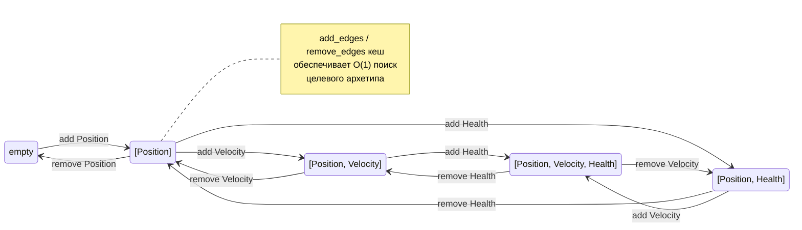

# APEX ECS — Entity Component System Engine
### Руководство пользователя
> **Версия 0.1.0** | Rust Edition 2021

---

## Содержание

1. [Введение](#1-введение)
2. [Основные концепции](#2-основные-концепции)
3. [Архетипы и хранилище](#3-архетипы-и-хранилище)
4. [Query API](#4-query-api)
5. [Ресурсы и события](#5-ресурсы-и-события)
6. [Системы и планировщик](#6-системы-и-планировщик)
7. [Commands](#7-commands)
8. [Relations (связи между entity)](#8-relations-связи-между-entity)
9. [EntityTemplate](#9-entitytemplate)
10. [Сериализация](#10-сериализация)
11. [Hot Reload](#11-hot-reload)
12. [Изолированные миры (IsolatedWorld)](#12-изолированные-миры-isolatedworld)
13. [Параллелизм](#13-параллелизм)
14. [Советы по производительности](#14-советы-по-производительности)
15. [Полный пример](#15-полный-пример)
16. [Быстрый справочник](#16-быстрый-справочник)
17. [Rhai Scripting](#17-rhai-scripting)
---

## 1. Введение

**Apex ECS** — это высокопроизводительный движок Entity Component System (ECS), написанный на Rust. Он разработан для применения в игровых движках и симуляциях, где требуется обработка сотен тысяч объектов с минимальными накладными расходами.

### 1.1 Ключевые возможности

- **Архетипное хранилище компонентов (SoA layout)** — данные одного типа хранятся рядом в памяти, что максимизирует использование CPU-кеша
- **Параллельное выполнение систем** — планировщик автоматически находит системы без конфликтов и запускает их параллельно через Rayon
- **Change Detection** — каждая строка данных хранит тик последнего изменения, запросы `Changed<T>` работают без overhead
- **Relations (связи между entity)** — иерархии, ownership и произвольные связи закодированы как компоненты
- **Сериализация мира** — снэпшот/восстановление состояния через JSON или bincode
- **Hot Reload конфигураций** — файловый watcher перезагружает JSON-конфиги без перезапуска
- **Batch API** — `spawn_many` создаёт тысячи entity за один проход
> **Версия 0.1.0** — крейты пока не опубликованы на crates.io. Для использования добавляйте зависимость через `path = "..."` или `git = "..."` (см. раздел 1.3).
### 1.2 Структура крейтов

| Крейт | Назначение |
|---|---|
| `apex-core` | Ядро ECS: entity, component, archetype, query, world, events, relations, resources, EntityTemplate, TemplateRegistry |
| `apex-scheduler` | Планировщик систем: компиляция графа зависимостей, параллельные Stage |
| `apex-graph` | Граф зависимостей: топологическая сортировка, обнаружение циклов |
| `apex-serialization` | Сериализация мира: WorldSnapshot, snapshot/restore, PrefabManifest, PrefabLoader |
| `apex-hot-reload` | Горячая перезагрузка: FileWatcher, HotReloadPlugin, PrefabPlugin |
| `apex-macros` | Процедурные макросы: `#[derive(Scriptable)]` для интеграции с Rhai-скриптингом |
| `apex-scripting` | Rhai-скриптинг: ScriptEngine, регистрация компонентов/ресурсов/событий, хот-релоад `.rhai`-скриптов |
| `apex-isolated` | Изолированные ECS-миры: IsolatedWorld, WorldBridge, CloneableBridge |

### 1.3 Установка

Крейты **ещё не опубликованы на crates.io** (версия 0.1.0). Используйте один из способов ниже.

**Вариант A — локальный путь (разработка):**

```toml
[dependencies]
apex-core          = { path = "path/to/apex-ecs/crates/apex-core" }
apex-scheduler     = { path = "path/to/apex-ecs/crates/apex-scheduler" }
apex-serialization = { path = "path/to/apex-ecs/crates/apex-serialization" }
apex-hot-reload    = { path = "path/to/apex-ecs/crates/apex-hot-reload" }
apex-macros        = { path = "path/to/apex-ecs/crates/apex-macros" }
apex-scripting     = { path = "path/to/apex-ecs/crates/apex-scripting" }
apex-isolated      = { path = "path/to/apex-ecs/crates/apex-isolated" }

# Для параллельного режима:
[features]
parallel = ["apex-core/parallel", "apex-scheduler/parallel"]
```

**Вариант B — git-зависимость (потребитель):**

```toml
[dependencies]
apex-core          = { git = "https://github.com/ваш-username/apex-ecs", rev = "latest-revision-hash" }
apex-scheduler     = { git = "https://github.com/ваш-username/apex-ecs", rev = "latest-revision-hash" }
apex-serialization = { git = "https://github.com/ваш-username/apex-ecs", rev = "latest-revision-hash" }
apex-hot-reload    = { git = "https://github.com/ваш-username/apex-ecs", rev = "latest-revision-hash" }
apex-macros        = { git = "https://github.com/ваш-username/apex-ecs", rev = "latest-revision-hash" }
apex-scripting     = { git = "https://github.com/ваш-username/apex-ecs", rev = "latest-revision-hash" }
apex-isolated      = { git = "https://github.com/ваш-username/apex-ecs", rev = "latest-revision-hash" }

[features]
parallel = ["apex-core/parallel", "apex-scheduler/parallel"]
```

> **Минимальная версия Rust:** 2021 Edition. Функция `parallel` требует включения соответствующего feature-флага — без неё планировщик работает в последовательном режиме.

---

## 2. Основные концепции

### 2.1 Entity

Entity — это уникальный идентификатор объекта в мире. Он не хранит данные напрямую, только указывает на строку в архетипе.

```rust
// Entity — generational index: index + generation
// Generational counter защищает от use-after-free
pub struct Entity {
    index:      u32,   // позиция в аллокаторе
    generation: u32,   // инкрементируется при повторном использовании
}

// Проверка жизни entity:
world.is_alive(entity)   // -> bool
entity.index()           // -> u32
entity.generation()      // -> u32
```

> **Примечание:** Entity никогда не хранит компоненты напрямую. Все данные живут в Column-буферах архетипа. Entity — это только ключ для поиска.

### 2.2 Component

Компонент — это чистые данные без логики. Любой тип, реализующий `Send + Sync + 'static`, автоматически является компонентом.

```rust
// Компонент — просто struct с данными:
#[derive(Clone, Copy, Debug)]
struct Position { x: f32, y: f32 }

#[derive(Clone, Copy)]
struct Velocity { x: f32, y: f32 }

#[derive(Clone, Copy)]
struct Health { current: f32, max: f32 }

// Маркерный компонент (ZST — zero-sized type):
struct Player;
struct Enemy;

// Регистрация без сериализации:
world.register_component::<Position>();

// Регистрация с сериализацией (требует Serialize + Deserialize):
#[derive(Serialize, Deserialize)]
struct Position { x: f32, y: f32 }
world.register_component_serde::<Position>();
```

> **Для Rhai-скриптинга** компоненты дополнительно помечаются `#[derive(Scriptable)]` из крейта `apex-macros`. Это автоматически реализует трейты `ScriptableField` для полей и `ScriptableRegistrar` для структуры, позволяя читать/писать компоненты из `.rhai`-скриптов. Подробнее — в разделе [Rhai Scripting](#17-rhai-scripting).

### 2.3 World

World — центральный контейнер, который хранит всё: entity, компоненты, ресурсы, события, relations.

```rust
use apex_core::prelude::*;

let mut world = World::new();

// Регистрация компонентов
world.register_component::<Position>();
world.register_component::<Velocity>();
world.register_component::<Health>();

// Создание entity с набором компонентов (Bundle):
let player = world.spawn((
    Position { x: 0.0, y: 0.0 },
    Velocity { x: 1.0, y: 0.0 },
    Health { current: 100.0, max: 100.0 },
));

// Пустая entity:
let marker = world.spawn(());

// Добавление компонента после создания через EntityRef:
world.entity(player).insert(Armor { value: 10.0 });

// Batch-спавн одинаковых бандлов (самый быстрый способ):
let entities = world.spawn_many(1000, |i| (
    Position { x: i as f32, y: 0.0 },
    Velocity { x: 0.1, y: 0.0 },
));

// Batch-спавн из итератора (разные бандлы):
world.spawn_batch([
    (Health(100.0), Armor(10.0), Player),
    (Health(50.0),  Armor(5.0),  Enemy),
    (Health(25.0),  Armor(2.0),  Enemy),
]);

// Уничтожение entity:
world.despawn(player);

// Добавление/удаление компонентов:
world.insert(entity, Health { current: 50.0, max: 100.0 });
world.remove::<Velocity>(entity);

// Чтение компонента:
if let Some(pos) = world.get::<Position>(entity) {
    println!("pos: ({}, {})", pos.x, pos.y);
}

// Мутабельное чтение:
if let Some(hp) = world.get_mut::<Health>(entity) {
    hp.current -= 10.0;
}
```

---

## 3. Архетипы и хранилище

Apex ECS использует архетипное хранилище (Archetype Storage). Entity с одинаковым набором компонентов хранятся в одном архетипе — это обеспечивает cache-friendly итерацию.

### 3.1 Как работает хранилище

```
Archetype [Position, Velocity, Health]
┌─────────────┬─────────────┬─────────────────┐
│  Position   │  Velocity   │     Health      │
├─────────────┼─────────────┼─────────────────┤
│ (0.0, 0.0)  │ (1.0, 0.0)  │ {100.0, 100.0}  │ entity 0
│ (5.0, 3.0)  │ (0.5, 0.0)  │ {75.0, 100.0}   │ entity 1
│ (10.0, 0.0) │ (0.0, -1.0) │ {50.0, 100.0}   │ entity 2
└─────────────┴─────────────┴─────────────────┘

Данные одного компонента — contiguous в памяти → SIMD-friendly
```

> **Примечание:** При добавлении или удалении компонента entity перемещается в другой архетип. Используйте `add_edges`/`remove_edges` кеш для O(1) поиска нужного архетипа при повторных операциях.

### 3.2 Граф переходов архетипов

Каждый архетип хранит карту переходов: при добавлении компонента A — в какой архетип перейти, при удалении A — в какой вернуться.



```rust
// Внутренняя логика (для понимания):
// world.insert(entity, NewComponent { ... })
//   → find_or_create_archetype_with(current_arch, component_id)
//   → проверяем add_edges cache (O(1) при повторе)
//   → move_entity: копируем общие компоненты, swap_remove из старого
//   → записываем новый компонент в новый архетип
```

---

## 4. Query API

Query — основной способ итерации по компонентам. Apex ECS предоставляет несколько уровней Query API.

### 4.1 Параметры запроса

| Параметр | Тип доступа | Описание |
|---|---|---|
| `Read<T>` | Иммутабельный (`&T`) | Чтение компонента |
| `Write<T>` | Мутабельный (`&mut T`) | Запись компонента |
| `With<T>` | Только фильтр | Entity должен иметь T |
| `Without<T>` | Только фильтр | Entity не должен иметь T |
| `Changed<T>` | Иммутабельный (`&T`) | Только изменённые с тика |

### 4.2 `Query<Q>`

```rust
use apex_core::prelude::*;

// Простой запрос — итерация по Position:
Query::<Read<Position>>::new(&world)
    .for_each(|_, pos| {
        println!("pos: ({}, {})", pos.x, pos.y);
    });

// Запрос с Entity + мутацией:
Query::<(Read<Velocity>, Write<Position>)>::new(&world)
    .for_each(|entity, (vel, pos)| {
        pos.x += vel.x * 0.016;
        pos.y += vel.y * 0.016;
        println!("entity {:?} moved", entity);
    });

// Фильтрация по маркерному компоненту:
Query::<(Read<Health>, With<Player>)>::new(&world)
    .for_each(|_, hp| {
        println!("player HP: {}/{}", hp.current, hp.max);
    });

// Исключение компонента:
Query::<(Read<Position>, Without<Enemy>)>::new(&world)
    .for_each(|_, pos| { /* только не-Enemy */ });

// Change detection:
let last_tick = world.current_tick();
// ... (следующий тик) ...
Query::<Changed<Position>>::new_with_tick(&world, last_tick)
    .for_each(|_, pos| {
        println!("position changed: ({}, {})", pos.x, pos.y);
    });

// Итератор (стандартный Iterator trait):
let count = Query::<Read<Health>>::new(&world)
    .iter()
    .filter(|(_, hp)| hp.current < 25.0)
    .count();
```

> **Примечание:** `Query::new()` собирает список подходящих архетипов при создании. Для горячих путей используйте `CachedQuery`, который переиспользует этот список.
>
> **Оптимизация cache hit (v0.1.0):** `CachedQuery` использует `SmallVec<[ComponentId; 8]>` в качестве ключа кэша. При cache hit (наиболее частый сценарий в горячем цикле) **не происходит heap-аллокации** — ключ хранится на стеке. Реализовано через типаж `Borrow<[ComponentId]>`, позволяющий поиску в `HashMap` идти по заимствованному срезу без создания `Vec`.

### 4.3 `CachedQuery`

`CachedQuery` кеширует список архетипов и инвалидируется только при изменении состава архетипов мира.

```rust
// CachedQuery — переиспользует список архетипов:
world.query_typed::<Read<Position>>()
    .for_each(|_, pos| { /* ... */ });

// С change detection:
world.query_changed::<(Read<Velocity>, Write<Position>)>(last_tick)
    .for_each(|entity, (vel, pos)| { /* ... */ });
```

### 4.4 `QueryBuilder` (динамический запрос)

Когда типы компонентов не известны статически — используйте `QueryBuilder`.

```rust
// QueryBuilder — runtime запрос:
let arch_ids = world.query()
    .read::<Position>()
    .write::<Velocity>()
    .exclude::<Enemy>()
    .matching_archetype_ids();

println!("Подходящих архетипов: {}", arch_ids.len());
```

---

## 5. Ресурсы и события

### 5.1 Resources

Ресурс — это глобальный синглтон, доступный из любой системы. Типичные примеры: конфиг физики, delta time, статистика кадра.

```rust
#[derive(Clone, Copy)]
struct PhysicsConfig { gravity: f32, dt: f32 }

#[derive(Default)]
struct FrameStats { frame: u32, total_entities: usize }

// Вставка ресурса:
world.insert_resource(PhysicsConfig { gravity: 9.8, dt: 0.016 });
world.insert_resource(FrameStats::default());

// Чтение (паникует если не найден):
let cfg = world.resource::<PhysicsConfig>();
println!("gravity: {}", cfg.gravity);

// Мутабельный доступ:
world.resource_mut::<PhysicsConfig>().gravity = 1.62;

// Безопасное чтение (Option):
if let Some(stats) = world.try_resource::<FrameStats>() {
    println!("frame: {}", stats.frame);
}

// Безопасный мутабельный доступ (Option):
if let Some(mut stats) = world.try_resource_mut::<FrameStats>() {
    stats.frame += 1;
}

// Проверка наличия:
world.has_resource::<PhysicsConfig>() // -> bool

// Удаление:
let old_cfg = world.remove_resource::<PhysicsConfig>();
```

### 5.2 Events

События используют двойную буферизацию: `current` (текущий тик, буфер `pending`) и `previous` (прошлый тик, буфер `events`). Вызов `world.tick()` переключает буферы.

Внутренний тип очереди — [`Events<T>`](crates/apex-core/src/events.rs:33). Доступ к нему осуществляется через `world.events::<T>()` (immutable) и `world.events_mut::<T>()` (mutable).

#### 5.2.1 Базовая отправка и чтение через `EventReader`

Для чтения событий используется [`EventReader<T>`](crates/apex-core/src/system_param.rs:110) с per-reader курсором. `EventReader::new()` безопасно создаёт читателя, автоматически регистрируя его через `add_reader()`.

```rust
#[derive(Clone, Copy)]
struct DamageEvent { target: Entity, amount: f32 }

#[derive(Clone, Copy)]
struct DeathEvent { entity: Entity }

// Регистрация типа события:
world.add_event::<DamageEvent>();
world.add_event::<DeathEvent>();

// Создание читателя событий (safe — сам вызывает add_reader()):
let mut reader = EventReader::new(world.events_mut::<DamageEvent>());

// Отправка события (паникует если тип не зарегистрирован):
world.send_event(DamageEvent { target: enemy, amount: 35.0 });

// Безопасная отправка (возвращает bool, не паникует):
if world.try_send_event(DamageEvent { target: enemy, amount: 35.0 }) {
    // событие отправлено
} else {
    // тип не зарегистрирован — вызовите world.add_event::<DamageEvent>()
}

// Чтение непрочитанных событий через slice (без продвижения курсора):
for ev in reader.iter() {
    println!("damage: {} → entity {:?}", ev.amount, ev.target);
}

// RAII-чтение с авто-продвижением курсора при Drop:
{
    let guard = reader.read();  // -> EventReadGuard<DamageEvent>
    for ev in guard.iter() {
        process(ev);
    }
} // ← курсор автоматически продвинут

// Переключение буферов (вызывать раз в кадр):
world.tick();

// После tick() курсор показывает новые события из предыдущего тика:
for ev in reader.iter() {
    println!("new tick: {:?}", ev);
}
```

#### 5.2.2 Per-reader чтение (низкоуровневое)

[`Events<T>`](crates/apex-core/src/events.rs:33) поддерживает произвольное количество независимых читателей, каждый со своим курсором [`EventCursor`](crates/apex-core/src/events.rs:365). Для типовых сценариев используйте [`EventReader`](#521-базовая-отправка-и-чтение-через-eventreader), а низкоуровневый API — для максимального контроля:

```rust
let queue = world.events_mut::<DamageEvent>();

// Создаём читателя вручную:
let reader_a = queue.add_reader();   // -> EventCursor
let reader_b = queue.add_reader();

// Отправляем несколько событий:
queue.send(DamageEvent { target: e1, amount: 10.0 });
queue.send(DamageEvent { target: e2, amount: 25.0 });

// Каждый читатель видит только непрочитанные события:
for ev in queue.iter(&reader_a) {
    println!("reader_a: {:?}", ev);
}

// Ручное продвижение курсора:
queue.advance_reader_mut(&reader_a);

// reader_b всё ещё видит все события (его курсор не двигали):
for ev in queue.iter(&reader_b) { /* ... */ }

// Удаление читателя:
queue.remove_reader(reader_b);

// Количество непрочитанных событий:
let n = queue.len_pending();
```

#### 5.2.3 RAII-чтение с автоматическим продвижением (`EventReadGuard`)

[`EventReadGuard<T>`](crates/apex-core/src/events.rs:248) — RAII-обёртка, которая при Drop автоматически продвигает курсор до конца буфера. Исключает забытые `advance_reader_mut()`.

```rust
let queue = world.events_mut::<DamageEvent>();

// read() возвращает EventReadGuard — курсор продвинется при выходе из scope:
{
    let guard = queue.read(&reader_a);  // -> EventReadGuard<DamageEvent>
    for ev in guard.iter() {
        process(ev);
    }
} // ← здесь cursor автоматически продвигается

// Можно использовать Deref к срезу:
let guard = queue.read(&reader_a);
if !guard.is_empty() {
    let first: &DamageEvent = &guard[0];
}
```

#### 5.2.4 Просмотр без продвижения (`PeekGuard`)

[`PeekGuard<T>`](crates/apex-core/src/events.rs:290) — обёртка над `EventReadGuard`, которая **не** продвигает курсор при Drop.

```rust
let queue = world.events_mut::<DamageEvent>();

// Посмотреть события, но не отмечать их как прочитанные:
let peek = queue.read(&reader_a).peek();  // -> PeekGuard<DamageEvent>
println!("{} pending events", peek.len());
// курсор не сдвинулся — следующий read() покажет те же события
```

#### 5.2.5 Пакетная отправка (`send_batch`)

Для массовой отправки событий используйте [`send_batch`](crates/apex-core/src/events.rs:98):

```rust
let queue = world.events_mut::<DamageEvent>();

// Вектор событий:
let batch: Vec<DamageEvent> = (0..100).map(|i| {
    DamageEvent { target: entity, amount: i as f32 }
}).collect();
queue.send_batch(batch);

// Или итератор:
queue.send_batch((0..50).map(|i| DamageEvent { target: entity, amount: i as f32 }));
```

#### 5.2.6 Сводка методов `Events<T>`

| Метод | Описание |
|-------|----------|
| `send(event)` | Отправить одно событие в текущий тик |
| `send_batch(events)` | Отправить пачку событий (любой `IntoIterator`) |
| `add_reader() -> EventCursor` | Зарегистрировать нового читателя |
| `remove_reader(reader_id)` | Удалить читателя |
| `iter(reader_id) -> &[T]` | Непрочитанные события для reader (без продвижения курсора) |
| `read(reader_id) -> EventReadGuard<T>` | Чтение с auto-advance на Drop |
| `advance_reader_mut(reader_id)` | Ручное продвижение курсора до конца буфера |
| `len_pending() -> usize` | Количество событий в буфере записи |
| `clear()` | Очистить оба буфера и сбросить все курсоры |
| `update()` | Переключить буферы (вызывается автоматически в `world.tick()`) |

**`EventReader<T>`** (рекомендуемый высокоуровневый API):

| Метод | Описание |
|-------|----------|
| `new(events: &mut Events<T>) -> Self` | Создать читателя (авто-регистрация через `add_reader()`) |
| `iter(&self) -> &[T]` | Непрочитанные события в виде среза (без продвижения) |
| `read(&mut self) -> EventReadGuard<T>` | Чтение с auto-advance на Drop |
| `len(&self) -> usize` | Количество непрочитанных событий |
| `is_empty(&self) -> bool` | Проверить, есть ли непрочитанные события |

---

## 6. Системы и планировщик

Apex ECS предоставляет четыре уровня API для систем — от простого к гибкому.

### 6.1 `AutoSystem` (рекомендуется)

`AutoSystem` автоматически выводит `AccessDescriptor` из типа Query. Это исключает класс ошибок, где разработчик забыл задекларировать компонент.

> **Как это работает:** `AutoSystem` анализирует `type Query = (Read<A>, Write<B>, With<C>, Without<D>)` и автоматически строит `AccessDescriptor`:
> - `Read<T>` → read access к компоненту `T`
> - `Write<T>` → write access к компоненту `T`
> - `With<T>` / `Without<T>` → read access (для фильтрации)
> - Если система использует ресурсы или события — используйте `ParSystem` с явным `AccessDescriptor`

```rust
use apex_scheduler::{Scheduler, ParSystem};
use apex_core::prelude::*;

struct MovementSystem;

impl AutoSystem for MovementSystem {
    // Доступ выводится автоматически из Query:
    // reads: [Velocity], writes: [Position]
    type Query = (Read<Velocity>, Write<Position>);

    fn run(&mut self, ctx: SystemContext<'_>) {
        ctx.query::<Self::Query>()
            .for_each(|_, (vel, pos)| {
                pos.x += vel.x * 0.016;
                pos.y += vel.y * 0.016;
            });
    }
}

let mut sched = Scheduler::new();
sched.add_auto_system("movement", MovementSystem);
```

### 6.2 `ParSystem` (явный access)

Используйте, когда система использует несколько Query, ресурсы или события — то, что `AutoSystem` не может вывести автоматически.

```rust
struct PhysicsSystem;

impl ParSystem for PhysicsSystem {
    fn access() -> AccessDescriptor {
        AccessDescriptor::new()
            .read::<PhysicsConfig>()  // ресурс
            .read::<Mass>()
            .write::<Velocity>()
            .write::<Position>()
    }

    fn run(&mut self, ctx: SystemContext<'_>) {
        let cfg = ctx.resource::<PhysicsConfig>();
        let dt = cfg.dt;
        let g = cfg.gravity;

        ctx.query::<(Read<Mass>, Write<Velocity>, Write<Position>)>()
            .for_each(|_, (mass, vel, pos)| {
                vel.y -= g * mass.0 * dt;
                pos.x += vel.x * dt;
                pos.y += vel.y * dt;
            });
    }
}

sched.add_par_system("physics", PhysicsSystem);
```

### 6.3 `FnParSystem` (замыкание)

```rust
// Inline-система без отдельного struct:
sched.add_fn_par_system(
    "enemy_ai",
    |ctx: SystemContext<'_>| {
        ctx.query::<(Read<Enemy>, Write<Velocity>)>()
            .for_each(|_, (_, vel)| {
                vel.x *= 0.99;
                vel.y *= 0.99;
            });
    },
    AccessDescriptor::new()
        .read::<Enemy>()
        .write::<Velocity>(),
);
```

### 6.4 Sequential система

Sequential система получает `&mut World` и выполняется строго одна в своём Stage — используется для structural changes (spawn/despawn).

```rust
// Sequential системы — замыкания fn(&mut World):
sched.add_system("despawn_dead", |world: &mut World| {
    use apex_core::system_param::EventReader;
    let mut reader = EventReader::new(world.events_mut::<DeathEvent>());
    let deaths: Vec<Entity> = reader
        .iter()
        .map(|ev| ev.entity)
        .collect();

    for entity in deaths {
        world.despawn(entity);
    }
});
```

> **Правило порядка:** Регистрируйте все Par-системы **ПЕРЕД** Sequential-системами. Sequential создаёт барьер «все системы до → я → все системы после», поэтому Par-система после Sequential автоматически получает зависимость от неё — это может создавать циклы через data-конфликты.

### 6.5 Компиляция и запуск планировщика

```rust
let mut sched = Scheduler::new();

// Регистрация — СНАЧАЛА все Par, ПОТОМ Sequential:
sched.add_par_system("physics",      PhysicsSystem);
sched.add_par_system("health_clamp", HealthClampSystem);
sched.add_auto_system("movement",    MovementSystem);

// Sequential ПОСЛЕ:
let damage_id  = sched.add_system("damage_apply", damage_apply).id();
let despawn_id = sched.add_system("despawn_dead", despawn_dead).id();
let stats_id   = sched.add_system("stats_update", stats_update).id();

// Явные зависимости (опционально):
sched.add_dependency(despawn_id, damage_id);  // despawn после damage
sched.add_dependency(stats_id,   despawn_id); // stats после despawn

// Компиляция — строит граф, проверяет циклы, группирует в Stage:
sched.compile().expect("circular dependency detected");

> **`compile_with_world()`:** Начиная с v0.1.0, доступен метод `compile_with_world(&mut self, world: &World)`, который заполняет имена компонентов в диагностике планировщика до компиляции:
>
> ```rust
> sched.compile_with_world(&world).expect("circular dependency detected");
> ```
>
> Разница с `compile()`: `compile_with_world()` также вызывает `populate_type_names(world.registry())`, что позволяет `debug_plan_verbose()` показывать реальные имена компонентов (например, `Position` вместо `<component>`). Вызывайте его после регистрации всех систем и компонентов, но перед первым `run()`.

// Диагностика плана:
println!("{}", sched.debug_plan());

// Последовательный запуск:
sched.run_sequential(&mut world);

// Параллельный запуск (feature = "parallel"):
sched.run(&mut world);
```

### 6.6 `SystemContext`

`SystemContext` — read-only view на мир, доступный внутри системы. Предоставляет доступ к Query, ресурсам и событиям.

```rust
fn run(&mut self, ctx: SystemContext<'_>) {
    // Query — единственный способ итерации:
    ctx.query::<(Read<Velocity>, Write<Position>)>()
        .for_each(|entity, (vel, pos)| { /* ... */ });

    // Единый API — entity всегда доступна (используйте `_` если не нужна):
    ctx.query::<(Read<Vel>, Write<Pos>)>()
        .for_each(|_, (v, p)| { /* ... */ });

    // Ресурсы:
    let cfg   = ctx.resource::<PhysicsConfig>();        // Res<T>
    let mut s = ctx.resource_mut::<FrameStats>();       // ResMut<T>

    // События:
    let reader     = ctx.event_reader::<DamageEvent>(); // EventReader<T>
    let mut writer = ctx.event_writer::<DeathEvent>();  // EventWriter<T>
    writer.send(DeathEvent { entity });

    // Количество entity:
    ctx.entity_count() // -> usize

    // Параллельная итерация (feature = "parallel"):
    ctx.query::<(Read<Vel>, Write<Pos>)>()
        .par_for_each(|_, (v, p)| {
            /* выполняется на нескольких потоках */
        });

    // Thread-local Commands (начиная с v0.1.0):
    ctx.commands().despawn(entity);
    ctx.commands().insert(entity, NewComponent { value: 42 });
}
```

> **`ctx.commands()` (начиная с v0.1.0):** Возвращает `&mut Commands` для текущего потока. В параллельных системах каждая система получает собственный экземпляр `Commands` — это безопасно, т.к. `Commands` не `Sync`. В последовательном режиме возвращается статическая заглушка. Метод устраняет необходимость вручную создавать `Commands` внутри `par_for_each`.

---

## 7. Commands

### 7.1 Commands

`Commands` буферизуют structural changes (spawn/despawn/insert/remove) для применения после завершения текущей итерации.

```rust
let mut cmds = Commands::new();

// Буферизация команд во время Query:
Query::<(Read<Health>, Read<Position>)>::new(&world)
    .for_each(|entity, (hp, pos)| {
        if hp.current <= 0.0 {
            cmds.despawn(entity);
        }
    });

// Применение всех команд за один проход:
cmds.apply(&mut world);

// Все поддерживаемые операции:
cmds.despawn(entity);
cmds.spawn((Position { x: 0.0, y: 0.0 }, Velocity { x: 1.0, y: 0.0 }));
cmds.insert(entity, NewComponent { value: 42 });
cmds.remove::<OldComponent>(entity);
cmds.add(|world: &mut World| { /* произвольная команда */ });
```

> **Совет:** `Commands::with_capacity(n)` — предаллоцирует буфер для `n` команд. Используйте, когда заранее знаете примерное количество команд.

> **Параллелизм:** В параллельных системах (см. [раздел 13](#13-параллелизм)) каждая система получает собственный экземпляр `Commands` — это безопасно, т.к. `Commands` не `Sync`. Два `despawn()` одного entity — второй вызов будет no-op. `Commands` не должен пересекать границу параллельного вызова — применяйте `cmds.apply()` после завершения параллельного блока.

> **`DeferredQueue` удалён.** Ранее существовал отдельный тип `DeferredQueue` для динамических операций с raw `ComponentId`. Теперь вся функциональность объединена в `Commands`: используйте `cmds.remove_raw(entity, component_id)` и `cmds.insert_raw(entity, component_id, value)` для динамических случаев.

---

## 8. Relations (связи между entity)

Relations позволяют создавать иерархии, ownership и произвольные связи между entity. Внутри они кодируются как специальные компоненты.

### 8.1 Встроенные виды связей

```rust
// Встроенные RelationKind:
// ChildOf — иерархия (cascade delete при уничтожении parent)
// Owns    — ownership
// Likes   — произвольная связь

// Добавление связи:
world.add_relation(child, ChildOf, parent);
world.add_relation(player, Owns, sword);

// Проверка:
world.has_relation(child, ChildOf, parent) // -> bool

// Получение target:
let parent_entity = world.get_relation_target(child, ChildOf); // -> Option<Entity>

// Итерация по дочерним entity:
for child in world.children_of(ChildOf, parent) {
    println!("child: {:?}", child);
}

// Удаление связи:
world.remove_relation(child, ChildOf, parent);

// Рекурсивное уничтожение иерархии:
world.despawn_recursive(ChildOf, root); // удаляет root + всех потомков
```

### 8.1.1 Массовое добавление Relations

```rust
// Массовое добавление одинаковой relation от множества субъектов к одному target.
// Оптимизировано для создания иерархий (например, тайловые карты).
// Все subjects группируются по текущему архетипу и перемещаются за один проход.
let subjects = vec![entity1, entity2, entity3];
world.add_relation_batch(subjects, ChildOf, parent);
```

> **Производительность:** При создании иерархии 1000 объектов `add_relation_batch` выполняет 1 архетипный переход на группу вместо 1000 отдельных переходов. Используйте вместо цикла `add_relation()` при пакетном создании связей.

### 8.2

```rust
// Создание своего типа связи:
#[derive(Clone, Copy)]
struct Targets;  // "атакует"

impl RelationKind for Targets {
    // Опционально: cascade delete — удалять subject при удалении target?
    fn cascade_delete_on_target_despawn() -> bool { false }
}

world.add_relation(archer, Targets, goblin);
```

### 8.3

```rust
// Найти всех entity с ChildOf-связью к конкретному parent:
for (entity, pos) in world.query_relation::<ChildOf, Read<Position>>(ChildOf, parent) {
    println!("child {:?} at ({}, {})", entity, pos.x, pos.y);
}

// Wildcard — все entity с любым ChildOf-target:
for (entity, hp) in world.query_wildcard::<ChildOf, Read<Health>>(ChildOf) {
    println!("entity with parent: {:?}", entity);
}
```

---

## 9. EntityTemplate

EntityTemplate — программные шаблоны сущностей. Позволяют определить многократно используемый «рецепт» создания entity с заданными компонентами, параметрами и родительской связью.

### 9.1 Трейт `EntityTemplate`

```rust
use apex_core::template::{EntityTemplate, TemplateParams, TemplateRegistry};

// Определение шаблона для врага:
struct MonsterTemplate {
    base_hp: f32,
}

impl EntityTemplate for MonsterTemplate {
    fn spawn(&self, world: &mut World, params: &TemplateParams) -> Entity {
        // Параметры вызова могут переопределить поля:
        let hp = params.get::<HpParam>().copied().unwrap_or(self.base_hp);

        let entity = world.spawn((
            Position { x: 0.0, y: 0.0 },
            Health { current: hp, max: self.base_hp },
            Enemy,
        ));
        entity
    }

    // Опционально: привязать к родителю
    fn parent(&self) -> Option<Entity> {
        None
    }
}
```

### 9.2 `TemplateRegistry` и регистрация

`TemplateRegistry` хранится в `World` и управляет всеми зарегистрированными шаблонами.

```rust
// Регистрация:
let template = MonsterTemplate { base_hp: 100.0 };
world.register_template("Monster", template);

// Проверка:
assert!(world.has_template("Monster"));
```

### 9.3 Параметры шаблонов (`TemplateParams`)

Параметры позволяют переопределять значения при каждом спавне. Начиная с v0.1.0, `TemplateParams` использует **типизированные ключи** вместо строковых — ошибки в именах и типах обнаруживаются на этапе компиляции.

```rust
use apex_core::template::{TemplateParams, TemplateParam};

// Определение типизированных параметров:
struct HpParam;
impl TemplateParam for HpParam { type Value = f32; }

// Создание параметров:
let params = TemplateParams::new()
    .set::<HpParam>(150.0);

// Спавн из шаблона:
let boss = world.spawn_from_template("Monster", &params)
    .expect("template not found");
```

### 9.4 Спавн через `Commands`

`Commands` поддерживает отложенный спавн из шаблона — полезно внутри систем, когда нельзя делать структурные изменения напрямую.

```rust
let mut cmds = Commands::new();
cmds.spawn_template("Monster");
cmds.spawn_from_template("Monster", params.clone());
cmds.apply(&mut world);
```

### 9.5 `EntityTemplate::parent()` — иерархии через шаблоны

Если шаблон переопределяет `parent()`, entity автоматически получает `ChildOf`-связь при спавне:

```rust
struct ChildTemplate {
    parent_entity: Entity,
}

impl EntityTemplate for ChildTemplate {
    fn spawn(&self, world: &mut World, _params: &TemplateParams) -> Entity {
        world.spawn((Position { x: 10.0, y: 0.0 },))
    }

    fn parent(&self) -> Option<Entity> {
        Some(self.parent_entity)
    }
}

// При спавне child сразу получает ChildOf к parent:
let child = world.spawn_from_template("Child", &TemplateParams::new());
```

### 9.6 Макрос `impl_entity_template!`

Для быстрой регистрации шаблона с именем:

```rust
impl_entity_template!(MonsterTemplate, "Monster");
// Эквивалентно: world.register_template("Monster", MonsterTemplate { ... })
```

---

## 10. Сериализация

`apex-serialization` предоставляет механизм сохранения/загрузки состояния мира. Сериализуются только компоненты, явно зарегистрированные через `register_component_serde`.

### 10.1 Настройка

```rust
use apex_serialization::{WorldSerializer, WorldSnapshot};
use serde::{Serialize, Deserialize};

// Только Serialize + Deserialize компоненты:
#[derive(Serialize, Deserialize, Clone, Copy)]
struct Position { x: f32, y: f32 }

#[derive(Serialize, Deserialize, Clone, Copy)]
struct Health { current: f32, max: f32 }

// Не сериализуемый компонент (runtime данные):
struct RenderHandle(u64);  // нет derive Serialize

// Регистрация:
world.register_component_serde::<Position>(); // → в снэпшот
world.register_component_serde::<Health>();   // → в снэпшот
world.register_component::<RenderHandle>();   // → НЕ в снэпшот
```

### 10.2 Сохранение

```rust
// Создать снэпшот текущего состояния мира:
let snapshot = WorldSerializer::snapshot(&world)
    .expect("serialization failed");

// Сериализовать в JSON:
let json = snapshot.to_json().expect("json failed");

// Записать на диск:
std::fs::write("savegame.json", &json).unwrap();

// Информация о снэпшоте:
println!("entities: {}", snapshot.entities.len());
println!("relations: {}", snapshot.relations.len());
```

#### 10.2.1 Бинарный формат (bincode)

Помимо JSON, снэпшоты поддерживают бинарную сериализацию через `bincode`. Бинарный формат компактнее и быстрее — используйте его для production save/load:

```rust
// Сериализовать в bincode:
let binary = snapshot.to_binary().expect("bincode failed");
std::fs::write("savegame.bin", &binary).unwrap();

// Загрузить из bincode:
let data = std::fs::read("savegame.bin").unwrap();
let restored = WorldSnapshot::from_binary(&data).expect("invalid binary save");
```

Также доступен универсальный метод `WorldSerializer::write_to_file()`, который определяет формат по расширению:

```rust
// Сохранение — явное указание формата:
WorldSerializer::write_to_file("savegame.json", &snapshot, apex_serialization::snapshot::SaveFormat::Json).unwrap();
WorldSerializer::write_to_file("savegame.bin", &snapshot, apex_serialization::snapshot::SaveFormat::Bincode).unwrap();

// Загрузка — авто-определение по расширению:
let loaded = WorldSerializer::read_from_file("savegame.json").unwrap();
```

> **Сравнение размеров** (на тестовом датасете): JSON ~1.8 MB, bincode ~1.2 MB. Разница особенно заметна при большом количестве entity.

### 10.3 Загрузка

```rust
// Прочитать с диска (JSON):
let json = std::fs::read("savegame.json").unwrap();
let snapshot = WorldSnapshot::from_json(&json).unwrap();

// Или из bincode:
let binary = std::fs::read("savegame.bin").unwrap();
let snapshot = WorldSnapshot::from_binary(&binary).unwrap();

// Подготовить новый мир (зарегистрировать те же типы):
let mut world = World::new();
world.register_component_serde::<Position>();
world.register_component_serde::<Health>();

// Восстановить — НЕ очищает мир (merge семантика):
let entity_map = WorldSerializer::restore(&mut world, &snapshot)
    .expect("restore failed");

// entity_map: HashMap<old_index, new_Entity>
// Используйте для патча внешних ссылок:
let new_player_entity = entity_map[&old_player_index];
```

> **Примечание:** Relations восстанавливаются автоматически на шаге 2 `restore` — после того как все entity уже созданы. Если тип `RelationKind` не зарегистрирован в мире — relation пропускается с предупреждением в лог.

### 10.3.1 WorldDiff и дельта-сериализация

`WorldDiff` — структура, представляющая разницу между двумя состояниями мира. Используется для инкрементальных сохранений — вместо полного snapshot сохраняются только изменённые компоненты.

```rust
use apex_serialization::snapshot::{WorldDiff, diff_snapshots};

// Создать два snapshot:
let snap1 = WorldSerializer::snapshot(&world).unwrap();
// ... изменения в мире ...
let snap2 = WorldSerializer::snapshot(&world).unwrap();

// Вычислить diff (byte-level сравнение компонентов):
let diff = diff_snapshots(&snap1, &snap2).unwrap();

// diff.modified_components — только изменённые данные
// Неизменённые компоненты исключены из диффа
println!("modified components: {}", diff.modified_components.len());
```

> **Преимущество:** При частичных изменениях (например, изменилось 10% entity) размер диффа в ~10× меньше полного snapshot. Поле `modified_components` содержит только побайтово изменённые компоненты.

### 10.4 Prefabs (файловые префабы)

Prefabs — это JSON-формат для описания и переиспользования entity и их иерархий. В отличие от `EntityTemplate`, префабы загружаются из файлов и могут изменяться без перекомпиляции.

#### 10.4.1 Формат `PrefabManifest`

```json
{
  "name": "Orc",
  "components": [
    { "type": "prefab_isolated::Position", "value": { "x": 0.0, "y": 0.0 } },
    { "type": "prefab_isolated::Health",   "value": { "current": 100.0, "max": 100.0 } },
    { "type": "prefab_isolated::Enemy",    "value": null }
  ],
  "children": [
    { "prefab": "Weapon", "overrides": [
      { "type": "prefab_isolated::Damage", "value": 15 }
    ]}
  ]
}
```

- `name` — уникальное имя префаба
- `components` — список компонентов с типом (полное имя) и значением
- `children` — дочерние префабы (вложенность, `ChildOf` связь)
- `overrides` — переопределение полей дочерних префабов
- Для unit-компонентов (маркеров) указывать `"value": null`

#### 10.4.2 `PrefabLoader`

```rust
use apex_serialization::prefab::PrefabLoader;

let mut loader = PrefabLoader::new();

// Загрузка из JSON-строки:
let manifest = loader.load_json(r#"{
    "name": "Orc",
    "components": [
        { "type": "prefab_isolated::Position", "value": { "x": 10.0, "y": 0.0 } },
        { "type": "prefab_isolated::Health",   "value": { "current": 100.0, "max": 100.0 } },
        { "type": "prefab_isolated::Enemy",    "value": null }
    ]
}"#).expect("invalid prefab");

// Инстанциирование:
let orc = loader.instantiate(&mut world, "Orc")
    .expect("prefab not found");
```

#### 10.4.3 `PrefabManifest` как `EntityTemplate`

`PrefabManifest` реализует трейт `EntityTemplate`, поэтому префаб можно зарегистрировать в `TemplateRegistry`:

```rust
world.register_template("Orc", manifest);
world.spawn_from_template("Orc", &TemplateParams::new());
```

#### 10.4.4 Экспорт entity в префаб

```rust
use apex_serialization::WorldSerializer;

// Экспорт одного entity:
let prefab = WorldSerializer::entity_to_prefab(&world, entity).unwrap();

// Экспорт entity с иерархией:
let hierarchy = WorldSerializer::hierarchy_to_prefab(&world, root).unwrap();
```

Сохраните полученный `PrefabManifest` в файл с расширением `.prefab` для последующей загрузки через `PrefabLoader`.

---

## 11. Hot Reload

Apex ECS поддерживает три вида горячей перезагрузки:

- **JSON-конфиги** — через `apex-hot-reload` (ресурсы мира)
- **Rhai-скрипты** — через `apex-scripting` (игровая логика)
- **Prefab-файлы** — через `PrefabPlugin` (entity и иерархии)

### 11.1 Hot Reload конфигураций (JSON)

`apex-hot-reload` позволяет изменять JSON-конфиги без перезапуска приложения. Изменения применяются в game loop без блокировки потока.

### 11.1.1 Настройка

```rust
use apex_hot_reload::HotReloadPlugin;
use serde::{Serialize, Deserialize};
use std::path::Path;

#[derive(Serialize, Deserialize, Clone)]
struct PhysicsConfig { gravity: f32, dt: f32 }

#[derive(Serialize, Deserialize, Clone)]
struct AudioConfig { master_volume: f32, music_volume: f32 }
```

### 11.1.2 Инициализация

```rust
// Создать plugin — следит за директорией assets/:
let mut hot = HotReloadPlugin::with_default_debounce(Path::new("assets/"))
    .expect("watcher init failed");

// Зарегистрировать конфиг — немедленно загружает файл:
hot.watch_config::<PhysicsConfig>(
    Path::new("assets/physics.json"),
    &mut world,
).expect("watch_config failed");

hot.watch_config::<AudioConfig>(
    Path::new("assets/audio.json"),
    &mut world,
).expect("watch_config failed");

// После watch_config ресурсы уже доступны в мире:
let cfg = world.resource::<PhysicsConfig>();
println!("gravity: {}", cfg.gravity);
```

### 11.1.3 Game loop

```rust
// В game loop — вызывать каждый кадр:
loop {
    // apply_changes < 1µs если нет изменений (non-blocking poll):
    let changed = hot.apply_changes(&mut world);
    for c in &changed {
        log::info!("reloaded: {:?}", c.path);
    }

    // Планировщик использует уже обновлённые ресурсы:
    scheduler.run(&mut world);
    world.tick();

    if should_exit { break; }
}
```

> **Формат файлов:** JSON. Структура файла должна точно соответствовать полям Rust struct (serde_json десериализация). При ошибке чтения/десериализации предыдущее значение ресурса остаётся в мире, ошибка пишется в `log::error!`.

### 11.1.4 Кастомный загрузчик

Если вам нужен нестандартный формат — реализуйте `ConfigLoader`:

```rust
use apex_hot_reload::ConfigLoader;

struct TomlConfigLoader;

impl ConfigLoader for TomlConfigLoader {
    fn reload(&self, path: &Path, world: &mut World) -> Result<(), HotReloadError> {
        let text = std::fs::read_to_string(path)?;
        let cfg: MyConfig = toml::from_str(&text)?;
        world.insert_resource(cfg);
        Ok(())
    }
}

hot.watch_config_with_loader(
    Path::new("assets/config.toml"),
    &mut world,
    TomlConfigLoader,
);
```

### 11.2 Hot Reload Rhai-скриптов

`apex-scripting` поддерживает горячую перезагрузку `.rhai`-файлов. При изменении файла на диске скрипт автоматически перекомпилируется и применяется в следующем кадре.

```rust
use apex_scripting::ScriptEngine;

// Следить за директорией scripts/:
let mut engine = ScriptEngine::with_dir("scripts/");

// В game loop:
loop {
    engine.poll_hot_reload();  // проверить изменения
    engine.run(dt, &mut world);
    world.tick();
}
```

Подробнее — в разделе [Rhai Scripting](#17-rhai-scripting).

### 11.3 Hot Reload префабов (PrefabPlugin)

`PrefabPlugin` из крейта `apex-hot-reload` отслеживает изменения `.prefab`-файлов и автоматически пересоздаёт entity при изменении.

#### 11.3.1 Инициализация

```rust
use apex_hot_reload::prefab_plugin::PrefabPlugin;
use apex_hot_reload::asset_registry::AssetRegistry;

let mut registry = AssetRegistry::new();
let mut prefab_plugin = PrefabPlugin::new();

// Загрузить все .prefab файлы из директории:
let mut loader = PrefabLoader::new();
prefab_plugin.load_directory("assets/prefabs/", &mut registry, &mut loader);

// Трекинг entity: после спавна префаба привяжите entity к AssetId
prefab_plugin.track_entity(asset_id, entity);
```

#### 11.3.2 Пересоздание entity

При изменении файла префаба на диске, `PrefabPlugin` может пересоздать все сущности, созданные из этого префаба:

```rust
// В game loop:
for change in hot.apply_changes(&mut world) {
    // Пересоздать entity для изменённого префаба:
    prefab_plugin.reapply_asset(&mut world, change.id)
        .expect("reapply failed");
}

// Или пересоздать всё сразу:
prefab_plugin.reapply_all(&mut world);
```

`reapply_asset` деспавнит старые entity (рекурсивно, включая детей через `ChildOf`) и создаёт новые из обновлённого кеша префаба.

---

## 12. Изолированные миры (IsolatedWorld)

`apex-isolated` предоставляет возможность создавать изолированные ECS-миры с собственной логикой и планировщиком, а также организовывать коммуникацию между ними через каналы.

### 12.1 `IsolatedWorld`

`IsolatedWorld` — самодостаточный мир со встроенным `Scheduler`:

```rust
use apex_isolated::IsolatedWorld;

let mut sub = IsolatedWorld::new();

// Зарегистрировать компоненты и системы как в обычном мире:
sub.world.register_component::<Position>();
sub.scheduler.add_system("move", |w: &mut World| { /* ... */ });
sub.scheduler.compile().unwrap();

// Один кадр: scheduler.run() + world.tick()
sub.tick();
```

### 12.2 `WorldBridge`

`WorldBridge` — двунаправленный канал для обмена сериализуемыми событиями между мирами:

```rust
use apex_isolated::WorldBridge;

// Создать пару (a → b) и (b → a):
let (bridge_a, bridge_b) = WorldBridge::new();

// В основном мире: отправить событие в изолированный мир
bridge_a.send_event(&SomeEvent { value: 42 });

// В изолированном мире: применить все входящие события
bridge_b.apply_incoming(&mut sub.world);
```

### 12.3 `CloneableBridge`

Для хранения моста в `Resources` (требуется `Clone`) используйте `CloneableBridge`:

```rust
use apex_isolated::{CloneableBridge, sync_bridge_cloneable};

let (a, b) = WorldBridge::new();
let bridge = CloneableBridge::new(a);

world.insert_resource(bridge.clone());

// Система синхронизации — применяет входящие события каждый кадр:
sched.add_system("sync_bridge", |world: &mut World| {
    sync_bridge_cloneable(world);
});
```

### 12.4 Важные ограничения

- `WorldBridge::send_event()` принимает только `Serialize + Send + Sync + 'static` типы (сериализация в `bincode`)
- `WorldBridge::send_action_event()` принимает любые `Send + Sync + 'static` (без сериализации)
- `IsolatedWorld` использует собственный `Scheduler` — зависимости между мирами не отслеживаются
- Канал `WorldBridge` гарантирует FIFO-порядок событий

### 12.5 Полный пример: два мира на двух потоках

```rust
use apex_isolated::{IsolatedWorld, WorldBridge};
use std::thread;
use std::sync::mpsc;

#[derive(serde::Serialize, serde::Deserialize, Clone, Copy)]
struct DamageEvent { amount: f32 };

// Основной мир
let mut world = /* ... */;

// Создать пару мостов
let (main_bridge, sub_bridge) = WorldBridge::new();
world.insert_resource(sub_bridge);  // в изолированном мире

// Изолированный мир
let mut sub = IsolatedWorld::new();
sub.world.register_component::<Health>();
sub.world.insert_resource(main_bridge);

sub.scheduler.add_system("damage", |w: &mut World| {
    // Применить входящие события
    if let Some(bridge) = w.try_resource::<WorldBridge>() {
        bridge.apply_incoming(w);
    }
});
sub.scheduler.compile().unwrap();

// Запуск изолированного мира в отдельном потоке
let handle = thread::spawn(move || {
    for _ in 0..60 {
        sub.tick();  // scheduler.run() + world.tick()
        thread::sleep(std::time::Duration::from_millis(16));
    }
});

// Отправка события из основного мира
let bridge = world.resource::<WorldBridge>();
bridge.send_event(&DamageEvent { amount: 10.0 });

handle.join().unwrap();
```

> **Примечание:** Для синхронизации между потоками используется канал `mpsc` внутри `WorldBridge`. `IsolatedWorld` не требует `Sync` — каждый мир работает в своём потоке. Мосты являются `Send`, но не `Sync`.

---

## 13. Параллелизм

### 13.1 Параллельный запуск систем

Планировщик автоматически группирует совместимые Par-системы в одну Stage и запускает их параллельно через Rayon. Начиная с v0.1.0, используется алгоритм **ASD (Adaptive Scope Distribution)** — единый адаптивный механизм, заменяющий два раздельных режима (per-system scope + intra-system chunking).

```toml
# Включение параллелизма (Cargo.toml):
[features]
parallel = ["apex-core/parallel", "apex-scheduler/parallel"]
```

```bash
# Запуск:
cargo run --features parallel
```

**Как работает ASD:**

```
target_chunk = max(total_entity_count / num_workers / 2, 64)

for each system:
    if arch_indices.len() <= 1 || entity_count <= target_chunk:
        → 1 задача (per-system scope, без ranges — zero overhead)
    else:
        → N задач (чанки размером ~target_chunk), сортировка по archetype_id
```

- Мало entity → per-system scope (одна задача на систему, zero overhead)
- Много entity → чанки заполняют все ядра
- Запуск через `rayon::scope` + `s.spawn(|_| ...)` (не `par_iter` — избегает двойного chunking Rayon)

Правила параллелизма — аналог Rust borrow checker:

| Комбинация | Результат |
|---|---|
| `Read` + `Read` | Нет конфликта → параллельны |
| `Write` + `Read` | Конфликт → разные Stage |
| `Write` + `Write` | Конфликт → разные Stage |

**Пример:** `PhysicsSystem` (write `Velocity`, write `Position`, read `Mass`) и `HealthClampSystem` (write `Health`) не имеют общих Write → выполняются в одном Stage параллельно.

#### Как это работает (безопасность)

Параллелизм безопасен благодаря трём архитектурным решениям:

1. **Archetype-level sharing.** Параллельные системы получают `SubWorld` — shared borrow на уровне архетипов. Rayon гарантирует, что два `SubWorld` не перекрываются по конфликтующим архетипам (аналог borrow checker, но на stage-уровне).
2. **Deferred structural changes.** `Commands::apply()` вызывается вне параллельного контекста. Это значит, что insert/remove не может произойти одновременно с параллельным чтением.
3. **Thread-local Commands (v0.1.0).** Каждая параллельная система автоматически получает собственный экземпляр `Commands` через `ctx.commands()` — не нужно создавать вручную. Команды применяются после каждого Stage.

**Результаты ASD (12 потоков, i5-12400F):**

| Сценарий | До ASD | ASD | Ускорение |
|---|---|---|---|
| 12 solo систем | 2.03x | **3.91x** | +93% |
| 2 CPU-bound (shared arch) | 0.36x | **1.10x** | +206% |
| Pipeline sequential barrier | 0.35x | **0.92x** | +163% |

### 13.2 Параллельная итерация внутри системы

`par_for_each` использует chunk-level параллелизм: архетип разбивается на chunks, каждый chunk обрабатывается независимо в Rayon thread pool. Размер чанка вычисляется динамически функцией [`adaptive_chunk_size`](crates/apex-core/src/world.rs:798):

```
chunk = entity_count / max(num_threads, 1)
# Абсолютный максимум — пользовательская настройка или 16384
if chunk > MAX_CHUNK_SIZE → chunk = MAX_CHUNK_SIZE
# Динамический минимум:
if   entity_count < 100   → min = 128   # очень мало entity → крупные чанки
elif entity_count < 1000  → min = 32    # средний размер → умеренное дробление
else                      → min = 64    # много entity → баланс
if chunk < min → chunk = min
chunk = min(chunk, entity_count)
```

```rust
impl ParSystem for PhysicsSystem {
    fn run(&mut self, ctx: SystemContext<'_>) {
        ctx.query::<(Read<Mass>, Write<Velocity>, Write<Position>)>()
            .par_for_each(|_, (mass, vel, pos)| {
                vel.y -= 9.8 * mass.0 * 0.016;
                pos.x += vel.x * 0.016;
                pos.y += vel.y * 0.016;
            });
    }
}

// par_for_each — то же с Entity:
ctx.query::<Read<Position>>().par_for_each(|entity, pos| {
    /* обрабатывается параллельно */
});
```

> **Настройка `MAX_CHUNK_SIZE`:** По умолчанию 16384. Можно изменить через `set_par_chunk_size(n)` или env `APEX_PAR_CHUNK_SIZE=n`. Увеличение уменьшает число задач (меньше overhead), уменьшение — более равномерная загрузка ядер.

> **Примечание:** Выигрыш от `par_for_each` достигается когда вычисления CPU-bound (не memory-bandwidth bound), а overhead Rayon оправдан сложностью расчётов. Для маленьких датасетов (entity_count < 100) chunk-size = 128, что минимизирует overhead.

### 13.3 Row-level параллельный SubWorld

Начиная с v0.1.0, [`SubWorld`](crates/apex-core/src/sub_world.rs:94) поддерживает row-level итерацию — параллельную обработку entity внутри одного архетипа.

```rust
// Последовательная итерация по entity в SubWorld:
sub_world.for_each_entity(|entity| {
    println!("entity: {:?}", entity);
});

// Последовательная итерация по строкам (без Entity, чуть быстрее):
sub_world.for_each_row(|_row| {
    // доступ к компонентам через SubWorld
});

// Параллельная итерация (feature = "parallel"):
sub_world.par_for_each_entity(|entity| {
    /* выполняется на нескольких потоках */
});

// Параллельная итерация по строкам:
sub_world.par_for_each_row(|_row| {
    /* выполняется на нескольких потоках */
});
```

> **Примечание:** `par_for_each_entity` и `par_for_each_row` используют [`compute_par_chunks`](crates/apex-core/src/par_utils.rs:14) — размер чанка вычисляется динамически через [`adaptive_chunk_size`](crates/apex-core/src/world.rs:798) (см. [раздел 13.2](#132-параллельная-итерация-внутри-системы)).

### 13.4 Ограничения параллелизма

#### Nested `par_for_each`

Вызов `par_for_each` внутри callback'а другого `par_for_each` **запаникует** — Rayon не поддерживает вложенные вызовы `scope()` в одном thread pool. Используйте последовательную итерацию (`for_each`) внутри параллельного блока.

#### Structural changes внутри `par_for_each`

Прямой вызов `world.insert()` / `world.remove()` / `world.despawn()` внутри `par_for_each` — **UB** (меняет мапу архетипов во время итерации). Используйте `Commands` для буферизации:
```rust
ctx.query::<Read<Health>>()
    .par_for_each(|entity, hp| {
        // ✅ Безопасно: Commands буферизует изменения
        if hp.current <= 0.0 { cmds.despawn(entity); }
    });
// Применение вне параллельного контекста:
cmds.apply(world);
```
Подробнее о `Commands` — в [разделе 7](#7-commands-и-deferredqueue).

#### Rhai-скриптинг

`ScriptEngine` использует `Arc<Mutex<>>` (вместо `Rc<RefCell<>>`) и реализует трейт `Send`. Это позволяет безопасно передавать `ScriptEngine` между потоками при условии внешней синхронизации (например, через `Mutex<ScriptEngine>`).

> **⚠️ Внутренне Rhai остаётся однопоточным.** `ScriptEngine::run()` выполняет скрипт последовательно, без параллелизма. Замена `Rc<RefCell<>>` на `Arc<Mutex<>>` даёт возможность **владения** `ScriptEngine` из другого потока (например, в `Sequential` системе шедулера), но не делает выполнение скрипта многопоточным.

**В `Sequential` системах (рекомендуемый способ):**
```rust
// ✅ ПРАВИЛЬНО: ScriptEngine как Sequential система
impl SequentialSystem for ScriptedSystem {
    fn run(&mut self, ctx: SystemContext<'_>) {
        self.engine.run(0.016, ctx.world_mut());
    }
}
```

**В `ParSystem` — НЕЛЬЗЯ.** Даже с `Send`-совместимостью, `run()` требует `&mut self` и `&mut World`, что несовместимо с параллельным доступом:

```rust
// ❌ НЕПРАВИЛЬНО: ScriptEngine не Sync, run() требует &mut self
impl ParSystem for ScriptedMovement {
    fn run(&mut self, ctx: SystemContext<'_>) {
        self.engine.run(0.016, ctx.world_mut()); // невозможно в параллельном контексте
    }
}
```

Подробнее — в [разделе 17](#17-rhai-scripting).

---

## 14. Советы по производительности

### 14.1 Spawn

- Используйте `spawn_many()` вместо цикла `spawn()` — один batch-аллокатор вместо N отдельных
- `spawn_many_silent()` — то же что `spawn_many`, но без возврата `Vec<Entity>` — экономит heap-аллокацию
- `spawn_batch()` — для спавна из итератора с разными типами бандлов (удобно в тестах/примерах)
- Определяйте компоненты для entity сразу при спавне — структурные изменения после спавна дороже

### 14.2 Query

- `CachedQuery` (`world.query_typed<Q>()`) переиспользует список архетипов — дешевле `Query::new()` в hot path
- Используйте `With<T>`/`Without<T>` для фильтрации вместо `if` внутри closure
- `for_each(|_, ...)` — единый метод; если entity не нужна, используйте `_` (компилятор оптимизирует загрузку entity)

### 14.3 Structural changes

- Минимизируйте `insert`/`remove` в hot path — каждый вызов перемещает entity между архетипами
- Группируйте изменения через `Commands.apply()` — один проход вместо N структурных изменений
- Маркерные компоненты (ZST) бесплатны по памяти, но всё равно вызывают переход архетипа

### 14.4 Планировщик

- Регистрируйте все Par-системы **ДО** Sequential — это максимизирует размер параллельных Stage
- Один `compile()` при старте, потом только `run()` — `compile` дорогой, `run` дешёвый
- Чем больше Par-систем без конфликтов — тем лучше масштабируется на N ядер
- `par_for_each` (внутрисистемный) эффективнее межсистемного параллелизма для CPU-bound нагрузок

### 14.5 Intra-system Parallelism

`par_for_each` на `Query`/`CachedQuery` даёт реальный прирост только когда:
- **Размер чанка** — вычисляется динамически [`adaptive_chunk_size`](crates/apex-core/src/world.rs:798): трёхуровневый минимум (128/32/64) и верхний лимит 16384 (настраивается через `set_par_chunk_size(n)` или env `APEX_PAR_CHUNK_SIZE=n`).
- **Вычисления CPU-bound** (atan2, физика, AI) — memory-bound задачи упираются в шину памяти

```rust
// Хорошо: CPU-bound, много entity
ctx.query::<(Read<Mass>, Write<Velocity>)>()
    .par_for_each(|_, (mass, vel)| {
        vel.y -= 9.8 * mass.0 * 0.016; // CPU-bound
    });

// Плохо: memory-bound, мало entity
ctx.query::<Read<Position>>()
    .par_for_each(|_, pos| {
        let _ = pos.x.sqrt(); // memory-bound
    });
```

### 14.6 Релизная сборка

```toml
# В Cargo.toml (уже настроено):
[profile.release]
opt-level = 3
lto = "fat"
codegen-units = 1
```

```bash
# Запуск с параллелизмом:
cargo run --release --features parallel
```

### 14.7 Эталонные метрики производительности

Измерения на **i5-12400F (6P+4E, 12 потоков)**, 1000k entities, release + LTO:

| Операция | Throughput | Масштабирование |
|----------|:----------:|:---------------:|
| `spawn_many_silent` (1 comp) | **35.4 M ops/s** | 🟢 O(N) |
| `spawn_many_silent` (4 comp) | **15.7 M ops/s** | 🟢 O(N) |
| `Query::for_each` (без entity) | **145.8 M ops/s** | 🟢 O(N) |
| `CachedQuery::for_each` (без entity) | **150.0 M ops/s** | 🟢 O(N) |
| `Query<(Read, Write)>` | **125.7 M ops/s** | 🟢 O(N) |
| insert component | **12.3 M ops/s** | 🟢 O(N) |
| despawn | **52.5 M ops/s** | 🟢 O(N) |
| resource read | **298 M ops/s** | 🟢 O(1) |
| resource write | **405 M ops/s** | 🟢 O(1) |
| event send + EventReader::iter | **165 M ops/s** | 🟢 O(N) |
| event send → tick → EventReader::iter | **117 M ops/s** | 🟢 O(N) |
| event send_batch (100) | **5 882 M ops/s** | 🟢 O(N) |

**Параллельное ускорение (speedup = seq/par, 12 потоков):**

| Сценарий | 100k | 1000k | Комментарий |
|----------|:----:|:-----:|-------------|
| `par_for_each` (без entity) CPU-bound (atan2+cos) | 1.64x | **4.06x** | 🟢 Растёт с N |
| `par_for_each` memory-bound (sqrt) | 0.23x | 1.11x | 🟡 Memory bound |
| Межсистемный, 2 CPU-bound | 1.07x | 1.07x | 🔴 Memory bound |
| Solo 8 систем | 4.09x | **4.80x** | 🟢 Растёт с N |
| Solo 12 систем | 4.22x | 4.72x | 🟡 Насыщение на 8 потоках |

> **Ключевой вывод:** `par_for_each` — основной инструмент для CPU-bound нагрузок. На 1000k entities дает **4.06x ускорение** (было 3.98x). Применённые оптимизации (SparseSet adaptive, EntityAllocator bit-packing, ArchetypeMask iter_ones, Column::grow) дали прирост в ряде бенчмарков: CachedQuery +5.9%, despawn +10.5%, resource read +2.4%, resource write +2.3%. Регрессия Events send + EventReader::iter (+8.6% относительно предыдущих замеров) связана с эффектами code placement при LTO="fat" + codegen-units=1.

### 14.8 Применённые оптимизации

В версии 0.1.0 применён ряд оптимизаций внутренних структур данных:

| Оптимизация | Суть | Эффект |
|------------|------|--------|
| **QueryCache zero-copy key** (`SmallVec<[ComponentId; 8]>`) | Ключ кэша хранится на стеке, heap-аллокация только при >8 компонентах | Ускорение cache-hit (горячий путь) |
| **Column::grow начальная ёмкость 16** (было 64) | Меньше начального overshoot для небольших архетипов | Экономия памяти на старте |
| **ArchetypeMask::iter_ones — bit manipulation** | Замена `filter_map` на `trailing_zeros()` | Ускорение итерации по маскам архетипов |
| **Bundle::component_ids — SmallVec** | `SmallVec<[ComponentId; 8]>` вместо `Vec` | Без heap-аллокации для типичных бандлов |
| **SparseSet adaptive backend** | Auto-switch: Dense (Vec) для плотных индексов, Sparse (HashMap) для разреженных | Переключение при `entity_index > dense.len() * 4 && entity_index > 1024` |
| **EntityAllocator — pack EntityLocation в u64** | `encoded_location: u64` с битовой упаковкой (нижние 32 бита — row, верхние — archetype_id); `u64::MAX` как sentinel для None | Уменьшение размера EntityRecord и количества кеш-миссов |
| **propagate_transforms HashSet** | Сбор dirty entity в HashSet вместо повторных world-запросов | Ускорение propagation при большом числе иерархий |
| **EventReadGuard RAII** | Guard автоматически продвигает курсор при Drop, исключая ручное управление курсором | Упрощение кода, устранение забытых `advance_reader_mut()` |
| **bincode по умолчанию** | `make_serde_fns` и Prefab-десериализация используют bincode вместо JSON | Ускорение runtime-сериализации в ~1.5-2x |
| **Graph::bfs/dfs buffer reuse** | Переиспользование `visit_order`, `stack`, `visited` между вызовами | Устранение повторных аллокаций в планировщике |

---

## 15. Полный пример

Минимальный рабочий пример, демонстрирующий все основные концепции:

```rust
use apex_core::prelude::*;
use apex_scheduler::{Scheduler, ParSystem};
use apex_core::access::AccessDescriptor;
use serde::{Serialize, Deserialize};

// Компоненты
#[derive(Clone, Copy, Serialize, Deserialize)]
struct Position { x: f32, y: f32 }

#[derive(Clone, Copy, Serialize, Deserialize)]
struct Velocity { x: f32, y: f32 }

#[derive(Clone, Copy, Serialize, Deserialize)]
struct Health { current: f32, max: f32 }

#[derive(Clone, Copy)]
struct Player;

// Ресурс
#[derive(Clone, Copy, Serialize, Deserialize)]
struct DeltaTime(f32);

// Событие
#[derive(Clone, Copy)]
struct DeathEvent { entity: Entity }

// Par-система (AutoSystem)
struct MovementSystem;

impl AutoSystem for MovementSystem {
    type Query = (Read<Velocity>, Write<Position>);

    fn run(&mut self, ctx: SystemContext<'_>) {
        let dt = ctx.resource::<DeltaTime>().0;
        ctx.query::<Self::Query>()
            .for_each(|_, (vel, pos)| {
                pos.x += vel.x * dt;
                pos.y += vel.y * dt;
            });
    }
}

fn main() {
    let mut world = World::new();

    // Регистрация
    world.register_component_serde::<Position>();
    world.register_component_serde::<Velocity>();
    world.register_component_serde::<Health>();
    world.register_component::<Player>();
    world.insert_resource(DeltaTime(0.016));
    world.add_event::<DeathEvent>();

    // Спавн
    let player = world.spawn((
        Position { x: 0.0, y: 0.0 },
        Velocity { x: 1.0, y: 0.0 },
        Health   { current: 100.0, max: 100.0 },
        Player,
    ));

    world.spawn_many(500, |i| (
        Position { x: i as f32, y: 0.0 },
        Velocity { x: 0.1, y: 0.0 },
        Health   { current: 50.0, max: 50.0 },
    ));

    // Планировщик
    let mut sched = Scheduler::new();

    sched.add_auto_system("movement", MovementSystem);
    sched.add_system("cleanup", |world: &mut World| {
        let mut cmds = Commands::new();
        Query::<Read<Health>>::new(world).for_each(|e, hp| {
            if hp.current <= 0.0 { cmds.despawn(e); }
        });
        cmds.apply(world);
    });

    sched.compile().unwrap();

    // Game loop
    for _ in 0..3 {
        sched.run(&mut world);
        world.tick();
    }

    println!("entities: {}", world.entity_count());

    // Сохранение
    use apex_serialization::WorldSerializer;
    let snap = WorldSerializer::snapshot(&world).unwrap();
    std::fs::write("save.json", snap.to_json().unwrap()).unwrap();
    println!("saved {} entities", snap.entities.len());
}
```

> **Вариант с Rhai-скриптингом:** Тот же пример, но логика движения вынесена в `.rhai`-скрипт:
>
> ```rust
> use apex_scripting::ScriptEngine;
> use apex_macros::Scriptable;
>
> // Компоненты — добавляем Scriptable для доступа из Rhai
> #[derive(Clone, Scriptable)]
> struct Position { x: f32, y: f32 }
>
> #[derive(Clone, Scriptable)]
> struct Velocity { x: f32, y: f32 }
>
> #[derive(Clone, Scriptable)]
> struct Health { current: f32, max: f32 }
>
> #[derive(Clone, Scriptable)]
> struct Player;
>
> #[derive(Clone, Scriptable)]
> struct DeltaTime(f32);
>
> fn main() {
>     let mut world = World::new();
>
>     world.register_component::<Position>();
>     world.register_component::<Velocity>();
>     world.register_component::<Health>();
>     world.register_component::<Player>();
>     world.insert_resource(DeltaTime(0.016));
>
>     // Настройка ScriptEngine — используем WorldScriptingExt
>     use apex_scripting::WorldScriptingExt;
>     let mut engine = ScriptEngine::new();
>     world.register_scriptable::<Position>(&mut engine);
>     world.register_scriptable::<Velocity>(&mut engine);
>     world.register_scriptable::<Health>(&mut engine);
>     world.register_scriptable::<Player>(&mut engine);
>     world.register_scriptable_resource::<DeltaTime>(&mut engine);
>
>     engine.load_script_str("move", r#"
>         let dt = delta_time();
>         for entity in query([Read(Velocity), Write(Position)]) {
>             entity.pos.x += entity.vel.x * dt;
>             entity.pos.y += entity.vel.y * dt;
>         }
>     "#).unwrap();
>     engine.set_active("move").unwrap();
>
>     // Спавн
>     let _player = world.spawn((
>         Position { x: 0.0, y: 0.0 },
>         Velocity { x: 1.0, y: 0.0 },
>         Health   { current: 100.0, max: 100.0 },
>         Player,
>     ));
>
>     world.spawn_many(500, |i| (
>         Position { x: i as f32, y: 0.0 },
>         Velocity { x: 0.1, y: 0.0 },
>         Health   { current: 50.0, max: 50.0 },
>     ));
>
>     // Game loop
>     for _ in 0..3 {
>         engine.run(0.016, &mut world);
>         world.tick();
>     }
>
>     println!("entities: {}", world.entity_count());
> }
> ```

---

## 16. Быстрый справочник

### World API

| Метод | Описание |
|---|---|
| `spawn(bundle)` | Создать entity с набором компонентов (принимает Bundle; `spawn(())` для пустой entity) |
| `spawn_many(n, \|i\| bundle)` | Batch-спавн N одинаковых бандлов (возвращает Vec) |
| `spawn_many_silent(n, \|i\| bundle)` | Batch-спавн N одинаковых бандлов (без возврата Vec) |
| `spawn_batch(iter)` | Спавн из итератора бандлов (разные типы) |
| `entity(entity)` | Получить `EntityRef` для операций над entity (insert, remove, despawn, get, add_relation и т.д.) |
| `despawn(entity)` | Уничтожить entity |
| `insert(entity, component)` | Добавить компонент |
| `remove::<T>(entity)` | Удалить компонент |
| `get::<T>(entity)` | Прочитать компонент → `Option<&T>` |
| `get_mut::<T>(entity)` | Изменить компонент → `Option<&mut T>` |
| `insert_resource(value)` | Вставить ресурс |
| `resource::<T>()` | Прочитать ресурс (panic если нет) |
| `resource_mut::<T>()` | Изменить ресурс |
| `try_resource::<T>()` | Безопасное чтение ресурса → `Option<Res<T>>` |
| `try_resource_mut::<T>()` | Безопасное мутабельное чтение → `Option<ResMut<T>>` |
| `has_resource::<T>()` | Проверить наличие ресурса → `bool` |
| `remove_resource::<T>()` | Удалить ресурс → `Option<T>` |
| `add_event::<T>()` | Зарегистрировать тип события |
| `send_event(event)` | Отправить событие (panic если не зарегистрирован) |
| `try_send_event(event)` | Безопасная отправка события → `bool` |
| `events::<T>()` | Получить `Events<T>` (иммутабельно) |
| `events_mut::<T>()` | Получить `Events<T>` (мутабельно) |
| `tick()` | Переключить буферы событий, +1 тик |
| `query_typed::<Q>()` | CachedQuery — кешированный запрос |
| `query_changed::<Q>(tick)` | CachedQuery с change detection |
| `query_relation::<K, Q>(kind, target)` | Query по relation |
| `query_wildcard::<K, Q>(kind)` | Query по relation (любой target) |
| `add_relation(s, kind, t)` | Создать связь subject→target |
| `add_relation_batch(subjects, kind, target)` | Массовое добавление relation (оптимизировано) |
| `has_relation(s, kind, t)` | Проверить наличие связи |
| `get_relation_target(s, kind)` | Получить target связи → `Option<Entity>` |
| `children_of(kind, parent)` | Итерация по дочерним entity |
| `despawn_recursive(kind, e)` | Удалить entity + потомков |
| `register_component::<T>()` | Зарегистрировать компонент |
| `register_component_serde::<T>()` | Зарегистрировать + сериализация |
| `entity_count()` | Количество живых entity → `usize` |
| `is_alive(entity)` | Проверить, жив ли entity → `bool` |
| `current_tick()` | Текущий тик мира → `Tick` |
| `register_template(name, tmpl)` | Зарегистрировать EntityTemplate по имени |
| `spawn_from_template(name, params)` | Создать entity из шаблона с параметрами |
| `has_template(name)` | Проверить наличие шаблона → `bool` |
| `register_write_hook::<T>(hook)` | Зарегистрировать хук на запись компонента |

### Scheduler API

| Метод | Описание |
|---|---|
| `add_auto_system(name, sys)` | Добавить AutoSystem |
| `add_par_system(name, sys)` | Добавить ParSystem |
| `add_fn_par_system(name, f, acc)` | Добавить FnParSystem (closure) |
| `add_system(name, f)` | Добавить Sequential систему |
| `add_dependency(a, b)` | `a` выполняется после `b` |
| `compile()` | Скомпилировать план → `Result` |
| `compile_with_world(&world)` | Компиляция с заполнением имён компонентов для диагностики |
| `run(&mut world)` | Запустить (параллельно если возможно) |
| `run_sequential(&mut world)` | Запустить последовательно |
| `debug_plan()` | Краткий план выполнения |
| `debug_plan_verbose()` | Подробная диагностика плана |

### SystemContext API (раздел 6.6)

| Метод | Описание |
|---|---|
| `query::<Q>()` | CachedQuery по типу Q |
| `resource::<T>()` | Чтение ресурса (panic если нет) |
| `resource_mut::<T>()` | Изменение ресурса |
| `event_reader::<T>()` | Чтение событий |
| `event_writer::<T>()` | Запись событий |
| `entity_count()` | Количество entity |
| **`commands()`** | Thread-local Commands (v0.1.0) |

### Commands API

| Метод | Описание |
|---|---|
| `spawn(bundle)` | Создать entity с компонентами (отложенно) |
| `despawn(entity)` | Уничтожить entity (отложенно) |
| `insert(entity, component)` | Добавить компонент (отложенно) |
| `remove::<T>(entity)` | Удалить компонент (отложенно) |
| `remove_raw(entity, component_id)` | Удалить компонент по динамическому ComponentId |
| `insert_raw(entity, component_id, value)` | Добавить компонент по динамическому ComponentId |
| `add(fn)` | Произвольная команда `\|world: &mut World\|` |
| `spawn_template(name)` | Создать entity из шаблона (без параметров) |
| `spawn_from_template(name, params)` | Создать entity из шаблона с параметрами |
| `apply(&mut world)` | Применить все буферизованные команды |

### EntityTemplate API

| Метод | Описание |
|---|---|
| `EntityTemplate::spawn(world, params)` | Создать entity из шаблона |
| `EntityTemplate::parent()` | Опционально: вернуть Entity родителя |
| `TemplateParams::new()` | Создать пустые параметры |
| `TemplateParams::set::<P>(value)` | Установить значение типизированного параметра |
| `TemplateParam` | Трейт для типизированного параметра (`type Value = ...`) |
| `impl_entity_template!(T, name)` | Макрос: зарегистрировать тип как шаблон |

### Prefab API

| Метод | Описание |
|---|---|
| `PrefabLoader::new()` | Создать загрузчик префабов |
| `PrefabLoader::load_json(json)` | Загрузить префаб из JSON-строки |
| `PrefabLoader::load_file(path)` | Загрузить префаб из файла |
| `PrefabLoader::instantiate(world, name)` | Создать entity из префаба |
| `WorldSerializer::entity_to_prefab(world, e)` | Экспорт entity в префаб |
| `WorldSerializer::hierarchy_to_prefab(world, e)` | Экспорт entity + children в префаб |

### Hot-reload PrefabPlugin API

| Метод | Описание |
|---|---|
| `PrefabPlugin::new()` | Создать плагин префабов |
| `PrefabPlugin::load_directory(dir, reg)` | Загрузить все `.prefab` из директории |
| `PrefabPlugin::load_file(path, reg)` | Загрузить один prefab-файл |
| `PrefabPlugin::prefab_name(path)` | Получить имя префаба по пути файла |
| `PrefabPlugin::track_entity(id, entity)` | Привязать entity к AssetId префаба |
| `PrefabPlugin::reapply_asset(world, id)` | Пересоздать entity при изменении префаба |
| `PrefabPlugin::reapply_all(world)` | Пересоздать все отслеживаемые префабы |
| `PrefabPlugin::on_asset_changed(change)` | Обработать изменение файла |

### IsolatedWorld API

| Метод | Описание |
|---|---|
| `IsolatedWorld::new()` | Создать изолированный мир |
| `IsolatedWorld::tick()` | Выполнить один кадр (scheduler.run + world.tick) |
| `IsolatedWorld::read_resource::<T>()` | Прочитать ресурс → `Option<&T>` |
| `WorldBridge::new()` | Создать пару мостов (a, b) |
| `WorldBridge::send_event::<T>(event)` | Отправить сериализуемое событие через мост |
| `WorldBridge::apply_incoming(world)` | Применить входящие события в мир |
| `WorldBridge::send_action_event(event)` | Отправить action-событие (несериализуемое) |
| `CloneableBridge::new(bridge)` | Создать клонируемый мост |
| `sync_bridge_cloneable(world)` | Система синхронизации CloneableBridge |

### WorldScriptingExt API (рекомендуемый способ регистрации)

| Метод | Описание |
|---|---|
| `world.register_scriptable::<T>(&mut engine)` | Зарегистрировать компонент в World и ScriptEngine (один вызов) |
| `world.register_scriptable_resource::<T>(&mut engine)` | Зарегистрировать ресурс в ScriptEngine |
| `world.register_scriptable_event::<T>(&mut engine)` | Зарегистрировать событие в World и ScriptEngine (один вызов) |

### ScriptEngine API

| Метод | Описание |
|---|---|
| `new()` | Создать ScriptEngine |
| `with_dir(path)` | Создать ScriptEngine с файловым watcher для `.rhai` |
| `register_component::<T>(&world)` | Зарегистрировать компонент для доступа из Rhai (низкоуровневый; рекомендуется `WorldScriptingExt`) |
| `register_resource::<T>()` | Зарегистрировать ресурс для доступа из Rhai (низкоуровневый; рекомендуется `WorldScriptingExt`) |
| `register_event::<T>()` | Зарегистрировать событие для отправки из Rhai (низкоуровневый; рекомендуется `WorldScriptingExt`) |
| `load_script_str(name, code)` | Загрузить скрипт из строки |
| `load_scripts()` | Загрузить все `.rhai`-файлы из директории |
| `set_active(name)` | Установить активный скрипт |
| `run(dt, &mut world)` | Выполнить активный скрипт |
| `poll_hot_reload()` | Проверить изменения `.rhai`-файлов на диске |

---

## 17. Rhai Scripting

`apex-scripting` интегрирует скриптовый язык **Rhai** в Apex ECS. Скрипты можно использовать для описания игровой логики, прототипирования и хот-релоада поведения без перекомпиляции Rust.

**Назначение — непроизводительные элементы.** Rhai-скриптинг однопоточный
внутренне (скрипты выполняются последовательно), и не может выполняться
в параллельных системах (`ParSystem`). Однако сам `ScriptEngine` теперь
реализует `Send` и может быть передан в другой поток для выполнения
в `Sequential`-системе шедулера. Он идеален для
событийно-ориентированной логики (диалоги, квесты, триггеры), тюнинга
параметров и быстрого прототипирования. Для CPU-bound обработки тысяч
сущностей оставайтесь на чистых Rust-системах (`AutoSystem` / `ParSystem`).

### 17.1 Быстрый старт

```rust
use apex_scripting::ScriptEngine;
use apex_macros::Scriptable;

// 1. Пометить компоненты, ресурсы и события
#[derive(Clone, Scriptable)]
struct Position { x: f32, y: f32 }

#[derive(Clone, Scriptable)]
struct Velocity { x: f32, y: f32 }

#[derive(Clone, Scriptable)]
struct Gravity(f32);  // ресурс

#[derive(Clone, Scriptable)]
struct CollisionEvent { entity: Entity }  // событие

fn main() {
    let mut world = World::new();

    // 2. Настроить движок (используем WorldScriptingExt — один вызов вместо двух)
    use apex_scripting::WorldScriptingExt;
    let mut engine = ScriptEngine::new();
    world.register_scriptable::<Position>(&mut engine);
    world.register_scriptable::<Velocity>(&mut engine);
    world.register_scriptable_resource::<Gravity>(&mut engine);
    world.register_scriptable_event::<CollisionEvent>(&mut engine);

    // 3. Загрузить скрипт
    engine.load_script_str("game", r#"
        let dt = delta_time();
        for entity in query([Read(Velocity), Write(Position)]) {
            entity.pos.x += entity.vel.x * dt;
            entity.pos.y += entity.vel.y * dt;
        }
    ").unwrap();
    engine.set_active("game").unwrap();

    // 4. Game loop
    loop {
        engine.run(0.016, &mut world);
        world.tick();
    }
}
```

### 17.2 Глобальные функции Rhai

| Функция | Сигнатура | Описание |
|---|---|---|
| `delta_time` | `|| → f64` | Текущий dt, переданный в `run()` |
| `entity_count` | `|| → i64` | Количество entity в мире |
| `query` | `\|[QueryDesc]\| → Iterator` | Итерация по компонентам |
| `spawn` | `\|[ComponentValue]\| → Entity` | Создать entity с компонентами |
| `despawn` | `\|Entity\|` | Уничтожить entity |
| `read_resource` | `\|type_name\| → Dynamic` | Прочитать ресурс (Rhai Map) |
| `write_resource` | `\|type_name, value\|` | Записать ресурс |
| `emit_event` | `\|type_name, value\|` | Отправить событие |
| `log` | `\|level, message\|` | Логирование (trace/debug/info/warn/error) |

### 17.3 Формат query-дескрипторов

```rust
// query([Read(ComponentName), Write(ComponentName), With(Marker), Without(Exclude)])
// Read — иммутабельное чтение
// Write — мутабельное чтение
// With — фильтр наличия компонента
// Without — фильтр отсутствия компонента

// Примеры:
query([Read(Position)])                              // только чтение
query([Read(Velocity), Write(Position)])              // чтение + запись
query([Read(Health), With(Player)])                   // фильтр по маркеру
query([Read(Position), Without(Enemy)])               // исключение
query([Read(Transform), Read(Health), Write(Velocity)]) // множественные компоненты
```

### 17.4 Структура элемента query

Каждый элемент итератора `query()` — это Rhai Map с полями компонентов, именованными по **snake_case** имени типа:

```rust
// Для компонентов:
//   struct Velocity { x: f32, y: f32 }
//   struct Position { x: f32, y: f32 }
// Поля в Rhai:
//   entity.vel.x, entity.vel.y, entity.pos.x, entity.pos.y

// Для компонентов-кортежей (ZST или newtype):
//   struct Gravity(f32);
//   entity.gravity.0

// Для маркерных компонентов (ZST без полей):
//   struct Player;
//   entity.player  // → true (есть компонент)
```

### 17.5 Работа с ресурсами и событиями

```rust
// Запись ресурса:
write_resource("Gravity", 9.8);

// Чтение ресурса (возвращает Rhai Map):
let g = read_resource("Gravity");
log("info", `gravity value: ${g.0}`);

// Отправка события:
emit_event("CollisionEvent", #{ entity: entity_id });

// Внутренняя архитектура: все write_resource и emit_event
// буферизуются во время выполнения скрипта и применяются
// после завершения скрипта — это предотвращает RefCell double-borrow
// при вызове внутри query()-итерации.
```

### 17.5.1 Кэширование запросов в Rhai

Начиная с v0.1.0, повторные вызовы `query()` из Rhai-скрипта с теми же дескрипторами автоматически кэшируются. Это устраняет повторное сканирование всех архетипов при каждом кадре.

```rust
// Первый вызов — полное сканирование архетипов:
let entities = query([Read(Velocity), Write(Position)]);
// Второй вызов с теми же дескрипторами — из кэша (значительно быстрее):
let entities = query([Read(Velocity), Write(Position)]);
```

> **Как это работает:** `ScriptContext` хранит `query_cache: HashMap<Vec<QueryDesc>, Vec<ArchState>>`. Кэш инвалидируется при каждом новом запуске скрипта. Если состав архетипов не менялся между кадрами — повторный `query()` возвращает закэшированный результат без сканирования мира.

### 17.5.2 Change Detection после записи компонентов

При модификации компонентов из Rhai-скриптов (через `Write<T>` в query) change ticks корректно обновляются. Это значит, что `Changed<T>` в последующих Rust-системах видит изменения, сделанные скриптами.

```rust
// Rhai-скрипт изменяет компонент:
for entity in query([Write(Position)]) {
    entity.pos.x += 1.0;
}

// После engine.run(), Rust-система с Changed<Position> увидит это изменение
```

> **Внутреннее устройство:** В `flush_writes()` при записи компонента вызывается `arch.set_change_tick(row, component_id, world.current_tick())`. Без этого изменения из скриптов не триггерили бы `Changed<T>`.

### 17.5.3 Обработка ошибок

`ScriptEngine::run()` логирует ошибки выполнения через `log::error!()`, но **не паникует** —
игра продолжает работать даже при падении скрипта:

```rust
engine.run(0.016, &mut world);
// При ошибке скрипта: ошибка в логе, мир не повреждён
```

Типы ошибок (`apex_scripting::ScriptError`):

| Вариант | Описание |
|---|---|
| `ScriptError::Compile` | Ошибка компиляции — синтаксис, неверные типы, неизвестные функции |
| `ScriptError::Runtime` | Ошибка выполнения — деление на ноль, неверный тип Dynamic, паника в кастомной функции |
| `ScriptError::NotFound` | Скрипт с указанным именем не найден |
| `ScriptError::Io` | Ошибка чтения .rhai-файла с диска |
| `ScriptError::Watcher` | Ошибка файлового наблюдателя (hot-reload) |
| `ScriptError::NoScriptDir` | Директория скриптов не задана |

`load_script_str()` и `load_scripts()` возвращают `Result<(), ScriptError>` — ошибки компиляции
должны обрабатываться явно:

```rust
match engine.load_script_str("game", code) {
    Ok(()) => log::info!("Скрипт скомпилирован"),
    Err(e) => log::error!("Ошибка компиляции: {}", e),
}
```

При хот-релоаде неудачная перекомпиляция **не заменяет** старый AST —
предыдущая рабочая версия скрипта продолжает использоваться.

### 17.6 Хот-релоад скриптов

`ScriptEngine` поддерживает горячую перезагрузку `.rhai`-файлов из директории:

```rust
// Следить за директорией scripts/:
let mut engine = ScriptEngine::with_dir("scripts/");

// В game loop:
loop {
    engine.poll_hot_reload();  // проверить изменения файлов
    engine.run(dt, &mut world);
    world.tick();
}
```

При изменении `.rhai`-файла движок автоматически перекомпилирует и применяет новый скрипт. Если компиляция не удалась — старое поведение сохраняется, ошибка пишется в лог.

### 17.7 Поддерживаемые типы полей

| Rust тип | В Rhai |
|---|---|
| `f32`, `f64` | `f64` (число с плавающей точкой) |
| `i32`, `i64` | `i64` (целое) |
| `u32`, `u64` | `i64` (целое, беззнаковые конвертируются) |
| `usize` | `i64` |
| `bool` | `bool` |
| `String` | `string` |
| `&'static str` | `string` |
| `(A, B)` | `[a, b]` (массив из 2 элементов) |
| `(A, B, C)` | `[a, b, c]` (массив из 3 элементов) |
| `Option<T>` | `null` или значение типа `T` |
| `Vec<T>` | `Array` (массив значений типа `T`) |
| `HashMap<String, V>` | `Map` (ассоциативный массив строк → V) |
| `enum` (C-like) | `i64` (целочисленный дискриминант; только для вариантов без данных) |

> **⚠️ C-like enum константы:** Константы C-like enum (`TileKind_Floor`, `TileKind_Wall`) регистрируются как **функции** Rhai. В скрипте обязательно используйте `TileKind_Floor()` **со скобками**. Без скобок (`TileKind_Floor`) Rhai интерпретирует имя как переменную и выдаст ошибку `Variable not found`.

> **💡 snake_case в spawn_entity:** Ключи в `spawn_entity(#{...})` могут быть как в snake_case (`tile_kind`), так и в PascalCase (`TileKind`). Движок нормализует оба варианта. Это удобно для многословных имён: `my_component: MyComponent(...)`.

> **✅ Vec<T> и HashMap<String, V>** полностью поддерживаются `#[derive(Scriptable)]` — как для именованных полей структур, так и для tuple-структур. Никакого ручного кода не требуется. Макрос автоматически использует `ScriptableField for Vec<T>` и `ScriptableField for HashMap<String, V>`.

> **`Send` + однопоточное выполнение:** `ScriptEngine` использует `Arc<Mutex<>>`
> (вместо `Rc<RefCell<>>`) благодаря включению фичи `"sync"` в крейт `rhai`.
> Это делает `ScriptEngine: Send` — его можно передать в другой поток.
> **Не используйте `ScriptEngine` в `ParSystem`** — `run()` требует `&mut self`,
> что несовместимо с параллельным доступом. Скриптинг предназначен для
> последовательного выполнения в `Sequential`-системах шедулера или в главном
> цикле. Внутренне Rhai остаётся однопоточным — скрипты выполняются
> последовательно.

### 17.7.1 Ручная реализация `ScriptableRegistrar`

`#[derive(Scriptable)]` генерирует реализацию `ScriptableRegistrar` для структур с
поддерживаемыми типами полей (см. таблицу 17.7). Если ваш компонент содержит
нестандартные типы, требующие специальной логики конвертации, реализуйте трейт
вручную:

```rust
use rhai::{Dynamic, Engine, Map};
use apex_scripting::ScriptableRegistrar;

struct Health { current: f32, max: f32 }

impl ScriptableRegistrar for Health {
    fn type_name_str() -> &'static str { "Health" }

    fn field_names() -> &'static [&'static str] { &["current", "max"] }

    fn to_dynamic(&self) -> Dynamic {
        let mut map = Map::new();
        map.insert("current".into(), Dynamic::from_float(self.current as f64));
        map.insert("max".into(),     Dynamic::from_float(self.max as f64));
        Dynamic::from_map(map)
    }

    fn from_dynamic(d: &Dynamic) -> Option<Self> {
        let map = d.read_lock::<Map>()?;
        Some(Self {
            current: map.get("current")?.as_float().ok()? as f32,
            max:     map.get("max")?.as_float().ok()? as f32,
        })
    }

    fn register_rhai_type(engine: &mut Engine) {
        engine.register_fn("Health", |current: f64, max: f64| -> Dynamic {
            let mut map = Map::new();
            map.insert("current".into(), Dynamic::from_float(current));
            map.insert("max".into(),     Dynamic::from_float(max));
            Dynamic::from_map(map)
        });
    }
}
```

> **💡 Параметры `Dynamic` для Vec/Map:** Если ваш конструктор принимает `Vec<T>` или `HashMap<String, V>`, используйте параметры `Dynamic` вместо типизированных:
> ```rust
> fn register_rhai_type(engine: &mut Engine) {
>     engine.register_fn("Tags", |list: rhai::Dynamic| -> rhai::Dynamic {
>         let mut map = rhai::Map::new();
>         map.insert("list".into(), list);
>         rhai::Dynamic::from_map(map)
>     });
> }
> ```
> Причина: Rhai передаёт `Array`/`Map` как `Dynamic`, и если объявить параметр как `Vec<String>`, Rhai не сможет автоматически конвертировать.

**Когда нужна ручная реализация:**
- Enum с данными (варианты с полями) — макрос поддерживает только C-like enum
- Нестандартная логика конвертации: например, `HashMap` с ключами не-`String`, вложенные структуры с особым форматом
- Компонент из внешнего крейта, к которому нельзя добавить `#[derive(Scriptable)]`
- Нужна кастомная валидация при конвертации `Dynamic → T`
- Тип имеет внешние зависимости, не реализующие `ScriptableRegistrar`

### 17.8 Публичное API apex-core для скриптинга

Методы `World`, используемые `apex-scripting`:

| Метод | Описание |
|---|---|
| `world.registry().get_id::<T>()` | Получить ComponentId по типу |
| `world.archetypes()` | Список архетипов для итерации |
| `world.insert_resource(value)` | Вставить ресурс |
| `world.try_resource::<T>()` | Безопасное чтение ресурса |
| `world.try_resource_mut::<T>()` | Безопасное мутабельное чтение |
| `world.try_send_event(event)` | Безопасная отправка события |
| `world.events_mut::<T>()` | Мутабельный доступ к очереди событий |
| `world.resource_raw_ptr::<T>()` | Raw pointer для скриптинга |

---

*Apex ECS v0.1.0 • Rust Edition 2021 • MIT License*