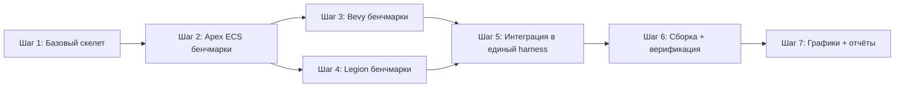

# План переработки apex-bench

## 1. Текущие проблемы

1. **Нет реального сравнения** — `comparison.rs` использует **хардкодные фейковые данные** для Bevy/Hecs/Legion
2. **Нестандартные компоненты** — Position/Velocity вместо стандартных Transform/Position/Rotation/Velocity из `cgmath`
3. **Отклонения от ecs-bench-suite**:
   - simple_insert: спавнит только 2 компонента (Position+Velocity), а нужно 4 (Transform+Position+Rotation+Velocity)
   - fragmented_iter: всего 4 архетипа вместо 26
   - schedule: использует устаревший Scheduler API
   - отсутствует heavy_compute, serialize_text, serialize_binary
4. **Куча лишнего** — relations_bench, commands_bench, graph_bench засоряют основное сравнение

## 2. Целевая архитектура

```mermaid
flowchart TD
    A[benches/benchmarks.rs] --> B[criterion harness]
    B --> C[simple_insert]
    B --> D[simple_iter]
    B --> E[frag_iter]
    B --> F[schedule]
    B --> G[heavy_compute]
    B --> H[add_remove]
    
    C --> I[Benchmark::run()]
    D --> I
    E --> I
    F --> I
    G --> I
    H --> I
    
    I --> J[Apex ECS impl]
    I --> K[Bevy impl]
    I --> L[Legion impl]
```

Каждый ECS получает свой модуль `src/{ecs}/` со структурой `Benchmark`, реализующей единый трейт.

## 3. Единый трейт Benchmark

```rust
pub trait Benchmark {
    fn new() -> Self;
    fn run(&mut self);
}
```

Все бенчмарки следуют этому паттерну. Каждый бенчмарк — структура с полями `world` и `entities`, создаётся в `new()`, выполняет замеряемую операцию в `run()`.

## 4. Стандартные компоненты (через cgmath)

```rust
use cgmath::{Matrix4, Vector3};

pub struct Transform(pub Matrix4<f32>);
pub struct Position(pub Vector3<f32>);
pub struct Rotation(pub Vector3<f32>);
pub struct Velocity(pub Vector3<f32>);
```

Эти 4 компонента используются во **всех** бенчмарках ecs-bench-suite.

## 5. Структура каталогов

```
crates/apex-bench/
├── Cargo.toml
├── benches/
│   └── benchmarks.rs          # Единый criterion harness — 6 групп
└── src/
    ├── lib.rs                 # cgmath-компоненты, трейт Benchmark
    ├── apex/
    │   ├── mod.rs             # реэкспорт всех подмодулей
    │   ├── simple_insert.rs   # 10K сущностей × 4 компонента
    │   ├── simple_iter.rs     # итерация + мутация Position
    │   ├── frag_iter.rs       # 26 архетипов, итерация Data
    │   ├── schedule.rs        # 40K сущностей, 3 параллельные системы
    │   ├── heavy_compute.rs   # inner parallelism (Rayon)
    │   └── add_remove.rs      # вставка/удаление компонента
    ├── bevy/
    │   ├── mod.rs
    │   ├── simple_insert.rs
    │   ├── simple_iter.rs
    │   ├── frag_iter.rs
    │   ├── schedule.rs
    │   ├── heavy_compute.rs
    │   └── add_remove.rs
    └── legion/
        ├── mod.rs
        ├── simple_insert.rs
        ├── simple_iter.rs
        ├── frag_iter.rs
        ├── schedule.rs
        ├── heavy_compute.rs
        └── add_remove.rs
```

## 6. Детальное описание каждого бенчмарка

### 6.1 simple_insert
| Параметр | Референс | Наш план |
|----------|----------|----------|
| Сущностей | 10K | 10K |
| Компоненты | Transform+Position+Rotation+Velocity | Transform+Position+Rotation+Velocity |
| Способ | batch spawn (extend / spawn_batch) | `spawn_many` (Apex), `spawn_batch` (Bevy), `extend` (Legion) |

**Apex ECS**: `world.spawn_many(10_000, |_| (Transform::new(), Position::new(), Rotation::new(), Velocity::new()))`

### 6.2 simple_iter
- Спавн 10K сущностей с Transform+Position+Rotation+Velocity
- В `run()`: итерация, чтение Velocity, мутация Position.x += Velocity.x * dt
- Используется CachedQuery или Query

### 6.3 frag_iter (fragmented iteration)
- 26 типов сущностей (A..Z), по ~20 сущностей каждого типа
- Каждый тип имеет Data(f32) + уникальную комбинацию пометочных компонентов
- В `run()`: итерация по всем Data, суммирование значений
- **Apex**: 26 вариантов TupleBundle с Data + маркер-компоненты

### 6.4 schedule
- 40K сущностей, разделённых на 4 группы по 10K
- 3 системы, обменивающие значения компонентов:
  - SysAB: читает A, пишет B
  - SysCD: читает C, пишет D
  - SysCE: читает C, пишет E
- **Apex**: Scheduler::new() + 3 AddAutoSystem

### 6.5 heavy_compute
- 10K сущностей с Transform+Position+Velocity
- В `run()`: дорогое вычисление (например, матричное умножение) через `par_iter()` Rayon
- **Apex**: `par_for_each_component`

### 6.6 add_remove
- 10K сущностей с Transform+Position+Rotation+Velocity
- В `run()`: добавляем компонент A(f32) ко всем, затем удаляем A у всех
- Используется `world.insert()` / `world.remove::<A>()`

## 7. Dependencies в Cargo.toml

```toml
[dependencies]
cgmath = "0.18"
rayon = "1.7"

apex-core = { path = "../apex-core" }
apex-scheduler = { path = "../apex-scheduler" }

# ECS under test
bevy_ecs = { version = "0.14", optional = true }
legion = { git = "https://github.com/amethyst/legion", optional = true }

[features]
default = ["apex", "bevy", "legion"]
apex = []
bevy = ["bevy_ecs"]
legion = ["legion"]

[dev-dependencies]
criterion = { version = "0.5", features = ["html_reports"] }
```

## 8. Flecs (отложено на второй этап)

FFI-интеграция Flecs через C-библиотеку будет реализована позже. Первый этап — Apex ECS, Bevy, Legion.

## 9. Единый criterion harness (benches/benchmarks.rs)

```rust
criterion_group!(benches,
    bench_simple_insert,
    bench_simple_iter,
    bench_frag_iter,
    bench_schedule,
    bench_heavy_compute,
    bench_add_remove,
);
criterion_main!(benches);
```

Каждая функция:
```rust
fn bench_simple_insert(c: &mut Criterion) {
    let mut group = c.benchmark_group("simple_insert");
    group.bench_function("Apex", |b| b.iter(|| apex::simple_insert::Benchmark::run(&mut apex::simple_insert::Benchmark::new())));
    group.bench_function("Bevy", |b| b.iter(|| bevy::simple_insert::Benchmark::run(&mut bevy::simple_insert::Benchmark::new())));
    group.bench_function("Legion", |b| b.iter(|| legion::simple_insert::Benchmark::run(&mut legion::simple_insert::Benchmark::new())));
    group.finish();
}
```

## 10. Дорожная карта реализации



## 11. Что вырезать/оставить из текущего кода

| Файл | Решение |
|------|---------|
| `src/lib.rs` | **Переписать** — новый трейт Benchmark + cgmath-компоненты |
| `src/simple_insert.rs` | **Переписать** — 4 компонента, batch spawn |
| `src/simple_iter.rs` | **Переписать** — с мутацией Position |
| `src/fragmented_iter.rs` | **Переписать** — 26 архетипов |
| `src/schedule.rs` | **Переписать** — 3 системы, 40K сущностей |
| `src/add_remove.rs` | **Переписать** — стандартные компоненты |
| `src/commands_bench.rs` | **Вырезать** — не часть стандартного набора |
| `src/relations_bench.rs` | **Вырезать** — не часть стандартного набора |
| `benches/benchmark.rs` | **Переписать** — единый harness всех ECS |
| `benches/comparison.rs` | **Удалить** — теперь всё в benchmarks.rs |
| `benches/graph_bench.rs` | **Вырезать** — это бенчмарки apex-graph, не ECS |
| `benches/specialized.rs` | **Вырезать** — не нужно |

## 12. Критические замечания

1. **Bevy версия**: ecs-bench-suite использует bevy_ecs 0.1 (2019). Современная Bevy 0.14 имеет иной API. Нужно адаптировать.
2. **Legion версия**: в референсе legion через git. Убедиться, что API совпадает.
3. **Сериализация** (serialize_text, serialize_binary) — опущена из первого этапа. Можно добавить позже.
