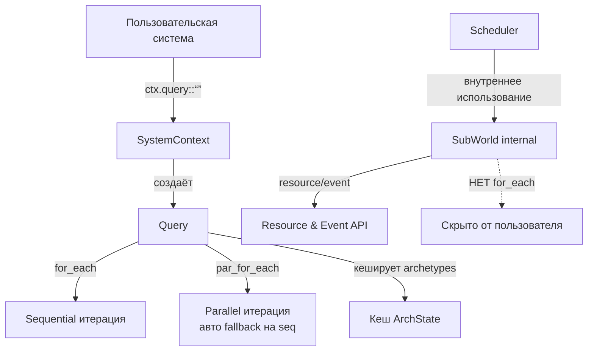

# Упрощение API итерации Apex ECS

## Текущая проблема: 3 overlapping API

Сейчас у пользователя есть **3 разных способа** итерировать компоненты, каждый со своими методами:

### 1. `Query<'w, Q>` — отдельный объект
```rust
let q = ctx.query::<(Read<Pos>, Write<Vel>)>();
q.for_each(|e, (pos, vel)| { ... });
q.for_each_component(|(pos, vel)| { ... });
// Нет par_for_each!
```

### 2. `SystemContext` — через ctx
```rust
ctx.for_each::<(Read<Pos>, Write<Vel>)>(|e, (pos, vel)| { ... });
ctx.for_each_component::<(Read<Pos>, Write<Vel>)>(|(pos, vel)| { ... });
ctx.par_for_each::<(Read<Pos>, Write<Vel>)>(|e, (pos, vel)| { ... });
ctx.par_for_each_component::<(Read<Pos>, Write<Vel>)>(|(pos, vel)| { ... });
```

### 3. `SubWorld` — низкоуровневый
```rust
sw.for_each::<(Read<Pos>, Write<Vel>)>(|e, (pos, vel)| { ... });
sw.for_each_component::<(Read<Pos>, Write<Vel>)>(|(pos, vel)| { ... });
sw.par_for_each::<(Read<Pos>, Write<Vel>)>(|e, (pos, vel)| { ... });
sw.par_for_each_component::<(Read<Pos>, Write<Vel>)>(|(pos, vel)| { ... });
```

**Итого**: 3 × 4 = 12 методов, делающих одно и то же.

---

## Как устроены топовые ECS

### Bevy ECS
- **Один API**: `Query` — единственный способ итерации
- **Автоматический parallel**: `Query` в `System` автоматически параллелится через `for_each`/`iter`
- **Нет выбора**: пользователь не выбирает seq/par — Bevy решает сам на основе `CombinatorSystem`
- **Нет `for_each_component`**: только `for_each` с Entity
- **`QueryState`** — закешированное состояние, переиспользуется между кадрами

### Flecs (C)
- **Один API**: `ecs_query()` / `ecs_iter()`
- **Автоматический parallel**: `ecs_worker()` — фреймворк сам распределяет
- **Нет выбора**: пользователь пишет `System`, Flecs решает как параллелить

### Unity ECS
- **Один API**: `IJobEntity` / `Entities.ForEach`
- **Автоматический parallel**: `ScheduleParallel()` — один вызов
- **Нет выбора**: Burst + Unity Job System решают

---

## Предлагаемая архитектура

### Принципы
1. **Один способ итерации** — только `Query`
2. **Автоматический parallel** — `Query` сам выбирает par или seq
3. **Кеширование** — `Query` кеширует archetype state между кадрами
4. **SubWorld — internal only** — скрыть от пользователя

### Новая структура

```rust
// Единственный публичный API для итерации
pub struct Query<'w, Q: WorldQuery> {
    world:      &'w World,
    archetypes: Vec<ArchState<Q::State>>,
    // Кеш: если archetypes не изменились — переиспользуем state
    cached_archetype_count: usize,
}

impl<'w, Q: WorldQuery> Query<'w, Q> {
    /// Создать Query (автоматически выбирает par или seq)
    pub fn new(world: &'w World) -> Self;
    
    /// Sequential for_each (всегда доступен)
    pub fn for_each<F: FnMut(Entity, Q::Item<'_>)>(&self, f: F);
    
    /// Parallel for_each (автоматически, если feature=parallel)
    /// Внутри сам решает: если entity_count > THRESHOLD → par, иначе seq
    pub fn par_for_each<F: Fn(Entity, Q::Item<'_>) + Send + Sync>(&self, f: F);
    
    /// Sequential без Entity (для performance-critical кода)
    pub fn for_each_component<F: FnMut(Q::Item<'_>)>(&self, f: F);
    
    /// Parallel без Entity
    pub fn par_for_each_component<F: Fn(Q::Item<'_>) + Send + Sync>(&self, f: F);
}
```

### SystemContext — только делегирование

```rust
impl SystemContext<'_> {
    /// Единственный способ создать Query
    pub fn query<Q: WorldQuery>(&self) -> Query<'_, Q> {
        Query::new(self.world())
    }
    
    // ВСЁ. Никаких for_each, par_for_each и т.д.
    // Пользователь пишет:
    //   ctx.query::<(Read<Pos>, Write<Vel>)>()
    //      .par_for_each(|e, (pos, vel)| { ... });
}
```

### SubWorld — internal, скрыть

```rust
// Убрать из публичного API
// SubWorld остаётся только для scheduler (внутреннее использование)
// Убрать: for_each, for_each_component, par_for_each, par_for_each_component
// Оставить: resource, event_reader, event_writer (нужны для ParSystem)
```

### Автоматический выбор par/seq

```rust
impl<Q: WorldQuery> Query<'_, Q> {
    pub fn par_for_each<F>(&self, f: F) {
        #[cfg(feature = "parallel")]
        if self.entity_count() > PAR_THRESHOLD {
            return self.par_for_each_impl(f);
        }
        self.for_each(f); // fallback на seq
    }
}
```

Где `PAR_THRESHOLD` — автоматический порог (например, 4096 entity), настраиваемый через `APEX_PAR_THRESHOLD`.

---

## Что меняем

### 1. `Query` — добавляем par_for_each
- [`crates/apex-core/src/query.rs`](crates/apex-core/src/query.rs:291)
- Добавить `par_for_each` и `par_for_each_component` (аналогично SubWorld)
- Использовать `adaptive_chunk_size` (уже есть)
- Добавить `entity_count()` метод

### 2. `SystemContext` — убираем дублирование
- [`crates/apex-core/src/world.rs:838-970`](crates/apex-core/src/world.rs:838)
- Удалить: `for_each`, `for_each_component`, `par_for_each`, `par_for_each_component`
- Оставить только `query::<Q>()`

### 3. `SubWorld` — убираем итерацию
- [`crates/apex-core/src/sub_world.rs:51-219`](crates/apex-core/src/sub_world.rs:51)
- Удалить: `for_each`, `for_each_component`, `par_for_each`, `par_for_each_component`
- Оставить: `resource`, `resource_mut`, `event_reader`, `event_writer`

### 4. `Query` — добавляем кеширование
- [`crates/apex-core/src/query.rs:296`](crates/apex-core/src/query.rs:296)
- `new_with_tick` уже вычисляет archetypes
- Добавить `cached_archetype_count` для пропуска пересчёта

### 5. Обновить примеры
- [`crates/apex-examples/examples/perf.rs`](crates/apex-examples/examples/perf.rs)
- [`crates/apex-examples/examples/basic.rs`](crates/apex-examples/examples/basic.rs)
- Все использования `ctx.for_each` → `ctx.query().for_each`

---

## Миграция для пользователей

### Было:
```rust
fn my_system(ctx: SystemContext<'_>) {
    ctx.for_each::<(Read<Pos>, Write<Vel>)>(|e, (pos, vel)| {
        vel.x += pos.x;
    });
    
    ctx.par_for_each_component::<(Read<Pos>, Write<Vel>)>(|(pos, vel)| {
        vel.x += pos.x;
    });
}
```

### Стало:
```rust
fn my_system(ctx: SystemContext<'_>) {
    // Sequential — явно
    ctx.query::<(Read<Pos>, Write<Vel>)>()
        .for_each(|e, (pos, vel)| {
            vel.x += pos.x;
        });
    
    // Parallel — явно (автоматический fallback на seq если мало entity)
    ctx.query::<(Read<Pos>, Write<Vel>)>()
        .par_for_each_component(|(pos, vel)| {
            vel.x += pos.x;
        });
    
    // Или ещё короче — один раз создаём Query
    let mut q = ctx.query::<(Read<Pos>, Write<Vel>)>();
    q.par_for_each(|e, (pos, vel)| { ... });
    // q можно переиспользовать — он кеширует archetypes
}
```

---

## План выполнения

| Шаг | Что | Файл | Сложность |
|-----|-----|------|-----------|
| 1 | Добавить `par_for_each` + `par_for_each_component` в `Query` | `query.rs` | Средняя |
| 2 | Удалить `for_each*` из `SystemContext` | `world.rs` | Простая |
| 3 | Удалить `for_each*` из `SubWorld` | `sub_world.rs` | Простая |
| 4 | Обновить scheduler (использует SubWorld только для resource/event) | `lib.rs` | Простая |
| 5 | Обновить perf.rs и примеры | `perf.rs`, `basic.rs` | Средняя |
| 6 | Добавить кеширование в Query | `query.rs` | Средняя |
| 7 | Тесты и проверка сборки | — | Простая |

---

## Mermaid: новая архитектура API



---

## Риски

1. **Breaking change** — все существующие системы нужно обновить
2. **Query создаётся каждый кадр** — небольшая аллокация (можно кешировать)
3. **SubWorld всё ещё нужен scheduler'у** — нельзя полностью убрать
