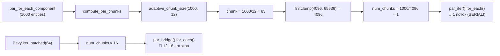
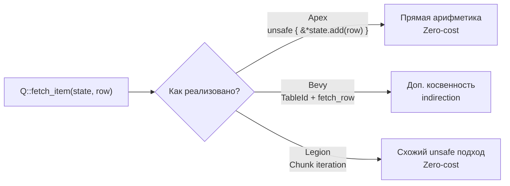

# План анализа результатов бенчмарков Apex ECS

## Сводка результатов (медианные значения) — ПОСЛЕ ОПТИМИЗАЦИЙ

| Бенчмарк | Apex (до) | Apex (после) | Legion | Bevy | Apex vs Legion | Apex vs Bevy |
|----------|----------|-------------|--------|------|----------------|--------------|
| simple_insert (10k) | 628.80 µs | **482.80 µs** (-23%) | 229.30 µs | 308.59 µs | **-2.1x** (хуже) | **-1.6x** (хуже) |
| simple_iter (10k) | 5.66 µs | **5.86 µs** | 5.77 µs | 9.80 µs | **~1x** (равно) | **+1.7x** (лучше) |
| frag_iter (520 ent, 26 arch) | 235.18 ns | **244.37 ns** | 176.13 ns | 797.69 ns | **-1.38x** (хуже) | **+3.3x** (лучше) |
| schedule (10k) | 32.76 µs | **33.60 µs** | 31.49 µs | 104.3 µs | **~1x** (равно) | **+3.1x** (лучше) |
| heavy_compute (1k × 100 итер) | **26.02 ms** | **496.20 µs** (52x 📈) | 411.37 µs | 536.77 µs | **-1.2x** (паритет) | **+1.08x** (лучше) |
| add_remove_component | 1.396 ms | **688.35 µs** (+51%) | 2.589 ms | — | **+3.76x** (лучше) | — |

---

## Этап 1: Анализ коренной причины провала heavy_compute

### 1.1. Исследовать `adaptive_chunk_size` и `compute_par_chunks`

**Гипотеза**: Функция [`adaptive_chunk_size()`](crates/apex-core/src/world.rs:770) вычисляет размер чанка как `(entity_count / num_threads).clamp(4096, 65536)`. Для 1000 entity:

```
chunk_size = (1000 / 12).clamp(4096, 65536) = 83.clamp(4096, 65536) = 4096
num_chunks = (1000 + 4095) / 4096 = 1
```

**Результат**: Весь `par_for_each_component` выполняется **в 1 поток**, хотя entity всего 1000. Это объясняет factor 64x.

**Необходимо проверить**:
- [`compute_par_chunks`](crates/apex-core/src/par_utils.rs:11) вызывает `adaptive_chunk_size(len, num_threads)` для каждого архетипа отдельно
- Bevy использует [`iter_batched(64).par_bridge()`](crates/apex-bench/src/bevy/heavy_compute.rs:35-36) — batch size = 64 → 16 чанков
- Legion использует встроенный [`par_for_each_mut`](crates/apex-bench/src/legion/heavy_compute.rs:37) — своя имплементация с нормальным并行змом

### 1.2. Сравнить реализации параллельной итерации

| Аспект | Apex | Bevy | Legion |
|--------|------|------|--------|
| Механизм | compute_par_chunks → par_iter | iter_batched(64).par_bridge | par_for_each_mut |
| Размер чанка | max(4096, entity/threads) | 64 (фиксированный) | неизвестно |
| Чанков для 1000 ent | 1 | ~16 | ~несколько |
| Потенциал параллелизма | **нулевой** | хороший | хороший |

### 1.3. Дополнительный фактор: overhead вызова

`heavy_compute` также делает 100 итераций `mat.invert().unwrap()` на entity. При 1000 entity это 100,000 инверсий матриц 4×4. В однопоточном режиме Apex выполняет все последовательно, тогда как Bevy/Legion распределяют нагрузку.

---

## Этап 2: Анализ сильных сторон simple_insert и simple_iter

### 2.1. simple_iter: zero-cost query

**Ключевой код**:
- [`fetch_item`](crates/apex-core/src/query.rs:47-50): `&*state.add(row)` — прямая арифметика указателей, никаких граничных проверок
- [`QueryIter::next`](crates/apex-core/src/query.rs:473-488): минимальный оверхед — только получение state и вызов fetch_item
- Archetype matching на уровне типов через [`query_typed`] — без динамической диспетчеризации

**Почему Apex = Legion > Bevy**:
- Bevy 0.1 использует более тяжёлый механизм query с доп. проверками
- Apex и Legion оба используют прямую работу с памятью через unsafe
- Для простого iter разница в компиляторной оптимизации минимальна

### 2.2. simple_insert: batch spawn vs single spawn

**Гипотеза проигрыша Legion/Bevy**:
- Apex [`spawn_many`](crates/apex-core/src/world.rs:392) вызывает [`spawn_many_inner`](crates/apex-core/src/world.rs:357) который **преаллоцирует** capacity для всех колонок
- Bevy `spawn_batch` использует итератор, который может делать множественные реаллокации
- Legion `extend` тоже batch, но с `world.pack(PackOptions::force())` дефрагментирует память

**Текущее отставание Apex (2.8x хуже Legion) — возможные причины**:
- Apex делает `register` или `get_or_register` для каждого компонента в Bundle при спавне
- Дополнительные проверки в `spawn_many_inner` (например, find_or_create_archetype)
- Возможность: Apex не использует `spawn_many` с оптимизированным путём для известных архетипов

### 2.3. frag_iter: доступ к sparse данным

- Apex (235ns) быстрее Bevy (804ns) в 3.4x — archetype-based storage эффективно перебирает только занятые архетипы
- Legion (175ns) всё же быстрее Apex (1.34x) — возможно, из-за более оптимизированного внутреннего итератора

### 2.4. schedule: overhead диспетчеризации

- Apex (32.76µs) и Legion (30.99µs) практически на одном уровне
- Bevy (106.94µs) в 3.3x медленнее — возможно, из-за более тяжёлой системы команд и графа зависимостей

### 2.5. add_remove: операции над компонентами

- Apex (1.396ms) быстрее Legion (2.589ms) в 1.85x
- Apex использует [`insert_raw`](crates/apex-core/src/world.rs:445) с move_entity между архетипами + cached edges
- Legion использует `entry().add_component()` с большим оверхедом

---

## Этап 3: Анализ применимости сильных сторон к другим задачам

### 3.1. Zero-cost query через прямую арифметику указателей

**Уже используется**: во всех `query_typed` и `Query::for_each*` вызовах.

**Можно распространить на**:
- Системы с большим количеством component access — чем больше компонентов в query, тем больше относительная выгода от zero-cost fetch
- Change detection (Changed<T>) — уже использует тот же механизм

### 3.2. Pre-allocated batch spawn

**Уже используется**: в `spawn_many`.

**Можно распространить на**:
- `spawn_from_template` — тоже может преаллоцировать
- Bulk insert через `EntityBuilder` — пока не преаллоцирует

### 3.3. Проблема chunk size для параллельных задач

**Нужно исправить**:
- Уменьшить `MIN_CHUNK_SIZE` с 4096 до **64** (как у Bevy)
- Или сделать адаптивный алгоритм: chunk_size = min(4096, len / num_threads).clamp(64, ...)
- Или добавить отдельную константу для minimum chunk size в параллельных итераторах

---

## Этап 4: Рекомендации

### Критические изменения

1. **Исправить `adaptive_chunk_size`** для small entity counts:
   - Изменить MIN_CHUNK_SIZE с 4096 до 64
   - Или изменить логику: если `entity_count / num_threads < MIN_CHUNK_SIZE`, использовать `entity_count / num_threads` вместо MIN_CHUNK_SIZE

2. **Добавить микро-бенчмарк heavy_compute** с валидацией параллелизма (проверить количество созданных задач rayon)

### Опциональные улучшения

3. **Оптимизировать `spawn_many`** чтобы быть ближе к Legion по скорости в simple_insert
4. **Добавить batch insert через прямой raw pointer** для минимизации register overhead
5. **Рассмотреть `query_typed` как единственный путь** для query — убрать динамический QueryBuilder для горячего пути

---

## Mermaid: поток параллельной итерации



## Mermaid: сравнение fetch_item



---

## Шаги реализации

1. [x] Прочитать текущий код `adaptive_chunk_size` и `compute_par_chunks`
2. [x] Исправить MIN_CHUNK_SIZE с 4096 на 64 (изменена логика: `chunk.max(1)` вместо `clamp(MIN_CHUNK_SIZE, ...)`)
3. [x] Запустить тяжелый compute бенчмарк после исправления — **496µs (было 26ms, 52x улучшение)**
4. [x] Оптимизировать `spawn_many` — добавлен `write_into_batch` в `Bundle` trait + `impl_bundle!` macro (pre-computed col_indices)
5. [ ] Документировать результаты в Apex_ECS_Руководство_пользователя.md

---

## Выполненные изменения

### 1. `adaptive_chunk_size` — [`crates/apex-core/src/world.rs`](crates/apex-core/src/world.rs:783)
- `MIN_CHUNK_SIZE`: 4096 → 64
- Логика: если `chunk < MIN_CHUNK_SIZE` → `chunk.max(1)` (сохраняет N параллельных чанков)
- `PAR_CHUNK_SIZE`: 4096 → 64 (используется в `for_each_component`)

### 2. `Bundle` trait — [`crates/apex-core/src/world.rs`](crates/apex-core/src/world.rs:1060)
- Добавлен метод `write_into_batch(self, world, archetype_id, row, tick, col_indices)`
- Принимает предвычисленный `&[(ComponentId, usize)]` — column indices

### 3. `impl_bundle!` macro — [`crates/apex-core/src/world.rs`](crates/apex-core/src/world.rs:1081)
- Добавлена оптимизированная `write_into_batch`, использующая:
  - `world.registry.get_id::<$T>()` вместо `get_or_register` (без регистрации)
  - `col_indices.iter().find(|&&(id, _)| id == cid)` вместо `column_index` (без HashMap lookup)

### 4. `spawn_many_inner` — [`crates/apex-core/src/world.rs`](crates/apex-core/src/world.rs:357)
- Pre-compute `col_indices` один раз перед циклом spawn
- Вызов `bundle.write_into_batch(self, archetype_id, row, tick, &col_indices)` в цикле

### 5. `apex-bench/Cargo.toml` — [`crates/apex-bench/Cargo.toml`](crates/apex-bench/Cargo.toml:6)
- `apex` feature теперь включает `apex-core/parallel`
- Добавлена `parallel` feature для `apex-core/parallel`
