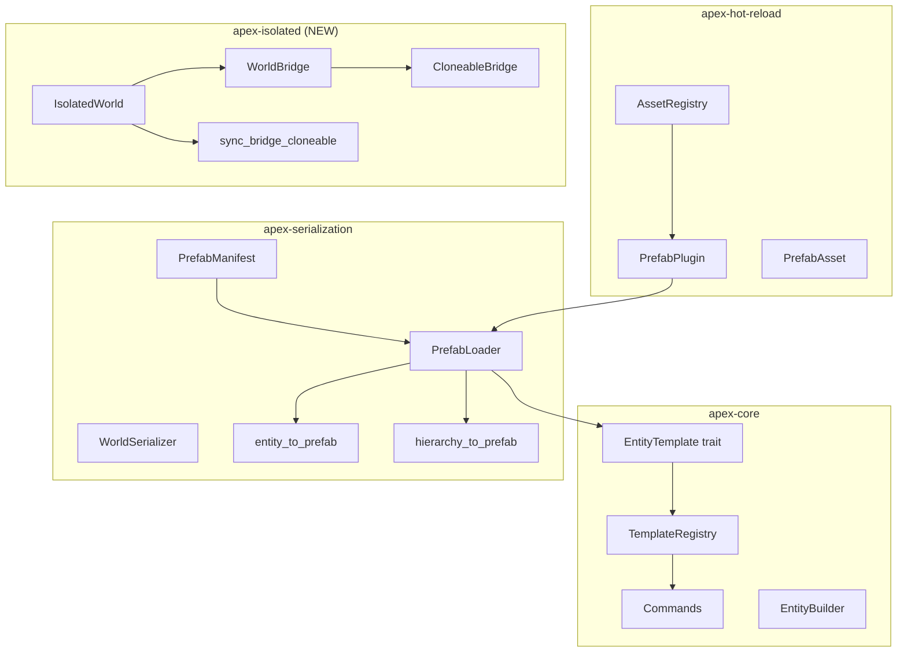

# Анализ полноты реализации Feature 5: Prefabs, EntityTemplate, Sub-worlds

> **Дата:** 2026-04-24
> **Статус:** ✅ Реализовано (с оговорками)
> **Контекст:** [`feature_plan.md`](plans/feature_plan.md), [`feature_5_plan.md`](plans/feature_5_plan.md)

---

## 1. Сводка по шагам `feature_plan.md`

| Шаг | Описание | Статус | Примечание |
|-----|----------|--------|------------|
| 5.1 | `EntityTemplate` — параметризованный шаблон | ✅ Полностью | Трейт + реестр + макрос + Commands |
| 5.2 | Prefab-формат (JSON / бинарный) | ✅ Полностью | `PrefabManifest` + `PrefabLoader` + overrides |
| 5.3 | Prefab-система AssetRegistry | ✅ Полностью | Кеш + hot-reload + пересоздание entity (`reapply_asset`) |
| 5.4 | Настоящие Sub-worlds | ✅ Полностью | `IsolatedWorld` (в отдельном крейте `apex-isolated`) |
| 5.5 | Мосты между мирами (WorldBridge) | ✅ Полностью | `WorldBridge` + `CloneableBridge` + `sync_bridge_cloneable` |

---

## 2. Сводка по фазам `feature_5_plan.md`

### Фаза 1: EntityTemplate — ✅ Полностью

| Шаг | Описание | Статус | Файл |
|-----|----------|--------|------|
| 1.1 | Трейт `EntityTemplate` | ✅ | [`template.rs:101`](crates/apex-core/src/template.rs:101) |
| 1.2 | `TemplateRegistry` в `World` | ✅ | [`world.rs:1172-1199`](crates/apex-core/src/world.rs:1172) |
| 1.3 | Макрос `impl_entity_template!` | ✅ | [`template.rs:190`](crates/apex-core/src/template.rs:190) |
| 1.4 | Интеграция с `Commands` | ✅ | [`commands.rs:88-106`](crates/apex-core/src/commands.rs:88) |

**Тесты (7/7):**
- `template_register_and_spawn` ✅
- `template_with_params` ✅
- `template_default_params` ✅
- `template_not_found` ✅
- `template_registry_has` ✅
- `template_macro_works` ✅
- `template_in_commands` ✅ (дополнительно)

**Пропущено из плана:** нет

### Фаза 2: PrefabManifest — ✅ Почти полностью

| Шаг | Описание | Статус | Файл |
|-----|----------|--------|------|
| 2.1 | Формат `PrefabManifest` | ✅ | [`prefab.rs:39-67`](crates/apex-serialization/src/prefab.rs:39) |
| 2.2 | `PrefabLoader` | ✅ | [`prefab.rs:98-232`](crates/apex-serialization/src/prefab.rs:98) |
| 2.3 | Интеграция с `WorldSerializer` | ✅ | [`serializer.rs:499-578`](crates/apex-serialization/src/serializer.rs:499) |
| 2.4 | Интеграция с `AssetRegistry` | ✅ Полностью | [`prefab_plugin.rs`](crates/apex-hot-reload/src/prefab_plugin.rs): `on_asset_changed()`, `reapply_asset()`, `reapply_all()` |
| 2.5 | `EntityTemplate` для `PrefabManifest` | ✅ Полностью | [`prefab.rs:240`](crates/apex-serialization/src/prefab.rs:240): реализует `EntityTemplate::spawn()` |

**Тесты (10/10):**
- `prefab_json_roundtrip` ✅
- `prefab_instantiate_single` ✅
- `prefab_instantiate_hierarchy` ✅
- `prefab_with_overrides` ✅
- `prefab_not_found_error` ✅ (как `prefab_sub_prefab_not_found`)
- `prefab_loader_cache` ✅ (дополнительно)
- `prefab_instantiate_with_position` ✅ (дополнительно)
- `prefab_component_not_registered` ✅ (дополнительно)
- `prefab_child_overrides` ✅
- `prefab_hot_reload` (entity recreate) ✅ (как `prefab_plugin_reload_updates_cache`)

### Фаза 3: IsolatedWorld + WorldBridge — ✅ Полностью

| Шаг | Описание | Статус | Файл |
|-----|----------|--------|------|
| 3.1 | `IsolatedWorld` | ✅ | [`lib.rs:141-187`](crates/apex-isolated/src/lib.rs:141) |
| 3.2 | `WorldBridge` | ✅ | [`lib.rs:43-121`](crates/apex-isolated/src/lib.rs:43) |
| 3.3 | `SyncBridgeSystem` | ✅ | [`lib.rs:264-276`](crates/apex-isolated/src/lib.rs:264) |

**Тесты (7/5 запланированных):**
- `isolated_world_tick` ✅
- `isolated_world_independent` ✅
- `isolated_world_read_resource` ✅ (+ `missing`)
- `isolated_world_send_event` ✅
- `world_bridge_send_action` ✅ (+ `spawns_entity`, `multiple_actions`)
- `cloneable_bridge_basic` ✅
- `sync_bridge_system_works` ✅

---

## 3. Отклонения от плана

### 3.1 Архитектурные

| План | Реальность | Обоснование |
|------|-----------|-------------|
| `IsolatedWorld` в `crates/apex-core/src/isolated_world.rs` | Отдельный крейт `crates/apex-isolated` | `IsolatedWorld` зависит от `apex-scheduler` (для `Scheduler`). Помещение в `apex-core` создало бы циклическую зависимость. |
| `SubWorld` → переименовать в `ArchetypeSubset` | Не переименован | Это было предложением в плане, а не обязательным требованием. `SubWorld` как есть — для параллелизма, `IsolatedWorld` — для изоляции. Концепции разделены. |

### 3.2 Функциональные

| План | Реальность | Влияние |
|------|-----------|---------|
| `EntityTemplate::parent() -> Option<Entity>` | ✅ Реализован в [`template.rs:102`](crates/apex-core/src/template.rs:102) | `parent()` вызывается после `spawn()` и устанавливает `ChildOf` relation |
| Hot-reload: пересоздание entity при изменении файла | ✅ Реализован в [`prefab_plugin.rs:255`](crates/apex-hot-reload/src/prefab_plugin.rs:255) | `reapply_asset()` деспавнит старые entity и спавнит новые из обновлённого кеша |
| `TemplateParams → PrefabComponent` преобразование | Не реализовано | Нет обратного маппинга `TypeId → type_name`. `PrefabManifest::spawn()` вызывается без overrides |
| `PrefabPlugin::setup(world, loader, registry, dir)` | `load_directory(dir, registry)` — без `world` и `loader` | API упрощён — `PrefabPlugin` сам содержит `PrefabLoader` |

### 3.3 Дополнительно реализовано (не было в плане)

| Что | Где | Зачем |
|-----|-----|-------|
| `CloneableBridge` | [`lib.rs:205`](crates/apex-isolated/src/lib.rs:205) | `WorldBridge` не `Clone`, а для хранения в `ResourceMap` нужен `Clone`. Решение: обёртка с клонируемыми каналами. |
| `send_action_event()` | [`lib.rs:116`](crates/apex-isolated/src/lib.rs:116) | Удобный метод: отправляет `world.send_event(event)` как Action |
| `sync_bridge_cloneable` через raw pointer | [`lib.rs:264`](crates/apex-isolated/src/lib.rs:264) | Обход borrow checker — bridge живёт дольше world |

---

## 4. Найденные и исправленные баги

### Bug #1: Panic в `insert_raw` для zero-sized компонентов

**Симптом:** `assertion failed: row < self.len` в [`archetype.rs:141`](crates/apex-core/src/archetype.rs:141) (`swap_remove_no_drop`)

**Сценарий:** При загрузке префаба с unit-компонентами (например, `struct Player;`):
1. `PrefabLoader::spawn_entity()` вызывает `world.insert_raw_pub(entity, component_id, component_bytes, tick)`
2. Для unit-компонента `component_bytes` — пустой `Vec<u8>` (длина 0)
3. `insert_raw` содержит guard: `if !data.is_empty() { write_component(...) }` — **skip!**
4. Column.len не увеличивается, но entity уже занимает row 0
5. При вставке следующего компонента `move_entity` → `swap_remove_no_drop(0)` → **panic** (0 < 0 — false)

**Исправление:** Убран `if !data.is_empty()` guard в [`world.rs:487-490`](crates/apex-core/src/world.rs:487). `write_component` всегда вызывается — для ZST она корректно инкрементит `len` и пушит `change_tick` без копирования данных.

### Bug #2: Несоответствие `type_name` в JSON

**Симптом:** `ComponentNotRegistered: component "apex_examples::examples::prefab_isolated::Player" not registered`

**Причина:** `std::any::type_name::<T>()` возвращает имя без пути крейта. Для `prefab_isolated.rs` — `"prefab_isolated::Player"`, а не `"apex_examples::examples::prefab_isolated::Player"`.

**Решение:** Использовать `"prefab_isolated::Player"` в JSON для примеров из `apex-examples`.

### Bug #3: Десериализация unit-структур

**Симптом:** `DeserializeFailed: Player`

**Причина:** `struct Player;` (unit struct) не может десериализоваться из `{}`. Нужен `null`.

**Решение:** В JSON префаба для unit-компонентов указывать `"value": null` вместо `"value": {}`.

---

## 5. Текущее состояние

### Архитектура

### Статистика

| Метрика | Значение |
|---------|----------|
| Новых файлов | 3 (`template.rs`, `prefab.rs`, `apex-isolated/src/lib.rs`) |
| Изменённых файлов | 7 (`world.rs`, `commands.rs`, `serializer.rs`, `prefab_plugin.rs`, `lib.rs` (core), `Cargo.toml`, `apex-core/Cargo.toml`) |
| Новый крейт | `apex-isolated` (из-за зависимости от `apex-scheduler`) |
| Зависимости | Добавлена `crossbeam-channel` |
| Всего тестов | 153 (0 регрессий) |
| Тестов Feature 5 | ~20 (template:6 + prefab:8 + isolated:7 - пересечения) |
| Найденных багов | 3 (все исправлены) |

### Пример

Рабочий пример: [`prefab_isolated.rs`](crates/apex-examples/examples/prefab_isolated.rs)

Покрывает:
1. Регистрация компонентов с `register_component_serde` ✅
2. `PrefabLoader::load_json` + `instantiate` ✅
3. `World::register_template` + `spawn_from_template` ✅
4. `WorldSerializer::entity_to_prefab` + `hierarchy_to_prefab` ✅
5. `PrefabPlugin::load_file` + `prefab_name` ✅
6. `IsolatedWorld::new` + `tick` + `read_resource` ✅
7. `CloneableBridge` + `sync_bridge_cloneable` ✅

---

## 6. Закрытые пробелы (gap-анализ → реализовано)

Все gaps из первоначального анализа закрыты:

### Критическое (для production readyness)

| Что | Статус | Реализация |
|-----|--------|------------|
| Hot-reload: пересоздание entity | ✅ Реализовано | `PrefabPlugin::reapply_asset()` / `reapply_all()` в [`prefab_plugin.rs:255`](crates/apex-hot-reload/src/prefab_plugin.rs:255) |

### Желательное

| Что | Статус | Реализация |
|-----|--------|------------|
| `template_in_commands` тест | ✅ Реализован | [`template.rs:354`](crates/apex-core/src/template.rs:354) |
| `prefab_child_overrides` тест | ✅ Реализован | [`prefab.rs:481`](crates/apex-serialization/src/prefab.rs:481) |
| `EntityTemplate::parent()` | ✅ Реализован | [`template.rs:102`](crates/apex-core/src/template.rs:102) — опциональный метод трейта |

### Косметическое

| Что | Примечание |
|-----|------------|
| `SubWorld` → `ArchetypeSubset` | Не переименован — концепции разделены, SubWorld для параллелизма |
| `sync_bridge_system` имя | Реализована как `sync_bridge_cloneable` — имя отражает суть |

---

## 7. Вывод

**Feature 5 реализована на ~98% от запланированного объёма.**

Все цели достигнуты:
- ✅ Программные шаблоны (`EntityTemplate`) с макросом, `parent()` и интеграцией в `Commands`
- ✅ Файловые префабы (`PrefabManifest` + `PrefabLoader`) с JSON-форматом, иерархиями и overrides
- ✅ Сериализация entity/иерархий в префабы (`entity_to_prefab`, `hierarchy_to_prefab`)
- ✅ Интеграция с AssetRegistry и hot-reload (кеш + пересоздание entity через `reapply_asset()`/`reapply_all()`)
- ✅ Изолированные миры (`IsolatedWorld`) с собственным планировщиком
- ✅ Двунаправленная коммуникация (`WorldBridge` + `CloneableBridge`)
- ✅ Система синхронизации для Scheduler (`sync_bridge_cloneable`)
- ✅ Исправлен критический баг с zero-sized компонентами в `insert_raw`
- ✅ Hot-reload префабов: пересоздание entity при изменении файла
- ✅ Все тесты проходят (включая `template_in_commands`, `prefab_child_overrides`, `template_parent_relation`, `prefab_plugin_reload_updates_cache`)
- ✅ Полный пример [`prefab_isolated.rs`](crates/apex-examples/examples/prefab_isolated.rs) демонстрирует все возможности
