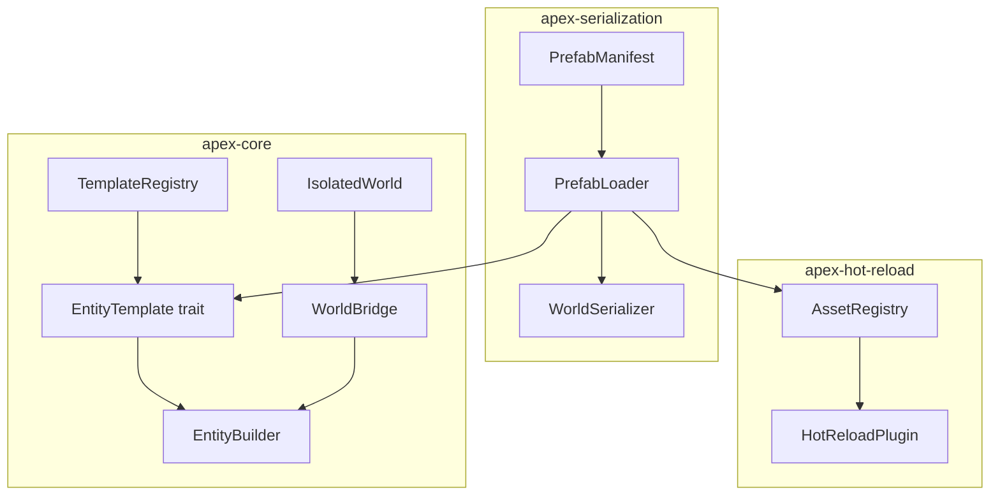
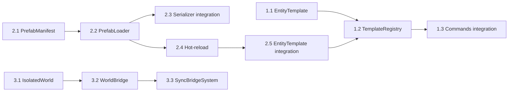

# Feature 5: Prefabs, EntityTemplate, Sub-worlds — План реализации

> **Дата:** 2026-04-24
> **Статус:** Проектирование
> **Контекст:** [`apex-core`](crates/apex-core/src/lib.rs), [`apex-serialization`](crates/apex-serialization/src/lib.rs), [`apex-hot-reload`](crates/apex-hot-reload/src/lib.rs)

---

## Общая архитектура



## Фазы реализации

План разбит на 3 фазы. Первые 2 фазы — минимально полезный продукт (префабы работают). Фаза 3 — изолированные миры.

---

## Фаза 1: EntityTemplate — программные шаблоны

### Шаг 1.1: Трейт `EntityTemplate`

Новый файл: [`crates/apex-core/src/template.rs`]

```rust
/// Параметры шаблона — значения для переопределения полей при спавне.
pub struct TemplateParams {
    overrides: FxHashMap<String, Box<dyn Any + Send>>,
}

impl TemplateParams {
    pub fn new() -> Self;
    /// Переопределить значение компонента по имени поля.
    pub fn with<T: Send + 'static>(mut self, key: &str, value: T) -> Self;
    pub fn get<T: 'static>(&self, key: &str) -> Option<&T>;
}

/// Трейт для шаблонов сущностей.
///
/// Позволяет создавать entity с предопределённым набором компонентов,
/// поддерживая переопределение полей через `TemplateParams`.
pub trait EntityTemplate: Send + Sync {
    /// Создать entity в указанном мире.
    fn spawn(&self, world: &mut World, params: &TemplateParams) -> Entity;

    /// Опционально: отношения с родителем (для иерархий).
    fn parent(&self) -> Option<Entity> { None }
}
```

**Обоснование**: `Send + Sync` требуется для использования в `TemplateRegistry` (доступ из параллельных систем). `params` позволяют переопределять отдельные поля без создания десятков подклассов шаблона.

### Шаг 1.2: `TemplateRegistry` в `World`

Добавить в [`World`](crates/apex-core/src/world.rs):

```rust
pub struct World {
    // ... существующие поля
    pub(crate) templates: FxHashMap<String, Box<dyn EntityTemplate>>,
}
```

Методы:

```rust
impl World {
    /// Зарегистрировать именованный шаблон.
    pub fn register_template(&mut self, name: &str, template: impl EntityTemplate + 'static);

    /// Создать entity из зарегистрированного шаблона.
    pub fn spawn_from_template(&mut self, name: &str, params: &TemplateParams) -> Option<Entity>;

    /// Создать entity из шаблона с параметрами по умолчанию.
    pub fn spawn_template(&mut self, name: &str) -> Option<Entity>;
}
```

### Шаг 1.3: Макрос `impl_template!`

Для удобного определения шаблонов:

```rust
// Пример использования:
struct MonsterTemplate {
    health: f32,
    speed: f32,
}

impl_entity_template!(MonsterTemplate, {
    "Monster", |this, world, params| {
        let health = params.get::<f32>("health").copied().unwrap_or(this.health);
        let speed  = params.get::<f32>("speed").copied().unwrap_or(this.speed);

        world.spawn()
            .insert(Health { current: health, max: health })
            .insert(Velocity(Vec3::new(speed, 0.0, 0.0)))
            .insert(Name("Monster"))
            .id()  // возвращается Entity
    }
});
```

Или без макроса — через ручную имплементацию `EntityTemplate`.

### Шаг 1.4: Интеграция с `Commands`

В [`Commands`](crates/apex-core/src/commands.rs) добавить:

```rust
impl Commands {
    /// Создать entity из шаблона (отложенно).
    pub fn spawn_template(&mut self, template_name: &str, params: TemplateParams) {
        let name = template_name.to_string();
        self.queue.push(Command::Apply(Box::new(move |world| {
            world.spawn_from_template(&name, &params);
        })));
    }
}
```

### Тесты для фазы 1

- `template_register_and_spawn` — регистрация + спавн из шаблона возвращает entity с компонентами
- `template_with_params` — переопределение полей через `TemplateParams`
- `template_default_params` — спавн без параметров использует значения по умолчанию
- `template_not_found` — `spawn_from_template("unknown", ...)` возвращает `None`
- `template_in_commands` — отложенный спавн через `Commands`

---

## Фаза 2: PrefabManifest — файловые префабы

### Шаг 2.1: Формат `PrefabManifest`

Новый файл: [`crates/apex-serialization/src/prefab.rs`]

```rust
/// Описание одного компонента в префабе.
#[derive(Debug, Clone, Serialize, Deserialize)]
pub struct PrefabComponent {
    pub type_name: String,
    /// JSON-значение компонента (использует serde_fns компонента для десериализации).
    pub value:     serde_json::Value,
}

/// Ребёнок в иерархии префаба.
#[derive(Debug, Clone, Serialize, Deserialize)]
pub struct PrefabChild {
    /// Имя под-префаба или inline-определение.
    pub prefab:       String,
    /// Переопределения компонентов для этого ребёнка.
    #[serde(default)]
    pub overrides:    Vec<PrefabComponent>,
}

/// Манифест префаба — JSON-файл, описывающий entity и его детей.
#[derive(Debug, Clone, Serialize, Deserialize)]
pub struct PrefabManifest {
    pub name:        String,
    pub components:  Vec<PrefabComponent>,
    #[serde(default)]
    pub children:    Vec<PrefabChild>,
}
```

Пример JSON:
```json
{
  "name": "Monster",
  "components": [
    { "type_name": "apex_examples::Health", "value": { "current": 100, "max": 100 } },
    { "type_name": "apex_examples::Velocity", "value": [5.0, 0.0, 0.0] },
    { "type_name": "apex_examples::Name", "value": "Monster" }
  ],
  "children": [
    { "prefab": "Weapon", "overrides": [{ "type_name": "apex_examples::Name", "value": "Monster Sword" }] },
    { "prefab": "Helmet" }
  ]
}
```

### Шаг 2.2: `PrefabLoader`

```rust
pub struct PrefabLoader {
    /// Кеш загруженных манифестов.
    cache: FxHashMap<String, PrefabManifest>,
}

impl PrefabLoader {
    pub fn new() -> Self;

    /// Загрузить манифест из JSON-строки.
    pub fn load_json(&mut self, json: &str) -> Result<&PrefabManifest, PrefabError>;

    /// Загрузить манифест из файла.
    pub fn load_file(&mut self, path: &Path) -> Result<&PrefabManifest, PrefabError>;

    /// Создать entity из префаба (рекурсивно, с учётом children).
    pub fn instantiate(
        &self,
        world: &mut World,
        manifest: &PrefabManifest,
        overrides: &[PrefabComponent],
        parent: Option<Entity>,
    ) -> Result<Entity, PrefabError>;
}
```

**Алгоритм `instantiate`:**
1. Создать пустой entity (`world.spawn_empty()`)
2. Для каждого компонента в манифесте + overrides:
   - Найти `ComponentId` по `type_name` через `world.component_id_by_name()`
   - Получить `serde_fns.deserialize_fn` из `registry`
   - Десериализовать `value` (JSON) в `Vec<u8>`
   - Вызвать `world.insert_raw_pub(entity, cid, bytes, tick)`
3. Если `parent` указан — добавить `ChildOf` relation
4. Для каждого `PrefabChild`:
   - Найти под-префаб в кеше
   - Рекурсивно `instantiate` с `parent = entity`
   - Добавить `ChildOf` к родителю
5. Вернуть `entity`

### Шаг 2.3: Интеграция с `WorldSerializer`

В `WorldSerializer` добавить методы:

```rust
impl WorldSerializer {
    /// Создать снэпшот компонентов entity как PrefabManifest.
    pub fn entity_to_prefab(world: &World, entity: Entity) -> Result<PrefabManifest, SerializationError>;

    /// Создать префаб из entity и всех его детей (рекурсивно).
    pub fn hierarchy_to_prefab(world: &World, root: Entity) -> Result<PrefabManifest, SerializationError>;
}
```

### Шаг 2.4: Интеграция с `AssetRegistry` и hot-reload

В [`apex-hot-reload`](crates/apex-hot-reload/src/lib.rs):

```rust
/// Ассет, представляющий префаб.
pub struct PrefabAsset {
    pub manifest: PrefabManifest,
    pub spawned_entities: Vec<Entity>,  // entity, созданные из этого префаба
}

/// PrefabPlugin — регистрирует префабы как ассеты.
pub struct PrefabPlugin;

impl PrefabPlugin {
    pub fn setup(world: &mut World, loader: &mut PrefabLoader, registry: &mut AssetRegistry, prefab_dir: &Path) {
        // Сканировать prefab_dir на .prefab.json файлы
        // Загрузить все в loader
        // Зарегистрировать пути в AssetRegistry
    }

    /// Hot-reload handler: при изменении .prefab.json файла
    /// пересоздаёт все entity, спавненные из этого префаба.
    pub fn on_asset_changed(world: &mut World, loader: &mut PrefabLoader, change: &AssetChange);
}
```

### Шаг 2.5: Интеграция с `EntityTemplate`

```rust
impl EntityTemplate for PrefabManifest {
    fn spawn(&self, world: &mut World, params: &TemplateParams) -> Entity {
        // Преобразует params.overrides в Vec<PrefabComponent>
        // и вызывает PrefabLoader::instantiate
    }
}
```

### Тесты для фазы 2

- `prefab_json_roundtrip` — PrefabManifest → JSON → deserialize → структура сохранена
- `prefab_instantiate_single` — создание entity из префаба с одним компонентом
- `prefab_instantiate_hierarchy` — префаб с детьми создаёт иерархию ChildOf
- `prefab_with_overrides` — overrides переопределяют компоненты
- `prefab_child_overrides` — overrides применяются к детям
- `entity_to_prefab` — WorldSerializer::entity_to_prefab создаёт корректный манифест
- `prefab_not_found_error` — неизвестный под-префаб → ошибка
- `prefab_hot_reload` — изменение файла → пересоздание entity

---

## Фаза 3: IsolatedWorld + WorldBridge

### Шаг 3.1: `IsolatedWorld`

Новый файл: [`crates/apex-core/src/isolated_world.rs`]

```rust
/// Полностью изолированный мир с собственным планировщиком.
///
/// Полезен для:
/// - Симуляции (физика, AI) в отдельном потоке
/// - Под-миры уровней (каждый уровень — свой мир)
/// - Тестирования (изолированный мир для юнит-тестов)
pub struct IsolatedWorld {
    world:     World,
    scheduler: Scheduler,
}

impl IsolatedWorld {
    pub fn new() -> Self;

    /// Доступ к внутреннему World (осторожно: structural changes).
    pub fn world_mut(&mut self) -> &mut World;

    /// Доступ к Scheduler для конфигурации.
    pub fn scheduler_mut(&mut self) -> &mut Scheduler;

    /// Выполнить один тик: tick() → scheduler.run().
    pub fn tick(&mut self);

    /// Прочитать ресурс.
    pub fn read_resource<T: Send + Sync + 'static>(&self) -> Option<&T>;

    /// Отправить событие.
    pub fn send_event<T: Send + Sync + 'static>(&mut self, event: T);
}
```

**Важно**: `IsolatedWorld` НЕ должен быть `Send`/`Sync`, если планируется использование из одного потока. Для многопоточности — обёртка с `Arc<Mutex<>>`.

### Шаг 3.2: `WorldBridge`

```rust
/// Канал связи между IsolatedWorld и основным World.
///
/// Использует lock-free очередь (crossbeam::channel) для передачи событий.
pub struct WorldBridge {
    /// События из основного мира в IsolatedWorld.
    inbound:  crossbeam_channel::Sender<BridgeEvent>,
    /// События из IsolatedWorld в основной мир.
    outbound: crossbeam_channel::Receiver<BridgeEvent>,
}

pub enum BridgeEvent {
    /// Произвольное вызываемое действие.
    Action(Box<dyn FnOnce(&mut World) + Send>),
    /// Типизированное событие (сериализованное).
    Event { type_name: String, data: Vec<u8> },
}

impl WorldBridge {
    pub fn new() -> (Self, Self);  // (main_to_sub, sub_to_main)

    /// Отправить действие в целевой мир.
    pub fn send_action(&self, f: Box<dyn FnOnce(&mut World) + Send>);

    /// Отправить событие.
    pub fn send_event<T: Send + Sync + 'static>(&self, event: T);

    /// Применить все накопленные сообщения к миру.
    pub fn apply_incoming(&self, world: &mut World);
}
```

### Шаг 3.3: Система `SyncBridgeSystem`

```rust
/// Система, которая синхронизирует IsolatedWorld с основным миром.
/// Добавляется в Scheduler основного мира.
pub fn sync_bridge_system(world: &mut World) {
    // 1. Получить WorldBridge из ресурса
    // 2. Вызвать bridge.apply_incoming(world) для применения событий из IsolatedWorld
}
```

### Тесты для фазы 3

- `isolated_world_tick` — IsolatedWorld::tick() выполняет системы
- `isolated_world_independent` — изменения в IsolatedWorld не влияют на основной мир
- `world_bridge_send_event` — событие отправляется из одного мира в другой через Bridge
- `world_bridge_action` — Action выполняется в целевом мире через Bridge
- `sync_bridge_system` — SyncBridgeSystem применяет события

---

## Файловая структура

```
crates/apex-core/src/
  template.rs       (NEW)  — EntityTemplate, TemplateRegistry, TemplateParams
  isolated_world.rs (NEW)  — IsolatedWorld, WorldBridge
  world.rs          (MOD)  — + templates поле, + spawn_from_template

crates/apex-serialization/src/
  prefab.rs         (NEW)  — PrefabManifest, PrefabLoader
  serializer.rs     (MOD)  — + entity_to_prefab, hierarchy_to_prefab
  lib.rs            (MOD)  — + pub mod prefab

crates/apex-hot-reload/src/
  lib.rs            (MOD)  — + PrefabAsset, PrefabPlugin
  asset_registry.rs       (unchanged)
```

## Зависимости

- `serde_json` — уже есть (через apex-serialization)
- `crossbeam_channel` — **новая** (для WorldBridge, опционально)

## Изменение feature_plan.md

После утверждения плана — обновить секцию Фичи 5 в [`feature_plan.md`](plans/feature_plan.md).

---

## Приоритет внутри фичи



**Рекомендуемый порядок реализации:**

1. **Фаза 1** (EntityTemplate) — программные шаблоны, минимум зависимостей
2. **Фаза 2** (PrefabManifest) — файловые префабы, переиспользует сериализацию
3. **Фаза 3** (IsolatedWorld) — изолированные миры, не зависит от фаз 1-2
