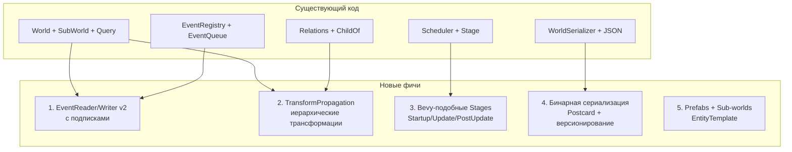
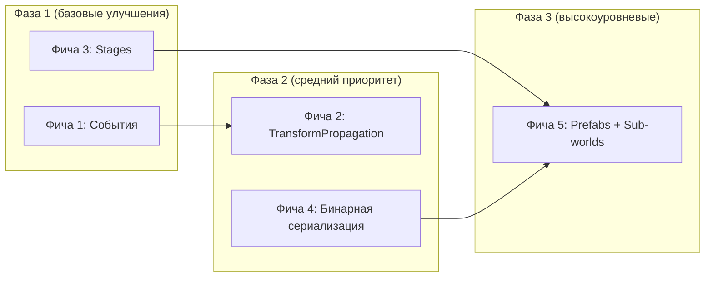

# План реализации 5 крупных фич для Apex ECS

> **Дата:** 2026-04-24
> **Контекст:** [`apex-core`](crates/apex-core/src/lib.rs), [`apex-scheduler`](crates/apex-scheduler/src/lib.rs), [`apex-serialization`](crates/apex-serialization/src/lib.rs)

---

## Общая архитектура изменений



---

## Фича 1: Система событий с подписками/читателями

### Текущее состояние

[`EventQueue<T>`](crates/apex-core/src/events.rs:4) — простой double buffer. [`EventReader<T>`](crates/apex-core/src/system_param.rs:110) — обёртка со `&EventQueue<T>`. Нет отслеживания позиции чтения. Нет per-entity событий. Нет задержанной доставки.

### Что нужно сделать

#### Шаг 1.1: `TrackedEventQueue<T>` с per-reader курсорами

- Заменить `Vec<T>` внутри на `Vec<T>` + счётчик `total_written: u32`
- Добавить `EventReaderId` — дескриптор, выдаваемый при создании читателя
- Каждый `EventReader<T>` хранит `last_read_counter: u32` — сколько событий он уже прочитал из `total_written`
- `iter()` возвращает только события с `last_read_counter..total_written`
- **Автоматическая очистка**: когда все зарегистрированные читатели одного типа продвинули свои курсоры за самое старое непрочитанное событие, оно удаляется

**Файлы**: [`events.rs`](crates/apex-core/src/events.rs), [`system_param.rs`](crates/apex-core/src/system_param.rs), [`world.rs`](crates/apex-core/src/world.rs)

#### Шаг 1.2: События, адресованные конкретным сущностям

- Добавить `EntityEvent<T>` — обёртка, содержащая `target: Entity` и `data: T`
- Добавить фильтр в `EventReader<T>`: `.iter_for_entity(entity)` → только события для данной entity
- Добавить `EventReader::iter_unread()` — все непрочитанные события (для мультикаст-сценариев)
- Добавить `EventWriter::send_to(entity, event)` — отправка конкретной сущности

**Файлы**: [`events.rs`](crates/apex-core/src/events.rs), [`system_param.rs`](crates/apex-core/src/system_param.rs)

#### Шаг 1.3: Задержанная доставка (Delayed Events)

- Добавить `DelayedEventQueue<T>` — хранит события с `deliver_tick: u32`
- Добавить `EventWriter::send_delayed(event, delay_in_ticks)` — отправить с задержкой
- В `EventRegistry::update_all()` дополнительно проверять: если `current_tick >= deliver_tick`, перемещать в `current` буфер
- Интегрировать в `world.tick()` — автоматический процессинг задержанных событий

**Файлы**: [`events.rs`](crates/apex-core/src/events.rs), [`world.rs`](crates/apex-core/src/world.rs)

#### Шаг 1.4: Подписки на типы событий с контролем порядка

- Добавить `EventSubscriber<T>` — реестр подписчиков с приоритетом (u32), которые вызываются в порядке возрастания приоритета при отправке события
- Альтернатива: интеграция с Scheduler — система декларирует `reads_events::<MyEvent>()`, планировщик строит граф зависимостей между читателями одного типа событий
- Реализовать через `AccessDescriptor`: добавить `reads_events: Vec<TypeId>`, `writes_events: Vec<TypeId>`

**Файлы**: [`access.rs`](crates/apex-core/src/access.rs), [`scheduler`](crates/apex-scheduler/src/lib.rs)

### Тесты для фичи 1

- reader создаёт правильный курсор, итерация даёт только новые события
- два reader-а читают независимо
- автоматическая очистка после прочтения всеми
- `send_to(entity)` → `iter_for_entity(entity)` находит событие
- delayed event доставляется ровно через N тиков
- очистка старых событий не удаляет непрочитанные другими reader-ами

---

## Фича 2: Иерархические трансформации (TransformPropagation)

### Текущее состояние

Есть [`ChildOf`](crates/apex-core/src/relations.rs:543) relation, [`children_of()`](crates/apex-core/src/relations.rs:407), [`despawn_recursive()`](crates/apex-core/src/relations.rs:437). Нет автоматического распространения трансформаций.

### Что нужно сделать

#### Шаг 2.1: Компоненты `LocalTransform` и `GlobalTransform`

- Определить `LocalTransform` (положение, поворот, масштаб) как `Component`
- Определить `GlobalTransform` (итоговая мировая матрица 4x4) как `Component`
- `GlobalTransform` — не сериализуемый runtime-компонент, пересчитывается из `LocalTransform`

#### Шаг 2.2: Dirty-флаг для инкрементального пересчёта

- Добавить `TransformDirty` — маркерный компонент (или битовый флаг на entity)
- При изменении `LocalTransform` у родителя, все дети (рекурсивно) помечаются `TransformDirty`
- Система `propagate_transforms` обрабатывает только `TransformDirty` сущности, снимает флаг после пересчёта

#### Шаг 2.3: Система `TransformPropagationSystem`

- Sequential-система, выполняющаяся в `PostUpdate`
- Алгоритм:
  1. Собрать корневые entity (родители без ChildOf)
  2. BFS/DFS обход: для каждой entity вычислить `GlobalTransform = parent.GlobalTransform * child.LocalTransform`
  3. Параллельная обработка независимых поддеревьев через `rayon`
- Добавить `PropagatedChildren` ресурс для кеширования топологически отсортированного порядка обхода

#### Шаг 2.4: Интеграция с Scheduler

- Зарегистрировать `propagate_transforms` как встроенную систему
- Плагин `TransformPlugin` — конфигурируемый: можно включить/выключить, задать порядок

**Файлы**: новый модуль [`crates/apex-core/src/transform.rs`], [`relations.rs`](crates/apex-core/src/relations.rs), [`world.rs`](crates/apex-core/src/world.rs), [`scheduler`](crates/apex-scheduler/src/lib.rs)

### Тесты для фичи 2

- одна entity без ChildOf: GlobalTransform == LocalTransform
- цепочка parent→child→grandchild: перемножение корректно
- изменение LocalTransform родителя → все дети пересчитаны
- dirty-флаг снимается после пропагации
- параллельный пересчёт независимых поддеревьев

---

## Фича 3: Bevy-подобные Stages (Startup, Update, PostUpdate…)

### Текущее состояние

[`Scheduler`](crates/apex-scheduler/src/lib.rs) имеет внутренние Stage (группы параллельных систем). [`Stage`](crates/apex-scheduler/src/stage.rs) — простая структура с `system_ids` и `all_parallel`. Нет именованных фаз.

### Что нужно сделать

#### Шаг 3.1: `StageLabel` — именованные этапы

- Определить enum `StageLabel` с общепринятыми фазами:
  ```rust
  pub enum StageLabel {
      Startup,    // однократный запуск
      First,      // до всего
      PreUpdate,  // обработка ввода
      Update,     // основная логика
      PostUpdate, // трансформации, физика
      Last,       // финальная обработка
  }
  ```
- Каждая система регистрируется с меткой этапа: `sched.add_system(Update, "move", MoveSystem)`
- На каждый этап может быть несколько систем, выполняющихся параллельно

#### Шаг 3.2: `StageConfig` — конфигурация этапов

- Возможность добавлять кастомные этапы: `sched.add_stage("CustomStage")`
- Возможность задавать порядок этапов: `sched.configure_stages([First, PreUpdate, Update, PostUpdate, Last])`
- Автоматическое построение графа зависимостей между этапами (все системы этапа N завершаются до начала этапа N+1)

#### Шаг 3.3: Startup-этап

- `Startup` — выполняется один раз при первом `run()`
- После отработки помечается как `completed`, при следующих `run()` пропускается
- Системы регистрируются как `sched.add_startup_system("init", InitSystem)`

#### Шаг 3.4: Миграция Scheduler

- Внутренняя структура планировщика: `HashMap<StageLabel, Vec<Stage>>`
- `compile()` строит граф отдельно для каждого этапа, затем объединяет этапы в общий порядок
- `debug_plan()` показывает этапы и системы внутри каждого

**Файлы**: [`stage.rs`](crates/apex-scheduler/src/stage.rs), [`lib.rs`](crates/apex-scheduler/src/lib.rs), новый модуль `stage_label.rs`

### Тесты для фичи 3

- система в Update не видит событий из PostUpdate (порядок гарантирован)
- Startup-система выполняется ровно один раз
- кастомный этап вставляется между стандартными
- системы внутри одного этапа параллельны, если нет конфликтов

---

## Фича 4: Бинарные форматы для быстрых сохранений

### Текущее состояние

[`WorldSerializer`](crates/apex-serialization/src/serializer.rs) → [`WorldSnapshot`](crates/apex-serialization/src/snapshot.rs) → JSON. Только текстовый формат.

### Что нужно сделать

#### Шаг 4.1: Добавить зависимость `postcard` или собственный бинарный формат

- Предлагается **Postcard** — компактный, быстрый, serde-совместимый, `#[no_std]`
- Добавить в [`Cargo.toml`](Cargo.toml) workspace-зависимость `postcard`
- Либо (для максимальной скорости) написать свой `RawBinaryFormat` — прямой дамп колонок в байты

#### Шаг 4.2: `WorldSnapshot::to_binary()` / `from_binary()`

- Добавить методы в [`snapshot.rs`](crates/apex-serialization/src/snapshot.rs):
  ```rust
  impl WorldSnapshot {
      fn to_postcard(&self) -> Result<Vec<u8>>;
      fn from_postcard(data: &[u8]) -> Result<Self>;
      fn to_bincode(&self) -> Result<Vec<u8>>;
      fn from_bincode(data: &[u8]) -> Result<Self>;
  }
  ```
- Опционально: сжатие `zstd` / `lz4` для ещё меньшего размера

#### Шаг 4.3: Версионирование и миграция

- Добавить `SnapshotVersion` — структура с мажорной/минорной версией
- При `from_postcard()` проверять версию, при несовпадении — вызывать `migrate_v1_to_v2()`
- Миграция — цепочка функций: `Fn(&mut WorldSnapshot) -> Result<()>`

#### Шаг 4.4: Инкрементальные сохранения (diff)

- Добавить `WorldDiff` — структура, содержащая только изменения с последнего снэпшота
- `WorldSerializer::diff(old_snapshot, new_world) -> WorldDiff`
- `WorldSerializer::apply_diff(world, diff) -> Result<()>`
- `WorldDiff` сериализуется в Postcard

#### Шаг 4.5: Потоковая запись/чтение

- `WorldSerializer::write_to_file(path, &snapshot, format)` — запись напрямую на диск
- `WorldSerializer::read_from_file(path) -> WorldSnapshot`
- Поддержка `BufWriter`/`BufReader` для эффективного I/O

**Файлы**: [`serializer.rs`](crates/apex-serialization/src/serializer.rs), [`snapshot.rs`](crates/apex-serialization/src/snapshot.rs), [`lib.rs`](crates/apex-serialization/src/lib.rs), новый файл `diff.rs`

### Тесты для фичи 4

- roundtrip: serialize → deserialize даёт ту же структуру
- бинарный формат в 5-10x меньше JSON для одного и того же мира
- `from_binary` на порядок быстрее `from_json`
- версионирование: старая версия вызывает миграцию
- diff-patch: diff + apply восстанавливает состояние

---

## Фича 5: Prefabs, EntityTemplate, Sub-worlds

### Текущее состояние

[`spawn_bundle`](crates/apex-core/src/world.rs), [`spawn_many`](crates/apex-core/src/world.rs). [`SubWorld`](crates/apex-core/src/sub_world.rs) — только для параллелизма. Нет шаблонов/префабов.

### Что нужно сделать

#### Шаг 5.1: `EntityTemplate` — параметризованный шаблон

- Определить трейт `EntityTemplate`:
  ```rust
  pub trait EntityTemplate: Send + Sync {
      fn spawn(&self, world: &mut World, params: &TemplateParams) -> Entity;
  }
  ```
- `TemplateParams` — `HashMap<String, Box<dyn Any>>` для переопределения полей
- Зарегистрировать шаблон: `world.register_template("Monster", MonsterTemplate)`
- Создать из шаблона: `world.spawn_from_template("Monster", &params)`

#### Шаг 5.2: Prefab-формат (JSON / бинарный)

- Определить `PrefabManifest` — десериализуемая структура:
  ```json
  {
    "name": "Monster",
    "components": {
      "Position": [0, 0, 0],
      "Health": 100,
      "Mesh": "orc.mesh",
      "AIBehaviour": "patrol"
    },
    "children": ["weapon.prefab", "helmet.prefab"]
  }
  ```
- `PrefabLoader` загружает манифест, рекурсивно создаёт entity + children + relations
- Поддержка переопределения полей при загрузке

#### Шаг 5.3: Prefab-система AssetRegistry

- Интеграция с [`apex-hot-reload`](crates/apex-hot-reload/src/asset_registry.rs)
- Prefab кешируется после первой загрузки
- Hot-reload prefab-файлов: при изменении файла пересоздаются entity из этого префаба
- Поддержка вложенности: prefab может ссылаться на другой prefab

#### Шаг 5.4: Настоящие Sub-worlds

- Разделить концепции:
  - **SubWorld** (существующий) → переименовать в `ArchetypeSubset` (только для параллелизма)
  - **IsolatedWorld** → новый тип, полноценный `World` + `Scheduler` в одной структуре
- `IsolatedWorld`:
  ```rust
  pub struct IsolatedWorld {
      world: World,
      scheduler: Scheduler,
  }
  impl IsolatedWorld {
      fn new() -> Self;
      fn tick(&mut self);
      fn read_resource<T>(&self) -> Option<&T>;
      fn send_event<T>(&mut self, event: T);
  }
  ```

#### Шаг 5.5: Мосты между мирами (WorldBridge)

- `WorldBridge` — канал для обмена событиями/ресурсами между `IsolatedWorld` и основным `World`
- Реализация: `crossbeam_channel` или самодельный lock-free queue
- В основном мире — система `SyncBridgeSystem`, которая применяет события из дочерних миров

**Файлы**: новый модуль [`crates/apex-core/src/prefab.rs`], новый крейт или модуль [`crates/apex-core/src/isolated_world.rs`], [`sub_world.rs`](crates/apex-core/src/sub_world.rs), [`asset_registry.rs`](crates/apex-hot-reload/src/asset_registry.rs)

### Тесты для фичи 5

- `spawn_from_template("Monster")` создаёт entity со всеми указанными компонентами
- prefab с children создаёт иерархию ChildOf
- переопределение поля Position при спавне работает
- hot-reload prefab вызывает пересоздание entity
- `IsolatedWorld::tick()` не влияет на основной мир
- WorldBridge доставляет событие из дочернего мира в основной

---

## Приоритет и зависимости



**Рекомендуемый порядок реализации:**

1. **Фича 1** (события + подписки) — фундамент, от которого зависит удобство остальных фич
2. **Фича 3** (Stages) — улучшение планировщика, нужно для правильного порядка TransformPropagation
3. **Фича 2** (TransformPropagation) — использует Stages (PostUpdate) и Events
4. **Фича 4** (бинаризация) — независима, но полезна для Prefab
5. **Фича 5** (Prefabs + Sub-worlds) — венец, опирается на всё выше

---

## Оценка объёма работ (без временных оценок)

| Фича | Новых файлов | Изменяемых файлов | Сложность |
|------|-------------|-------------------|-----------|
| 1. События v2 | 0-1 | 4-5 | Средняя |
| 2. TransformPropagation | 2-3 | 3-4 | Средняя |
| 3. Stages | 1-2 | 2-3 | Средняя |
| 4. Бинарная сериализация | 1-2 | 3-4 | Низкая-Средняя |
| 5. Prefabs + Sub-worlds | 3-4 | 4-5 | Высокая |
