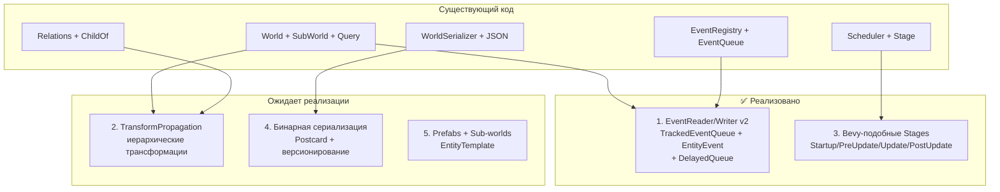
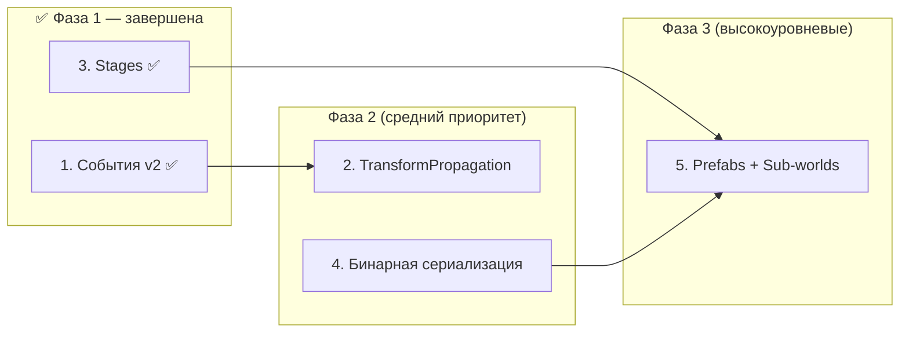

# План реализации 5 крупных фич для Apex ECS

> **Дата:** 2026-04-24
> **Статус:** Фича 1 ✅, Фича 3 ✅ — реализованы и протестированы
> **Контекст:** [`apex-core`](crates/apex-core/src/lib.rs), [`apex-scheduler`](crates/apex-scheduler/src/lib.rs), [`apex-serialization`](crates/apex-serialization/src/lib.rs)

---

## Общая архитектура изменений



---

## Фича 1: Система событий с подписками/читателями ✅ РЕАЛИЗОВАНО

### Исходное состояние

[`EventQueue<T>`](crates/apex-core/src/events.rs:4) — простой double buffer. [`EventReader<T>`](crates/apex-core/src/system_param.rs:110) — обёртка со `&EventQueue<T>`. Нет отслеживания позиции чтения. Нет per-entity событий. Нет задержанной доставки.

### Что реализовано

#### Шаг 1.1: `TrackedEventQueue<T>` с per-reader курсорами ✅

- [`TrackedEventQueue<T>`](crates/apex-core/src/events.rs:33-258) — очередь событий с отслеживанием прочитанного
- [`EventCursor`](crates/apex-core/src/events.rs:20-31) — дескриптор читателя, выдаётся через `add_reader()`
- [`EventRegistry`](crates/apex-core/src/events.rs:443-527) — `add_reader`, `remove_reader`, `update_all`
- Backward-compat методы: `get<T>`, `get_mut<T>`, `try_get<T>`, `try_get_mut<T>`, `get_raw_ptr<T>`
- **Автоматическая очистка**: когда все читатели продвинули курсоры за самое старое событие, оно удаляется
- [`EventReader<T>`](crates/apex-core/src/system_param.rs:99-121) — system-param обёртка с курсором
- [`EventWriter<T>`](crates/apex-core/src/system_param.rs:124-143) — system-param обёртка

#### Шаг 1.2: События, адресованные конкретным сущностям ✅

- [`EntityEvent<T>`](crates/apex-core/src/events.rs:290-301) — обёртка с `target: Entity` и `data: T`
- `EventWriter::send_to(entity, event)` — отправка конкретной сущности
- `EventReader::iter_for_entity(entity)` — чтение событий для entity
- `EventReader::iter_unread()` — все непрочитанные

#### Шаг 1.3: Задержанная доставка (Delayed Events) ✅

- [`DelayedQueue<T>`](crates/apex-core/src/events.rs:317-382) — очередь с `deliver_tick`
- `EventRegistry::update_all()` — процессинг задержанных (перенос в current buffer при наступлении tick)
- `flush_delayed()` — интеграция с `Tick`

#### Шаг 1.4: Подписки на типы событий с контролем порядка ❌

> **Не реализовано.** Пункт описывал интеграцию с Scheduler через `AccessDescriptor` (система декларирует `reads_events::<MyEvent>()`, планировщик строит граф зависимостей между читателями). Отложено до необходимости.

### Тесты для фичи 1

- ✅ `send_and_read` — базовая отправка/чтение
- ✅ `two_readers_independent` — два reader читают независимо
- ✅ `reader_removed_still_works` — удаление reader не ломает других
- ✅ `entity_event_send_and_read` — EntityEvent
- ✅ `delayed_event_delivery` — delayed event доставляется ровно через N тиков
- ✅ `delayed_event_varying_delays` — разная задержка
- ✅ `clear_resets_everything` — очистка
- ✅ `multiple_updates_cycle` — многократные update()

### Примеры

- [`basic.rs`](crates/apex-examples/examples/basic.rs:115-132) — `damage_apply` читает `DamageEvent` через `EventReader`
- [`perf.rs`](crates/apex-examples/examples/perf.rs:828-884) — бенчмарки: `send + iter_current` (114M ops/s), `send→tick→iter_prev`, `send_batch` (660M ops/s)

---

## Фича 2: Иерархические трансформации (TransformPropagation) ⏳ ОЖИДАЕТ

### Текущее состояние

Есть [`ChildOf`](crates/apex-core/src/relations.rs:543) relation, [`children_of()`](crates/apex-core/src/relations.rs:407), [`despawn_recursive()`](crates/apex-core/src/relations.rs:437). Нет автоматического распространения трансформаций.

### Что нужно сделать

#### Шаг 2.1: Компоненты `LocalTransform` и `GlobalTransform`

- Определить `LocalTransform` (положение, поворот, масштаб) как `Component`
- Определить `GlobalTransform` (итоговая мировая матрица 4x4) как `Component`
- `GlobalTransform` — не сериализуемый runtime-компонент, пересчитывается из `LocalTransform`

#### Шаг 2.2: Dirty-флаг для инкрементального пересчёта

- Добавить `TransformDirty` — маркерный компонент (или битовый флаг на entity)
- При изменении `LocalTransform` у родителя, все дети (рекурсивно) помечаются `TransformDirty`
- Система `propagate_transforms` обрабатывает только `TransformDirty` сущности, снимает флаг после пересчёта

#### Шаг 2.3: Система `TransformPropagationSystem`

- Sequential-система, выполняющаяся в `PostUpdate`
- Алгоритм:
  1. Собрать корневые entity (родители без ChildOf)
  2. BFS/DFS обход: для каждой entity вычислить `GlobalTransform = parent.GlobalTransform * child.LocalTransform`
  3. Параллельная обработка независимых поддеревьев через `rayon`
- Добавить `PropagatedChildren` ресурс для кеширования топологически отсортированного порядка обхода

#### Шаг 2.4: Интеграция с Scheduler

- Зарегистрировать `propagate_transforms` как встроенную систему
- Плагин `TransformPlugin` — конфигурируемый: можно включить/выключить, задать порядок

**Файлы**: новый модуль [`crates/apex-core/src/transform.rs`], [`relations.rs`](crates/apex-core/src/relations.rs), [`world.rs`](crates/apex-core/src/world.rs), [`scheduler`](crates/apex-scheduler/src/lib.rs)

### Тесты для фичи 2

- одна entity без ChildOf: GlobalTransform == LocalTransform
- цепочка parent→child→grandchild: перемножение корректно
- изменение LocalTransform родителя → все дети пересчитаны
- dirty-флаг снимается после пропагации
- параллельный пересчёт независимых поддеревьев

---

## Фича 3: Bevy-подобные Stages (Startup, Update, PostUpdate…) ✅ РЕАЛИЗОВАНО

### Исходное состояние

[`Scheduler`](crates/apex-scheduler/src/lib.rs) имеет внутренние Stage (группы параллельных систем). [`Stage`](crates/apex-scheduler/src/stage.rs) — простая структура с `system_ids` и `all_parallel`. Нет именованных фаз.

### Что реализовано

#### Шаг 3.1: `StageLabel` — именованные этапы ✅

- [`StageLabel`](crates/apex-scheduler/src/stage.rs:9-51) — enum с вариантами:
  ```rust
  pub enum StageLabel {
      Startup,    // однократный запуск
      PreUpdate,  // перед обновлением
      Update,     // основная логика
      PostUpdate, // трансформации, физика, пост-обработка
      Custom(&'static str), // кастомные этапы
  }
  ```
- Фиксированный порядок: `[Startup, PreUpdate, Update, PostUpdate]`
- Системы регистрируются с меткой этапа: `sched.add_system_to_stage(StageLabel::Update, "move", move_system)`
- Каждый этап может содержать несколько систем, выполняющихся параллельно

#### Шаг 3.2: `StageConfig` — конфигурация этапов ⚠️ ЧАСТИЧНО

- ✅ Добавлен `StageLabel::Custom(&'static str)` для кастомных этапов
- ❌ `configure_stages()` для переопределения порядка не реализован — порядок фиксирован в `StageLabel::standard_order()`

#### Шаг 3.3: Startup-этап ✅

- `add_startup_system`, `add_startup_auto_system`, `add_startup_par_system`, `add_startup_fn_par_system`
- Startup выполняется один раз при первом `run()`
- При следующих `run()` Startup-системы пропускаются

#### Шаг 3.4: Миграция Scheduler ✅

- `compile()` — полная перестройка: системы группируются по стадиям, топологическая сортировка внутри каждой стадии
- Sequential barriers между стадиями: все системы стадии N завершаются до начала стадии N+1
- [Автоматическая защита от циклов](crates/apex-scheduler/src/lib.rs:837-966): BFS-проверка `has_path(to, from)` перед добавлением каждого ребра
- `debug_plan()` / `debug_plan_verbose()` — отображение стадий и систем
- Первый compile — full, последующие — incremental (только при добавлении систем)

### Тесты для фичи 3

- ✅ `stage_label_in_debug_plan` — StageLabel отображается в debug_plan
- ✅ `add_system_to_stage_custom_label` — кастомный StageLabel
- ✅ `startup_system_runs_once` — Startup-система выполняется 1 раз
- ✅ `startup_auto_system` — AutoSystem в Startup
- ✅ `startup_system_works_via_run` — run() выполняет Startup
- + 13 других тестов (ordering, barriers, conflicts, circular_dependency_detected)

### Примеры

- [`basic.rs`](crates/apex-examples/examples/basic.rs:221-378) — полноценный пример со всеми 4 стадиями:
  - `Startup`: `init_resources` + `spawn_player`
  - `PreUpdate`: `movement` (AutoSystem)
  - `Update`: `health_clamp`, `physics`, `enemy_ai`
  - `PostUpdate`: `damage_apply → despawn_dead → stats_update`
- [`perf.rs`](crates/apex-examples/examples/perf.rs:486-590) — бенчмарки планировщика

### Дополнительно: Баги, исправленные в процессе

- [`CircularDependency`](crates/apex-scheduler/src/lib.rs:776-982) — добавлен `has_path(to, from)` BFS для предотвращения циклических зависимостей между стадиями при автоматическом добавлении конфликтных рёбер
- [Null pointer dereference](crates/apex-core/src/query.rs:44-46) для ZST — `Read<T>::fetch_state` и `Write<T>::fetch_state` теперь используют `Column::get_ptr(0)` вместо прямого доступа к `Column::data`

---

## Фича 4: Бинарные форматы для быстрых сохранений ⏳ ОЖИДАЕТ

### Текущее состояние

[`WorldSerializer`](crates/apex-serialization/src/serializer.rs) → [`WorldSnapshot`](crates/apex-serialization/src/snapshot.rs) → JSON. Только текстовый формат.

### Что нужно сделать

#### Шаг 4.1: Добавить зависимость `postcard` или собственный бинарный формат

- Предлагается **Postcard** — компактный, быстрый, serde-совместимый, `#[no_std]`
- Добавить в [`Cargo.toml`](Cargo.toml) workspace-зависимость `postcard`
- Либо (для максимальной скорости) написать свой `RawBinaryFormat` — прямой дамп колонок в байты

#### Шаг 4.2: `WorldSnapshot::to_binary()` / `from_binary()`

- Добавить методы в [`snapshot.rs`](crates/apex-serialization/src/snapshot.rs):
  ```rust
  impl WorldSnapshot {
      fn to_postcard(&self) -> Result<Vec<u8>>;
      fn from_postcard(data: &[u8]) -> Result<Self>;
      fn to_bincode(&self) -> Result<Vec<u8>>;
      fn from_bincode(data: &[u8]) -> Result<Self>;
  }
  ```
- Опционально: сжатие `zstd` / `lz4` для ещё меньшего размера

#### Шаг 4.3: Версионирование и миграция

- Добавить `SnapshotVersion` — структура с мажорной/минорной версией
- При `from_postcard()` проверять версию, при несовпадении — вызывать `migrate_v1_to_v2()`
- Миграция — цепочка функций: `Fn(&mut WorldSnapshot) -> Result<()>`

#### Шаг 4.4: Инкрементальные сохранения (diff)

- Добавить `WorldDiff` — структура, содержащая только изменения с последнего снэпшота
- `WorldSerializer::diff(old_snapshot, new_world) -> WorldDiff`
- `WorldSerializer::apply_diff(world, diff) -> Result<()>`
- `WorldDiff` сериализуется в Postcard

#### Шаг 4.5: Потоковая запись/чтение

- `WorldSerializer::write_to_file(path, &snapshot, format)` — запись напрямую на диск
- `WorldSerializer::read_from_file(path) -> WorldSnapshot`
- Поддержка `BufWriter`/`BufReader` для эффективного I/O

**Файлы**: [`serializer.rs`](crates/apex-serialization/src/serializer.rs), [`snapshot.rs`](crates/apex-serialization/src/snapshot.rs), [`lib.rs`](crates/apex-serialization/src/lib.rs), новый файл `diff.rs`

### Тесты для фичи 4

- roundtrip: serialize → deserialize даёт ту же структуру
- бинарный формат в 5-10x меньше JSON для одного и того же мира
- `from_binary` на порядок быстрее `from_json`
- версионирование: старая версия вызывает миграцию
- diff-patch: diff + apply восстанавливает состояние

---

## Фича 5: Prefabs, EntityTemplate, Sub-worlds ⏳ ОЖИДАЕТ

### Текущее состояние

[`spawn_bundle`](crates/apex-core/src/world.rs), [`spawn_many`](crates/apex-core/src/world.rs). [`SubWorld`](crates/apex-core/src/sub_world.rs) — только для параллелизма. Нет шаблонов/префабов.

### Что нужно сделать

#### Шаг 5.1: `EntityTemplate` — параметризованный шаблон

- Определить трейт `EntityTemplate`:
  ```rust
  pub trait EntityTemplate: Send + Sync {
      fn spawn(&self, world: &mut World, params: &TemplateParams) -> Entity;
  }
  ```
- `TemplateParams` — `HashMap<String, Box<dyn Any>>` для переопределения полей
- Зарегистрировать шаблон: `world.register_template("Monster", MonsterTemplate)`
- Создать из шаблона: `world.spawn_from_template("Monster", &params)`

#### Шаг 5.2: Prefab-формат (JSON / бинарный)

- Определить `PrefabManifest` — десериализуемая структура:
  ```json
  {
    "name": "Monster",
    "components": {
      "Position": [0, 0, 0],
      "Health": 100,
      "Mesh": "orc.mesh",
      "AIBehaviour": "patrol"
    },
    "children": ["weapon.prefab", "helmet.prefab"]
  }
  ```
- `PrefabLoader` загружает манифест, рекурсивно создаёт entity + children + relations
- Поддержка переопределения полей при загрузке

#### Шаг 5.3: Prefab-система AssetRegistry

- Интеграция с [`apex-hot-reload`](crates/apex-hot-reload/src/asset_registry.rs)
- Prefab кешируется после первой загрузки
- Hot-reload prefab-файлов: при изменении файла пересоздаются entity из этого префаба
- Поддержка вложенности: prefab может ссылаться на другой prefab

#### Шаг 5.4: Настоящие Sub-worlds

- Разделить концепции:
  - **SubWorld** (существующий) → переименовать в `ArchetypeSubset` (только для параллелизма)
  - **IsolatedWorld** → новый тип, полноценный `World` + `Scheduler` в одной структуре
- `IsolatedWorld`:
  ```rust
  pub struct IsolatedWorld {
      world: World,
      scheduler: Scheduler,
  }
  impl IsolatedWorld {
      fn new() -> Self;
      fn tick(&mut self);
      fn read_resource<T>(&self) -> Option<&T>;
      fn send_event<T>(&mut self, event: T);
  }
  ```

#### Шаг 5.5: Мосты между мирами (WorldBridge)

- `WorldBridge` — канал для обмена событиями/ресурсами между `IsolatedWorld` и основным `World`
- Реализация: `crossbeam_channel` или самодельный lock-free queue
- В основном мире — система `SyncBridgeSystem`, которая применяет события из дочерних миров

**Файлы**: новый модуль [`crates/apex-core/src/prefab.rs`], новый крейт или модуль [`crates/apex-core/src/isolated_world.rs`], [`sub_world.rs`](crates/apex-core/src/sub_world.rs), [`asset_registry.rs`](crates/apex-hot-reload/src/asset_registry.rs)

### Тесты для фичи 5

- `spawn_from_template("Monster")` создаёт entity со всеми указанными компонентами
- prefab с children создаёт иерархию ChildOf
- переопределение поля Position при спавне работает
- hot-reload prefab вызывает пересоздание entity
- `IsolatedWorld::tick()` не влияет на основной мир
- WorldBridge доставляет событие из дочернего мира в основной

---

## Приоритет и зависимости



**Рекомендуемый порядок реализации:**

1. ✅ **Фича 1** (события v2) — фундамент
2. ✅ **Фича 3** (Stages) — улучшение планировщика
3. ⏳ **Фича 2** (TransformPropagation) — использует Stages (PostUpdate) и Relations (ChildOf)
4. ⏳ **Фича 4** (бинаризация) — независима, но полезна для Prefab
5. ⏳ **Фича 5** (Prefabs + Sub-worlds) — венец, опирается на всё выше

---

## Оценка объёма работ (без временных оценок)

| Фича | Статус | Новых файлов | Изменяемых файлов | Сложность |
|------|--------|-------------|-------------------|-----------|
| 1. События v2 | ✅ Реализовано | 0 | 5 | Средняя |
| 2. TransformPropagation | ⏳ Ожидает | 2-3 | 3-4 | Средняя |
| 3. Stages | ✅ Реализовано | 1 | 3 | Средняя |
| 4. Бинарная сериализация | ⏳ Ожидает | 1-2 | 3-4 | Низкая-Средняя |
| 5. Prefabs + Sub-worlds | ⏳ Ожидает | 3-4 | 4-5 | Высокая |
