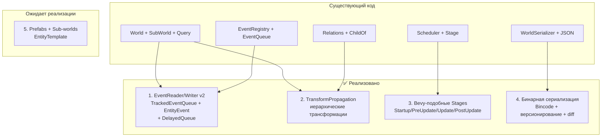
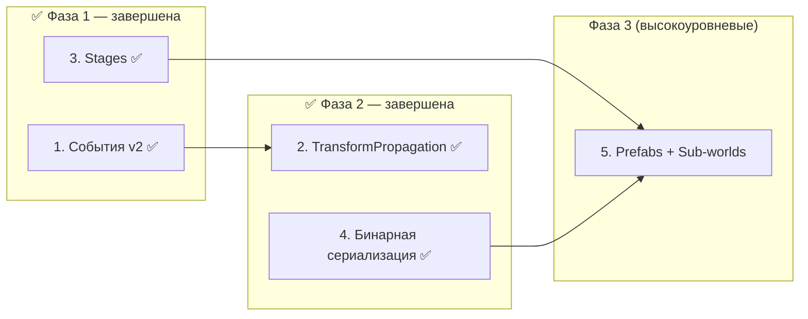

# План реализации 5 крупных фич для Apex ECS

> **Дата:** 2026-04-24
> **Статус:** Фича 1 ✅, Фича 2 ✅, Фича 3 ✅, Фича 4 ✅ — реализованы и протестированы
> **Контекст:** [`apex-core`](crates/apex-core/src/lib.rs), [`apex-scheduler`](crates/apex-scheduler/src/lib.rs), [`apex-serialization`](crates/apex-serialization/src/lib.rs)

---

## Общая архитектура изменений



---

## Фича 1: Система событий с подписками/читателями ✅ РЕАЛИЗОВАНО

### Исходное состояние

[`EventQueue<T>`](crates/apex-core/src/events.rs:4) — простой double buffer. [`EventReader<T>`](crates/apex-core/src/system_param.rs:110) — обёртка со `&EventQueue<T>`. Нет отслеживания позиции чтения. Нет per-entity событий. Нет задержанной доставки.

### Что реализовано

#### Шаг 1.1: `TrackedEventQueue<T>` с per-reader курсорами ✅

- [`TrackedEventQueue<T>`](crates/apex-core/src/events.rs:33-258) — очередь событий с отслеживанием прочитанного
- [`EventCursor`](crates/apex-core/src/events.rs:20-31) — дескриптор читателя, выдаётся через `add_reader()`
- [`EventRegistry`](crates/apex-core/src/events.rs:443-527) — `add_reader`, `remove_reader`, `update_all`
- Backward-compat методы: `get<T>`, `get_mut<T>`, `try_get<T>`, `try_get_mut<T>`, `get_raw_ptr<T>`
- **Автоматическая очистка**: когда все читатели продвинули курсоры за самое старое событие, оно удаляется
- [`EventReader<T>`](crates/apex-core/src/system_param.rs:99-121) — system-param обёртка с курсором
- [`EventWriter<T>`](crates/apex-core/src/system_param.rs:124-143) — system-param обёртка

#### Шаг 1.2: События, адресованные конкретным сущностям ✅

- [`EntityEvent<T>`](crates/apex-core/src/events.rs:290-301) — обёртка с `target: Entity` и `data: T`
- `EventWriter::send_to(entity, event)` — отправка конкретной сущности
- `EventReader::iter_for_entity(entity)` — чтение событий для entity
- `EventReader::iter_unread()` — все непрочитанные

#### Шаг 1.3: Задержанная доставка (Delayed Events) ✅

- [`DelayedQueue<T>`](crates/apex-core/src/events.rs:317-382) — очередь с `deliver_tick`
- `EventRegistry::update_all()` — процессинг задержанных (перенос в current buffer при наступлении tick)
- `flush_delayed()` — интеграция с `Tick`

#### Шаг 1.4: Event конфликты через AccessDescriptor ✅

- В [`AccessDescriptor`](crates/apex-core/src/access.rs:160-163) добавлены поля `reads_event: Vec<TypeId>` и `writes_event: Vec<TypeId>`
- Методы [`read_event<T>()`](crates/apex-core/src/access.rs:188) и [`write_event<T>()`](crates/apex-core/src/access.rs:195) — декларация доступа к событиям
- В [`ConflictKind`](crates/apex-scheduler/src/lib.rs:92-100) добавлены варианты `EventWriteWrite` и `EventWriteRead`
- [`detect_conflict_kind()`](crates/apex-scheduler/src/lib.rs:1437-1463) проверяет event-конфликты наравне с компонентными
- Правила: два EventWriter → конфликт (WriteWrite), EventWriter + EventReader → конфликт (WriteRead), два EventReader → нет конфликта
- 4 теста: `event_write_write_conflict`, `event_write_read_conflict`, `event_read_read_no_conflict`, `event_conflict_kind_in_edge_info`

### Тесты для фичи 1

- ✅ `send_and_read` — базовая отправка/чтение
- ✅ `two_readers_independent` — два reader читают независимо
- ✅ `reader_removed_still_works` — удаление reader не ломает других
- ✅ `entity_event_send_and_read` — EntityEvent
- ✅ `delayed_event_delivery` — delayed event доставляется ровно через N тиков
- ✅ `delayed_event_varying_delays` — разная задержка
- ✅ `clear_resets_everything` — очистка
- ✅ `multiple_updates_cycle` — многократные update()

### Примеры

- [`basic.rs`](crates/apex-examples/examples/basic.rs:115-132) — `damage_apply` читает `DamageEvent` через `EventReader`
- [`perf.rs`](crates/apex-examples/examples/perf.rs:828-884) — бенчмарки: `send + iter_current` (114M ops/s), `send→tick→iter_prev`, `send_batch` (660M ops/s)

---

## Фича 2: Иерархические трансформации (TransformPropagation) ✅ РЕАЛИЗОВАНО

### Исходное состояние

Есть [`ChildOf`](crates/apex-core/src/relations.rs:543) relation, [`children_of()`](crates/apex-core/src/relations.rs:407), [`despawn_recursive()`](crates/apex-core/src/relations.rs:437). Нет компонентов трансформаций и автоматического распространения.

### Что реализовано

#### Шаг 2.1: Компоненты `LocalTransform` и `GlobalTransform` ✅

- [`LocalTransform`](crates/apex-core/src/transform.rs:44-48) — `translation: Vec3`, `rotation: Quat`, `scale: Vec3`
- [`GlobalTransform`](crates/apex-core/src/transform.rs:99-100) — обёртка над `Mat4`, пересчитывается из `LocalTransform`
- `to_matrix()` — преобразует `LocalTransform` в аффинную матрицу 4x4
- Конструкторы: `from_translation()`, `from_rotation()`, `from_scale()`, `IDENTITY`, `Default`

#### Шаг 2.2: Dirty-флаг для инкрементального пересчёта ✅

- [`TransformDirty`](crates/apex-core/src/transform.rs:126-127) — маркерный компонент
- [`propagate_transforms()`](crates/apex-core/src/transform.rs:139-246) — sequential система:
  1. Собирает все entity с `TransformDirty` через `query_typed::<Read<TransformDirty>>()`
  2. Топологическая сортировка dirty entity (DFS: корни → листья)
  3. Для каждой dirty entity вычисляет `GlobalTransform = parent.Global * local.to_matrix()`
  4. Если нет родителя — `GlobalTransform = LocalTransform`
  5. Снимает `TransformDirty` после записи
  6. **Каскадирование dirty на детей**: итерация по `world.children_of(ChildOf, entity)`, вставка `TransformDirty` всем детям, добавление их в ordered-список для обработки в том же проходе
- Используется `while i < ordered.len()` вместо `for entity in ordered`, т.к. список динамически растёт при каскадировании

#### Шаг 2.3: Зависимость `glam` (математическая библиотека) ✅

- Добавлена `glam = "0.29"` в [`Cargo.toml`](Cargo.toml:48)
- Используется: `Vec3`, `Quat`, `Mat4` (`from_scale_rotation_translation`, `transform_point3`)

#### Шаг 2.4: `TransformPlugin` — регистрация компонентов ✅

- [`TransformPlugin::register_components(world)`](crates/apex-core/src/transform.rs:213-218) — регистрирует `LocalTransform`, `GlobalTransform`, `TransformDirty`
- Система `propagate_transforms` добавляется пользователем вручную:
  ```rust
  scheduler.add_system_to_stage(
      "propagate_transforms",
      apex_core::transform::propagate_transforms,
      StageLabel::PostUpdate,
  );
  ```
- Scheduler не импортируется (избегаем циклической зависимости apex-core ↔ apex-scheduler)

#### Шаг 2.5: `write_hooks` — автоматическая пометка TransformDirty при изменении LocalTransform ✅

- [`write_hooks: FxHashMap<ComponentId, fn(Entity, &mut World)>`](crates/apex-core/src/world.rs:152-155) — новое поле в `World`, хранит коллбэки на запись
- Использован `fn` pointer (Copy) вместо `Box<dyn Fn>`, чтобы избежать borrow conflict при вызове `hook(entity, self)`
- [`get_mut::<T>()`](crates/apex-core/src/world.rs:571-600) модифицирован:
  1. Обновляет `change_tick` (как и раньше)
  2. Копирует hook из `write_hooks` (fn pointer — Copy) и отпускает borrow
  3. Вызывает `hook(entity, self)`, если хук зарегистрирован
  4. Перепроверяет location (хук мог изменить archetype через `insert`) и возвращает `&mut T`
- [`register_write_hook::<T>()`](crates/apex-core/src/world.rs:602-614) — публичный метод для регистрации хука
- [`mark_local_transform_dirty`](crates/apex-core/src/transform.rs:270-274) — функция-хук: вызывает `world.insert(entity, TransformDirty)`
- Зарегистрирован в [`TransformPlugin::register_components()`](crates/apex-core/src/transform.rs:280-288):
  ```rust
  world.register_write_hook::<LocalTransform>(mark_local_transform_dirty);
  ```
- **Решает проблему Issue #1**: пользователь больше не должен вручную вставлять `TransformDirty` после `get_mut::<LocalTransform>()`

#### Шаг 2.6: Каскадирование TransformDirty на детей ✅

- В `propagate_transforms()`, после обработки dirty entity и снятия `TransformDirty`, выполняется каскадирование ([строки 228-242](crates/apex-core/src/transform.rs:228-242)):
  ```rust
  let children: Vec<Entity> = world.children_of(ChildOf, entity).collect();
  for child in children {
      if !world.is_alive(child) { continue; }
      if world.get::<TransformDirty>(child).is_none() {
          world.insert(child, TransformDirty);
          ordered.push(child);
      }
  }
  ```
- **Решает проблему Issue #2**: если пользователь изменил LocalTransform родителя, дети автоматически получают `TransformDirty` и их `GlobalTransform` пересчитывается в том же проходе `propagate_transforms`
- До исправления: пользователь должен был вручную пометить каждого ребёнка как dirty
- После исправления: достаточно изменить `LocalTransform` родителя через `get_mut`, остальное делается автоматически

**Файлы**: [`crates/apex-core/src/transform.rs`], [`crates/apex-core/src/world.rs`](crates/apex-core/src/world.rs), [`Cargo.toml`](Cargo.toml), [`crates/apex-core/Cargo.toml`](crates/apex-core/Cargo.toml), [`crates/apex-core/src/lib.rs`](crates/apex-core/src/lib.rs:13)

### Дополнительно: Баги, исправленные в процессе

- **Issue #1: Нет автоматической пометки TransformDirty** — добавлен механизм `write_hooks` в ядро `World`. При вызове `get_mut::<LocalTransform>()` хук `mark_local_transform_dirty` автоматически вставляет `TransformDirty`
- **Issue #2: Нет каскадирования dirty от родителя к детям** — в `propagate_transforms()` добавлен проход по `world.children_of(ChildOf, entity)` после обработки dirty entity. Все дети помечаются dirty и добавляются в ordered-список
- **Borrow checker conflict** — изначально использовался `Box<dyn Fn(Entity, &mut World)>`, но вызов `hook(entity, self)` конфликтовал с borrow `self.write_hooks.get()`. Решение: замена на `fn(Entity, &mut World)` (function pointer, Copy), копирование значения перед вызовом

### Тесты для фичи 2

- ✅ `local_transform_default_is_identity` — IDENTITY значения по умолчанию
- ✅ `local_transform_to_matrix` — `to_matrix()` корректно транслирует точку
- ✅ `global_transform_default_is_identity` — `GlobalTransform::default()` == `Mat4::IDENTITY`
- ✅ `propagate_single_entity_no_parent` — GlobalTransform == LocalTransform, TransformDirty снят
- ✅ `propagate_parent_child_chain` — parent(100,0,0) + child(10,0,0) → child.Global = (110,0,0)
- ✅ `propagate_deep_hierarchy` — grandparent(50) + parent(30) + child(20) → parent=80, child=100
- ✅ `no_transform_dirty_skips_propagation` — без TransformDirty GlobalTransform не меняется

### Примеры

- [`transform_example.rs`](crates/apex-examples/examples/transform_example.rs) — полноценный пример:
  - Создание иерархии Grandparent → Parent → Child
  - `TransformDirty` вставляется автоматически при spawn (через `EntityBuilder`)
  - Первый запуск `propagate_transforms` → все GlobalTransform корректны
  - Изменение `LocalTransform` родителя через `get_mut` → **write_hook** автоматически вставляет `TransformDirty`
  - Запуск `propagate_transforms` → **каскадирование** помечает Child dirty → Child.Global пересчитан
  - Все assertions проходят без единой ручной вставки `TransformDirty`

---

## Фича 3: Bevy-подобные Stages (Startup, Update, PostUpdate…) ✅ РЕАЛИЗОВАНО

### Исходное состояние

[`Scheduler`](crates/apex-scheduler/src/lib.rs) имеет внутренние Stage (группы параллельных систем). [`Stage`](crates/apex-scheduler/src/stage.rs) — простая структура с `system_ids` и `all_parallel`. Нет именованных фаз.

### Что реализовано

#### Шаг 3.1: `StageLabel` — именованные этапы ✅

- [`StageLabel`](crates/apex-scheduler/src/stage.rs:9-51) — enum с вариантами:
  ```rust
  pub enum StageLabel {
      Startup,    // однократный запуск
      PreUpdate,  // перед обновлением
      Update,     // основная логика
      PostUpdate, // трансформации, физика, пост-обработка
      Custom(&'static str), // кастомные этапы
  }
  ```
- Фиксированный порядок: `[Startup, PreUpdate, Update, PostUpdate]`
- Системы регистрируются с меткой этапа: `sched.add_system_to_stage(StageLabel::Update, "move", move_system)`
- Каждый этап может содержать несколько систем, выполняющихся параллельно

#### Шаг 3.2: `configure_stages()` — пользовательский порядок StageLabel ✅

- В [`Scheduler`](crates/apex-scheduler/src/lib.rs:314) добавлено поле `stage_order: Option<Vec<StageLabel>>`
- Метод [`configure_stages(order: Vec<StageLabel>)`](crates/apex-scheduler/src/lib.rs:535) — переопределение порядка этапов
- [`compile()`](crates/apex-scheduler/src/lib.rs:548) использует `stage_order` если задан, иначе `StageLabel::standard_order()` (как было)
- Стадии, не указанные в `order`, добавляются в конец автоматически
- 2 теста: `configure_stages_custom_order`, `configure_stages_keeps_missing_at_end`

#### Шаг 3.3: Startup-этап ✅

- `add_startup_system`, `add_startup_auto_system`, `add_startup_par_system`, `add_startup_fn_par_system`
- Startup выполняется один раз при первом `run()`
- При следующих `run()` Startup-системы пропускаются

#### Шаг 3.4: Миграция Scheduler ✅

- `compile()` — полная перестройка: системы группируются по стадиям, топологическая сортировка внутри каждой стадии
- Sequential barriers между стадиями: все системы стадии N завершаются до начала стадии N+1
- [Автоматическая защита от циклов](crates/apex-scheduler/src/lib.rs:837-966): BFS-проверка `has_path(to, from)` перед добавлением каждого ребра
- `debug_plan()` / `debug_plan_verbose()` — отображение стадий и систем
- Первый compile — full, последующие — incremental (только при добавлении систем)

### Тесты для фичи 3

- ✅ `stage_label_in_debug_plan` — StageLabel отображается в debug_plan
- ✅ `add_system_to_stage_custom_label` — кастомный StageLabel
- ✅ `startup_system_runs_once` — Startup-система выполняется 1 раз
- ✅ `startup_auto_system` — AutoSystem в Startup
- ✅ `startup_system_works_via_run` — run() выполняет Startup
- + 13 других тестов (ordering, barriers, conflicts, circular_dependency_detected)

### Примеры

- [`basic.rs`](crates/apex-examples/examples/basic.rs:221-378) — полноценный пример со всеми 4 стадиями:
  - `Startup`: `init_resources` + `spawn_player`
  - `PreUpdate`: `movement` (AutoSystem)
  - `Update`: `health_clamp`, `physics`, `enemy_ai`
  - `PostUpdate`: `damage_apply → despawn_dead → stats_update`
- [`perf.rs`](crates/apex-examples/examples/perf.rs:486-590) — бенчмарки планировщика

### Дополнительно: Баги, исправленные в процессе

- [`CircularDependency`](crates/apex-scheduler/src/lib.rs:776-982) — добавлен `has_path(to, from)` BFS для предотвращения циклических зависимостей между стадиями при автоматическом добавлении конфликтных рёбер
- [Null pointer dereference](crates/apex-core/src/query.rs:44-46) для ZST — `Read<T>::fetch_state` и `Write<T>::fetch_state` теперь используют `Column::get_ptr(0)` вместо прямого доступа к `Column::data`

---

## Фича 4: Бинарные форматы для быстрых сохранений ✅ РЕАЛИЗОВАНО

### Текущее состояние (до)

[`WorldSerializer`](crates/apex-serialization/src/serializer.rs) → [`WorldSnapshot`](crates/apex-serialization/src/snapshot.rs) → JSON. Только текстовый формат.

### Что реализовано

#### Шаг 4.1: Добавить зависимость `bincode` ✅

- [`bincode = "1.3"`](Cargo.toml:21) добавлена в workspace-зависимости в [`Cargo.toml`](Cargo.toml)
- [`bincode.workspace = true`](crates/apex-serialization/Cargo.toml:6) в [`apex-serialization/Cargo.toml`](crates/apex-serialization/Cargo.toml)

#### Шаг 4.2: `WorldSnapshot::to_bincode()` / `from_bincode()` ✅

- В [`snapshot.rs`](crates/apex-serialization/src/snapshot.rs:72-139):
  ```rust
  impl WorldSnapshot {
      fn to_json(&self) -> Result<Vec<u8>>;
      fn from_json(data: &[u8]) -> Result<Self>;
      fn to_bincode(&self) -> Result<Vec<u8>>;
      fn from_bincode(data: &[u8]) -> Result<Self>;
  }
  ```
- [`ComponentSnapshot`](crates/apex-serialization/src/snapshot.rs:160) хранит `data: Vec<u8>` + `format: DataFormat` (Json/Binary)
- Компоненты в JSON-формате (serde_fns.format == "json") → `ComponentSnapshot::new_json()` с `DataFormat::Json`
- Компоненты в бинарном формате → `ComponentSnapshot::new_binary()` с `DataFormat::Binary`
- Bincode НЕ используется для `serde_json::Value` — все данные хранятся как сырые байты

#### Шаг 4.3: Версионирование и миграция ✅

- [`SnapshotVersion`](crates/apex-serialization/src/snapshot.rs:21-38) — `{ major: u32, minor: u32 }`
- [`is_compatible_with()`](crates/apex-serialization/src/snapshot.rs:126-130) — проверка: same major + minor >= expected
- [`migrate()`](crates/apex-serialization/src/snapshot.rs:115-123) — цепочка вызовов `migration_for(v)`, пока `version < CURRENT_VERSION`
- [`migration_for()`](crates/apex-serialization/src/snapshot.rs:213-220) — регистрация функций миграции по версии: `type MigrationFn = fn(&mut WorldSnapshot) -> Result<(), String>`

#### Шаг 4.4: Инкрементальные сохранения (diff) ✅

- [`WorldDiff`](crates/apex-serialization/src/snapshot.rs:223-270) — структура с полями:
  - `removed_entities: Vec<u32>`
  - `added_entities: Vec<EntitySnapshot>`
  - `removed_components: Vec<(u32, Vec<String>)>`
  - `added_components: Vec<(u32, Vec<ComponentSnapshot>)>`
  - `removed_relations: Vec<RelationSnapshot>`
  - `added_relations: Vec<RelationSnapshot>`
- [`WorldSerializer::diff()`](crates/apex-serialization/src/serializer.rs:274-280) — `(old_snapshot, new_world) → WorldDiff`
- [`WorldSerializer::diff_snapshots()`](crates/apex-serialization/src/serializer.rs:283-371) — сравнение двух снэпшотов
- [`WorldSerializer::apply_diff_to_snapshot()`](crates/apex-serialization/src/serializer.rs:377-430) — snapshot-level применение diff
- [`WorldDiff::to_bincode()`](crates/apex-serialization/src/snapshot.rs) / `from_bincode()` — сериализация diff в bincode

#### Шаг 4.5: Файловый I/O ✅

- [`WorldSerializer::write_to_file()`](crates/apex-serialization/src/serializer.rs:435-446) — `(path, &snapshot, SaveFormat::Json | Bincode)`
- [`WorldSerializer::read_from_file()`](crates/apex-serialization/src/serializer.rs:453-481) — автоопределение формата по расширению (`.json` / `.bin`)
- [`WorldSerializer::write_diff_to_file()`](crates/apex-serialization/src/serializer.rs:484-488) — запись diff в bincode
- [`WorldSerializer::read_diff_from_file()`](crates/apex-serialization/src/serializer.rs:491-495) — чтение diff из файла
- [`SaveFormat`](crates/apex-serialization/src/snapshot.rs:282-285) — enum `{ Json, Bincode }`

**Файлы**: [`serializer.rs`](crates/apex-serialization/src/serializer.rs), [`snapshot.rs`](crates/apex-serialization/src/snapshot.rs)

### Тесты для фичи 4

#### В snapshot.rs (9 тестов)

- ✅ `version_compatible` — `SnapshotVersion::is_compatible_with()`
- ✅ `snapshot_json_roundtrip` — WorldSnapshot → to_json → from_json → структура сохранена
- ✅ `snapshot_bincode_roundtrip` — WorldSnapshot → to_bincode → from_bincode → структура сохранена
- ✅ `bincode_smaller_than_json` — bincode размер < json размер
- ✅ `world_diff_empty` — пустой WorldDiff корректен
- ✅ `world_diff_bincode_roundtrip` — WorldDiff → to_bincode → from_bincode
- ✅ `component_snapshot_formats` — `DataFormat::Json` vs `DataFormat::Binary` через `ComponentSnapshot`
- ✅ `snapshot_migration_noop` — v1 → migrate() → CURRENT_VERSION без изменений
- ✅ `version_compatibility_check` — major mismatch → incompatible

#### В serializer.rs (8 тестов)

- ✅ `snapshot_restore_json_roundtrip` — JSON: snapshot → restore → Position совпадает
- ✅ `snapshot_bincode_roundtrip` — Bincode: snapshot → restore → Position совпадает
- ✅ `bincode_smaller_than_json` — bincode < json в полном цикле
- ✅ `diff_add_entity` — entity добавлен → diff содержит его
- ✅ `diff_remove_entity` — entity удалён → diff содержит его index
- ✅ `write_read_file` — JSON и Bincode файлы: запись → чтение → коррекция
- ✅ `diff_apply_roundtrip` — diff → to_bincode → from_bincode → структура сохранена
- ✅ `restore_with_migration` — v1 → migrate() → restore → success

**Всего: 17 тестов, 0 failures**

---

## Фича 5: Prefabs, EntityTemplate, Sub-worlds ⏳ ОЖИДАЕТ

### Текущее состояние

[`spawn_bundle`](crates/apex-core/src/world.rs), [`spawn_many`](crates/apex-core/src/world.rs). [`SubWorld`](crates/apex-core/src/sub_world.rs) — только для параллелизма. Нет шаблонов/префабов.

### Что нужно сделать

#### Шаг 5.1: `EntityTemplate` — параметризованный шаблон

- Определить трейт `EntityTemplate`:
  ```rust
  pub trait EntityTemplate: Send + Sync {
      fn spawn(&self, world: &mut World, params: &TemplateParams) -> Entity;
  }
  ```
- `TemplateParams` — `HashMap<String, Box<dyn Any>>` для переопределения полей
- Зарегистрировать шаблон: `world.register_template("Monster", MonsterTemplate)`
- Создать из шаблона: `world.spawn_from_template("Monster", &params)`

#### Шаг 5.2: Prefab-формат (JSON / бинарный)

- Определить `PrefabManifest` — десериализуемая структура:
  ```json
  {
    "name": "Monster",
    "components": {
      "Position": [0, 0, 0],
      "Health": 100,
      "Mesh": "orc.mesh",
      "AIBehaviour": "patrol"
    },
    "children": ["weapon.prefab", "helmet.prefab"]
  }
  ```
- `PrefabLoader` загружает манифест, рекурсивно создаёт entity + children + relations
- Поддержка переопределения полей при загрузке

#### Шаг 5.3: Prefab-система AssetRegistry

- Интеграция с [`apex-hot-reload`](crates/apex-hot-reload/src/asset_registry.rs)
- Prefab кешируется после первой загрузки
- Hot-reload prefab-файлов: при изменении файла пересоздаются entity из этого префаба
- Поддержка вложенности: prefab может ссылаться на другой prefab

#### Шаг 5.4: Настоящие Sub-worlds

- Разделить концепции:
  - **SubWorld** (существующий) → переименовать в `ArchetypeSubset` (только для параллелизма)
  - **IsolatedWorld** → новый тип, полноценный `World` + `Scheduler` в одной структуре
- `IsolatedWorld`:
  ```rust
  pub struct IsolatedWorld {
      world: World,
      scheduler: Scheduler,
  }
  impl IsolatedWorld {
      fn new() -> Self;
      fn tick(&mut self);
      fn read_resource<T>(&self) -> Option<&T>;
      fn send_event<T>(&mut self, event: T);
  }
  ```

#### Шаг 5.5: Мосты между мирами (WorldBridge)

- `WorldBridge` — канал для обмена событиями/ресурсами между `IsolatedWorld` и основным `World`
- Реализация: `crossbeam_channel` или самодельный lock-free queue
- В основном мире — система `SyncBridgeSystem`, которая применяет события из дочерних миров

**Файлы**: новый модуль [`crates/apex-core/src/prefab.rs`], новый крейт или модуль [`crates/apex-core/src/isolated_world.rs`], [`sub_world.rs`](crates/apex-core/src/sub_world.rs), [`asset_registry.rs`](crates/apex-hot-reload/src/asset_registry.rs)

### Тесты для фичи 5

- `spawn_from_template("Monster")` создаёт entity со всеми указанными компонентами
- prefab с children создаёт иерархию ChildOf
- переопределение поля Position при спавне работает
- hot-reload prefab вызывает пересоздание entity
- `IsolatedWorld::tick()` не влияет на основной мир
- WorldBridge доставляет событие из дочернего мира в основной

---

## Приоритет и зависимости



**Рекомендуемый порядок реализации:**

1. ✅ **Фича 1** (события v2) — фундамент
2. ✅ **Фича 3** (Stages) — улучшение планировщика
3. ✅ **Фича 2** (TransformPropagation) — использует Stages (PostUpdate) и Relations (ChildOf)
4. ✅ **Фича 4** (бинаризация) — независима, но полезна для Prefab
5. ⏳ **Фича 5** (Prefabs + Sub-worlds) — венец, опирается на всё выше

---

## Оценка объёма работ (без временных оценок)

| Фича | Статус | Новых файлов | Изменяемых файлов | Сложность |
|------|--------|-------------|-------------------|-----------|
| 1. События v2 | ✅ Реализовано | 0 | 5 | Средняя |
| 2. TransformPropagation | ✅ Реализовано | 2-3 | 3-4 | Средняя |
| 3. Stages | ✅ Реализовано | 1 | 3 | Средняя |
| 4. Бинарная сериализация | ✅ Реализовано | 1-2 | 3-4 | Низкая-Средняя |
| 5. Prefabs + Sub-worlds | ⏳ Ожидает | 3-4 | 4-5 | Высокая |
