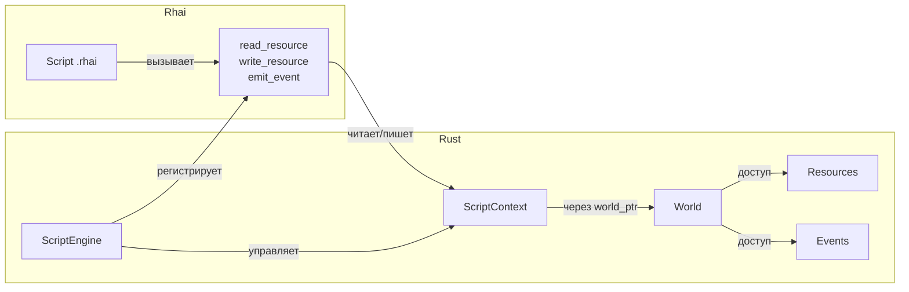

# План следующего шага: Ресурсы и события в Rhai-скриптах

## Текущее состояние

Скриптинг Apex ECS покрывает **чтение/запись компонентов**, **spawn/despawn**, **хот-релоад**. 
Не хватает доступа к **ресурсам (Resources)** и **событиям (Events)** — это два самых частых 
паттерна в игровой логике после работы с компонентами.

## Предлагаемый шаг: Добавить Resources API в Rhai

### Почему именно Resources, а не Events или модульность?

1. **Resources** — следующий по частоте использования паттерн (глобальные настройки, таймеры, счётчики)
2. **Events** — тесно связаны с Resources (оба через `SystemContext`), логично делать вместе
3. **Модульность скриптов** — сложнее, требует архитектурного решения (загрузка нескольких .rhai, их взаимодействие)

### План реализации

#### Шаг 1: Добавить `register_resource` в `ScriptEngine`

```rust
// script_engine.rs
pub fn register_resource<T: Send + Sync + ScriptableRegistrar + 'static>(
    &mut self, world: &World
) {
    // 1. Получить ComponentId из реестра ресурсов мира
    // 2. Зарегистрировать binding в ScriptContext
    // 3. Зарегистрировать функции в Rhai Engine:
    //    - read_resource::<T>() -> Dynamic
    //    - write_resource::<T>(Dynamic)
}
```

#### Шаг 2: Добавить `read_resource` / `write_resource` в `rhai_api.rs`

```rust
// rhai_api.rs
fn register_read_resource(engine: &mut Engine, ctx: Rc<RefCell<ScriptContext>>) {
    engine.register_fn("read_resource", move |type_name: &str| -> Dynamic {
        let ctx = ctx.borrow();
        let world = ctx.world_ref();
        // Найти resource по имени типа, прочитать через binding
    });
}
```

#### Шаг 3: Добавить `emit_event` / `read_event` в `rhai_api.rs`

```rust
// rhai_api.rs
fn register_emit_event(engine: &mut Engine, ctx: Rc<RefCell<ScriptContext>>) {
    engine.register_fn("emit_event", move |type_name: &str, data: Dynamic| {
        // Создать EventWriter и отправить событие
    });
}
```

#### Шаг 4: Обновить `ScriptContext`

Добавить хранение:
- `resource_bindings: HashMap<&'static str, ResourceBinding>` — аналогично `ComponentBinding`
- `event_bindings: HashMap<&'static str, EventBinding>`

#### Шаг 5: Обновить тесты

Добавить тесты 9-10 в `hot_reload_test.rs`:
- Тест 9: `read_resource` + `write_resource` из скрипта
- Тест 10: `emit_event` + проверка что событие дошло

### Архитектура



### Файлы для изменений

| Файл | Изменения |
|------|-----------|
| [`crates/apex-scripting/src/context.rs`](crates/apex-scripting/src/context.rs) | Добавить `resource_bindings`, `event_bindings`, методы доступа |
| [`crates/apex-scripting/src/rhai_api.rs`](crates/apex-scripting/src/rhai_api.rs) | Добавить `register_read_resource`, `register_write_resource`, `register_emit_event` |
| [`crates/apex-scripting/src/script_engine.rs`](crates/apex-scripting/src/script_engine.rs) | Добавить `register_resource::<T>()`, `register_event::<T>()` |
| [`crates/apex-scripting/src/registrar.rs`](crates/apex-scripting/src/registrar.rs) | Добавить `ResourceBinding` (аналог `ComponentBinding`) |
| [`crates/apex-examples/examples/hot_reload_test.rs`](crates/apex-examples/examples/hot_reload_test.rs) | Добавить тесты 9-10 |
| [`crates/apex-scripting/README_SCRIPTING.md`](crates/apex-scripting/README_SCRIPTING.md) | Обновить документацию |

### Оценка сложности

- **Resources**: ~50 строк кода (уже есть готовый паттерн `ComponentBinding`)
- **Events**: ~40 строк кода (аналогично)
- **Тесты**: ~60 строк
- **Документация**: ~20 строк

### Риски

1. **Resources в Apex Core** — нужно проверить, как устроен доступ к ресурсам через `SystemContext`
2. **EventWriter** — требует `&mut World`, а у нас в скрипте только `&World` через ptr. Нужно отложить запись событий как deferred-команду
3. **Имена типов** — для ресурсов и событий нужно уникальное строковое имя (как у компонентов через `ScriptableRegistrar::type_name_str()`)
