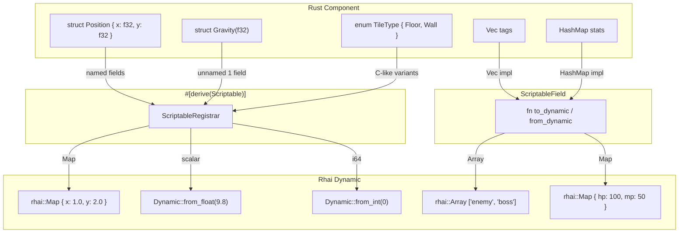

# План: Поддержка HashMap, Vec и enum в `#[derive(Scriptable)]`

## Анализ текущего состояния

### `ScriptableField` (field.rs)
- Трейт: `pub trait ScriptableField: Sized + Clone { fn to_dynamic(&self) -> Dynamic; fn from_dynamic(d: &Dynamic) -> Option<Self>; }`
- Реализован для: `f32`, `f64`, `i32`, `i64`, `u32`, `u64`, `usize`, `bool`, `String`, `&'static str`, `(A,B)`, `(A,B,C)`, `Option<T>`
- **Нет** реализаций для `Vec<T>`, `HashMap<K,V>`
- `rhai::Array` уже используется для кортежей

### `#[derive(Scriptable)]` (apex-macros/src/lib.rs)
- Генерирует `ScriptableRegistrar` **только** для struct с именованными полями
- Rejects: tuple structs (`struct Gravity(f32)`), enums (`enum State { Idle, Active }`)

### `ScriptableRegistrar` (registrar.rs)
```rust
pub trait ScriptableRegistrar: Sized + 'static {
    fn type_name_str() -> &'static str;
    fn field_names() -> &'static [&'static str];
    fn to_dynamic(&self) -> Dynamic;
    fn from_dynamic(d: &Dynamic) -> Option<Self>;
    fn register_rhai_type(engine: &mut Engine);
}
```

### Архитектура конвертации (как работает макрос)

Именованная структура → `rhai::Map` (ключи = имена полей, значения = Dynamic полей)
Поля конвертируются через `ScriptableField::to_dynamic` / `ScriptableField::from_dynamic`

---

## Задачи

### [1] `field.rs` — `ScriptableField` для `Vec<T>`

**Код:**
```rust
impl<T: ScriptableField> ScriptableField for Vec<T> {
    fn to_dynamic(&self) -> Dynamic {
        let arr: rhai::Array = self.iter().map(|v| v.to_dynamic()).collect();
        Dynamic::from_array(arr)
    }
    fn from_dynamic(d: &Dynamic) -> Option<Self> {
        let arr = d.read_lock::<rhai::Array>()?;
        arr.iter().map(|v| T::from_dynamic(v)).collect()
    }
}
```

**Как работает в Rhai:** `Vec<T>` представляется как `rhai::Array`. В скрипте можно писать `entity.tags = ["enemy", "boss"]`.

**Ограничение:** Rhai — динамический язык, тип элементов не проверяется на уровне компиляции.

---

### [2] `field.rs` — `ScriptableField` для `HashMap<String, V>`

**Код:**
```rust
impl<V: ScriptableField> ScriptableField for HashMap<String, V> {
    fn to_dynamic(&self) -> Dynamic {
        let mut map = rhai::Map::new();
        for (k, v) in self.iter() {
            map.insert(k.clone().into(), v.to_dynamic());
        }
        Dynamic::from_map(map)
    }
    fn from_dynamic(d: &Dynamic) -> Option<Self> {
        let lock = d.read_lock::<rhai::Map>()?;
        let mut out = HashMap::new();
        for (k, v) in lock.iter() {
            let val = V::from_dynamic(v)?;
            out.insert(k.to_string(), val);
        }
        Some(out)
    }
}
```

**Как работает в Rhai:** представляется как `rhai::Map` (BTreeMap<String, Dynamic>). В скрипте: `entity.stats = #{ "hp": 100, "mp": 50 }`.

**Выбор ключей:** Только `String`. Если нужны другие типы ключей — ручная реализация через `ScriptableField`.

**Импорт:** Нужно добавить `use std::collections::HashMap;` в field.rs.

---

### [3] `apex-macros/src/lib.rs` — Поддержка tuple structs

Текущий код отклоняет tuple structs с ошибкой:
```
"#[derive(Scriptable)] поддерживает только struct с именованными полями"
```

**Новая логика для `Fields::Unnamed`:**
- Если 0 полей — ошибка
- Если 1 поле — `struct Gravity(f32)` → конвертируем как одиночное значение (не Map)
- Если >1 поля — `struct Pair(f32, f32)` → конвертируем как кортеж в rhai::Array

**Генерация для `struct Gravity(f32)`:**
```rust
impl ScriptableRegistrar for Gravity {
    fn type_name_str() -> &'static str { "Gravity" }
    fn field_names() -> &'static [&'static str] { &["0"] }
    fn to_dynamic(&self) -> Dynamic {
        ScriptableField::to_dynamic(&self.0)
    }
    fn from_dynamic(d: &Dynamic) -> Option<Self> {
        let v = ScriptableField::from_dynamic(d)?;
        Some(Self(v))
    }
    fn register_rhai_type(engine: &mut Engine) {
        engine.register_fn("Gravity", |a: Dynamic| -> Dynamic { a });
    }
}
```

**Генерация для `struct Pair(f32, f32)`:**
```rust
// to_dynamic → rhai::Array [self.0.to_dynamic(), self.1.to_dynamic()]
// from_dynamic ← rhai::Array
// register_rhai_type → raw_fn с 2 Dynamic аргументами
```

---

### [4] `apex-macros/src/lib.rs` — Поддержка C-like enums

**Что такое C-like enum:** Все варианты без данных.
```rust
#[derive(Scriptable)]
enum TileType { Floor, Wall, Water }
```

**Генерация:**
- Каждый вариант получает числовой индекс = 0, 1, 2... (порядок объявления)
- `to_dynamic()`: `Dynamic::from_int(self as i64)` (работает только для C-like)
- `from_dynamic(d)`: match по int, генерируем все варианты
- `register_rhai_type()`: регистрируем константы в Engine

**Код генерации:**
```rust
// to_dynamic
fn to_dynamic(&self) -> rhai::Dynamic {
    rhai::Dynamic::from_int(*self as i64)
}

// from_dynamic
fn from_dynamic(d: &rhai::Dynamic) -> ::std::option::Option<Self> {
    match d.as_int().ok()? {
        0 => ::std::option::Option::Some(Self::Variant0),
        1 => ::std::option::Option::Some(Self::Variant1),
        // ...
        _ => ::std::option::Option::None,
    }
}

// register_rhai_type — регистрируем константы
// engine.register("TileType::Floor", Dynamic::from_int(0));
// engine.register("TileType::Wall", Dynamic::from_int(1));
```

**Enum с данными** — выдаём compile error с сообщением:
```
"#[derive(Scriptable)] для enum поддерживает только варианты без данных (C-like enum).
Для enum с данными реализуйте ScriptableRegistrar вручную."
```

---

### [5] Обновление `Apex_ECS_Руководство_пользователя.md` — раздел 17.7

- Убрать ❌ для `Vec<T>`, `HashMap<K,V>`
- Оставить ❌ для `enum` (или убрать, если добавили C-like поддержку)
- Добавить примеры использования Vec и HashMap в Rhai-скриптах

---

### [6] Обновление `README_SCRIPTING.md`

- Добавить Vec, HashMap в список поддерживаемых типов
- Добавить enum как C-like (с ограничением)

---

### [7] Обновление `feature_plan.md`

- Отметить задачу "Rhai: HashMap/Vec/enum в компонентах" как выполненную

---

### [8] Билд и тесты

- `cargo build -p apex-scripting` — проверка компиляции
- `cargo test -p apex-scripting` — запуск тестов
- Если есть тесты для field.rs — проверить, что проходят
- Проверить `cargo build -p apex-macros`

---

## Mermaid-диаграмма: Архитектура конвертации



## Зависимости между задачами

1. [1] + [2] не зависят ни от чего → можно делать параллельно
2. [3] + [4] зависят от понимания [1] + [2] (не критично, можно параллельно)
3. [5] + [6] + [7] — после реализации [1]-[4]
4. [8] — после [1]-[4]
