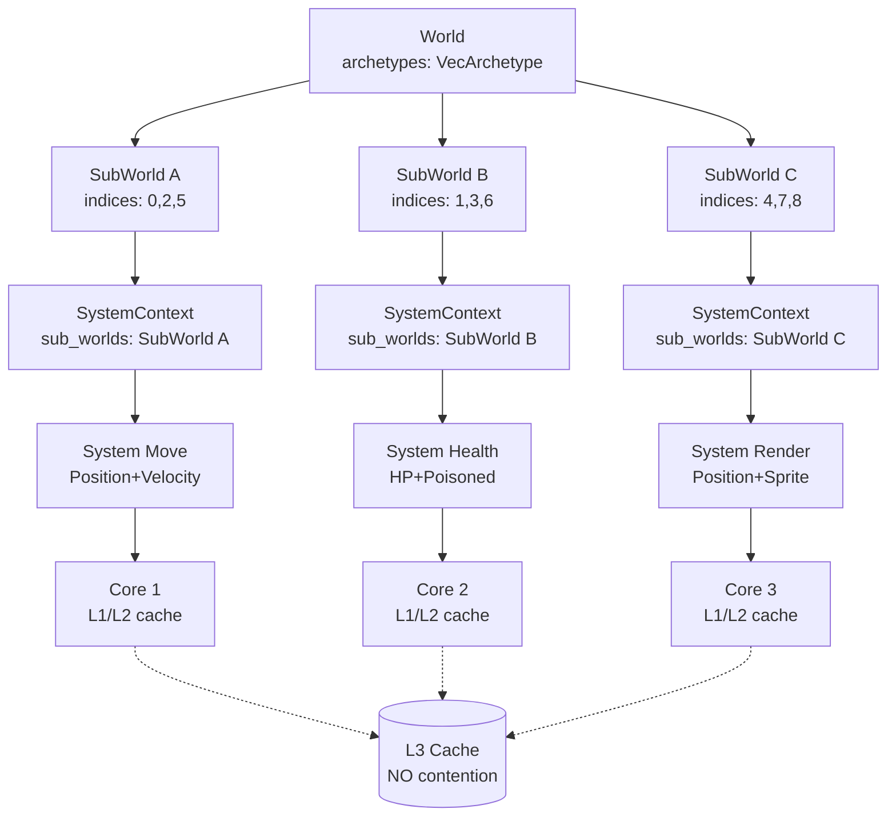

# SubWorld Architecture — разделение World на под-миры по архетипам

## 1. Проблема

**Текущая архитектура**: Все параллельные системы получают `&World` через `ParallelWorld` и `SystemContext`. Это означает, что каждая система имеет доступ ко ВСЕМ архетипам, даже если ей нужен только один.

**Следствие**: L3 cache contention. Когда 12 систем работают параллельно на 12 ядрах, каждая система загружает в L3 кэш данные всех архетипов. Ядра постоянно вытесняют кэш друг друга, потому что все системы обращаются к одним и тем же областям памяти (World.archetypes).

**Бенчмарк подтверждает**: speedup всего 1.27x на 12 ядрах вместо ожидаемых 3x-6x.

## 2. Идея SubWorld

**SubWorld** — это view (представление) на подмножество архетипов World'а. Каждая параллельная система получает только те архетипы, которые соответствуют её `AccessDescriptor` (read_mask / write_mask).

```
World {
    archetypes: [A, B, C, D, E, F, G, H, ...]
}

Система Move (читает Position, Velocity):
  → SubWorld { archetype_indices: [A, B, C] }  // только архетипы с Position+Velocity

Система Health (читает HP, Poisoned):
  → SubWorld { archetype_indices: [D, E] }      // только архетипы с HP+Poisoned

Система Render (читает Position, Sprite):
  → SubWorld { archetype_indices: [F, G, H] }   // только архетипы с Position+Sprite
```

**Результат**: Каждая система работает только со своими архетипами. Разные системы работают с разными областями памяти → нет L3 cache contention.

## 3. Архитектура

### 3.1. SubWorld — новый тип в apex-core

```rust
// crates/apex-core/src/sub_world.rs

/// Представление на подмножество архетипов World'а.
///
/// Содержит индексы архетипов, которые соответствуют AccessDescriptor системы.
/// Не владеет данными — только ссылается на них через World.
pub struct SubWorld<'w> {
    /// Ссылка на оригинальный World (нужна для доступа к entity, registry, relations)
    world: &'w World,
    /// Индексы архетипов, которые входят в этот SubWorld
    archetype_indices: &'w [usize],
}

impl<'w> SubWorld<'w> {
    pub fn new(world: &'w World, archetype_indices: &'w [usize]) -> Self { ... }

    /// Итерация по компонентам только в своих архетипах
    pub fn for_each_component<Q, F>(&self, f: F) { ... }

    /// Параллельная итерация только по своим архетипам
    pub fn par_for_each_component<Q, F>(&self, f: F) { ... }

    /// Доступ к ресурсам (глобальные, не разделяются)
    pub fn resource<T>(&self) -> Res<'_, T> { ... }
    pub fn resource_mut<T>(&self) -> ResMut<'_, T> { ... }

    /// Доступ к событиям
    pub fn event_reader<T>(&self) -> EventReader<'_, T> { ... }
    pub fn event_writer<T>(&self) -> EventWriter<'_, T> { ... }
}
```

### 3.2. Изменение SystemContext

`SystemContext` теперь хранит слайс SubWorld'ов вместо `*const World`:

```rust
pub struct SystemContext<'w> {
    pub(crate) sub_worlds: &'w [SubWorld<'w>],
}

impl<'w> SystemContext<'w> {
    pub fn new(sub_worlds: &'w [SubWorld<'w>]) -> Self { ... }

    // for_each итерирует по ВСЕМ sub_worlds (объединение всех архетипов)
    pub fn for_each<Q, F>(&self, f: F) { ... }
    pub fn for_each_component<Q, F>(&self, f: F) { ... }
    pub fn par_for_each_component<Q, F>(&self, f: F) { ... }

    // Ресурсы и события — из первого SubWorld (все SubWorld ссылаются на один World)
    pub fn resource<T>(&self) -> Res<'_, T> { ... }
    pub fn resource_mut<T>(&self) -> ResMut<'_, T> { ... }
}
```

### 3.3. Изменение Scheduler::run_hybrid_parallel

Вместо одного `ParallelWorld` для всех систем, создаём для каждой системы свой набор `SubWorld`:

```rust
fn run_hybrid_parallel(&mut self, world: &mut World) {
    // Предварительно вычисляем маппинг: ArchetypeId → ComponentMask
    // Это делается один раз в compile()
    
    let plan = self.execution_plan.as_ref().unwrap();
    let stages = ...;

    for (stage_ids, all_parallel) in &stages {
        if !all_parallel || stage_ids.len() < self.parallel_threshold {
            // sequential — без изменений
            ...
            continue;
        }

        // Для каждой системы в Stage создаём SubWorld с её архетипами
        let indices: Vec<usize> = stage_ids
            .iter()
            .filter_map(|sid| self.system_indices.get(sid))
            .copied()
            .collect();

        let ptrs: Vec<SendPtr<SystemDescriptor>> = ...;

        ptrs.par_iter().for_each(|ptr| {
            let descriptor = unsafe { ptr.as_mut() };
            if let SystemKind::Parallel { system, access } = &mut descriptor.kind {
                // Создаём SubWorld только для этой системы
                let sub_worlds = self.get_sub_worlds_for_access(world, access);
                system.run(SystemContext::new(sub_worlds));
            }
        });
    }
}
```

### 3.4. ArchetypeMask — быстрый фильтр архетипов

Чтобы O(1) определять, какие архетипы нужны системе, вводим `ArchetypeMask`:

```rust
// crates/apex-core/src/access.rs

/// Битовая маска архетипов — до 1024 архетипов.
///
/// Позволяет O(1) проверять, какие архетипы соответствуют AccessDescriptor системы.
#[derive(Clone, Copy, Default)]
pub struct ArchetypeMask {
    // 1024 бит = 16 u64
    bits: [u64; 16],
}
```

**Как заполняется**:
1. В `compile()` после построения графа проходим по всем архетипам World'а
2. Для каждого архетипа вычисляем его `ComponentMask` (на основе `component_ids`)
3. Для каждой системы проверяем: `archetype_mask.overlaps(system.access_mask)`?
4. Если да — архетип входит в SubWorld этой системы

**Оптимизация**: Маска архетипов вычисляется один раз в `compile()` и кэшируется.

## 4. Детальный план реализации

### Шаг 1: ArchetypeMask в access.rs

- Добавить тип `ArchetypeMask` (битовая маска на 1024 архетипа)
- Добавить `archetype_mask: ArchetypeMask` в `AccessDescriptor`
- Добавить метод `assign_archetype_mask(&mut self, archetype_masks: &[ArchetypeMask])` в `AccessDescriptor`

### Шаг 2: SubWorld в новом файле

- Создать `crates/apex-core/src/sub_world.rs`
- Определить `SubWorld<'w>` с полями `world: &'w World` и `archetype_indices: &'w [usize]`
- Реализовать `for_each_component`, `par_for_each_component`, `resource`, `resource_mut`, `event_reader`, `event_writer`
- Добавить `mod sub_world;` в `lib.rs`

### Шаг 3: Изменение SystemContext

- Заменить `world: *const World` на `sub_worlds: &'w [SubWorld<'w>]`
- `for_each_component` итерирует по всем SubWorld → всем их архетипам
- `resource` и `resource_mut` — через `sub_worlds[0].world` (все SubWorld ссылаются на один World)
- `event_reader` и `event_writer` — аналогично

### Шаг 4: Изменение Scheduler::compile()

- После построения `ExecutionPlan` вычислить для каждой системы маску архетипов
- Сохранить маппинг: `SystemId → Vec<usize>` (индексы архетипов для SubWorld)

### Шаг 5: Изменение Scheduler::run_hybrid_parallel()

- Вместо `ParallelWorld` создавать `Vec<SubWorld>` для каждой системы
- Передавать `SystemContext::new(&sub_worlds)` вместо `SystemContext::new(world)`

### Шаг 6: Адаптация benchmark

- `bench_parallel_scheduler` должен показать speedup 3x-6x вместо 1.27x

## 5. Mermaid-диаграмма архитектуры



## 6. Ключевые моменты безопасности

1. **SubWorld не владеет данными** — только ссылается на World. World должен быть жив всё время выполнения Stage.
2. **Archetype_indices не пересекаются** — разные системы в одном Stage не могут иметь конфликтующие архетипы (проверено compile()).
3. **Resource и Event — глобальные** — все SubWorld ссылаются на один World, поэтому resource/event доступны из любого SubWorld.
4. **Structural changes запрещены** — как и сейчас, во время выполнения Stage нельзя добавлять/удалять архетипы.

## 7. Ожидаемый результат

| Метрика | До | После |
|---------|-----|-------|
| Inter-system speedup (12 cores) | 1.27x | 3x-6x |
| L3 cache misses per system | высокие | низкие |
| Memory bandwidth per system | разделяется | изолирована |

## 8. Риски

1. **Overhead создания SubWorld** — для каждой системы в каждом Stage нужно создавать `Vec<SubWorld>`. Решение: кэшировать SubWorld'ы после compile().
2. **ArchetypeMask на 1024 архетипа** — достаточно ли? В типичной игре 10-50 архетипов. 1024 — с запасом.
3. **SystemContext.for_each_component** — нужно убедиться, что итерация по нескольким SubWorld не медленнее, чем итерация по всем архетипам World'а.
