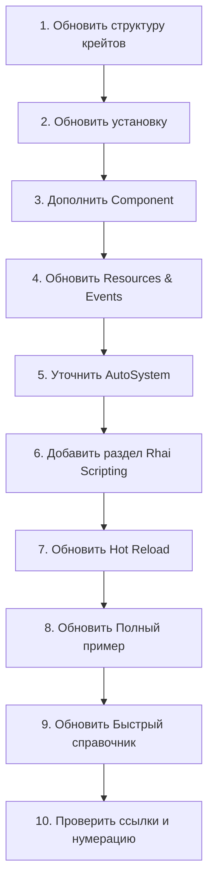

# План актуализации Apex_ECS_Руководство_пользователя.md

## Анализ расхождений

После анализа текущего кода и руководства выявлены следующие разделы, требующие обновления:

---

### 1. Раздел 1.2 — Структура крейтов

**Проблема**: В таблице отсутствуют новые крейты:
- `apex-macros` — proc-macro для `#[derive(Scriptable)]`
- `apex-scripting` — ScriptEngine, Rhai-скриптинг, хот-релоад скриптов
- `apex-bench` — бенчмарки (опционально, можно не включать)

**Действие**: Добавить строки в таблицу.

---

### 2. Раздел 1.3 — Установка

**Проблема**: В `Cargo.toml` примере отсутствуют:
- `apex-macros`
- `apex-scripting`

**Действие**: Добавить зависимости для скриптинга.

---

### 3. Раздел 2.2 — Component

**Проблема**: Нет упоминания `#[derive(Scriptable)]` для компонентов, используемых в Rhai-скриптах.

**Действие**: Добавить примечание о `Scriptable` и `apex_scripting::Scriptable`.

---

### 4. Раздел 5 — Ресурсы и события

**Проблемы**:
1. Нет упоминания `try_send_event()` — безопасной отправки события без паники
2. Нет упоминания `try_resource_mut()` — безопасного мутабельного доступа к ресурсу
3. Нет упоминания `events_mut()` — мутабельного доступа к EventQueue

**Действие**: 
- Добавить `try_send_event()` в примеры и таблицу быстрого справочника
- Добавить `try_resource_mut()` в примеры
- Добавить `events_mut()` в примеры

---

### 5. Раздел 6 — Системы и планировщик

**Проблема**: Нет упоминания `AutoSystem` в разделе 6.1 — используется трейт, но не объяснён механизм автоматического вывода `AccessDescriptor`.

**Действие**: Уточнить описание `AutoSystem` — как именно работает автоматический вывод доступа.

---

### 6. НОВЫЙ раздел — Rhai Scripting

**Проблема**: Полностью отсутствует документация по интеграции Rhai-скриптинга:
- `ScriptEngine` — создание, настройка
- `Scriptable` — derive-макрос для компонентов/ресурсов/событий
- `register_component()`, `register_resource()`, `register_event()`
- Глобальные Rhai-функции: `delta_time`, `entity_count`, `query`, `spawn_entity`, `spawn_empty`, `despawn`, `read_resource`, `write_resource`, `emit_event`, `log`
- Хот-релоад .rhai скриптов
- Двухбуферность deferred-изменений

**Действие**: Добавить новый раздел (например, раздел 11, сдвинув нумерацию последующих).

---

### 7. Раздел 10 — Hot Reload конфигураций

**Проблема**: Старый раздел описывает только `apex-hot-reload` для JSON-конфигов. Теперь есть ещё `apex-scripting` с хот-релоадом .rhai скриптов.

**Действие**: Переименовать раздел в "Hot Reload" и добавить подраздел про хот-релоад скриптов.

---

### 8. Раздел 11 — Параллелизм (станет разделом 12)

**Проблема**: После добавления раздела про скриптинг нумерация сдвинется.

**Действие**: Обновить все ссылки и номера разделов.

---

### 9. Раздел 13 — Полный пример (станет разделом 14)

**Проблема**: Пример не включает скриптинг.

**Действие**: Добавить вариант примера с `ScriptEngine` или дополнить существующий.

---

### 10. Раздел 14 — Быстрый справочник (станет разделом 15)

**Проблемы**:
1. В таблице World API отсутствуют:
   - `try_send_event()`
   - `try_resource_mut()`
   - `events_mut()`
   - `spawn_empty()`
   - `spawn_many_silent()`
   - `entity_allocator()`
   - `query_typed()`, `query_changed()`
   - `query_relation()`, `query_wildcard()`
2. Нет таблицы ScriptEngine API

**Действие**: 
- Дополнить таблицу World API
- Добавить таблицу ScriptEngine API

---

## План работ

### Детальные шаги

#### Шаг 1: Обновить раздел 1.2 (структура крейтов)
- Файл: `Apex_ECS_Руководство_пользователя.md`
- Добавить строки `apex-macros` и `apex-scripting` в таблицу

#### Шаг 2: Обновить раздел 1.3 (установка)
- Файл: `Apex_ECS_Руководство_пользователя.md`
- Добавить `apex-macros` и `apex-scripting` в пример Cargo.toml

#### Шаг 3: Дополнить раздел 2.2 (Component)
- Файл: `Apex_ECS_Руководство_пользователя.md`
- Добавить примечание о `#[derive(Scriptable)]` для компонентов, используемых в скриптах

#### Шаг 4: Обновить раздел 5 (Resources & Events)
- Файл: `Apex_ECS_Руководство_пользователя.md`
- Добавить `try_send_event()` в примеры
- Добавить `try_resource_mut()` в примеры
- Добавить `events_mut()` в примеры

#### Шаг 5: Уточнить раздел 6.1 (AutoSystem)
- Файл: `Apex_ECS_Руководство_пользователя.md`
- Добавить пояснение про автоматический вывод `AccessDescriptor` из типа `Query`

#### Шаг 6: Добавить новый раздел "Rhai Scripting"
- Файл: `Apex_ECS_Руководство_пользователя.md`
- Содержание:
  - Обзор `apex-scripting`
  - `#[derive(Scriptable)]` для компонентов, ресурсов, событий
  - `ScriptEngine::new()`, `with_dir()`
  - `register_component()`, `register_resource()`, `register_event()`
  - `load_scripts()`, `load_script_str()`, `set_active()`
  - `run()`, `poll_hot_reload()`
  - Таблица глобальных Rhai-функций
  - Пример скрипта
  - Двухбуферность deferred-изменений (архитектурное решение)

#### Шаг 7: Обновить раздел "Hot Reload"
- Файл: `Apex_ECS_Руководство_пользователя.md`
- Переименовать в "Hot Reload"
- Добавить подраздел про хот-релоад .rhai скриптов

#### Шаг 8: Обновить "Полный пример"
- Файл: `Apex_ECS_Руководство_пользователя.md`
- Добавить вариант с `ScriptEngine` или дополнить существующий пример

#### Шаг 9: Обновить "Быстрый справочник"
- Файл: `Apex_ECS_Руководство_пользователя.md`
- Дополнить таблицу World API недостающими методами
- Добавить таблицу ScriptEngine API

#### Шаг 10: Финальная проверка
- Файл: `Apex_ECS_Руководство_пользователя.md`
- Обновить номера разделов в содержании
- Проверить все внутренние ссылки
- Обновить версию документации
